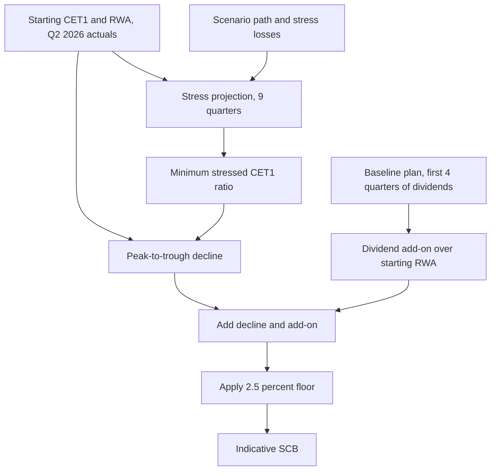

# Stress Capital Buffer (SCB)

The stress capital buffer is a firm-specific CET1 add-on that comes out of the Federal Reserve's annual supervisory stress test (CCAR). The firm's own definition is "CET1 buffer derived from the peak-to-trough decline in the supervisory stress test plus four quarters of dividends" ([annual report glossary](../../sources/reports/mhfc-2025-annual-report.md)). It is one of three layers above the 4.5% regulatory CET1 minimum, alongside the [G-SIB surcharge](gsib-surcharge.md) and the countercyclical buffer. Meridian Harbor is a fictional institution and all figures here are synthetic.

Two things share the name "SCB" and should not be confused:

- The **regulatory SCB**: the number the Federal Reserve sets and that binds the firm's requirement.
- The **indicative SCB**: an internal estimate the capital planning model produces each quarter, using the same recipe applied to the firm's own stress projection. The model component is described in [Indicative Stress Capital Buffer](../models/components/indicative-stress-capital-buffer.md).

## Role in the CET1 requirement

<!-- openwiki: broken internal link [../../sources/reports/mhfc-2025-annual-report.md#L301] heading anchor "L301" does not exist in "../../sources/reports/mhfc-2025-annual-report.md". Fix the href or restore the target, then delete this comment. -->
<!-- openwiki: broken internal link [../../sources/reports/mhfc-q2-2026-earnings-supplement.md#L288-L295] heading anchor "L288-L295" does not exist in "../../sources/reports/mhfc-q2-2026-earnings-supplement.md". Fix the href or restore the target, then delete this comment. -->
The Standardized CET1 requirement is 4.5% + SCB + G-SIB surcharge (+ countercyclical buffer, currently 0%). With the current SCB of 3.2% and a 2.5% G-SIB surcharge, the requirement is 10.2%. Management targets about 13.0% on top of this ([annual report, capital risk management](../../sources/reports/mhfc-2025-annual-report.md#L301); [Q2 2026 supplement requirement stack](../../sources/reports/mhfc-q2-2026-earnings-supplement.md#L288-L295)). Compare actual capital against it using the [CET1 ratio](../metrics/cet1-ratio.md).

| Layer | Value |
|---|---|
| Regulatory CET1 minimum (12 CFR 217) | 4.5% |
| Stress capital buffer (effective 2025-10-01) | 3.2% |
| G-SIB surcharge (Method 2) | 2.5% |
| Countercyclical buffer | 0.0% |
| **Total CET1 requirement** | **10.2%** |
| Management target (Board Capital Committee) | 13.0% |

<!-- openwiki: broken internal link [../../sources/reports/mhfc-2025-pillar3-disclosures.md#L194] heading anchor "L194" does not exist in "../../sources/reports/mhfc-2025-pillar3-disclosures.md". Fix the href or restore the target, then delete this comment. -->
<!-- openwiki: broken internal link [../../sources/reports/mhfc-2025-annual-report.md#L168] heading anchor "L168" does not exist in "../../sources/reports/mhfc-2025-annual-report.md". Fix the href or restore the target, then delete this comment. -->
Under the Standardized approach the capital conservation buffer requirement equals SCB + G-SIB surcharge + countercyclical buffer, i.e. 5.7%. At 31 December 2025 the firm held 10.58% against it and faced no limits on distributions or discretionary bonuses ([Pillar 3](../../sources/reports/mhfc-2025-pillar3-disclosures.md#L194)). The SCB also feeds segment capital allocation and therefore segment ROE ([annual report](../../sources/reports/mhfc-2025-annual-report.md#L168)).

## Regulatory SCB lifecycle

<!-- openwiki: broken internal link [../../sources/reports/mhfc-2025-annual-report.md#L305] heading anchor "L305" does not exist in "../../sources/reports/mhfc-2025-annual-report.md". Fix the href or restore the target, then delete this comment. -->
<!-- openwiki: broken internal link [../../sources/reports/mhfc-2025-pillar3-disclosures.md#L464] heading anchor "L464" does not exist in "../../sources/reports/mhfc-2025-pillar3-disclosures.md". Fix the href or restore the target, then delete this comment. -->
- The 2025 CCAR cycle produced an SCB of 3.2%, effective 1 October 2025 through 30 September 2026. The Fed's projected minimum CET1 under the supervisory severely adverse scenario was 12.1%. The firm's own projection from MDL-CAP-003 under the same scenario was 12.6% ([annual report](../../sources/reports/mhfc-2025-annual-report.md#L305); [Pillar 3](../../sources/reports/mhfc-2025-pillar3-disclosures.md#L464)).
<!-- openwiki: broken internal link [../../sources/reports/mhfc-q2-2026-earnings-supplement.md#L81] heading anchor "L81" does not exist in "../../sources/reports/mhfc-q2-2026-earnings-supplement.md". Fix the href or restore the target, then delete this comment. -->
- On 27 June 2026 the Fed delivered a preliminary 2026 SCB. The firm expects it to stay at 3.2% from 1 October 2026 ([Q2 2026 supplement](../../sources/reports/mhfc-q2-2026-earnings-supplement.md#L81)).
<!-- openwiki: broken internal link [../../sources/reports/mhfc-q2-2026-earnings-supplement.md#L456] heading anchor "L456" does not exist in "../../sources/reports/mhfc-q2-2026-earnings-supplement.md". Fix the href or restore the target, then delete this comment. -->
- Management said it would revisit buyback pace once the final SCB is confirmed in August ([supplement, earnings call](../../sources/reports/mhfc-q2-2026-earnings-supplement.md#L456)). The final figure is not in the sources.

## Indicative SCB calculation (MDL-CAP-003)

<!-- openwiki: broken internal link [../../sources/models/capital-planning-model.md#L9-L41] heading anchor "L9-L41" does not exist in "../../sources/models/capital-planning-model.md". Fix the href or restore the target, then delete this comment. -->
<!-- openwiki: broken internal link [../../sources/reports/mhfc-2025-annual-report.md#L307] heading anchor "L307" does not exist in "../../sources/reports/mhfc-2025-annual-report.md". Fix the href or restore the target, then delete this comment. -->
The Capital Planning & Stress Projection Model is a Tier 1 (High) model owned by Corporate Treasury – Capital Management and validated independently by Model Risk Governance & Review. It projects CET1, RWA and ratios over nine quarters (Q3 2026 to Q3 2028) under a baseline and a severely adverse scenario. It is re-run each quarter ([model README](../../sources/models/capital-planning-model.md#L9-L41); [annual report](../../sources/reports/mhfc-2025-annual-report.md#L307)).

The formula, on the model's `Summary` sheet:

```
indicative SCB = MAX( 2.5%,
    (starting CET1 ratio - minimum stressed CET1 ratio)
    + (sum of 4 quarters of baseline common dividends / starting RWA) )
```

<!-- openwiki: broken internal link [../../sources/models/capital-planning-model.md#L94-L108] heading anchor "L94-L108" does not exist in "../../sources/models/capital-planning-model.md". Fix the href or restore the target, then delete this comment. -->
In the workbook: `B10 = B6 - B9`, `B11 = -SUM(Baseline_Projection!C9:F9) / Baseline_Projection!B14` (four quarters of baseline common dividends over starting RWA), and `B12 = MAX(0.025, B10 + B11)` ([Summary formulas](../../sources/models/capital-planning-model.md#L94-L108)).



Caption: inputs and steps behind the indicative SCB in the `Summary` sheet.

### Worked example (Q2 2026 starting point)

| Item | Value |
|---|---|
| Starting CET1 ratio ($101.2bn / $668.4bn RWA) | 15.14% |
| Minimum stressed CET1 ratio (reached Q3 2027) | 12.90% |
| Peak-to-trough decline | 2.24% |
| Four quarters of dividends / starting RWA | 0.94% |
| **Indicative SCB** | **3.18%** (floor 2.5% not binding) |
| Regulatory requirement using current SCB 3.2% | 10.20% |
| Regulatory requirement using indicative SCB | 10.18% |

<!-- openwiki: broken internal link [../../sources/reports/mhfc-q2-2026-earnings-supplement.md#L276-L284] heading anchor "L276-L284" does not exist in "../../sources/reports/mhfc-q2-2026-earnings-supplement.md". Fix the href or restore the target, then delete this comment. -->
<!-- openwiki: broken internal link [../../sources/models/capital-planning-model.md#L75-L90] heading anchor "L75-L90" does not exist in "../../sources/models/capital-planning-model.md". Fix the href or restore the target, then delete this comment. -->
The 3.18% result was published in the Q2 2026 supplement as consistent with the preliminary supervisory 3.2% ([supplement](../../sources/reports/mhfc-q2-2026-earnings-supplement.md#L276-L284); [Summary sheet](../../sources/models/capital-planning-model.md#L75-L90)).

### Stress conventions that drive the decline

- Stress pre-tax income = PPNR – provisions – trading and counterparty losses. These are top-down inputs from the enterprise stress testing program, not modelled inside the workbook.
- Tax is at the 22% effective rate and a tax benefit is recognized on losses.
- Buybacks are suspended (a CCAR convention, noted on every stress-quarter cell). Common and preferred dividends are held flat, so the stress CET1 path is depleted by dividends while earnings are low.
- RWA follows scenario-specific growth: it rises early (+2.2%, +1.5% in the first two quarters) and then shrinks, which is why the trough ratio comes in Q3 2027 rather than at the point of lowest capital dollars.
- The internal scenario (SA-2025-INT, from the Macroeconomic Scenario API) has peak unemployment of 10.2%, a -41% equity trough and an instantaneous market shock in quarter 1.

<!-- openwiki: broken internal link [../../sources/models/capital-planning-model.md#L35-L41] heading anchor "L35-L41" does not exist in "../../sources/models/capital-planning-model.md". Fix the href or restore the target, then delete this comment. -->
<!-- openwiki: broken internal link [../../sources/models/capital-planning-model.md#L446-L456] heading anchor "L446-L456" does not exist in "../../sources/models/capital-planning-model.md". Fix the href or restore the target, then delete this comment. -->
<!-- openwiki: broken internal link [../../sources/reports/mhfc-2025-pillar3-disclosures.md#L445-L460] heading anchor "L445-L460" does not exist in "../../sources/reports/mhfc-2025-pillar3-disclosures.md". Fix the href or restore the target, then delete this comment. -->
([README conventions](../../sources/models/capital-planning-model.md#L35-L41); [stress notes](../../sources/models/capital-planning-model.md#L446-L456); [Pillar 3 §13](../../sources/reports/mhfc-2025-pillar3-disclosures.md#L445-L460))

## Inputs and data flow

- Starting CET1 capital and standardized RWA come from the Regulatory Reporting API (API-16, FR Y-9C / FFIEC 101 extract).
- Scenario paths come from the Macroeconomic Scenario API (API-14).
- Liquidity limits on distributions are cross-checked against the Treasury Liquidity Positions API (API-15).
- The dividend and buyback plan is approved by the Board Capital Committee. The assumptions are $1.15 per share per quarter and $3.0bn per quarter of repurchases (a $30bn program for 2025–2028).
- Outputs flow into the Annual Report (Capital Risk Management) and the Pillar 3 capital planning and stress testing section. See [Basel III Pillar 3](basel-iii-pillar-3.md).

<!-- openwiki: broken internal link [../../sources/models/capital-planning-model.md#L22-L55] heading anchor "L22-L55" does not exist in "../../sources/models/capital-planning-model.md". Fix the href or restore the target, then delete this comment. -->
<!-- openwiki: broken internal link [../../sources/models/capital-planning-model.md#L116-L141] heading anchor "L116-L141" does not exist in "../../sources/models/capital-planning-model.md". Fix the href or restore the target, then delete this comment. -->
([README](../../sources/models/capital-planning-model.md#L22-L55); [Assumptions](../../sources/models/capital-planning-model.md#L116-L141))

## Invariants, limits and caveats

- **Floor.** The indicative SCB can never be below 2.5%, whatever the stress result.
- **Indicative, not binding.** The Fed-set SCB drives `Assumptions!B19` and the requirement of 10.20%. The indicative value only feeds a side-by-side comparison (10.18%).
- **Which dividends.** The add-on uses baseline-plan dividends, which fall slightly as buybacks shrink the share count. Stress-case dividends are held at the starting-share level (about $1,588mm per quarter). The two differ slightly, so the add-on is not exactly the stress-case dividend burden.
- **Stress test pass.** The `Summary` sheet shows "YES" if the minimum stressed ratio is at or above the *current* requirement, and "NO - capital action required" otherwise. Here it is 12.90% against 10.20%.
<!-- openwiki: broken internal link [../../sources/reports/mhfc-2025-pillar3-disclosures.md#L66-L71] heading anchor "L66-L71" does not exist in "../../sources/reports/mhfc-2025-pillar3-disclosures.md". Fix the href or restore the target, then delete this comment. -->
- **Risk appetite.** The Board's appetite sets an internal severely adverse minimum of 10.2% or more (12.6% at 31 December 2025) and a baseline CET1 of 13.0% or more ([Pillar 3 risk appetite](../../sources/reports/mhfc-2025-pillar3-disclosures.md#L66-L71)). The management target is breached in the stress path in Q2 2027 to Q4 2027 (headroom between -$713mm and -$267mm), without breaching the regulatory requirement.
- **Simplifications.** The model has no AOCI volatility modelling and no deferred-tax-asset threshold deductions. Stress losses are not derived in the model. The regulatory SCB comes from the Fed's own models, so the indicative figure only approximates it.

## Operating and changing the calculation

- Blue cells on `Assumptions` are the levers: starting capital and RWA, dividend and buyback plan, tax rate, the current SCB and G-SIB surcharge, and the management target. The stress losses, PPNR and RWA growth are inputs on `Stress_Projection`.
- When the Fed's final SCB changes, update `Assumptions!B19`. The floor (0.025) is hard-coded in the `Summary!B12` formula.
- The model's last validation was 2026-02-27 and the next is due 2027-02-28. Any change to the SCB formula or stress conventions should go through that validation process.
