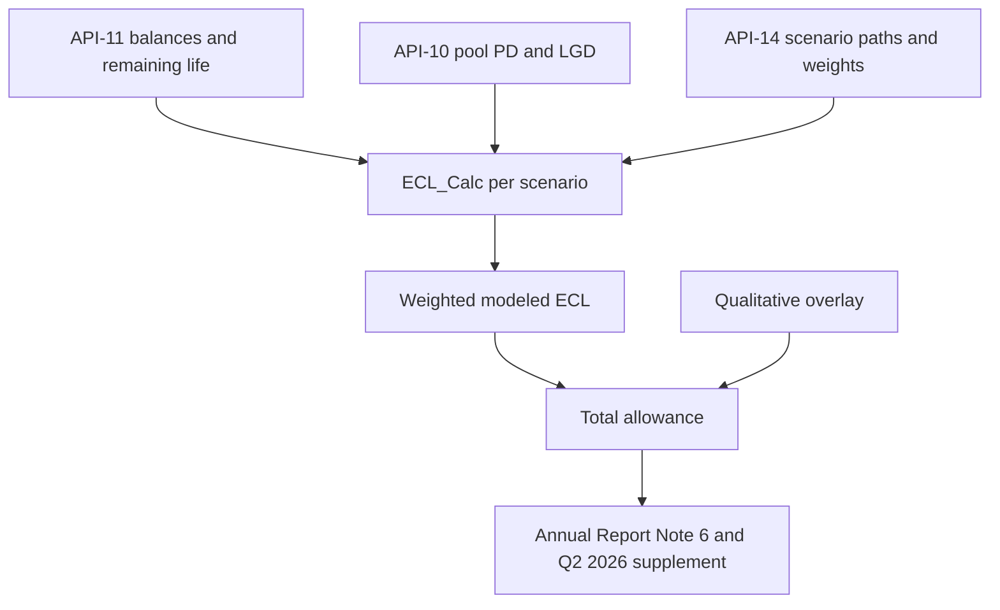

# Allowance for Credit Losses

The allowance for credit losses (ACL) is management's estimate of expected credit losses over the remaining expected life of the firm's loans under ASC 326 ([CECL](../concepts/cecl.md)). The wiki mostly uses the loan-level figure, which the reports label "allowance for loan losses". It is the stock that [net charge-offs](net-charge-offs.md) draw down and that the provision for credit losses replenishes.

Meridian Harbor Financial Corp. is a fictional institution, and the source documents say so. All figures below are in USD millions unless noted.

## Reported values

| As of | Allowance | Allowance / loans | Source |
|---|---|---|---|
| Dec 31, 2024 | 15,180 | not stated | Annual Report Note 6 beginning balance |
| Dec 31, 2025 | 15,920 | 2.14% (loans 742,300) | Annual Report, Note 6, Pillar 3 table 6.4, workbook `Allowance_Summary` |
| Mar 31, 2026 (1Q26) | 16,110 | 2.14% | Q2 2026 Earnings Supplement |
| Jun 30, 2026 (2Q26) | 16,380 | 2.15% | Q2 2026 Earnings Supplement |

The supplement's five-quarter trend row reads 15,640 / 15,780 / 15,920 / 16,110 / 16,380, ending at 2Q26 ($ millions). The Dec 31, 2025 value is the third entry.

### Year-end 2025 by segment

Source: Annual Report p. 17 (the table says "Source: CECL_Allowance_Model.xlsx, sheet Allowance_Summary"). The workbook cells are `Allowance_Summary` rows 6–12 and carry unrounded values.

| Segment | Modeled | Overlay | Total allowance | Allowance / loans | Coverage of FY2025 NCOs (workbook col. L) |
|---|---|---|---|---|---|
| Credit Card | 8,383 (8,383.18) | 257 (256.82) | 8,640 | 6.24% | 1.87 yrs |
| Residential Mortgage | 765 (764.97) | 55 (55.03) | 820 | 0.38% | 20.50 yrs |
| Auto | 724 (723.56) | (34) (-33.56) | 690 | 1.06% | 1.68 yrs |
| Commercial Real Estate | 2,244 (2,244.00) | 226 (226.00) | 2,470 | 2.52% | 6.50 yrs |
| Commercial & Industrial | 2,609 (2,609.28) | 151 (150.72) | 2,760 | 1.60% | 4.93 yrs |
| Other Consumer & Wholesale | 514 (513.93) | 26 (26.07) | 540 | 1.09% | 6 yrs |
| **Total** | **15,239 (15,238.91)** | **681 (681.09)** | **15,920** | **2.14%** | **2.61 yrs** |

The overlay is 4.47% of the modeled allowance in total (workbook cell `J12`). The "years of coverage" column is the total allowance divided by that segment's FY2025 net charge-offs from `Segment_Inputs`. For example, Card is 8,640 / 4,620 = 1.87, and the total is 15,920 / 6,100 = 2.61. Only the Annual Report's allowance-to-loans column is a published figure. The years-of-NCO column exists in the workbook, not in the report table.

### Does the model agree with the reports?

Yes, for Dec 31, 2025.

- Every row of the workbook's `Allowance_Summary` has `Difference` (column I, total allowance minus reported allowance) of 0, including the total. Both columns show 15,920.
- The reported figure in the workbook (`Segment_Inputs` column K) is annotated "Reported in Annual Report Note 6".
- The Annual Report p. 16 loan-portfolio table, the p. 17 segment table, Note 6 ending balances (p. 26) and Pillar 3 table 6.4 (p. 12) all show the same segment allowances: 8,640 / 820 / 690 / 2,470 / 2,760 / 540 = 15,920.
- Pillar 3 states overlays of $681 million, which matches workbook cell `F12`.
- The workbook is a single as-of snapshot (balances at 2025-12-31). The 1Q26 and 2Q26 balances (16,110 and 16,380) are reported in the supplement and cannot be tied to a workbook sheet. The supplement defers to Note 6 for the by-segment split and the sensitivity.

## How MDL-CR-007 produces the allowance

The CECL Lifetime Expected Credit Loss Model (MDL-CR-007) is a spreadsheet model, `CECL_Allowance_Model.xlsx`. See [CECL Allowance Model](../models/cecl-allowance-model.md) and the step-by-step [CECL allowance calculation flow](../workflows/cecl-allowance-calculation-flow.md). The summary below covers what determines the metric.

Caption: Inputs, scenario ECL, weighting and overlay that yield the reported allowance. Source: workbook README and `Allowance_Summary` formulas.

1. **Scenario PD.** Scenario PD is the base annual PD x (1 + elasticity x (scenario peak unemployment − baseline unemployment) x 100), floored at 0.
2. **Lifetime PD.** Lifetime PD = 1 − (1 − scenario PD)^remaining life in years.
3. **Scenario LGD.** Scenario LGD is the base LGD x (1 − sensitivity x collateral price change), bounded to 0–100%. Mortgage LGD uses the house price index. CRE LGD uses the commercial property price index.
4. **Scenario ECL.** Scenario ECL = EAD x lifetime PD x scenario LGD.
5. **Modeled allowance.** Modeled allowance = 20% x Upside ECL + 50% x Baseline ECL + 30% x Downside ECL, where the weights are those in the MSC-2025Q4 scenario set (see [macro scenarios MSC-2025Q4](../scenarios/macro-scenarios-msc-2025q4.md) and [scenario weighting](../models/components/cecl-scenario-weighting.md)). The workbook totals are:
   - Upside 12,434.76.
   - Baseline 13,817.04.
   - Downside 19,478.13.
   - Weighted 15,238.91.
6. **Total allowance.** Total allowance = modeled allowance + qualitative overlay (`G = E + F`). See [qualitative overlay](../models/components/cecl-qualitative-overlay.md).

Scenario peak unemployment is 3.8% / 4.4% / 6.8% for Upside / Baseline / Downside. The 4.4% baseline is the anchor, so the baseline scenario leaves PD at its base value. Weights come from API-14 and are approved by the Scenario Committee. Pool-level PD and LGD come from API-10 and are refreshed quarterly. Balances and remaining life come from API-11.

### Controls and limits

- **Weights.** Scenario weights must sum to 100%. The `Scenarios` sheet has a check cell, and it is "OK".
- **Overlay band.** Overlays must be documented and fall within ±15% of the modeled allowance per segment. Cell `F14` returns "OK" or "REVIEW", and it returned "OK" at year-end. The largest overlay is CRE at 10.07%. Auto is a negative overlay of −4.64%, which is also within the band. The overlay cells are entered values with notes saying they are Allowance Committee approved (Dec-2025).
- **Governance.** MDL-CR-007 is Tier 1 (High). The model owner is Consumer & Wholesale Credit Risk – Allowance Methodology. MRGR validated it on 2025-11-04, and the next validation is due 2026-11-30. The Allowance Committee approves scenario weights, model outputs and overlays each quarter (Pillar 3). Tier 1 models get annual independent validation under the firm's SR 11-7-aligned Model Risk Policy.
- **Scope.** The workbook is explicitly a simplified pool-level demonstration. The production model uses loan-level cash flows. Unfunded commitments (the off-balance-sheet allowance) are excluded from the workbook.
- **Policy note.** The Annual Report's accounting-policy note describes a two-year reasonable-and-supportable forecast period with reversion to historical averages over 12 months. It also describes individual measurement for collateral-dependent and restructured wholesale loans. Neither mechanism appears in the workbook, so the workbook is not a full replica of the policy.

## Drivers of change

### 2025 roll-forward (Note 6, p. 26)

| | Beginning | Net charge-offs | Provision | Ending |
|---|---|---|---|---|
| Credit Card | 8,040 | (4,620) | 5,220 | 8,640 |
| Residential Mortgage | 860 | (40) | 0 | 820 |
| Auto | 670 | (410) | 430 | 690 |
| Commercial Real Estate | 2,510 | (380) | 340 | 2,470 |
| Commercial & Industrial | 2,610 | (560) | 710 | 2,760 |
| Other Consumer & Wholesale | 490 | (90) | 140 | 540 |
| **Total** | **15,180** | **(6,100)** | **6,840** | **15,920** |

The net addition was $740 million (6,840 − 6,100). Management attributed it to Card loan growth and a modest increase in the Downside weight, partly offset by improved multifamily CRE valuations.

### 2026 quarters (supplement p. 11)

| | 1Q26 | 2Q26 |
|---|---|---|
| Beginning | 15,920 | 16,110 |
| Net charge-offs | (1,590) | (1,650) |
| Provision for loan losses | 1,780 | 1,920 |
| Ending | 16,110 | 16,380 |
| Allowance / period-end loans | 2.14% | 2.15% |

The 2Q26 net reserve build was $270 million, primarily in Card on loan growth. Scenario weights were unchanged at 20/50/30. The baseline unemployment peak moved from 4.4% to 4.5% (in 1Q27). API-10 PD and LGD estimates were refreshed in June and are reflected in the quarter-end allowance. The supplement also cites office CRE allowance coverage of 9.8%. Management commentary describes Card's allowance at roughly 6% of loans, covering almost two years of current charge-offs.

## Link to net charge-offs

NCOs reduce the allowance and the provision refills it: ending allowance = beginning − NCOs + provision. FY2025 NCOs were 6,100 (0.82% of loans). Quarterly NCOs were 1,590 (1Q26) and 1,650 (2Q26). The allowance is also compared with NCOs as a coverage measure, 2.61 years at year-end 2025 by segment (see the table above). See [Net Charge-Offs](net-charge-offs.md). In this data, mortgage reserves are large relative to losses (20.5 years) and Card is short (1.87 years). Card is 138,400 of loans but 8,640 (54%) of the allowance, and the Consumer & Community Banking business owns the Card, Mortgage and Auto segments ([Consumer & Community Banking](../organizations/consumer-community-banking.md)).

## Link to scenarios and sensitivity

The weighting is the main lever, and the reports quantify it with the overlay held constant.

| Weighting | Allowance incl. overlay | Change vs 15,920 |
|---|---|---|
| 100% Upside | 13,115.85 | −2,804.15 (−17.61%) |
| 100% Baseline | 14,498.13 | −1,421.87 (−8.93%) |
| 100% Downside | 20,159.22 | +4,239.22 (+26.63%) |

The Annual Report p. 17 rounds these to about $20.2 billion (+$4.2 billion) for Downside and about −$1.4 billion for Baseline. The Upside figure appears only in the workbook `Sensitivity` sheet. The 2Q26 supplement repeats "over $4 billion" for Downside. The reports say these cases do not represent management's expectation of losses.

## Capital relevance

Pillar 3 states that up to 1.25% of credit RWA of the allowance, $6,380 million, qualifies as Tier 2 capital under the Standardized approach. It also notes the $681 million overlay (see [Basel III Pillar 3](../concepts/basel-iii-pillar-3.md)).

## Relationships

- **Produced by:** MDL-CR-007, the CECL Lifetime Expected Credit Loss Model ([model page](../models/cecl-allowance-model.md)). It uses the [scenario weighting](../models/components/cecl-scenario-weighting.md) and [qualitative overlay](../models/components/cecl-qualitative-overlay.md) components, with inputs from API-10, API-11 and API-14 (scenario set [MSC-2025Q4](../scenarios/macro-scenarios-msc-2025q4.md)). See the [calculation flow](../workflows/cecl-allowance-calculation-flow.md).
- **Disclosed in:**
  - 2025 Annual Report: p. 16 (loan-portfolio table), p. 17 (segment allowance and sensitivity), p. 26 (Note 6 roll-forward). See [Annual Report 2025](../reports/annual-report-2025.md).
  - [Q2 2026 Earnings Supplement](../reports/q2-2026-earnings-supplement.md): p. 11 (roll-forward and scenario note) and the five-quarter trend table.
  - 2025 Pillar 3 disclosures: table 6.4 (p. 12), the $681 million overlay and the Tier 2 treatment. See [Pillar 3 disclosures 2025](../reports/pillar3-disclosures-2025.md).
- **Governed by:** ASC 326 (CECL, see [CECL](../concepts/cecl.md)). Within the firm, governance is by the Allowance Committee (weights, outputs and overlays, quarterly), the Scenario Committee (scenario probabilities) and MRGR validation under the Model Risk Policy aligned with SR 11-7.
- **Related metrics:** [Net Charge-Offs](net-charge-offs.md).
