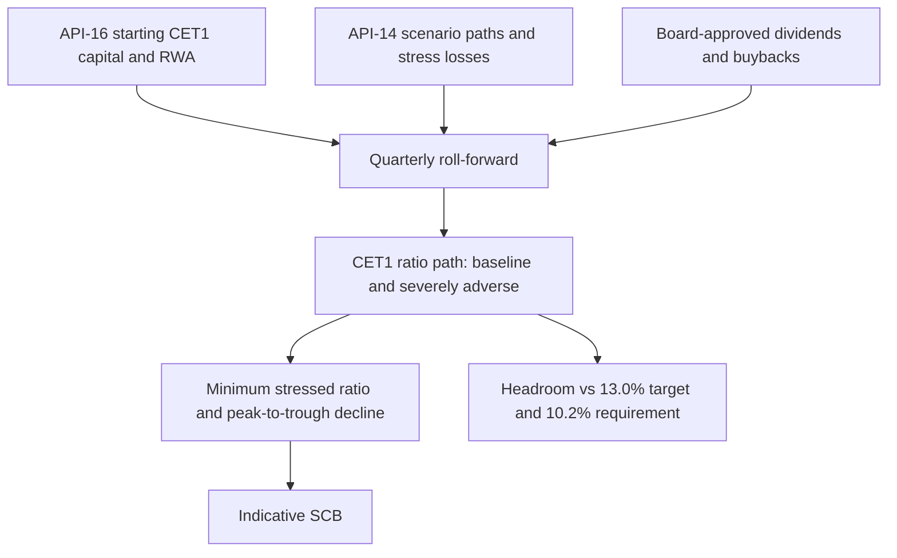

# CET1 Ratio

The Common Equity Tier 1 (CET1) ratio is CET1 capital divided by risk-weighted assets (RWA). For Meridian Harbor Financial Corp. (MHFC, a fictional institution used in a proof-of-concept corpus) it is the binding capital ratio: the firm's reports state that the Standardized CET1 ratio is the binding ratio ([Annual Report](../../sources/reports/mhfc-2025-annual-report.md)). Throughout this page "CET1 ratio" means the **Standardized** ratio unless stated otherwise. Figures are USD millions unless noted.

Related pages: [Risk-Weighted Assets](risk-weighted-assets.md) (denominator), [Stress Capital Buffer](../concepts/stress-capital-buffer.md) (requirement component), [Capital Planning Model](../models/capital-planning-model.md) (projection engine), [Pillar 3 Disclosures 2025](../reports/pillar3-disclosures-2025.md).

## Definition and components

- **Numerator.** CET1 capital is common stock, surplus, retained earnings and AOCI, less regulatory deductions. As a Category I firm MHFC includes AOCI on available-for-sale securities. At 31 Dec 2025 the reconciliation runs from common equity of 116,240 through deductions (goodwill, intangibles, DTAs, pension assets, other) to CET1 capital of 98,450 ([Pillar 3](../../sources/reports/mhfc-2025-pillar3-disclosures.md)).
- **Denominator.** Standardized RWA (652,800 at 31 Dec 2025). The Advanced-approaches ratio is reported alongside (15.92%) but the Standardized ratio is the one used for requirements, targets and projections.
- **Quarterly source of truth.** Starting CET1 capital and RWA for projections come from the Regulatory Reporting API (API-16), which the Pillar 3 report says delivers the same governed data used for the disclosures and FR Y-9C.

## Reported values

| Date | CET1 capital | Standardized RWA | CET1 ratio |
|---|---|---|---|
| 31 Dec 2024 | 93,120 | 633,900 | 14.7% |
| 31 Dec 2025 | 98,450 | 652,800 | 15.08% (15.1% rounded) |
| 30 Jun 2026 | 101,200 | 668,400 | 15.14% (15.1% rounded) |

The five-quarter trend from 2Q25 to 2Q26 is 14.9%, 15.0%, 15.1%, 15.1%, 15.1% ([Q2 2026 supplement](../../sources/reports/mhfc-q2-2026-earnings-supplement.md)). In 2025, CET1 capital rose 5.3 billion: net income of 25.0 billion less common dividends of 6.1 billion, repurchases of 11.0 billion, preferred dividends of 1.1 billion and other movements including AOCI. In 2Q26 the ratio was flat quarter over quarter because earnings were offset by distributions (3,000 repurchases, 1.15 per share dividend) and RWA growth of 1.1%.

## Requirement stack and management target

The regulatory CET1 requirement is additive:

| Component | Level |
|---|---|
| Regulatory minimum (12 CFR 217) | 4.5% |
| Stress capital buffer (effective 1 Oct 2025 to 30 Sep 2026) | 3.2% |
| G-SIB surcharge (Method 2) | 2.5% |
| Countercyclical buffer (U.S.) | 0.0% |
| **Total requirement** | **10.2%** |
| Management target (Board Capital Committee) | 13.0% |

The 13.0% target is a buffer above the requirement for macroeconomic uncertainty and pending U.S. capital framework revisions. The risk appetite framework sets two CET1 limits: baseline Standardized CET1 of at least 13.0% (15.08% at year-end 2025) and minimum stressed CET1 under the internal severely adverse scenario of at least 10.2% (12.6% at year-end 2025). The Pillar 3 report also states the Standardized capital conservation buffer was 10.58% against 5.7% required, with no limits on distributions. See [Stress Capital Buffer](../concepts/stress-capital-buffer.md) for how the 3.2% is derived.

## Projections (MDL-CAP-003)

The [Capital Planning & Stress Projection Model](../models/capital-planning-model.md) (Tier 1 model owned by Corporate Treasury - Capital Management, validated by MRGR) projects the CET1 ratio over nine quarters, Q3 2026 to Q3 2028, from the 30 Jun 2026 actual starting point. It is re-run each quarter with updated starting capital, RWA and scenario paths.

Caption: inputs, roll-forward and outputs of the CET1 projection.

### Mechanics

- **Capital roll-forward.** CET1(t) = CET1(t-1) + net income - preferred dividends - common dividends - share repurchases + other CET1 movements. Common dividends are shares outstanding times 1.15 per share; shares fall by buyback dollars divided by an assumed flat 262 share price. Other movements are a constant -150 per quarter (AOCI, deductions, stock plans, net).
- **RWA roll-forward.** RWA(t) = RWA(t-1) x (1 + growth). Baseline growth is 1.0% per quarter. The ratio is computed as capital over RWA with a guard returning 0 if RWA is zero.
- **Baseline.** Net income starts at 6,600 per quarter growing 0.8% per quarter, preferred dividends are 260, and buybacks are 3,000 per quarter (27,000 cumulative, within the 30 billion 2025-2028 authorization).
- **Severely adverse.** Pre-tax income is PPNR minus provisions minus trading and counterparty losses (top-down inputs from the enterprise stress testing program). Tax is applied at the 22% effective rate, with a tax benefit recognized on losses. Buybacks are suspended and the common dividend is held flat at the starting share count. RWA growth follows a scenario path: +2.2%, +1.5%, +0.8%, +0.4%, 0%, then -0.2% and -0.4% per quarter.
- **Headroom.** Computed in dollars as CET1 capital minus the target (or requirement) times RWA, for both scenarios.

### Results as of the 30 Jun 2026 run

| Measure | Baseline | Severely adverse |
|---|---|---|
| Starting ratio (Q2 2026) | 15.14% | 15.14% |
| Ending ratio (Q3 2028) | 16.15% | 13.63% |
| Minimum ratio | 15.23% (Q3 2026) | 12.90% (Q3 2027) |
| Peak-to-trough decline | n/a | 2.24 pts |
| Ending CET1 capital | 118,027 | 94,293 |
| Ending RWA | 731,019 | 691,920 |

Stressed quarter-by-quarter ratios are 13.92%, 13.46%, 13.14%, 12.95%, 12.90%, 12.96%, 13.13%, 13.36% and 13.63%. Headroom against the 10.2% requirement stays positive throughout the stress (smallest 18,934 at Q3 2027), so the model's check "stress minimum above requirement?" returns YES. Baseline excess over the 13.0% target reaches about 23.0 billion (22,995) at Q3 2028, which management describes as capacity for growth, extra distributions or acquisitions.

Note that headroom against the 13.0% *management target* turns negative under stress in Q2 to Q4 2027 (about -353, -713 and -267): the stressed minimum of 12.90% sits above the regulatory requirement but below the target.

### Indicative SCB link

The model derives an indicative SCB = starting CET1 ratio minus minimum stressed ratio, plus four quarters of planned dividends divided by starting RWA, floored at 2.5%. With 2.24% decline and 0.94% dividend add-on this gives 3.18%, consistent with the preliminary supervisory SCB of 3.2%. Substituting it into the stack gives an indicative requirement of 10.18% versus 10.20% currently.

## Supervisory and historical stress results

In the 2025 CCAR cycle the Federal Reserve's projected minimum CET1 ratio under the supervisory severely adverse scenario was 12.1%, producing the 3.2% SCB. MHFC's own projection for the same scenario was 12.6%. The internal scenario (scenario set SA-2025-INT from API-14) assumes unemployment peaking at 10.2%, real GDP down 6.4%, equity prices down 41% and an instantaneous global market shock in the first quarter. Reverse stress tests (cyber event plus severe recession; sustained negative policy rates) look for scenarios that push the ratio below requirements.

## Limitations and cautions

- The model omits AOCI volatility modelling and deferred-tax-asset threshold deductions; "other movements" is a flat plug even though AOCI is included in CET1 for MHFC.
- Stress losses are inputs, not modelled, so the CET1 path is only as good as the enterprise stress testing outputs.
- The dividend per share and share price are held flat; the share count falls with buybacks only in the baseline.
- Quarterly outputs are not reproduced in the annual report or Pillar 3 report because they refresh each quarter; the latest figures are in the quarterly earnings supplement. Compare dates carefully: the 12.6% minimum is a 2025 result and the 12.90% minimum is the 2Q26 run, which are not the same projection.
- The 3.2% SCB applies only through 30 Sep 2026; the requirement stack changes when the next SCB takes effect.
- Starting capital for the model comes through API-16, so a breaking change to that API triggers a model change review under the firm's model inventory controls.
- All data is synthetic; MHFC is fictional.
