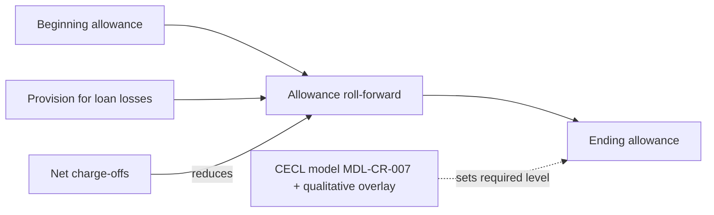

# Net Charge-offs

**Net charge-offs (NCOs)** are gross charge-offs less recoveries. The Firm's glossary defines the term this way ([Annual Report glossary](repo://sources/reports/mhfc-2025-annual-report.md#L661)). NCOs are the realized-loss counterpart to the forward-looking [allowance for credit losses](allowance-for-credit-losses.md). They are the main driver of the provision, together with reserve builds. The metric is reported for Meridian Harbor Financial Corp. (a fictional institution in a synthetic proof-of-concept document set) by portfolio segment, and at Firm level as an NCO rate.

The Card NCO rate is the one that management guides on and the Board limits. Card is also the largest NCO contributor. It sits inside [Consumer & Community Banking](../organizations/consumer-community-banking.md).

## Definitions and rate conventions

- **NCO** = gross charge-offs − recoveries.
- **Card NCO rate (quarterly)** = annualized Card NCOs ÷ average Card loans ([Q2 2026 supplement glossary](repo://sources/reports/mhfc-q2-2026-earnings-supplement.md#L528)).
- **Segment NCO rate in the credit-risk table** appears to be NCOs divided by period-end loans. For example, Card is 4,620 ÷ 138,400 ≈ 3.34% in the loan portfolio table ([Annual Report](repo://sources/reports/mhfc-2025-annual-report.md#L345-L353)). The Firm-wide figure is 6,100 ÷ 742,300 ≈ 0.82%.
- **Two Card figures exist for 2025.** The CCB segment discussion and the Pillar 3 risk-appetite table report **3.42%** (up from 3.18% in 2024), and the CCB table rounds this to 3.4% ([Annual Report CCB](repo://sources/reports/mhfc-2025-annual-report.md#L184-L197)). The credit-risk loan table shows **3.34%**. The difference looks like a denominator difference (average versus period-end loans), but the sources do not state this. Use 3.42% when comparing with the guidance and the limit, and use the table value when reconciling to segment loan balances.
- Amounts are in millions of U.S. dollars unless noted.

## 2025 NCOs by segment

Total 2025 NCOs were **$6.1 billion**, a 0.82% NCO rate on $742.3 billion of loans. Card was about three-quarters of the total.

| Segment | Loans | NCOs | NCO rate | Allowance | Allowance / loans |
|---|---|---|---|---|---|
| Credit Card | 138,400 | 4,620 | 3.34% | 8,640 | 6.24% |
| Residential Mortgage | 218,600 | 40 | 0.02% | 820 | 0.38% |
| Auto | 64,900 | 410 | 0.63% | 690 | 1.06% |
| Commercial Real Estate | 98,200 | 380 | 0.39% | 2,470 | 2.52% |
| Commercial & Industrial | 172,500 | 560 | 0.32% | 2,760 | 1.60% |
| Other Consumer & Wholesale | 49,700 | 90 | 0.18% | 540 | 1.09% |
| **Total** | **742,300** | **6,100** | **0.82%** | **15,920** | **2.14%** |

Source: [Annual Report credit risk table](repo://sources/reports/mhfc-2025-annual-report.md#L345-L353). The Pillar 3 impaired and past-due table repeats the same NCO figures by segment ([Pillar 3 §6.4](repo://sources/reports/mhfc-2025-pillar3-disclosures.md#L287-L295)).

Segment commentary:

- **Card**: NCOs of $4.6 billion reflect "continued normalization of consumer credit". The Card NCO rate rose from 3.18% to 3.42% ([Annual Report CCB](repo://sources/reports/mhfc-2025-annual-report.md#L184)). Management said at the time that charge-offs were in line with Investor Day guidance ([letter](repo://sources/reports/mhfc-2025-annual-report.md#L41)).
- **Residential Mortgage**: NCOs were only $40 million, a 0.02% rate, and credit was described as "very strong". Weighted-average current LTV was 51% ([consumer credit](repo://sources/reports/mhfc-2025-annual-report.md#L357)).
- **Wholesale (CRE and C&I)**: losses were concentrated in office CRE and a small number of C&I names in consumer discretionary ([CIB commentary](repo://sources/reports/mhfc-2025-annual-report.md#L210)).

## Quarterly trend (2Q26)

NCOs rose 3.8% sequentially and 8.6% year on year in 2Q26.

| NCOs ($mm) | 2Q26 | 1Q26 | 2Q25 |
|---|---|---|---|
| Credit Card | 1,270 | 1,200 | 1,110 |
| Residential Mortgage | 10 | 10 | 10 |
| Auto | 100 | 110 | 100 |
| Commercial Real Estate | 90 | 110 | 80 |
| Commercial & Industrial | 160 | 140 | 130 |
| Other Consumer & Wholesale | 20 | 20 | 20 |
| **Total** | **1,650** | **1,590** | **1,520** |

Source: [Q2 2026 Credit Trends](repo://sources/reports/mhfc-q2-2026-earnings-supplement.md#L250-L262).

Rate metrics:

| Rate | 2Q25 | 1Q26 | 2Q26 |
|---|---|---|---|
| Card NCO rate | 3.39% | 3.55% | 3.58% |
| Auto NCO rate | 0.60% | 0.68% | 0.61% |
| Firm NCO rate | 0.84% | 0.86% | 0.88% |

The Firm NCO rate series is 0.84%, 0.83%, 0.85%, 0.86% and 0.88% from 2Q25 through 2Q26 ([consumer credit quality](repo://sources/reports/mhfc-q2-2026-earnings-supplement.md#L340-L348), [five-quarter trend](repo://sources/reports/mhfc-q2-2026-earnings-supplement.md#L504)). Management attributes the drift to Card loan growth and gradual normalization of consumer charge-offs ([commentary](repo://sources/reports/mhfc-q2-2026-earnings-supplement.md#L508)).

Other 2Q26 observations:

- Card 30+ day delinquency was 2.24% (2.29% in 1Q26, 2.15% in 2Q25). Card 90+ day delinquency was 1.14%. Early roll rates for 2025 vintages were reported as tracking underwriting loss curves ([Q2 2026](repo://sources/reports/mhfc-q2-2026-earnings-supplement.md#L342-L351)).
- Wholesale NCOs are tracked by industry. Office real estate accounted for $90 million of 2Q26 NCOs, the largest single industry. Consumer & retail had $55 million and technology, media & telecom had $40 million. Office CRE is described as the area of greatest credit attention. Criticized office loans were $3.1 billion, down from $3.6 billion at year end ([industry table](repo://sources/reports/mhfc-q2-2026-earnings-supplement.md#L353-L365), [CIB commentary](repo://sources/reports/mhfc-q2-2026-earnings-supplement.md#L194-L200)).

## Guidance and risk-appetite limits

- **Outlook**: management expected the full-year 2026 Card NCO rate to be about **3.6%** in January ([Annual Report outlook](repo://sources/reports/mhfc-2025-annual-report.md#L116)). The expectation was reiterated unchanged in the 2Q26 supplement ([outlook](repo://sources/reports/mhfc-q2-2026-earnings-supplement.md#L51)). The 2Q26 rate of 3.58% is described as in line with guidance ([CCB](repo://sources/reports/mhfc-q2-2026-earnings-supplement.md#L69)). These are forward-looking statements.
- **Limit**: the Board-approved risk appetite framework includes an annual Card NCO rate limit of **≤ 4.5%**. The 2025 value of 3.42% was reported as "Within" ([Pillar 3 risk appetite](repo://sources/reports/mhfc-2025-pillar3-disclosures.md#L68-L77)). That leaves about 108 bps of headroom against the 2025 outcome.

## Relationship to provision and allowance

NCOs reduce the allowance for loan losses. The provision then replenishes it and adds any reserve build. Credit costs therefore decompose as:

> Provision for credit losses ≈ net charge-offs + net reserve build

| Period | Provision | NCOs | Net reserve build |
|---|---|---|---|
| FY2025 | $6.8bn | $6.1bn | $740mm, primarily Card |
| 2Q26 | $1.92bn | $1.65bn | $270mm, primarily Card on loan growth |

Sources: [FY2025 provision](repo://sources/reports/mhfc-2025-annual-report.md#L146), [2Q26 provision](repo://sources/reports/mhfc-q2-2026-earnings-supplement.md#L47).

Roll-forward evidence:

- **2025 Card**: beginning allowance 8,040, less NCOs 4,620, plus provision 5,220, gives an ending balance of 8,640. For the Firm, 15,180 − 6,100 + 6,840 = 15,920 ([Note 6](repo://sources/reports/mhfc-2025-annual-report.md#L598-L606)).
- **2Q26**: 16,110 − 1,650 + 1,920 = 16,380. The allowance to period-end loans ratio was 2.15%. For 1Q26 the roll-forward was 15,920 − 1,590 + 1,780 = 16,110 ([Q2 2026](repo://sources/reports/mhfc-q2-2026-earnings-supplement.md#L263-L268)).
- **Coverage**: the Card allowance is about 6% of loans. This is almost two years of current Card charge-offs, which is how management answers reserve-adequacy questions ([Q&A](repo://sources/reports/mhfc-q2-2026-earnings-supplement.md#L448-L450)).
- **Caveat on the reserve build**: the allowance is CECL lifetime expected loss. Reserve builds in Card come from loan growth and scenario weighting, not from realized NCOs. The 100%-downside sensitivity adds about $4.2 billion to the allowance. NCOs are realized losses and the allowance is not, so the two should not be conflated. See [Allowance for Credit Losses](allowance-for-credit-losses.md) and [CECL](../concepts/cecl.md).

CCB's own 2025 provision was $5.96 billion. It comprised Card NCOs of $4.6 billion and a $600 million reserve build ([CCB](repo://sources/reports/mhfc-2025-annual-report.md#L184-L190)).

## Interpretation notes

- Card dominates: 2025 Card NCOs of $4.62 billion were about 76% of the Firm's $6.1 billion, and 2Q26 Card NCOs of $1.27 billion were about 77% of $1.65 billion. Firm-level NCO rate moves are largely a Card story.
- Segment NCO rates are not comparable across Card and secured products. Mortgage had a 0.02% rate against Card at 3.3–3.6%.
- Reported Card NCO rates differ by convention (average versus period-end denominator) and by period (annual versus annualized quarter). Check the denominator before comparing figures.
- Both guidance and results come from synthetic documents. Figures are internally consistent roll-forwards but do not describe a real company ([disclaimer](repo://sources/reports/mhfc-q2-2026-earnings-supplement.md#L538)).
