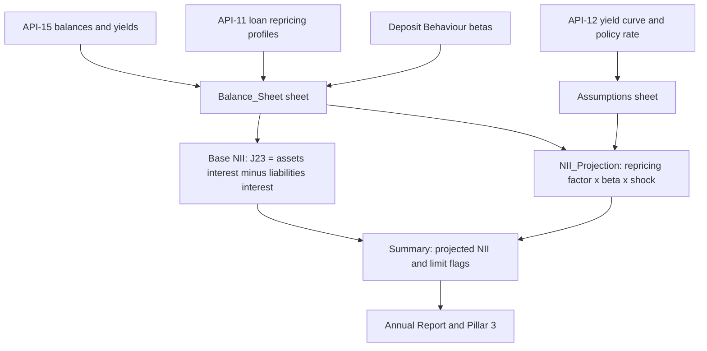

# Net Interest Income

Net interest income (NII) is interest income less interest expense. The Annual Report glossary defines it exactly that way ([Annual Report](../../sources/reports/mhfc-2025-annual-report.md), glossary). Meridian Harbor Financial Corp. (MHFC) is a fictional institution in a proof-of-concept corpus, and every figure below comes from synthetic documents. Amounts are USD millions unless stated.

This page covers two different things that share the name "NII":

1. **Reported NII**: the accounting result in the income statement for a period (FY2025, 2Q26).
2. **Modeled 12-month NII**: a forward, static-balance-sheet projection from the [NII Sensitivity Model (MDL-ALM-014)](../models/nii-sensitivity-model.md), used for [IRRBB](../concepts/irrbb.md) earnings-at-risk and as the basis of the 2026 NII outlook.

Keeping the two apart matters: the model's base case (50,237) is not a restatement of FY2025 reported NII (48,620).

## Reported NII

| Period | Interest income | Interest expense | Net interest income | Source |
|---|---|---|---|---|
| FY2024 | 77,120 | 30,210 | 46,910 | Annual Report, Consolidated Statements of Income (p. 22) |
| FY2025 | 79,340 | 30,720 | 48,620 (+3.6%) | Annual Report, Financial Highlights (p. 6) and p. 22 |
| 2Q25 | 19,420 | 7,400 | 12,020 | Q2 2026 Supplement, Statements of Income (p. 6) |
| 1Q26 | 19,610 | 7,300 | 12,310 | same |
| 2Q26 | 19,840 | 7,280 | 12,560 (+2.0% QoQ, +4.5% YoY) | Q2 2026 Supplement, Highlights (p. 5) and p. 6 |

The five-quarter trend of NII is 12,020 (2Q25), 12,200 (3Q25), 12,390 (4Q25), 12,310 (1Q26) and 12,560 (2Q26) ([Q2 2026 Supplement](../../sources/reports/mhfc-q2-2026-earnings-supplement.md), Five-Quarter Trend Summary, p. 20). See also the [Q2 2026 Earnings Supplement page](../reports/q2-2026-earnings-supplement.md).

### Net interest yield

- FY2025: managed-basis net interest yield of 2.71%, down 4 bps, "reflecting a higher proportion of lower-yielding liquid assets" (Annual Report, Net revenue, p. 8).
- 2Q26: net interest yield of 3.47% on average interest-earning assets of 1,452,000, with 5.48% yield on assets and 2.95% cost of interest-bearing liabilities (Q2 2026 Supplement, average balance table, p. 13). The sources do not reconcile the FY2025 and 2Q26 yield figures, which appear to be on different bases, so do not compare them directly.

### Drivers of reported NII

- **FY2025** (Annual Report, 2025 at a glance, p. 7, and Net revenue): NII rose on higher average loan and deposit balances, with growth in Card loans and wholesale deposits more than offsetting lower policy rates in the fourth quarter. Deposit margin compression late in the year partly offset the gains.
- **2Q26** (Q2 2026 Supplement, p. 3): up 2.0% sequentially on one additional day, Card loan growth and higher deposit balances, partly offset by lower deposit margins after the 25 bp policy rate reduction in March. Loan yields fell 9 bps sequentially, and the cost of interest-bearing deposits fell 7 bps (p. 13).
- **Observed deposit beta.** The cumulative interest-bearing deposit beta since the easing cycle began is 49%, "slightly above the 45% consumer and below the 75% wholesale betas assumed" in the model (Q2 2026 Supplement, p. 13). This is a useful external check on the model's deposit-beta assumptions.

### By segment (FY2025)

| Segment | NII | FY2024 | Source |
|---|---|---|---|
| Consumer & Community Banking | 31,420 | 30,380 | Annual Report p. 9 |
| Commercial & Investment Bank | 12,680 | 12,140 | Annual Report p. 10 |
| Asset & Wealth Management | 3,640 | 3,550 | Annual Report p. 10 |

The three business segments sum to 47,740. The remaining 880 of the firm total of 48,620 is an arithmetic residual, which the sources do not itemize. It sits in [Corporate](../organizations/corporate.md), whose Treasury/CIO unit manages the investment portfolio, liquidity and structural interest rate risk. The Annual Report cites "higher net interest income on the investment portfolio" for Corporate (p. 11). In 2Q26 Corporate NII again "benefited from reinvestment of maturing securities at higher yields" (Q2 2026 Supplement, p. 10).

## 2026 outlook

| Date given | Expectation | Basis | Source |
|---|---|---|---|
| Jan 2026 (Annual Report) | about $50.2 billion | Forward curve at year-end 2025 (two further 25 bp cuts in 2026), modest loan growth | Annual Report, 2026 outlook, p. 7 |
| 2Q26 | about $50.5 billion | Market-implied forward curve at 30 Jun 2026 | Q2 2026 Supplement, p. 3 |

The raise from $50.2 billion to $50.5 billion is attributed to stronger deposit balances. The Q2 2026 Supplement (Drivers of the 2026 NII outlook, p. 15) bridges from the 2025 starting point of about $48.6 billion to the $50.5 billion outlook:

| Driver | Effect ($ billion) |
|---|---|
| Card loan growth | +1.1 |
| Reinvestment of maturing securities at higher yields | +0.6 |
| Deposit growth | +0.5 |
| Lower policy rates compressing deposit margins | -1.0 |
| Migration to higher-yielding deposit products | -0.4 |
| Other balance sheet effects (not shown separately in the chart) | about +1.1 |

The listed items sum to +1.9, which matches the step from 48.6 to 50.5. The 2Q26 NII of 12,560 annualizes to 50,240, which is consistent with the outlook, but that is an arithmetic observation and not a stated forecast method.

## Rate sensitivity (MDL-ALM-014)

### How the model computes it

The model is a Tier 1 workbook owned by Corporate Treasury - Asset & Liability Management, validated by MRGR on 2025-09-18, with the next validation due 2026-09-30 (workbook README sheet). Calculation chain, using the model's sheet names:

Caption: lineage from upstream feeds through the workbook sheets to the disclosed NII sensitivity.

1. **Base NII.** `Balance_Sheet!J23 = J21 - J22`: the sum of balance x yield over 9 asset lines (76,515.95 of annual interest on 1,258,500 of balances) minus balance x cost over 5 liability lines (26,279.04 on 1,180,100). The result is **50,236.91** at the 2025-12-31 month-end snapshot.
2. **Repricing factor** (`NII_Projection!C7:C20`). Each line reprices only for the part of the 12-month horizon left after its repricing date, using bucket midpoints of month 1.5 (0-3m) and month 7.5 (3-12m). The factor is `share(0-3m) x (12-1.5)/12 + share(3-12m) x (12-7.5)/12`. Repricing beyond 12 months has no effect on 12-month NII. See [NII repricing and deposit betas](../models/components/nii-repricing-and-deposit-betas.md).
3. **Shock effect per line.** `sign x balance x beta x repricing factor x shock / 10000`, where sign is +1 for assets and -1 for liabilities. Asset betas are 1.0; deposit betas are 0.45 (consumer interest-bearing), 0.75 (wholesale interest-bearing) and 0 (noninterest-bearing). Repo and long-term debt carry a beta of 1.0.
4. **Change in NII** (`NII_Projection!D22:H22`) is the sum across lines, and projected NII is base plus change (row 24).
5. **Limit test** (`Summary!F6:F10`): `=IF(E<-Assumptions!$B$11,"BREACH","Within limit")`. The Board Risk Committee limit is a decline of no more than 7.0% of base NII in any parallel shock, approved 2025-03. This limit applies to ±100 and ±200 bp shocks. The Pillar 3 risk-appetite text states it for the 200 bp case.

Upstream feeds are [API-15 Treasury Liquidity Positions](../apis/api-15-treasury-liquidity-positions-api.md) (balances and yields), [API-11 Loan Servicing](../apis/api-11-loan-servicing-api.md) (loan repricing profiles) and [API-12 Market Data](../apis/api-12-market-data-api.md) (yield curve and policy rate of 3.75%). The deposit betas come from the Deposit Behaviour sub-model, calibrated annually and approved by MRGR.

### Results at 31 Dec 2025

| Scenario | Projected NII | Change in NII | % of base | NII limit status |
|---|---|---|---|---|
| Down 200 bp | 47,220.02 | -3,016.89 | -6.01% | Within limit |
| Down 100 bp | 48,728.47 | -1,508.44 | -3.00% | Within limit |
| Base | 50,236.91 | 0 | 0 | Within limit |
| Up 100 bp | 51,745.35 | +1,508.44 | +3.00% | Within limit |
| Up 200 bp | 53,253.80 | +3,016.89 | +6.01% | Within limit |

Source: workbook `Summary!C6:F10`. The firm is **asset-sensitive**. Rising rates increase NII because assets (mostly floating or short-repricing: deposits with banks, C&I, CRE, Card) reprice more than liabilities. In the +100 bp case the asset repricing effect is about +5,819 and the liability effect about -4,311 (sum of the `NII_Projection` rows), for a net +1,508. The largest single contributors are deposits with banks and fed funds sold (+2,160) and C&I loans (+1,229) on the asset side, and wholesale deposits (-2,030) on the liability side. Noninterest-bearing deposits do not offset because their beta is zero.

The worst modeled outcome, -6.0% in the Down 200 scenario, uses roughly 86% of the 7.0% limit. The results are exactly symmetric by construction, because betas are constant across shock sizes and there are no floors or convexity.

### Where the model and the reports agree

- The Annual Report Market Risk Management table (Structural interest rate risk (IRRBB), pp. 18-19) shows projected NII of 47,220 / 48,728 / 50,237 / 51,745 / 53,254 and changes of (3,017) / (1,508) / 0 / 1,508 / 3,017 (6.0% / 3.0% in percentage terms). It cites "NII_Sensitivity_Model.xlsx, sheet Summary", so it **agrees** with the workbook to rounding. The text also states the +100 bp result of approximately $1.5 billion (3.0%) and the -200 bp result of $3.0 billion (6.0%) within the 7.0% limit.
- [Pillar 3, section 11 "Interest Rate Risk in the Banking Book"](../reports/pillar3-disclosures-2025.md) (p. 16) reports the same ±3,017 and ±1,508 changes against a stated **base-case 12-month NII of $50,237 million**, which **agrees** with `Balance_Sheet!J23`. Its methodology bullets (instantaneous parallel shocks, midpoint repricing at months 1.5 and 7.5, betas 0.45 / 0.75 / 0.00, static balance sheet, API-15 / API-11 / API-12 data) match the README and Assumptions sheets.
- The Annual Report's 2026 outlook of about $50.2 billion is described as "consistent with the base-case output" of MDL-ALM-014 (Annual Report p. 7). The model base of 50,236.91 is in fact approximately 50.2 billion.
- The Q2 2026 Supplement (Net Interest Income Outlook and Rate Sensitivity, p. 15) reproduces the year-end 2025 table and states that the 30 Jun 2026 sensitivity was "directionally similar", with a +100 bp shock increasing 12-month NII by approximately **$1.4 billion**. That differs slightly from the year-end $1.5 billion. It also confirms that the 0.45 and 0.75 deposit betas were re-calibrated in 1Q26 and remained unchanged.

### Where the model and reported NII differ

The model base (50,237) is higher than FY2025 reported NII (48,620) by about 1,617. It is a different object: annualized balance x yield on month-end rate-sensitive balances (1,258,500, against total assets of 1,418,560), not an accounting result. The model's gross interest income (76,516) and expense (26,279) are also below FY2025 reported interest income (79,340) and expense (30,720). The sources do not provide a formal reconciliation. Treat the model base as a forward 12-month run-rate on the 31 Dec 2025 balance sheet, which the Annual Report links to the 2026 outlook, and do not read it as FY2025 actuals.

### Limitations and compensating controls

- Parallel shocks only (no twists or basis risk), static balance sheet (no growth, mix shift or management actions), constant betas across shock sizes, and no deposit-rate floors below zero (README sheet).
- Pillar 3 adds that the model does not capture mortgage prepayment optionality beyond the static repricing profile or beta convexity at very low rates.
- The compensating control is a **dynamic balance-sheet simulation run quarterly** in the ALM engine, with supplemental scenarios reviewed by ALCO (README sheet, Pillar 3 p. 16, Annual Report p. 18-19).
- The same workbook produces the EVE sensitivity, a separate value-based lens. In the Down 200 case EVE is +2,737 (2.5% of Tier 1 of 110,620), and in the Up 200 case it is -2,737. See [Economic Value of Equity](../concepts/economic-value-of-equity.md).

## Operating notes

- **Changing inputs.** Blue cells in the workbook (Assumptions, Balance_Sheet balances, yields, shares, betas, durations) are the levers. Each Balance_Sheet row has a "Share check" that flags `CHECK` unless the four repricing buckets sum to 100%. A schema or business-logic change in an upstream API triggers a model change review under the Tier 1 process (Annual Report, Model Risk Management, p. 20).
- **Refresh cadence.** The disclosed run uses the 2025-12-31 month-end snapshot. The 30 Jun 2026 sensitivity is only described in text in the Q2 supplement (about +$1.4 billion for +100 bp), and the sources do not give a full table for it.
- **Governance.** The model is subject to the SR 11-7 framework, with MRGR as independent validator, and its limit utilisation flags feed ALCO reporting. Related concepts: [IRRBB](../concepts/irrbb.md) and [Parallel Rate Shocks](../scenarios/parallel-rate-shocks.md).

## Relationships

- produced by (sensitivity): [NII Sensitivity Model (MDL-ALM-014)](../models/nii-sensitivity-model.md)
- governed by: [IRRBB](../concepts/irrbb.md)
- complements: [Economic Value of Equity](../concepts/economic-value-of-equity.md)
- consumes via the model: [API-15](../apis/api-15-treasury-liquidity-positions-api.md), [API-11](../apis/api-11-loan-servicing-api.md), [API-12](../apis/api-12-market-data-api.md)
- belongs to: [Corporate (Treasury/CIO)](../organizations/corporate.md) for structural rate risk management
- disclosed in: [Annual Report](../../sources/reports/mhfc-2025-annual-report.md) pp. 6, 7, 18-19, 22; [Pillar 3 Disclosures 2025](../reports/pillar3-disclosures-2025.md) p. 16; [Q2 2026 Earnings Supplement](../reports/q2-2026-earnings-supplement.md) pp. 3, 5, 6, 13, 15, 20
