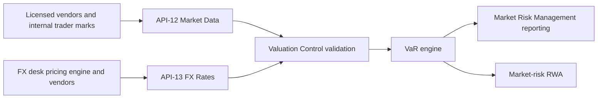

# Value at Risk (VaR)

Value-at-risk (VaR) is defined in the Annual Report glossary as a "statistical estimate of potential one-day loss in trading positions at a given confidence level" ([Annual Report](../../sources/reports/mhfc-2025-annual-report.md)). Meridian Harbor Financial Corp. (MHFC) is a fictional institution in a proof-of-concept corpus, so all figures here are invented. Figures are USD millions for the year ended 31 Dec 2025 unless stated.

VaR is the main trading-book market-risk metric. The sources publish it in two forms with different confidence levels, horizons and risk-factor breakdowns. Do not mix them up.

| Form | Confidence / horizon | Where reported | 2025 headline |
|---|---|---|---|
| Management VaR | 95%, 1-day | Annual Report, Market Risk Management (p. 18) | Average total 50 (2024: 51); min 37, max 71 |
| Regulatory VaR | 99%, 10-day | Pillar 3, section 9 (p. 14) | Average total 160; min 118, max 231; period end 149 |

Related: [Market Data API (API-12)](../apis/api-12-market-data-api.md), [Market Data Services](../teams/market-data-services.md), [Risk-Weighted Assets](risk-weighted-assets.md), [CET1 Ratio](cet1-ratio.md), [Basel III Pillar 3](../concepts/basel-iii-pillar-3.md), [BCBS 239](../concepts/bcbs-239.md), [IRRBB](../concepts/irrbb.md), [Commercial & Investment Bank](../organizations/commercial-investment-bank.md), [2025 Annual Report](../reports/annual-report-2025.md), [2025 Pillar 3 Disclosures](../reports/pillar3-disclosures-2025.md).

## Ownership

No reportable business segment owns VaR. The Annual Report says that "Market Risk Management, part of the independent risk function, sets limits, monitors exposures and reports to the Board Risk Committee" (p. 18). Market risk is defined there as the effect of changes in interest and foreign exchange rates, equity and commodity prices, credit spreads or implied volatilities on the value of assets and liabilities.

The trading activity that VaR covers sits mainly in the Markets business of the [Commercial & Investment Bank](../organizations/commercial-investment-bank.md) (Markets revenue was a record 17,920 in 2025), but the sources publish only firmwide VaR, not a CIB-only or desk-level figure. Treat VaR as a firmwide measure.

## Management VaR (95%, 1-day)

The Annual Report publishes average VaR by asset class, with the diversification benefit shown as a negative line:

| Asset class | 2025 avg | 2024 avg | Min 2025 | Max 2025 |
|---|---|---|---|---|
| Fixed income | 38 | 41 | 27 | 55 |
| Foreign exchange | 9 | 8 | 5 | 16 |
| Equities | 15 | 13 | 9 | 24 |
| Commodities and other | 7 | 8 | 4 | 12 |
| Credit portfolio and other | 12 | 14 | 8 | 19 |
| Diversification benefit | (31) | (33) | NM | NM |
| **Total VaR** | **50** | **51** | **37** | **71** |

The components sum to the total: 38 + 9 + 15 + 7 + 12 = 81, less the 31 diversification benefit, gives 50. Fixed income is the largest contributor. The diversification benefit is not a standalone risk. It reflects that the asset-class risks do not peak together. Component minima and maxima do not add to the total minimum and maximum, which is why diversification is marked "NM" (not meaningful) in those columns.

**Methodology.** The table note on p. 18 states: "VaR is calculated using historical simulation over a one-year look-back." The Annual Report gives no further model detail, and the Pillar 3 regulatory VaR methodology is not described beyond the confidence level and horizon.

## Regulatory VaR (99%, 10-day)

For regulatory capital, the Firm "uses internal models approved by its regulators for VaR, stressed VaR, the incremental risk charge (IRC) and the comprehensive risk measure, and the standardized specific risk charge for certain positions". These apply to "covered positions": trading assets and liabilities plus certain foreign exchange and commodity positions ([Pillar 3](../../sources/reports/mhfc-2025-pillar3-disclosures.md), section 9, p. 14). Pillar 3 breaks regulatory VaR down by a different set of risk factors from the Annual Report:

| Risk factor | Average | Min | Max | Period end |
|---|---|---|---|---|
| Interest rate | 128 | 84 | 192 | 117 |
| Credit spread | 61 | 42 | 89 | 58 |
| Equity | 52 | 31 | 86 | 49 |
| Foreign exchange | 29 | 16 | 51 | 27 |
| Commodity | 22 | 12 | 37 | 19 |
| Diversification | (132) | NM | NM | (121) |
| **Total regulatory VaR** | **160** | **118** | **231** | **149** |

Interest-rate risk is the largest factor, consistent with fixed income dominating the management view. The other measures are defined in the Pillar 3 glossary: stressed VaR is VaR "calibrated to a one-year period of significant financial stress", and IRC is the charge for default and migration risk in trading positions.

### Contribution to market-risk RWA

Both VaR and stressed VaR feed market-risk RWA, each multiplied by a regulatory multiplier. The Pillar 3 market-risk RWA table (31 Dec 2025, with 31 Dec 2024 in parentheses) shows:

- Regulatory VaR (10-day, 99%) x multiplier: 11,400 (11,100)
- Stressed VaR (10-day, 99%) x multiplier: 21,900 (21,200)
- Incremental risk charge: 7,800 (7,500)
- Comprehensive risk measure: 1,300 (1,400)
- Standardized specific risk: 11,800 (11,400)
- **Total market risk RWA: 54,200 (52,600)**

VaR and stressed VaR together are 33,300 of 54,200, about 61%, and stressed VaR is the larger of the two. Market risk is 8.3% of total Standardized RWA (652,800) and 8.8% of Advanced RWA (618,300) (p. 7). Pillar 3 attributes the 2025 rise in market-risk RWA to higher stressed VaR in rates trading in the second quarter (p. 8). The Standardized RWA flow shows +1,600 from "Changes in market risk positions and model updates", taking market risk RWA from 52,600 to 54,200. See [Risk-Weighted Assets](risk-weighted-assets.md) for how this sits in total RWA, and [CET1 Ratio](cet1-ratio.md) for the capital-ratio effect.

## Backtesting and the multiplier

Backtesting compares daily trading results with the prior day's 1-day 99% VaR. Pillar 3 reports 2 backtesting exceptions at the firmwide level in the twelve months to 31 Dec 2025 (p. 14). That is below the threshold of five that would raise the regulatory multiplier above 3.0. Because the exception count drives the multiplier, which scales VaR and stressed VaR in RWA, more exceptions would raise market-risk capital.

The Annual Report separately states "There were 3 backtesting exceptions in 2025, within the expected range" in the note under its 95% 1-day VaR table (p. 18). The two sources count differently (2 versus 3), and neither explains the difference. When quoting an exception count, name the source and the measure it refers to.

## Models and the "VaR engine"

The Annual Report's Model Risk Management section (p. 20) lists the three Tier 1 models, out of roughly 2,900 in the inventory, that "directly drive amounts and metrics disclosed in this report":

| Model | Owner | Relation to VaR |
|---|---|---|
| MDL-ALM-014 Net Interest Income Sensitivity Model | Corporate Treasury - Asset & Liability Management | Measures structural earnings-at-risk and EVE (IRRBB), not VaR |
| MDL-CR-007 CECL Lifetime Expected Credit Loss Model | Consumer & Wholesale Credit Risk - Allowance Methodology | Credit loss allowance, not VaR |
| MDL-CAP-003 Capital Planning & Stress Projection Model | Corporate Treasury - Capital Management | Capital projections; consumes trading and counterparty stress losses, not VaR |

None of the three models produces VaR, and the sources assign no model ID, owner or validation date to the VaR calculation. The only name given to the calculator is the "VaR engine", which the API-12 and API-13 documents list as a downstream consumer of their data. Do not attribute VaR to any of the three inventoried models.

## Data inputs and lineage

- Trading positions are valued daily from prices, curves and volatility surfaces published by [API-12](../apis/api-12-market-data-api.md) and FX rates from API-13 (FX Rates API) (Annual Report p. 18). Pillar 3 adds correlations to the model inputs.
- Both feeds are designated critical data elements under the Firm's [BCBS 239](../concepts/bcbs-239.md) program, and Pillar 3 says their inputs are validated independently by the Valuation Control Group. The API-12 documentation describes it as the golden source for VaR, fair value and the policy rate used in ALM models; its owning team is [Market Data Services](../teams/market-data-services.md).
- If API-12 is unavailable or its end-of-day snapshot is late, downstream VaR valuation lacks current inputs. The API-12 page says callers must not silently substitute stale rates. A change to either feed therefore has regulatory-data governance weight.

## Scope and relationships

- VaR covers trading positions only. Structural interest-rate risk from lending, deposit-taking and debt issuance is measured separately as earnings-at-risk and EVE by the NII Sensitivity Model (MDL-ALM-014), not by VaR. See [IRRBB](../concepts/irrbb.md).
- Trading assets were 132,900 at year-end 2025 (2024: 124,200), and trading liabilities were 48,300 (2024: 45,600). These give the scale of the book that VaR covers.
- Trading and counterparty losses from enterprise stress testing feed capital planning (MDL-CAP-003). That is a separate loss measure from VaR.
- Pillar 3 section 9 is the regulatory home of VaR within [Basel III Pillar 3](../concepts/basel-iii-pillar-3.md); its data-lineage summary maps API-12 to "MDL-ALM-014; VaR; collateral valuation" and API-13 to "VaR; non-USD exposure conversion".

## Reading the numbers safely

- The 95% 1-day (50) and 99% 10-day (160) totals are not comparable. They differ in confidence level, horizon and risk-factor taxonomy. A 2025 average is not a period-end value (regulatory total: 160 average, 149 period end).
- The management figure is an annual average with min/max range, so it does not show the exposure on a given day.
- The Q2 2026 earnings supplement lists API-12 (310 million monthly calls, 99.99% availability) with "Trading" among its key consumers, and gives Markets revenue of $4.6 billion, but publishes no VaR figures. The latest VaR values in the sources are the 2025 ones.
