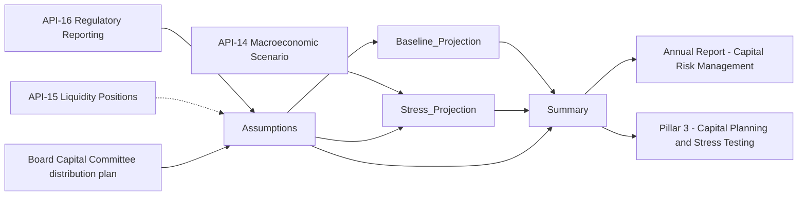
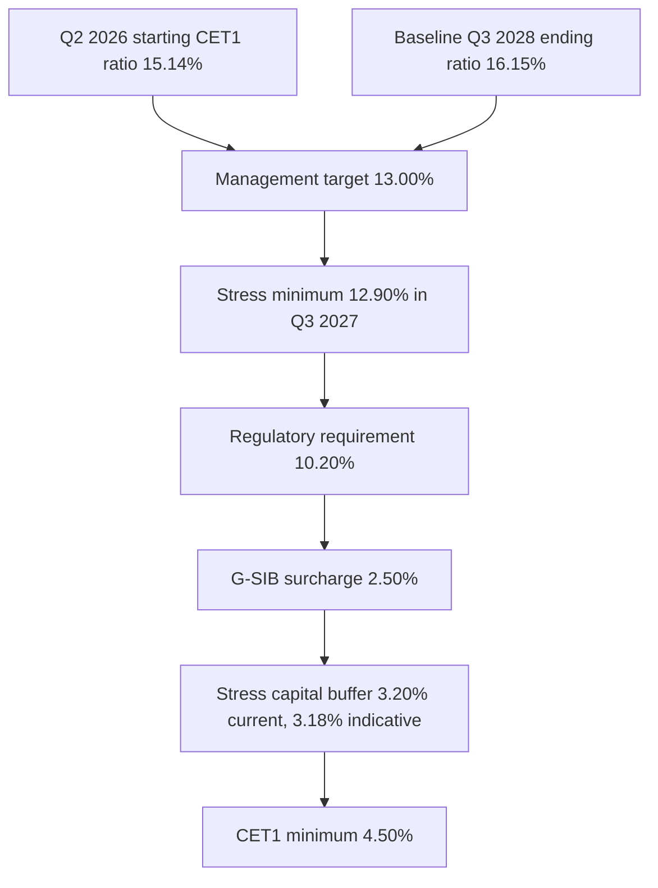

# MDL-CAP-003 Capital Planning & Stress Projection Model

MDL-CAP-003 is the Meridian Harbor Financial Corp. workbook (`Capital_Planning_Model.xlsx`, rendered in `sources/models/capital-planning-model.md`) that projects **CET1 capital, risk-weighted assets (RWA) and capital ratios over a nine-quarter horizon** under two paths: the firm's baseline plan and a severely adverse scenario. Its stated purpose is to size shareholder distributions (dividends and buybacks). The institution and all figures are synthetic.

| Attribute | Value |
| --- | --- |
| Model ID | MDL-CAP-003 |
| Risk tier | Tier 1 (High) |
| Owner | [Corporate Treasury - Capital Management](../teams/corporate-treasury-capital-management.md) |
| Independent validator | Model Risk Governance & Review (MRGR), under [SR 11-7 model risk management](../concepts/model-risk-sr-11-7.md) |
| Last / next validation | 2026-02-27 / due 2027-02-28 |
| Units | USD millions unless stated; rates stored as decimals |
| Starting point | Q2 2026 actuals (Assumptions sheet) |
| Horizon | Q3 2026 to Q3 2028 (columns C to K, nine projected quarters) |

## Relationships

- consumes: [API-16 Regulatory Reporting API](../apis/api-16-regulatory-reporting-api.md) for starting CET1 capital and standardized RWA (FR Y-9C / FFIEC 101 extract).
- consumes: [API-14 Macroeconomic Scenario API](../apis/api-14-macroeconomic-scenario-api.md) for the severely adverse scenario paths (CCAR 2026 analogue).
- cross-checks against: [API-15 Treasury Liquidity Positions API](../apis/api-15-treasury-liquidity-positions-api.md) for liquidity constraints on distributions.
- produces: [CET1 ratio](../metrics/cet1-ratio.md) paths, [RWA](../metrics/risk-weighted-assets.md) paths, and an indicative [stress capital buffer](../concepts/stress-capital-buffer.md).
- uses: the [G-SIB surcharge](../concepts/gsib-surcharge.md) (2.50%, Method 2) in the regulatory requirement.
- disclosed in: Annual Report (Capital Risk Management) and Pillar 3 (Capital Planning and Stress Testing); see [2025 Annual Report](../reports/annual-report-2025.md) and [Pillar 3 disclosures](../reports/pillar3-disclosures-2025.md), plus [Basel III Pillar 3](../concepts/basel-iii-pillar-3.md).
- components: [baseline projection](components/capital-baseline-projection.md), [stress projection](components/capital-stress-projection.md), [indicative SCB](components/indicative-stress-capital-buffer.md).

## Workbook structure and data flow

The workbook has five sheets. Colour convention: blue text = hard-coded input or scenario lever, black = formula, green = cross-sheet link, yellow fill = key assumption.

| Sheet | Role |
| --- | --- |
| `README` | Model documentation, ownership, limits and known limitations. |
| `Assumptions` | All starting values, distribution plan, growth rates and the requirement stack. |
| `Baseline_Projection` | Nine-quarter CET1 roll-forward under the baseline plan. |
| `Stress_Projection` | Nine-quarter roll-forward under the severely adverse scenario. |
| `Summary` | Minimum ratios, headroom, indicative SCB; feeds the disclosures. |

Caption: inputs enter through `Assumptions` and the stress sheet, both projections flow to `Summary`, and `Summary` feeds the two downstream disclosures. The dotted API-15 link is a manual cross-check rather than a formula link.

## Inputs (`Assumptions` sheet)

| Cell | Input | Value | Source / note |
| --- | --- | --- | --- |
| `B6` | Starting CET1 capital ($mm) | 101,200 | API-16, Q2 2026 |
| `B7` | Starting standardized RWA ($mm) | 668,400 | API-16, Q2 2026 |
| `B8` | Common shares outstanding (mm) | 1,381 | Transfer agent, 2026-06-30 |
| `B9` | Baseline quarterly net income ($mm) | 6,600 | Financial plan 2026-2028 |
| `B10` | Net income growth per quarter | 0.80% | Financial plan |
| `B11` | Preferred dividends per quarter ($mm) | 260 | Contractual |
| `B12` | Common dividend per share per quarter ($) | 1.15 | Board-declared, flat |
| `B13` | Share repurchases per quarter ($mm) | 3,000 | Board-authorised $30bn program, 2025-2028 |
| `B14` | Assumed share price ($) | 262 | Flat, for share-count roll-forward |
| `B15` | Baseline RWA growth per quarter | 1.00% | Balance sheet plan |
| `B16` | Other CET1 movements per quarter ($mm) | -150 | AOCI, deductions, employee stock plans (net) |
| `B17` | Effective tax rate | 22.0% | FY2025 effective rate |
| `B18` | CET1 regulatory minimum | 4.50% | 12 CFR 217 |
| `B19` | Stress capital buffer (current) | 3.20% | Effective 2025-10-01 |
| `B20` | G-SIB surcharge | 2.50% | Method 2 |
| `B21` | Management target CET1 ratio | 13.00% | Board Capital Committee |
| `B23` | Regulatory CET1 requirement | 10.20% | Formula `=B18+B19+B20` |

Stress-only inputs live directly on `Stress_Projection` as blue hard-coded rows: PPNR (row 7), provision for credit losses (row 8), trading and counterparty losses (row 9), RWA growth (row 18) and share repurchases (row 15). Stress losses are top-down values supplied by the enterprise stress testing program, not computed inside this workbook.

## Capital stack

The regulatory requirement is a stack of the 4.5% minimum, the SCB and the G-SIB surcharge; the management target and the actual and stressed positions sit above it.

Caption: ratios from high to low, read top to bottom. The three bottom boxes sum to the 10.20% requirement (`Assumptions!B23`). The indicative SCB would lower the requirement to 10.18% (`Summary!B14`). The stress minimum falls below the 13.00% management target but stays above the requirement.

## Baseline projection (`Baseline_Projection`)

Column `B` is the Q2 2026 actual; columns `C:K` are Q3 2026 to Q3 2028. Per quarter `t`:

- Ending CET1, `C12 = C6+C7+C8+C9+C10+C11`: beginning CET1 (`C6 = B12`, the prior ending) plus net income, minus preferred dividends, common dividends and repurchases, plus other movements.
- Net income, `C7 = Assumptions!$B$9*(1+Assumptions!$B$10)^n` with exponent `n` running 0 to 8 across the columns.
- Common dividends, `C9 = -B16*Assumptions!$B$12`: *prior-quarter* share count times dividend per share.
- Share repurchases, `C10 = -Assumptions!$B$13`, and share count `C16 = B16+C10/Assumptions!$B$14`, so buyback dollars retire shares at the flat $262 price. This lowers dividends each quarter (about 1,588 falling to about 1,483).
- RWA, `C14 = B14*(1+C13)` with growth `C13 = Assumptions!$B$15`.
- CET1 ratio, `C15 = IF(C14=0,0,C12/C14)`.
- Headroom vs management target, `C17 = C12-Assumptions!$B$21*C14`; headroom vs requirement, `C18 = C12-Assumptions!$B$23*C14`.

Outcome: ending CET1 rises from 101,200 to 118,027.41 and RWA from 668,400 to 731,019.24, so the ratio rises from 15.14% to 16.15% (`K15`). Headroom vs target at Q3 2028 is 22,994.91 (`K17`). Cumulative buybacks over the horizon are 27,000 (nine times 3,000).

## Stress projection (`Stress_Projection`)

Same layout as the baseline, but income is built bottom-up from scenario inputs:

- Pre-tax income, `C10 = SUM(C7:C9)` (PPNR + provisions + trading and counterparty losses, the latter two entered as negatives).
- Income tax, `C11 = -C10*Assumptions!$B$17`. A loss produces a positive tax benefit (Q3 2026: +1,166), so tax benefit is recognised on losses.
- Net income, `C12 = C10+C11`.
- Ending CET1, `C17 = C6+C12+C13+C14+C15+C16`.
- Buybacks (row 15) are hard-coded at 0 for every quarter (cell notes: "Buybacks suspended under stress (CCAR convention)").
- Common dividends are held flat: `C14 = -B21*Assumptions!$B$12`. Because buybacks are zero, the share count (`C21 = B21+C15/Assumptions!$B$14`) stays at 1,381mm, giving a constant 1,588.15 per quarter.
- RWA, `C19 = B19*(1+C18)`, with scenario growth of +2.2%, +1.5%, +0.8%, +0.4%, 0, then -0.2%, -0.4%, -0.4%, -0.4%.
- CET1 ratio, `C20 = IF(C19=0,0,C17/C19)`; headroom rows 22 and 23 use the same target and requirement as the baseline.

Results: Q3 2026 net income is -4,134 after a 5,400 trading and counterparty loss and 7,300 provisions. CET1 falls to a trough of 90,507.25 in Q3 2027 and ends at 94,292.65. The ratio falls from 15.14% to a minimum of **12.90% in Q3 2027** (`G20`) and recovers to 13.63% by Q3 2028. Headroom vs the 13.00% management target is negative in Q2 2027 to Q4 2027 (-352.79, -712.94, -266.65), but headroom vs the 10.20% requirement stays at least 18,934.48.

## Summary outputs and indicative SCB (`Summary`)

| Cell | Metric | Formula | Value |
| --- | --- | --- | --- |
| `B6` | Starting CET1 ratio | `=Baseline_Projection!B15` | 15.14% |
| `B7` | Ending CET1 ratio, baseline | `=Baseline_Projection!K15` | 16.15% |
| `B8` | Minimum CET1 ratio, baseline | `=MIN(Baseline_Projection!C15:K15)` | 15.23% |
| `B9` | Minimum CET1 ratio, severely adverse | `=MIN(Stress_Projection!C20:K20)` | 12.90% |
| `B10` | Peak-to-trough decline | `=B6-B9` | 2.24% |
| `B11` | Four quarters of planned dividends / starting RWA | `=-SUM(Baseline_Projection!C9:F9)/Baseline_Projection!B14` | 0.94% |
| `B12` | Indicative SCB | `=MAX(0.025,B10+B11)` | 3.18% |
| `B13` | Requirement at current SCB | `=Assumptions!$B$23` | 10.20% |
| `B14` | Requirement at indicative SCB | `=Assumptions!$B$18+B12+Assumptions!$B$20` | 10.18% |
| `B15` | Management target | `=Assumptions!$B$21` | 13.00% |
| `B16` | Cumulative buybacks ($mm) | `=-SUM(Baseline_Projection!C10:K10)` | 27,000 |
| `B17` | Excess CET1 vs target at Q3 2028 ($mm) | `=Baseline_Projection!K17` | 22,994.91 |
| `B18` | Stress minimum above requirement? | `=IF(B9>=B13,"YES","NO - capital action required")` | YES |

The indicative SCB is `MAX(2.5%, starting ratio - minimum stressed ratio + four quarters of planned dividends / starting RWA)`. The dividend add-on uses the first four *baseline* common-dividend quarters (`C9:F9`, 6,273.59 in total) over starting RWA. At 3.18% the indicative SCB is slightly below the current 3.20% (effective 2025-10-01). See [Stress capital buffer](../concepts/stress-capital-buffer.md) and the [indicative SCB component](components/indicative-stress-capital-buffer.md).

`Summary!B17` doubles as the output "capacity for additional buybacks at the management target": the baseline CET1 left over above 13.0% of RWA at Q3 2028.

## Invariants, controls and limitations

- Roll-forward identity: every quarter's beginning CET1 equals the prior quarter's ending CET1, and the Q2 2026 actuals come only from `Assumptions!B6:B8`. Changing a starting value there flows through both projections.
- Pass/fail test: `Summary!B18` compares the stress minimum with the *current-SCB* requirement (`B13`), not the indicative one and not the management target. A "NO - capital action required" result is the trigger for capital action. The stress path can breach the 13.0% management target (it does in this version) while still returning YES.
- The indicative SCB is not fed back into `Assumptions!B19`; the current SCB remains an input to be updated manually when the regulator sets a new one.
- Ratio formulas guard against zero RWA with `IF(x=0,0,...)`, except for the Q2 2026 column.
- Management target CET1 ratio is 13.0%; regulatory requirement is 4.5% + SCB + G-SIB surcharge.
- Known limitations (README): no AOCI volatility modelling, no deferred-tax-asset threshold deductions (AOCI and other items appear only as the flat -150 per quarter), and stress losses are top-down inputs from the enterprise stress testing program. Share price, dividend per share, RWA growth and the buyback pace are all flat assumptions.
- Operating note: distribution plan inputs (dividends, buybacks) are approved by the Board Capital Committee; liquidity constraints on distributions are cross-checked against API-15 outside the formulas.

## Extension and change points

- **Scenario refresh:** replace the blue stress rows (7, 8, 9, 18 on `Stress_Projection`) with a new API-14 scenario set. Row 15 must remain 0 to preserve the buyback-suspension convention.
- **Distribution plan:** change `Assumptions!B12:B14` (dividends, buybacks, price). Because baseline dividends use the prior-quarter share count, buyback changes alter dividends and the SCB dividend add-on (`Summary!B11`).
- **Horizon:** the model is hard-wired to nine columns; `Summary!B8`, `B9`, `B11` and `B16` use fixed ranges (`C:K`, `C:F`), so adding quarters requires updating them.
- **Requirement stack:** update `Assumptions!B19` and `B20` when the SCB or G-SIB surcharge changes; `B23` and all headroom rows recompute.

## Reference results at a glance

| Measure | Baseline | Severely adverse |
| --- | --- | --- |
| Starting CET1 ratio (Q2 2026) | 15.14% | 15.14% |
| Ending CET1 ratio (Q3 2028) | 16.15% | 13.63% |
| Minimum CET1 ratio | 15.23% (Q3 2026) | 12.90% (Q3 2027) |
| Ending CET1 capital ($mm) | 118,027.41 | 94,292.65 |
| Ending RWA ($mm) | 731,019.24 | 691,920.47 |
| Cumulative buybacks ($mm) | 27,000 | 0 |
