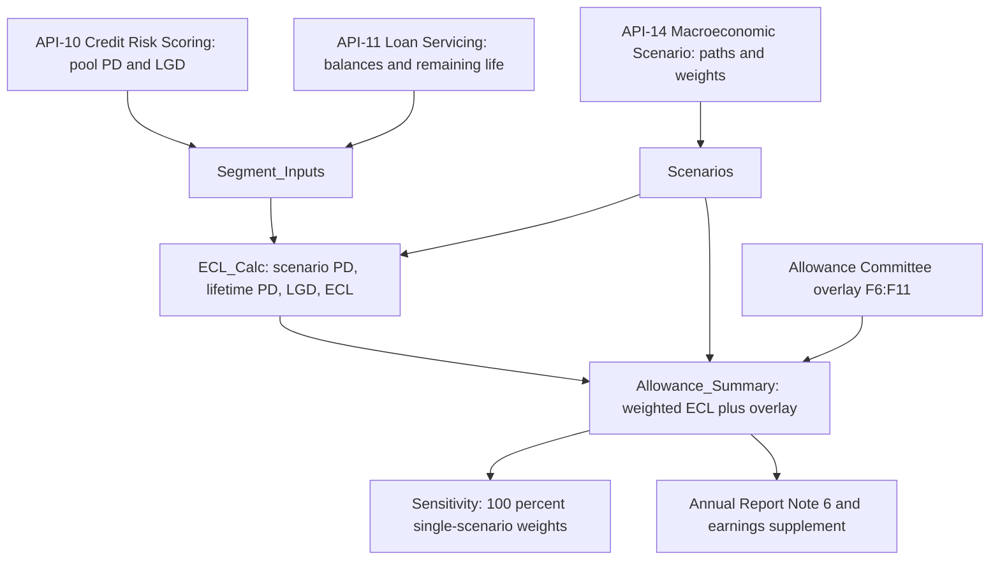

# MDL-CR-007 CECL Allowance Model

MDL-CR-007, the *CECL Lifetime Expected Credit Loss Model*, is the Excel workbook `CECL_Allowance_Model.xlsx` that Meridian Harbor Financial Corp. (a fictional bank) uses to size its allowance for credit losses under ASC 326. It runs a pool-level calculation, **EAD × lifetime PD × scenario LGD**, for six portfolio segments under three macroeconomic scenarios. It then probability-weights the results, adds a management qualitative overlay, and reconciles the total to the reported allowance. The accounting standard is explained in [CECL](../concepts/cecl.md). This page covers the workbook mechanics. The quarterly operating sequence is in [CECL Allowance Calculation Flow](../workflows/cecl-allowance-calculation-flow.md).

Evidence: repo://sources/models/cecl-allowance-model.md#L119-L152

## Governance snapshot

| Attribute | Value |
|---|---|
| Model ID / tier | MDL-CR-007 / Tier 1 (High) |
| Owner | Consumer & Wholesale Credit Risk - Allowance Methodology ([team page](../teams/consumer-wholesale-credit-risk-allowance-methodology.md)) |
| Independent validator | Model Risk Governance & Review (MRGR) |
| Last validation / next due | 2025-11-04 / 2026-11-30 |
| Units | USD millions unless stated; rates stored as decimals |
| Downstream disclosures | Annual Report Note 6 (Allowance for Credit Losses); Q2 2026 Earnings Supplement, Credit Trends |

The workbook is described as a simplified pool-level demonstration; the README says the production model uses loan-level cash flows. Colour convention: blue = hard-coded input or scenario lever, black = formula, green = cross-sheet link, yellow fill = key assumption.

Evidence: repo://sources/models/cecl-allowance-model.md#L125-L137, repo://sources/models/cecl-allowance-model.md#L168-L178, repo://sources/reports/mhfc-2025-pillar3-disclosures.md#L489-L500

## Pipeline at a glance

Caption: data flows from the three consumed APIs through the input sheets and ECL_Calc into Allowance_Summary, which feeds Sensitivity and the disclosures.

## Sheets and roles

| Sheet | Role |
|---|---|
| `README` | Model ID, owner, validator, how-it-works steps, limits and controls |
| `Scenarios` | Scenario weights and macro paths (MSC-2025Q4); weight check; baseline unemployment anchor |
| `Segment_Inputs` | EAD, remaining life, base PD and LGD, elasticities, price driver, FY2025 net charge-offs, reported allowance |
| `ECL_Calc` | Three stacked blocks (Upside rows 7-13, Baseline rows 17-23, Downside rows 27-33) |
| `Allowance_Summary` | Weighting, overlay, total allowance, reconciliation, coverage ratios, overlay control |
| `Sensitivity` | Allowance if 100% weight is put on a single scenario |

Evidence: repo://sources/models/cecl-allowance-model.md#L138-L145

## Inputs and the APIs consumed

The model consumes three internal APIs, and each feeds a different set of cells. The workbook README and the developer-platform reference agree on the list.

- **[API-11 Loan Servicing API](../apis/api-11-loan-servicing-api.md)** supplies loan balances (EAD) and remaining life: `Segment_Inputs!C6:D11`.
- **[API-10 Credit Risk Scoring API](../apis/api-10-credit-risk-scoring-api.md)** supplies pool-level PD and LGD parameters, refreshed quarterly, plus the macro elasticities: `Segment_Inputs!E6:H11`. The API reference notes that v3.0 (2025-10) added the macro elasticities used by MDL-CR-007.
- **[API-14 Macroeconomic Scenario API](../apis/api-14-macroeconomic-scenario-api.md)** supplies scenario paths and weights (scenario set MSC-2025Q4, approved by the Scenario Committee): `Scenarios!B6:F8`. See [Macro Scenarios MSC-2025Q4](../scenarios/macro-scenarios-msc-2025q4.md).

Two further inputs are not API-sourced. The qualitative overlay in `Allowance_Summary!F6:F11` is entered by management after Allowance Committee approval. The reported allowance in `Segment_Inputs!K6:K11` is the figure published in Note 6.

Evidence: repo://sources/models/cecl-allowance-model.md#L133, repo://sources/models/cecl-allowance-model.md#L154-L158, repo://sources/api_docs/mhfc-developer-platform-api-reference.md#L832-L836, repo://sources/api_docs/mhfc-developer-platform-api-reference.md#L1395-L1404

### Segment inputs (as of 2025-12-31)

| Segment | EAD ($mm) | Life (yrs) | Base PD | Base LGD | PD elasticity | LGD sens. | Price driver | FY25 NCOs |
|---|---|---|---|---|---|---|---|---|
| Credit Card | 138,400 | 1.70 | 0.0374 | 0.88 | 0.165 | 0 | None | 4,620 |
| Residential Mortgage | 218,600 | 6.50 | 0.0035 | 0.14 | 0.14 | 1.80 | HPI | 40 |
| Auto | 64,900 | 2.40 | 0.0104 | 0.42 | 0.12 | 0.40 | None | 410 |
| Commercial Real Estate | 98,200 | 3.80 | 0.0137 | 0.38 | 0.15 | 1.60 | CRE | 380 |
| Commercial & Industrial | 172,500 | 2.30 | 0.0150 | 0.41 | 0.135 | 0 | None | 560 |
| Other Consumer & Wholesale | 49,700 | 2.00 | 0.0149 | 0.33 | 0.10 | 0 | None | 90 |
| **Total** | **742,300** (`C12 =SUM(C6:C11)`) | | | | | | | **6,100** |

Auto carries an LGD sensitivity of 0.40 but its price driver is "None", so `ECL_Calc` applies no collateral-price adjustment and Auto LGD stays at 0.42 in every scenario. Only Residential Mortgage (HPI) and CRE (commercial property index) pick up a price effect.

Evidence: repo://sources/models/cecl-allowance-model.md#L209-L226, repo://sources/models/cecl-allowance-model.md#L249-L252

## Step 1: ECL by scenario (`ECL_Calc`)

Each scenario block repeats the same six formulas for every segment. The formulas below use the Upside block, row 7 (Credit Card). The Baseline block uses `Scenarios!$C$7` and `Scenarios!$E$7:$F$7` in rows 17-22. The Downside block uses `$C$8` and `$E$8:$F$8` in rows 27-32.

| Column | Quantity | Formula (Upside, Credit Card, row 7) |
|---|---|---|
| B | Scenario PD (annual) | `=MAX(0,Segment_Inputs!E6*(1+Segment_Inputs!G6*(Scenarios!$C$6-Scenarios!$B$11)*100))` |
| C | Lifetime PD | `=1-(1-B7)^Segment_Inputs!D6` |
| D | Collateral price change | `=IF(Segment_Inputs!I6="HPI",Scenarios!$E$6,IF(Segment_Inputs!I6="CRE",Scenarios!$F$6,0))` |
| E | Scenario LGD | `=MIN(1,MAX(0,Segment_Inputs!F6*(1-Segment_Inputs!H6*D7)))` |
| F | EAD | `=Segment_Inputs!C6` |
| G | Lifetime ECL ($mm) | `=F7*C7*E7` |

Key behaviours:

- **Unemployment shock is anchored on the baseline.** `Scenarios!B11` is `=C7`, the baseline peak unemployment (4.40%). The shock is `(scenario peak − 4.40%) × 100` percentage points, scaled by the segment's PD elasticity. The Baseline scenario PD therefore equals the base PD. Downside Card PD is 0.0374 × (1 + 0.165 × 2.4) = 0.0522, and Upside is 0.0337.
- **Floors and caps.** Scenario PD is floored at 0 and scenario LGD is bounded to 0-100%.
- **Lifetime compounding.** Lifetime PD compounds the annual PD over the segment's remaining life. This is why Mortgage (6.5 years) and CRE (3.8 years) have much larger lifetime PDs than Card (1.7 years) relative to their annual PDs.
- **Totals.** `G13 =SUM(G7:G12)`, `G23 =SUM(G17:G22)` and `G33 =SUM(G27:G32)`.

| Scenario | Total lifetime ECL ($mm) | Cell |
|---|---|---|
| Upside | 12,434.76 | `ECL_Calc!G13` |
| Baseline | 13,817.04 | `ECL_Calc!G23` |
| Downside | 19,478.13 | `ECL_Calc!G33` |

Detailed treatments are on the component pages [Lifetime PD](components/cecl-lifetime-pd.md) and [LGD and EAD](components/cecl-lgd-and-ead.md).

Evidence: repo://sources/models/cecl-allowance-model.md#L146-L152, repo://sources/models/cecl-allowance-model.md#L243-L271, repo://sources/models/cecl-allowance-model.md#L277-L283, repo://sources/models/cecl-allowance-model.md#L319-L321, repo://sources/models/cecl-allowance-model.md#L362-L366, repo://sources/models/cecl-allowance-model.md#L405

## Step 2: Scenario weighting (`Scenarios`, `Allowance_Summary` column E)

Scenario weights are inputs in `Scenarios!B6:B8`: Upside 20%, Baseline 50%, Downside 30%. The macro paths are shown below.

| Scenario | Weight | Peak unemployment | Real GDP 2026 | HPI chg | CRE price chg |
|---|---|---|---|---|---|
| Upside | 20% | 3.8% | 2.6% | 4.5% | 3.0% |
| Baseline | 50% | 4.4% | 1.7% | 2.2% | (1.0%) |
| Downside | 30% | 6.8% | (1.2%) | (8.5%) | (14.0%) |

The check cell `Scenarios!B9 =SUM(B6:B8)` equals 1, and `C9 =IF(ABS(B9-1)<0.0001,"OK","WEIGHTS MUST SUM TO 100%")` shows "OK". Each segment's modeled allowance is then

`Allowance_Summary!E6 =B6*Scenarios!$B$6+C6*Scenarios!$B$7+D6*Scenarios!$B$8`

and `E7:E11` repeat it for the other segments. `E12 =SUM(E6:E11)` gives $15,238.91 million. The weights flow in by direct reference, so a weight that fails the check shows a flag on `Scenarios` but does not block or change the summary formulas. Reviewers have to treat the `C9` flag as a gate by procedure. See [Scenario Weighting](components/cecl-scenario-weighting.md).

Evidence: repo://sources/models/cecl-allowance-model.md#L180-L201, repo://sources/models/cecl-allowance-model.md#L32, repo://sources/models/cecl-allowance-model.md#L97

## Step 3: Qualitative overlay and total (`Allowance_Summary`)

- Overlays are hard-coded inputs in `F6:F11`, with no formula behind them. Every overlay cell carries the same note: a management adjustment approved by the Allowance Committee (Dec-2025) that captures model limitations, concentration and emerging-risk factors.
- `G6 =E6+F6` gives the total allowance by segment. `G12 =SUM(G6:G11)` gives $15,920 million.
- `J6 =IF(E6=0,0,F6/E6)` gives the overlay as a share of the modeled allowance.
- **Control.** `F14 =IF(SUMPRODUCT(--(ABS(J6:J11)>0.15))=0,"OK","REVIEW")` enforces the README limit that each segment's overlay stays within ±15% of its modeled allowance. It currently returns "OK".
- **Overlay sizes.** The largest is CRE at +10.07% ($226.00 million). Auto is a negative overlay of −4.64% (−$33.56 million), which reduces its allowance below the modeled figure. The total overlay is $681.09 million, or 4.47% of modeled (`J12`).

The overlay in each segment is exactly the amount that moves the modeled figure onto the Note 6 balance, because the "Difference" column below is zero. The workbook does not show how the overlays were derived from risk factors. See [Qualitative Overlay](components/cecl-qualitative-overlay.md).

Evidence: repo://sources/models/cecl-allowance-model.md#L14-L22, repo://sources/models/cecl-allowance-model.md#L98-L114, repo://sources/models/cecl-allowance-model.md#L170

## Output: `Allowance_Summary` results and reconciliation

| Segment | Upside | Baseline | Downside | Weighted `E` | Overlay `F` | Total `G` | Reported `H` | Diff `I` | Allowance / loans `K` | NCO coverage (yrs) `L` |
|---|---|---|---|---|---|---|---|---|---|---|
| Credit Card | 6,894.36 | 7,641.79 | 10,611.39 | 8,383.18 | 256.82 | 8,640 | 8,640 | 0 | 6.24% | 1.87 |
| Residential Mortgage | 580.96 | 662.27 | 1,058.80 | 764.97 | 55.03 | 820 | 820 | 0 | 0.38% | 20.50 |
| Auto | 627.11 | 675.41 | 868.10 | 723.56 | (33.56) | 690 | 690 | 0 | 1.06% | 1.68 |
| Commercial Real Estate | 1,653.82 | 1,936.21 | 3,150.43 | 2,244.00 | 226.00 | 2,470 | 2,470 | 0 | 2.52% | 6.50 |
| Commercial & Industrial | 2,222.31 | 2,416.26 | 3,188.96 | 2,609.28 | 150.72 | 2,760 | 2,760 | 0 | 1.60% | 4.93 |
| Other Consumer & Wholesale | 456.21 | 485.11 | 600.45 | 513.93 | 26.07 | 540 | 540 | 0 | 1.09% | 6.00 |
| **Total (row 12)** | 12,434.76 | 13,817.04 | 19,478.13 | 15,238.91 | 681.09 | **15,920** | 15,920 | 0 | 2.14% | 2.61 |

Formula definitions:

- `B6 =ECL_Calc!G7`, `C6 =ECL_Calc!G17`, `D6 =ECL_Calc!G27` (scenario ECL links).
- `H6 =Segment_Inputs!K6` (reported allowance link).
- `I6 =G6-H6` (difference).
- `K6 =IF(Segment_Inputs!C6=0,0,G6/Segment_Inputs!C6)` (allowance / loans).
- `L6 =IF(Segment_Inputs!J6=0,0,G6/Segment_Inputs!J6)` (years of FY2025 net charge-offs covered).

### Agreement with reported figures

- **Total allowance.** `Allowance_Summary!G12` = $15,920 million equals the Annual Report allowance for loan losses of $15,920 million at Dec 31, 2025. It also equals the Note 6 ending balance and Pillar 3's $15,920 million. `I12` is 0.
- **Segment table.** The Annual Report segment table (modeled / overlay / total / coverage) reads Card 8,383 / 257 / 8,640 / 6.24%, Mortgage 765 / 55 / 820 / 0.38%, Auto 724 / (34) / 690 / 1.06%, CRE 2,244 / 226 / 2,470 / 2.52%, C&I 2,609 / 151 / 2,760 / 1.60%, Other 514 / 26 / 540 / 1.09%, and Total 15,239 / 681 / 15,920 / 2.14%. These agree with the model after rounding to whole millions. The report cites `CECL_Allowance_Model.xlsx`, sheet `Allowance_Summary`, as the source.
- **Net charge-offs.** `Segment_Inputs!J12` = $6,100 million agrees with the Note 6 roll-forward charge-offs of (6,100). The roll-forward runs 15,180 beginning − 6,100 + 6,840 provision = 15,920.
- **Coverage.** The workbook total of 2.14% allowance / loans (`K12`, loans $742,300 million) matches the 2.14% reported. See [Allowance for Credit Losses](../metrics/allowance-for-credit-losses.md) and [Net Charge-offs](../metrics/net-charge-offs.md).

Evidence: repo://sources/models/cecl-allowance-model.md#L12-L22, repo://sources/models/cecl-allowance-model.md#L26-L38, repo://sources/models/cecl-allowance-model.md#L94-L105, repo://sources/reports/mhfc-2025-annual-report.md#L270, repo://sources/reports/mhfc-2025-annual-report.md#L377-L387, repo://sources/reports/mhfc-2025-annual-report.md#L598-L606, repo://sources/reports/mhfc-2025-pillar3-disclosures.md#L295-L297

## Sensitivity (`Sensitivity` sheet)

`Sensitivity` holds the overlay constant and swaps the scenario weights for a 100% weight on one scenario. For example, `B8 =Allowance_Summary!D12`, `C8 =B8+Allowance_Summary!$F$12` and `D8 =C8-Allowance_Summary!$H$12`.

| Weighting | Modeled ECL | Plus overlay | Change vs reported | % |
|---|---|---|---|---|
| 100% Upside | 12,434.76 | 13,115.85 | −2,804.15 | −17.61% |
| 100% Baseline | 13,817.04 | 14,498.13 | −1,421.87 | −8.93% |
| 100% Downside | 19,478.13 | 20,159.22 | +4,239.22 | +26.63% |
| Probability-weighted (reported) | 15,238.91 | 15,920 | 0 | 0% |

The Annual Report states the same sensitivities: about $20.2 billion under 100% Downside ($4.2 billion higher), and about $1.4 billion lower under 100% Baseline. It also says these hold the overlay constant and are not a management loss expectation. The report's sentences agree with `Sensitivity!C8`, `D8` and `D7`.

Evidence: repo://sources/models/cecl-allowance-model.md#L407-L440, repo://sources/reports/mhfc-2025-annual-report.md#L389

## Invariants, controls and known limitations

- **Weights sum to 100%.** This is checked at `Scenarios!C9` and is not enforced downstream (see Step 2).
- **Overlay within ±15% of modeled, per segment.** This is checked at `Allowance_Summary!F14` and is the only automated range check on judgmental adjustments.
- **Reconciliation to the reported allowance.** `Allowance_Summary!I6:I12` should be zero. The overlay is an input, so a zero difference shows the overlay was chosen to bridge to Note 6, not that an independent model estimate matches it.
- **Pool-level and simplified.** The model is a pool-level demonstration, and the README says production uses loan-level cash flows.
- **Unfunded commitments excluded.** The README lists the off-balance-sheet allowance as out of scope. MRGR's 2025 validation raised a medium-severity finding on the absence of an explicit unfunded-commitment model, remediated through an interim overlay. It also raised a low-severity finding on documentation of the Card PD elasticity. Note 6 attributes $0 million of provision to lending-related commitments and securities.
- **Point-in-time vintage.** The workbook is as of 2025-12-31 and scenario set MSC-2025Q4. The Q2 2026 supplement says the weights were unchanged (20/50/30) at 2Q26. It says the baseline then assumed unemployment peaking at 4.5% in Q1 2027, versus the 4.4% in this workbook. The allowance was $16,380 million at 2Q26, but that figure is not computed in this workbook.

## Extension points and safe change plan

- **New or changed scenario weights.** Edit `Scenarios!B6:B8`, confirm `C9` reads "OK", and re-read `Allowance_Summary` plus `Sensitivity`. Weights come from Scenario Committee approval via API-14, not from analyst judgment.
- **New segments.** Add a row to `Segment_Inputs`, one row in each of the three `ECL_Calc` blocks, one row in `Allowance_Summary`, and extend the `SUM` ranges (`B12:L12`, `G13`, `G23`, `G33`) and the `F14` range. The formulas are row-aligned (for example, `Segment_Inputs` row 6 maps to `ECL_Calc` rows 7, 17 and 27 and to `Allowance_Summary` row 6), so mis-alignment is the main risk.
- **New collateral drivers.** The nested `IF` in `ECL_Calc` column D recognises only "HPI" and "CRE" and returns 0 for anything else. A new price driver needs a new column on `Scenarios` and an extended `IF` in all three blocks.
- **Overlay changes.** These need Allowance Committee approval and documentation. The ±15% check must still return "OK".
- **Parameter refresh.** PD, LGD and elasticity come quarterly from API-10. Balances and remaining life come from API-11.

Evidence: repo://sources/models/cecl-allowance-model.md#L166-L171, repo://sources/models/cecl-allowance-model.md#L278-L281, repo://sources/models/cecl-allowance-model.md#L105, repo://sources/reports/mhfc-2025-pillar3-disclosures.md#L517, repo://sources/reports/mhfc-2025-annual-report.md#L608, repo://sources/reports/mhfc-q2-2026-earnings-supplement.md#L263-L270

## Relationships

- governed by: [CECL](../concepts/cecl.md)
- owned by: [Consumer & Wholesale Credit Risk - Allowance Methodology](../teams/consumer-wholesale-credit-risk-allowance-methodology.md)
- consumes: [API-10 Credit Risk Scoring API](../apis/api-10-credit-risk-scoring-api.md), [API-11 Loan Servicing API](../apis/api-11-loan-servicing-api.md), [API-14 Macroeconomic Scenario API](../apis/api-14-macroeconomic-scenario-api.md)
- uses scenario: [Macro Scenarios MSC-2025Q4](../scenarios/macro-scenarios-msc-2025q4.md)
- produces metric: [Allowance for Credit Losses](../metrics/allowance-for-credit-losses.md)
- components: [Scenario Weighting](components/cecl-scenario-weighting.md), [Lifetime PD](components/cecl-lifetime-pd.md), [LGD and EAD](components/cecl-lgd-and-ead.md), [Qualitative Overlay](components/cecl-qualitative-overlay.md)
- operating sequence: [CECL Allowance Calculation Flow](../workflows/cecl-allowance-calculation-flow.md)
- disclosed in: Annual Report 2025 (Allowance for Credit Losses and Note 6), Q2 2026 Earnings Supplement (Credit Trends)
