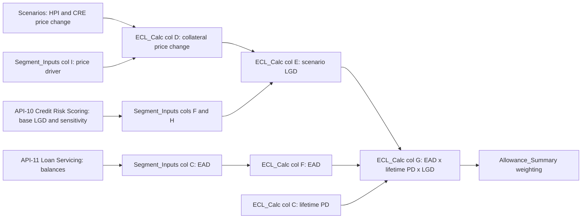

# CECL LGD and EAD

This component covers the loss-severity and exposure legs of the CECL formula in [MDL-CR-007](../cecl-allowance-model.md): **scenario ECL = EAD × lifetime PD × scenario LGD**. EAD is a balance taken from the [Loan Servicing API](../../apis/api-11-loan-servicing-api.md). LGD is a pool-level parameter from the [Credit Risk Scoring API](../../apis/api-10-credit-risk-scoring-api.md), and the workbook shifts it per scenario with a collateral price index. The PD leg is covered in [Lifetime PD](cecl-lifetime-pd.md). The accounting standard is explained in [CECL](../../concepts/cecl.md).

## Responsibilities

- Hold one base LGD and one LGD price sensitivity for each of six segments in `Segment_Inputs` (columns F and H).
- Convert each scenario's collateral price change into a scenario LGD per segment (`ECL_Calc` columns D and E).
- Carry the segment balance into each scenario block as EAD (`ECL_Calc` column F).
- Combine EAD, lifetime PD and scenario LGD into lifetime ECL (`ECL_Calc` column G). `Allowance_Summary` and `Sensitivity` then consume that ECL.

Evidence: repo://sources/models/cecl-allowance-model.md#L146-L152, repo://sources/models/cecl-allowance-model.md#L209-L218, repo://sources/models/cecl-allowance-model.md#L277-L283

## Data flow

Caption: EAD and LGD paths converge with lifetime PD in `ECL_Calc` column G, which `Allowance_Summary` weights across scenarios.

## LGD mechanics

Scenario LGD is computed in every scenario block with the same two formulas. The Upside, Credit Card row 7 is the template:

| Column | Quantity | Formula |
|---|---|---|
| D | Collateral price change | `=IF(Segment_Inputs!I6="HPI",Scenarios!$E$6,IF(Segment_Inputs!I6="CRE",Scenarios!$F$6,0))` |
| E | Scenario LGD | `=MIN(1,MAX(0,Segment_Inputs!F6*(1-Segment_Inputs!H6*D7)))` |

In words, scenario LGD = base LGD × (1 − LGD sensitivity × collateral price change), clamped to the range 0–100%. A price fall (negative change) raises LGD, and a price rise lowers it. The README states this as "Mortgages use the house price index (HPI); CRE uses the commercial property price index."

The Baseline block reads `Scenarios!$E$7:$F$7` and the Downside block reads `$E$8:$F$8`, so each scenario applies its own price path.

Evidence: repo://sources/models/cecl-allowance-model.md#L150, repo://sources/models/cecl-allowance-model.md#L280-L281, repo://sources/models/cecl-allowance-model.md#L323-L324, repo://sources/models/cecl-allowance-model.md#L366-L367

### Price driver selection

Column I of `Segment_Inputs` (the "Price driver") gates the adjustment. Only the literal values `HPI` and `CRE` select a price series. Any other value, including `None`, gives a price change of 0, so LGD stays at its base value.

| Segment | Base LGD | LGD sensitivity | Price driver | Effect |
|---|---|---|---|---|
| Credit Card | 0.88 | 0 | None | Fixed at 0.88 in all scenarios |
| Residential Mortgage | 0.14 | 1.80 | HPI | Moves with house prices |
| Auto | 0.42 | 0.40 | None | Fixed at 0.42, because the driver is "None" even though the sensitivity is non-zero |
| Commercial Real Estate | 0.38 | 1.60 | CRE | Moves with the commercial property index |
| Commercial & Industrial | 0.41 | 0 | None | Fixed at 0.41 |
| Other Consumer & Wholesale | 0.33 | 0 | None | Fixed at 0.33 |

The Auto row is the main trap. Setting its driver to a recognised series would activate its 0.40 sensitivity. The driver lookup recognises only two keys. A new driver such as a used-vehicle index would need both a new column on `Scenarios` and an extra branch in the nested `IF` in column D of all three blocks.

Evidence: repo://sources/models/cecl-allowance-model.md#L209-L217, repo://sources/models/cecl-allowance-model.md#L294-L295, repo://sources/models/cecl-allowance-model.md#L280

### Resulting LGD by scenario

| Segment | Price change Up / Base / Down | LGD Upside | LGD Baseline | LGD Downside |
|---|---|---|---|---|
| Residential Mortgage (HPI) | +4.5% / +2.2% / −8.5% | 0.1287 | 0.1345 | 0.1614 |
| Commercial Real Estate (CRE index) | +3.0% / −1.0% / −14.0% | 0.3618 | 0.3861 | 0.4651 |
| Credit Card, Auto, C&I, Other | not applicable | 0.88, 0.42, 0.41, 0.33 | same | same |

Worked example, CRE Downside: 0.38 × (1 − 1.6 × (−0.14)) = 0.38 × 1.224 ≈ 0.4651. The cap at 100% does not bind at any current input, and the largest LGD in the workbook is Card at 0.88. A large negative price path combined with a high base LGD and sensitivity could hit the cap.

Evidence: repo://sources/models/cecl-allowance-model.md#L188-L191, repo://sources/models/cecl-allowance-model.md#L247-L270

## EAD mechanics

- `Segment_Inputs!C6:C11` holds the segment balance at 2025-12-31, in USD millions, and `C12` sums it to 742,300. Each `ECL_Calc` EAD cell is a pure link (for example `F7 =Segment_Inputs!C6`).
- EAD is the same in the Upside, Baseline and Downside blocks. Scenarios therefore change ECL only through PD and LGD, never through exposure.
- The workbook has no credit-conversion factor, amortization, prepayment or draw-down term. EAD is the current balance. Time enters only through the lifetime PD exponent (remaining life).
- Unfunded commitments are excluded by design (README limitation), so off-balance-sheet exposure never enters EAD.
- The same `C` column is the denominator for `Allowance_Summary` allowance / loans (`K6 =IF(Segment_Inputs!C6=0,0,G6/Segment_Inputs!C6)`). A balance change therefore moves both the ECL and the coverage ratio.

| Segment | EAD ($mm) |
|---|---|
| Credit Card | 138,400 |
| Residential Mortgage | 218,600 |
| Auto | 64,900 |
| Commercial Real Estate | 98,200 |
| Commercial & Industrial | 172,500 |
| Other Consumer & Wholesale | 49,700 |
| **Total** | **742,300** |

Evidence: repo://sources/models/cecl-allowance-model.md#L168-L169, repo://sources/models/cecl-allowance-model.md#L209-L226, repo://sources/models/cecl-allowance-model.md#L282, repo://sources/models/cecl-allowance-model.md#L325, repo://sources/models/cecl-allowance-model.md#L368, repo://sources/models/cecl-allowance-model.md#L37

## ECL_Calc: combining the legs

Lifetime ECL per segment and scenario is `G = F × C × E`, that is EAD × lifetime PD × scenario LGD. Block totals are `G13`, `G23` and `G33`, and `Allowance_Summary` links to them by cell (for example `B6 =ECL_Calc!G7`).

Because the product is linear in EAD and in LGD, a given percentage change in either moves that segment's ECL by the same percentage. The impact is largest where the balance is large and LGD is high. Credit Card, with a high LGD of 0.88 and the largest weighted ECL of $8,383.18 million, is driven by its fixed LGD, whereas Mortgage and CRE are the only segments where scenario ECL varies through LGD as well as PD.

| Scenario | Total lifetime ECL ($mm) | Cell |
|---|---|---|
| Upside | 12,434.76 | `ECL_Calc!G13` |
| Baseline | 13,817.04 | `ECL_Calc!G23` |
| Downside | 19,478.13 | `ECL_Calc!G33` |

Mortgage shows the compounding effect. Its Downside ECL of $1,058.80 million is about 1.6 times its Baseline figure of $662.27 million, because Downside raises both lifetime PD (0.0225 to 0.0300) and LGD (0.1345 to 0.1614).

Evidence: repo://sources/models/cecl-allowance-model.md#L283, repo://sources/models/cecl-allowance-model.md#L319, repo://sources/models/cecl-allowance-model.md#L362, repo://sources/models/cecl-allowance-model.md#L405, repo://sources/models/cecl-allowance-model.md#L32, repo://sources/models/cecl-allowance-model.md#L256-L266

## Upstream sourcing and operations

- **EAD** comes from the [Loan Servicing API](../../apis/api-11-loan-servicing-api.md) (balances and remaining life). The README says loan balances (EAD) are sourced from API-11. That API's critical-data-service classification means breaking changes to balance semantics trigger a model change review.
- **LGD** parameters are pool-level and refreshed quarterly from the [Credit Risk Scoring API](../../apis/api-10-credit-risk-scoring-api.md). The CECL workbook uses the point-in-time parameters (`GET /pools/{poolId}/parameters?basis=pit`), which are conditioned on macro scenarios. The through-the-cycle parameters with regulatory floors are a separate endpoint used for capital. The Pillar 3 disclosure draws the same distinction.
- The workbook marks LGD, sensitivity, price driver and balances as blue-font inputs. Updates are manual refreshes of `Segment_Inputs` and carry no automated validation in the workbook, apart from the scenario-weight check and the overlay range check downstream.
- Scenario price paths (`Scenarios!E6:F8`) come from the macroeconomic scenario set MSC-2025Q4, so a re-issued scenario set changes LGD for Mortgage and CRE even if the base LGD is unchanged.

Evidence: repo://sources/models/cecl-allowance-model.md#L154-L158, repo://sources/models/cecl-allowance-model.md#L173-L178, repo://sources/models/cecl-allowance-model.md#L184-L192, repo://sources/api_docs/mhfc-developer-platform-api-reference.md#L798-L799, repo://sources/reports/mhfc-2025-pillar3-disclosures.md#L283

## Invariants, limits and failure modes

- **LGD bounded 0–100%.** The `MIN(1, MAX(0, ...))` wrapper silently clamps. A clamped LGD gives no warning, so a surprise flat LGD in a stress scenario may signal the cap.
- **Driver typo risk.** A price-driver string other than `HPI` or `CRE` (for example a misspelling such as "House") yields a 0 price change and the base LGD, with no flag. The lookup is a plain nested `IF` with no error branch.
- **Zero-sensitivity segments.** Card, C&I and Other have sensitivity 0, so LGD is flat even when a price driver is later added.
- **Flat EAD.** There is no run-off, so lifetime PD is applied to the current balance for the full remaining life. This is the simplified pool-level approach the README flags. The production model uses loan-level cash flows.
- **No stand-alone LGD or EAD control.** Reconciliation only occurs at the allowance level (`Allowance_Summary!I6:I12`). The overlay is an input, so a zero difference does not validate LGD or EAD.

Evidence: repo://sources/models/cecl-allowance-model.md#L168-L171, repo://sources/models/cecl-allowance-model.md#L280-L281, repo://sources/models/cecl-allowance-model.md#L35, repo://sources/models/cecl-allowance-model.md#L105-L114

## Extension points

- Add a segment: extend `Segment_Inputs` rows and repeat the formula row in each of the three `ECL_Calc` blocks, then extend `Allowance_Summary` and its `SUM` ranges.
- Add a collateral price driver: add a series to `Scenarios`, a key to the `IF` chain in column D (three blocks), and set the segment's driver and sensitivity in `Segment_Inputs`.
- Move to loan-level EAD: replace the single balance in column C with an amortizing or drawn-plus-committed exposure. Doing so would also need to bring unfunded commitments in scope, which MDL-CR-007 excludes today.

These are structural observations of how the formulas reference each other, not documented procedures.

Evidence: repo://sources/models/cecl-allowance-model.md#L280-L283, repo://sources/models/cecl-allowance-model.md#L94-L105

## Related

- [MDL-CR-007 CECL Allowance Model](../cecl-allowance-model.md) for the full workbook, weighting, overlay and reconciliation.
- [API-11 Loan Servicing API](../../apis/api-11-loan-servicing-api.md) for the EAD and remaining-life feed.
- [CECL](../../concepts/cecl.md) for the accounting concept.
