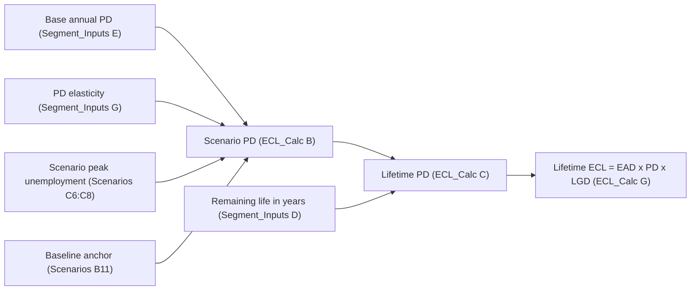

# CECL Lifetime PD

The lifetime probability of default (lifetime PD) is the second quantity computed in each scenario block of the `ECL_Calc` sheet in the [CECL Allowance Model](../cecl-allowance-model.md) (MDL-CR-007). It is the PD leg of the pool-level identity **Lifetime ECL = EAD × lifetime PD × scenario LGD**. It converts a one-year, point-in-time pool PD into a probability of default over the segment's remaining contractual life. It also makes that probability depend on the macroeconomic scenario. The accounting background is in [CECL](../../concepts/cecl.md). The loss-severity and exposure legs are in [LGD and EAD](cecl-lgd-and-ead.md).

The component has no code. It is two spreadsheet formulas, repeated for 6 segments × 3 scenarios = 18 cells for scenario PD and 18 for lifetime PD. The workbook is a synthetic proof of concept for the fictional Meridian Harbor Financial Corp.

## Derivation

The README of the workbook states the method in two steps:

1. **Scenario PD** = base annual PD × (1 + elasticity × (scenario peak unemployment − baseline unemployment) × 100), floored at 0.
2. **Lifetime PD** = 1 − (1 − scenario PD) ^ remaining life (years).

In `ECL_Calc` these are columns B and C. For Credit Card in the Upside block (row 7):

| Column | Quantity | Formula |
|---|---|---|
| B | Scenario PD (annual) | `=MAX(0,Segment_Inputs!E6*(1+Segment_Inputs!G6*(Scenarios!$C$6-Scenarios!$B$11)*100))` |
| C | Lifetime PD | `=1-(1-B7)^Segment_Inputs!D6` |

The Baseline block (rows 17-22) points at `Scenarios!$C$7`, and the Downside block (rows 27-32) points at `Scenarios!$C$8`. The segment-input references are otherwise identical. Column C feeds column G, `=F*C*E`, which is the lifetime ECL. See [Scenario Weighting](cecl-scenario-weighting.md) for how the three scenario ECLs are combined.

Evidence: repo://sources/models/cecl-allowance-model.md#L146-L152, repo://sources/models/cecl-allowance-model.md#L277-L283, repo://sources/models/cecl-allowance-model.md#L362-L366

## Inputs and where they come from

| Input | Cell | Source |
|---|---|---|
| Base annual PD | `Segment_Inputs!E6:E11` | [API-10 Credit Risk Scoring API](../../apis/api-10-credit-risk-scoring-api.md) pool-level parameters, refreshed quarterly |
| PD elasticity (per 1 pp unemployment) | `Segment_Inputs!G6:G11` | API-10 |
| Remaining life (years) | `Segment_Inputs!D6:D11` | API-11 Loan Servicing API |
| Scenario peak unemployment | `Scenarios!C6:C8` | API-14 Macroeconomic Scenario API, scenario set MSC-2025Q4 |
| Baseline unemployment anchor | `Scenarios!B11` | Formula `=C7`, the Baseline peak unemployment |

The README lists API-10 for the PD and LGD parameters, API-11 for balances and remaining life, and API-14 for scenario paths. The API-10 reference page describes the point-in-time (`basis=pit`) endpoint as the CECL feed. That endpoint carries `basePdAnnual`, `remainingLifeYears` and the macro elasticity.

Segment parameters at 2025-12-31:

| Segment | Base annual PD | PD elasticity | Remaining life (yrs) |
|---|---|---|---|
| Credit Card | 0.0374 | 0.165 | 1.70 |
| Residential Mortgage | 0.0035 | 0.14 | 6.50 |
| Auto | 0.0104 | 0.12 | 2.40 |
| Commercial Real Estate | 0.0137 | 0.15 | 3.80 |
| Commercial & Industrial | 0.0150 | 0.135 | 2.30 |
| Other Consumer & Wholesale | 0.0149 | 0.10 | 2.00 |

Scenario unemployment: Upside 3.8%, Baseline 4.4%, Downside 6.8%. Scenario weights are 20%, 50% and 30%, and they affect the allowance but not the PD formulas.

Evidence: repo://sources/models/cecl-allowance-model.md#L154-L158, repo://sources/models/cecl-allowance-model.md#L186-L201, repo://sources/models/cecl-allowance-model.md#L209-L218

## Behaviour and invariants

- **Baseline-anchored shock.** `Scenarios!B11` is `=C7`, so the Baseline shock term is zero. The Baseline scenario PD therefore equals the base PD exactly (Card 0.0374, Mortgage 0.0035). The Upside scenario lowers PD and the Downside scenario raises it. The elasticity is multiplicative. It is applied as a percentage change per percentage point of unemployment, so segments with higher elasticity move more.
- **Worked example, Card Downside.** Shock = (6.8% − 4.4%) × 100 = 2.4 pp. Scenario PD = 0.0374 × (1 + 0.165 × 2.4) ≈ 0.0522. Lifetime PD = 1 − (1 − 0.0522)^1.7 ≈ 0.0871.
- **Constant-hazard compounding.** One annual PD is applied every year over the remaining life, and the exponent can be fractional (1.70, 2.40). There is no term structure, no age-dependent hazard, and no scenario path over time. Only the single peak-unemployment figure per scenario enters, so the scenario shock is applied as if constant across the whole life. There is also no balance run-off or discounting inside this step.
- **Life drives the lifetime PD.** Mortgage has a low annual PD but a 6.5-year life, so its lifetime PD is around 6 times its annual PD. Card has a high annual PD but only 1.7 years of life.
- **Floor but no cap.** `MAX(0, ...)` keeps scenario PD non-negative. The formula has no upper bound on scenario PD. Lifetime PD stays below 1 only while the scenario PD is ≤ 1. This is an inference from the formulas, not a documented control, and it matters if elasticities or the unemployment shock are set aggressively.
- **Not checked on this sheet.** The workbook's explicit controls are the scenario-weight check (`Scenarios!C9`) and the overlay ±15% check (`Allowance_Summary!F14`). Neither tests PD values, so reasonableness of PD inputs relies on API-10 governance and model validation.

Evidence: repo://sources/models/cecl-allowance-model.md#L193, repo://sources/models/cecl-allowance-model.md#L201, repo://sources/models/cecl-allowance-model.md#L278-L279, repo://sources/models/cecl-allowance-model.md#L364-L365, repo://sources/models/cecl-allowance-model.md#L105, repo://sources/models/cecl-allowance-model.md#L168-L171

## Resulting values

| Segment | Upside PD / lifetime | Baseline PD / lifetime | Downside PD / lifetime |
|---|---|---|---|
| Credit Card | 0.0337 / 0.0566 | 0.0374 / 0.0627 | 0.0522 / 0.0871 |
| Residential Mortgage | 0.0032 / 0.0207 | 0.0035 / 0.0225 | 0.0047 / 0.0300 |
| Auto | 0.0097 / 0.0230 | 0.0104 / 0.0248 | 0.0134 / 0.0318 |
| Commercial Real Estate | 0.0125 / 0.0466 | 0.0137 / 0.0511 | 0.0186 / 0.0690 |
| Commercial & Industrial | 0.0138 / 0.0314 | 0.0150 / 0.0342 | 0.0199 / 0.0451 |
| Other Consumer & Wholesale | 0.0140 / 0.0278 | 0.0149 / 0.0296 | 0.0185 / 0.0366 |

Values are the computed outputs in `ECL_Calc` columns B and C, rounded to four decimals.

Evidence: repo://sources/models/cecl-allowance-model.md#L243-L271

## Relationships and extension points

- **Upstream.** [API-10](../../apis/api-10-credit-risk-scoring-api.md) owns the PD and elasticity calibration. Because the elasticity is part of the payload, recalibrating it changes the allowance's sensitivity to scenarios directly. Remaining life comes from API-11. Scenario unemployment comes from API-14.
- **Downstream.** Lifetime PD multiplies EAD and scenario LGD in `ECL_Calc!G`. Those results are weighted in `Allowance_Summary` and shown on the `Sensitivity` sheet, so a change in PD flows through to the reported allowance, the overlay-ratio control and the disclosures in Note 6.
- **Changing the method.** All 18 PD rows use the same formula pattern, so a change to the PD method (a different shock driver, a term structure, a cap) must be made consistently in every segment row of all three blocks. The workbook is a simplified pool-level demonstration, and the README notes that production uses loan-level cash flows. Unemployment is the only macro driver for PD. The house-price and CRE-price paths affect LGD only.
- **Governance.** The model is Tier 1 under independent validation by MRGR, last validated 2025-11-04 and next due 2026-11-30.

Evidence: repo://sources/models/cecl-allowance-model.md#L125-L137, repo://sources/models/cecl-allowance-model.md#L166-L171, repo://sources/models/cecl-allowance-model.md#L280-L283, repo://sources/models/cecl-allowance-model.md#L32
