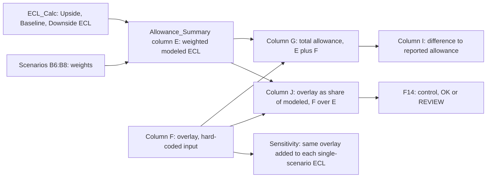

# CECL Qualitative Overlay

The qualitative overlay is the last component in the [MDL-CR-007 CECL Allowance Model](../cecl-allowance-model.md). It is a management adjustment, one per portfolio segment, that is added to the probability-weighted modeled expected credit loss. The sum is the total allowance that is reconciled to the reported figure. The overlay is not computed from the scenario machinery. It is a judgmental input that sits on top of it. It lives only on the `Allowance_Summary` sheet, so this page uses cell references from that sheet unless it says otherwise.

Evidence: repo://sources/models/cecl-allowance-model.md#L146-L152, repo://sources/models/cecl-allowance-model.md#L105-L114

## Responsibility

According to the cell notes, the overlay captures "model limitations, concentration and emerging-risk factors" that the pool-level PD × LGD × EAD calculation does not capture. The README states the rule as step 5 of "How the model works": total allowance = modeled allowance + qualitative overlay approved by the Allowance Committee. The Pillar 3 disclosure confirms the Allowance Committee approves scenario weights, model outputs and overlays each quarter. It also confirms the allowance includes overlays of $681 million.

Evidence: repo://sources/models/cecl-allowance-model.md#L107-L114, repo://sources/models/cecl-allowance-model.md#L152, repo://sources/reports/mhfc-2025-pillar3-disclosures.md#L87, repo://sources/reports/mhfc-2025-pillar3-disclosures.md#L297

## Mechanism and control flow

Caption: the overlay enters after scenario weighting, and the same input drives the total, the percentage control and the sensitivity table.

1. **Input.** `F6:F11` are hard-coded values with no formula behind them, one per segment. `F12 =SUM(F6:F11)` totals them to $681.09 million.
2. **Addition.** Each segment's `G =E+F` (for example `G6 =E6+F6`) gives the total allowance. `G12` sums to $15,920 million. The overlay is applied to the weighted figure and not to any single scenario.
3. **Relative size.** `J =IF(E=0,0,F/E)` expresses the overlay as a share of the modeled allowance. The check returns 0 rather than an error if modeled ECL is zero.
4. **Control.** `F14 =IF(SUMPRODUCT(--(ABS(J6:J11)>0.15))=0,"OK","REVIEW")` returns "REVIEW" if any segment's overlay exceeds 15% of its modeled allowance in either direction. It currently returns "OK".
5. **Reconciliation.** `I =G-H` compares the total with the reported allowance linked from `Segment_Inputs!K`. Every segment difference is 0.

Evidence: repo://sources/models/cecl-allowance-model.md#L14-L22, repo://sources/models/cecl-allowance-model.md#L34-L36, repo://sources/models/cecl-allowance-model.md#L98-L105

## Current values

| Segment | Modeled `E` ($mm) | Overlay `F` ($mm) | Overlay % of modeled `J` | Total `G` ($mm) |
|---|---|---|---|---|
| Credit Card | 8,383.18 | 256.82 | 3.06% | 8,640 |
| Residential Mortgage | 764.97 | 55.03 | 7.19% | 820 |
| Auto | 723.56 | (33.56) | (4.64%) | 690 |
| Commercial Real Estate | 2,244.00 | 226.00 | 10.07% | 2,470 |
| Commercial & Industrial | 2,609.28 | 150.72 | 5.78% | 2,760 |
| Other Consumer & Wholesale | 513.93 | 26.07 | 5.07% | 540 |
| **Total** | 15,238.91 | 681.09 | 4.47% | 15,920 |

Observations:

- CRE has the largest overlay in percentage terms (10.07%) and Card the largest in dollars ($256.82 million). No segment is near the 15% limit.
- Auto carries a **negative** overlay, which reduces its allowance below the modeled amount. The ±15% control uses `ABS`, so negative overlays are limited to the same band as positive ones.
- The Annual Report shows the same split (modeled / overlay / total) in whole millions and cites `Allowance_Summary` as its source. For example, Card is 8,383 / 257 / 8,640 and Total is 15,239 / 681 / 15,920.

Evidence: repo://sources/models/cecl-allowance-model.md#L14-L22, repo://sources/reports/mhfc-2025-annual-report.md#L377-L387

## Invariants and failure modes

- **±15% per segment.** This is stated in the README as a limit ("must be documented and fall within +/-15% of the modeled allowance per segment") and is implemented only by `F14`. The check is a flag. It does not cap the overlay, and `G` does not read `F14`, so a breach would still flow into the total and the reported figure unless a reviewer acts on "REVIEW". The control also tests a ratio to the modeled amount and not to total allowance or to loan balances.
- **Documentation requirement.** The README requires overlays to be documented, but the workbook holds only a standard approval note on each cell. It shows no derivation from concentration or emerging-risk factors.
- **Overlay as a plug.** The reconciliation difference is zero for every segment because the overlay equals the reported allowance minus the modeled ECL. Since the overlay is an input, a zero difference shows that the overlay bridges the model to the Note 6 balance. It does not show that an independent estimate agrees with the reported figure. This is an inference from the structure of the workbook (the overlay is hard-coded and `H` is linked to `Segment_Inputs!K`), not a statement the workbook makes.
- **Modeled change without overlay change.** Because the overlay is not formula-linked to `E`, a change to scenario weights or to PD/LGD parameters changes `G` and `I` but not `F`. The reconciliation difference `I` will then move away from zero, and `J` will change. The overlay does not rebalance automatically. The overlay would have to be re-approved by the Allowance Committee.
- **Unfunded commitments.** The model excludes the off-balance-sheet allowance. MRGR's 2025 validation raised a medium-severity finding about this, remediated through an interim overlay. The workbook does not show a separate line for this interim overlay.

Evidence: repo://sources/models/cecl-allowance-model.md#L14-L22, repo://sources/models/cecl-allowance-model.md#L34-L36, repo://sources/models/cecl-allowance-model.md#L105, repo://sources/models/cecl-allowance-model.md#L166-L171, repo://sources/reports/mhfc-2025-pillar3-disclosures.md#L517

## Effect on sensitivity

The `Sensitivity` sheet adds the **same total overlay** `Allowance_Summary!$F$12` to the modeled ECL under a 100% Upside, Baseline or Downside weighting (`C =B+Allowance_Summary!$F$12`). The overlay is held constant, and that is the only way overlay is treated in stress or scenario variants. For example, 100% Downside gives 19,478.13 + 681.09 = 20,159.22, which is $4,239.22 million (26.63%) above the reported allowance. The Annual Report says the sensitivities hold the qualitative overlay constant and do not represent management's expectation of losses. This means the sensitivities do not show how management would reset the overlay in a different scenario. Per-segment overlays are also not re-tested against the 15% limit inside `Sensitivity`.

Evidence: repo://sources/models/cecl-allowance-model.md#L407-L440, repo://sources/reports/mhfc-2025-annual-report.md#L389

## Extension and change guidance

- **Changing an overlay.** Edit the value in `F6:F11`, which needs Allowance Committee approval and documentation. Afterwards confirm that `F14` reads "OK" and that `I` equals the intended reported allowance in `Segment_Inputs!K`.
- **Adding a segment.** Add a row to `Allowance_Summary` and extend `SUM(F6:F11)`, `SUMPRODUCT` ranges `J6:J11` in `F14`, and the other total ranges. The `F14` range is hard-coded, so a new row outside `J6:J11` would escape the control.
- **Adding a limit or a floor.** The limit of 0.15 is embedded in the `F14` formula and is not an input cell. Changing the policy requires editing that formula.
- **Disclosure.** Overlay values flow to Annual Report Note 6 and the earnings supplement through `Allowance_Summary`. Metric context is on the [Allowance for Credit Losses](../../metrics/allowance-for-credit-losses.md) page.

Evidence: repo://sources/models/cecl-allowance-model.md#L105, repo://sources/models/cecl-allowance-model.md#L116-L134, repo://sources/models/cecl-allowance-model.md#L166-L171

## Relationships

- part of: [MDL-CR-007 CECL Allowance Model](../cecl-allowance-model.md)
- adjusts: the probability-weighted modeled allowance in `Allowance_Summary` column E
- contributes to: [Allowance for Credit Losses](../../metrics/allowance-for-credit-losses.md)
- approved by: the Allowance Committee (quarterly)
