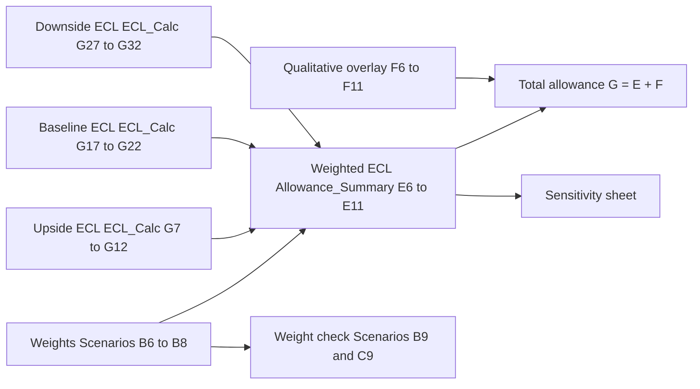

# CECL Scenario Weighting

Scenario weighting is the step in the [CECL Allowance Model](../cecl-allowance-model.md) (MDL-CR-007) that collapses three scenario-conditional lifetime ECL figures per segment into a single **probability-weighted modeled allowance**. It is step 4 of the workbook's method: "Modeled allowance = sum of scenario weight x ECL". The result is then topped up by the [qualitative overlay](cecl-qualitative-overlay.md) to give the total allowance. The accounting background is in [CECL](../../concepts/cecl.md); the end-to-end sequence is in the [CECL allowance calculation flow](../../workflows/cecl-allowance-calculation-flow.md).

The component has no code. It is one weight table, one weight-sum check, and one repeated formula. The workbook is a synthetic proof of concept for the fictional Meridian Harbor Financial Corp.

## Cells and inputs

| Cell(s) | Content | Kind |
|---|---|---|
| `Scenarios!B6` | Upside weight, 0.20 | Input (blue) |
| `Scenarios!B7` | Baseline weight, 0.50 | Input (blue) |
| `Scenarios!B8` | Downside weight, 0.30 | Input (blue) |
| `Scenarios!B9` | `=SUM(B6:B8)`, currently 1 | Formula |
| `Scenarios!C9` | `=IF(ABS(B9-1)<0.0001,"OK","WEIGHTS MUST SUM TO 100%")`, currently `OK` | Formula (check) |
| `Allowance_Summary!B6:D11` | Per-segment Upside, Baseline and Downside ECL, linked from `ECL_Calc` | Links |
| `Allowance_Summary!E6:E11` | Weighted (modeled) ECL by segment | Formula |
| `Allowance_Summary!B12:E12` | Column totals | Formula |

The weights, together with the peak unemployment, GDP, house-price and CRE-price paths in `Scenarios!C6:F8`, are labelled as sourced from the [Macroeconomic Scenario API (API-14)](../../apis/api-14-macroeconomic-scenario-api.md), scenario set MSC-2025Q4. The README says the Scenario Committee approves them. See [Macro Scenarios MSC-2025Q4](../../scenarios/macro-scenarios-msc-2025q4.md) for the set itself. API-14 returns the weight on each scenario object (`0.2`, `0.5`, `0.3`) and locks sets after Scenario Committee approval.

Evidence: repo://sources/models/cecl-allowance-model.md#L180-L201, repo://sources/models/cecl-allowance-model.md#L154-L159, repo://sources/api_docs/apis/api-14-macroeconomic-scenario-api.md#L1-L5

## Formula

For every segment row `n` (6 to 11) of `Allowance_Summary`, column E is:

```
E_n = B_n * Scenarios!$B$6 + C_n * Scenarios!$B$7 + D_n * Scenarios!$B$8
```

where `B_n`, `C_n` and `D_n` are the Upside, Baseline and Downside lifetime ECL pulled from `ECL_Calc` column G (rows 7-12, 17-22 and 27-32 respectively). The weight references are absolute, so all six segments use the same three weights. There is no segment-specific weighting. The total `E12` is `=SUM(E6:E11)`, which equals the weighted sum of the three scenario totals because the weights are common.

The formula does not divide by the sum of the weights. If the weights did not add to 1, the modeled allowance would be scaled up or down by that sum, not renormalised.



The diagram shows the weights feeding only the weighted-ECL column and the weight check, with the weighted result flowing to total allowance and the sensitivity sheet.

Evidence: repo://sources/models/cecl-allowance-model.md#L32-L32, repo://sources/models/cecl-allowance-model.md#L94-L99, repo://sources/models/cecl-allowance-model.md#L146-L152

## Resulting values ($ millions, as of 2025-12-31)

| Segment | Upside (20%) | Baseline (50%) | Downside (30%) | Weighted |
|---|---|---|---|---|
| Credit Card | 6,894.36 | 7,641.79 | 10,611.39 | 8,383.18 |
| Residential Mortgage | 580.96 | 662.27 | 1,058.80 | 764.97 |
| Auto | 627.11 | 675.41 | 868.10 | 723.56 |
| Commercial Real Estate | 1,653.82 | 1,936.21 | 3,150.43 | 2,244.00 |
| Commercial & Industrial | 2,222.31 | 2,416.26 | 3,188.96 | 2,609.28 |
| Other Consumer & Wholesale | 456.21 | 485.11 | 600.45 | 513.93 |
| **Total** | **12,434.76** | **13,817.04** | **19,478.13** | **15,238.91** |

The total checks by hand: 0.2 x 12,434.76 + 0.5 x 13,817.04 + 0.3 x 19,478.13 = 15,238.91. Adding the $681.09 million overlay gives the $15,920 million total allowance, which equals the reported allowance with a zero difference.

Two observations follow from the numbers (derived arithmetic, not stated in the workbook):

- The weighted result is $1,421.87 million (about 10.3%) above Baseline alone. The Downside scenario carries 30% of the weight but contributes about 38% of the weighted total (5,843.44 of 15,238.91), because its loss is skewed upward.
- The uplift over Baseline varies by segment. It is largest where scenario severity is amplified by collateral prices: Commercial Real Estate (about 16%) and Residential Mortgage (about 15.5%). It is smallest in Other Consumer & Wholesale (about 6%). Credit Card, which has no price driver, is about 10%. See [LGD and EAD](cecl-lgd-and-ead.md) and [Lifetime PD](cecl-lifetime-pd.md) for what drives the scenario spread.

Evidence: repo://sources/models/cecl-allowance-model.md#L14-L21, repo://sources/models/cecl-allowance-model.md#L186-L193

## Weight-sum control

`Scenarios!C9` is the only control on the weights. It tests `ABS(B9-1) < 0.0001` and displays `OK` or `WEIGHTS MUST SUM TO 100%`. The README lists this as a limit: "Scenario weights must sum to 100% (check cell on Scenarios sheet)".

Properties worth knowing before changing weights:

- The check is **informational**. Nothing in `Allowance_Summary` reads `C9`, so a failing check does not stop the allowance from being calculated. A reviewer has to look at it.
- The tolerance is 0.0001, so weights such as 0.20 / 0.50 / 0.30 pass exactly, while a rounding slip of 0.01 fails.
- Weights are not validated to be non-negative or individually bounded.
- The separate overlay check (`Allowance_Summary!F14`, per-segment overlay within 15% of modeled) is computed from `E`, so it moves when weights change. See [Qualitative Overlay](cecl-qualitative-overlay.md).

Evidence: repo://sources/models/cecl-allowance-model.md#L195-L201, repo://sources/models/cecl-allowance-model.md#L166-L171, repo://sources/models/cecl-allowance-model.md#L105-L105

## Sensitivity to the weights

The `Sensitivity` sheet shows the allowance if 100% weight were put on a single scenario, holding the overlay constant. It reads the scenario totals in `Allowance_Summary!B12:D12` and adds the total overlay `$F$12`. It does not read `Scenarios!B6:B8`, so it is independent of the current weights apart from the reported-allowance comparison.

| Weighting | Modeled ECL | Plus overlay | Change vs reported | Change % |
|---|---|---|---|---|
| 100% Upside | 12,434.76 | 13,115.85 | -2,804.15 | -17.61% |
| 100% Baseline | 13,817.04 | 14,498.13 | -1,421.87 | -8.93% |
| 100% Downside | 19,478.13 | 20,159.22 | +4,239.22 | +26.63% |
| Probability-weighted (reported) | 15,238.91 | 15,920.00 | 0 | 0 |

The 2025 Annual Report discloses the Downside and Baseline cases in its sensitivity note: about $20.2 billion (+$4.2 billion) for 100% Downside and about -$1.4 billion for 100% Baseline. It states that these hold the overlay constant and do not represent management's loss expectation.

Because the weighted ECL is linear in the weights, moving weight between scenarios has a predictable effect (derived): shifting 10 percentage points from Baseline to Downside adds 0.10 x (19,478.13 - 13,817.04) = about $566 million to the modeled allowance. Shifting 10 points from Baseline to Upside removes about $138 million.

Evidence: repo://sources/models/cecl-allowance-model.md#L407-L440, repo://sources/reports/mhfc-2025-annual-report.md#L389-L389

## Interaction with the reconciliation

The overlay cells `Allowance_Summary!F6:F11` are hard-coded inputs, not formulas. The reconciliation column `I` (`=G-H`, total allowance less reported allowance) is zero only for the current weights, and weights are part of what the overlay was set against. If the weights or the scenario set change, `E` changes, `G` changes, and `I` becomes non-zero until the overlay or the reported figure is revisited. A weight change is therefore never an isolated edit. It must be taken through the Allowance Committee along with the overlay and the overlay-limit check.

The Q2 2026 earnings supplement says the weights were unchanged at 2Q26 (Upside 20%, Baseline 50%, Downside 30%). It also says the baseline unemployment assumption moved to 4.5%, from the 4.4% in this workbook. The workbook still holds the year-end values. The 2Q26 allowance of $16,380 million is not computed here.

Evidence: repo://sources/models/cecl-allowance-model.md#L34-L36, repo://sources/models/cecl-allowance-model.md#L105-L114, repo://sources/reports/mhfc-q2-2026-earnings-supplement.md#L270-L270

## Extension and change points

- **Re-issuing the scenario set.** Replace `Scenarios!B6:F8` from API-14. The weights and the scenario paths arrive together and are locked after Scenario Committee approval, so the weights should not be edited independently of the paths.
- **Adding a fourth scenario.** This is not a drop-in change. `Allowance_Summary!E` hard-codes three terms, `ECL_Calc` has three fixed blocks, `Sensitivity` has three fixed rows, and the weight-sum range is `B6:B8`. Each would need extending.
- **Baseline anchor.** `Scenarios!B11` (`=C7`) is the baseline unemployment used to shock PD in every scenario. It is a path value, not a weight, but it is on the same sheet and a change to it moves all three scenario ECLs before they are weighted. See [Lifetime PD](cecl-lifetime-pd.md).
- **Per-segment weights.** The model applies one weight vector to all segments. Differentiating by segment would require replacing the absolute references in `E6:E11`.

## Related pages

- [CECL Allowance Model](../cecl-allowance-model.md)
- [CECL allowance calculation flow](../../workflows/cecl-allowance-calculation-flow.md)
- [Macro Scenarios MSC-2025Q4](../../scenarios/macro-scenarios-msc-2025q4.md)
- [CECL Lifetime PD](cecl-lifetime-pd.md), [CECL LGD and EAD](cecl-lgd-and-ead.md), [CECL Qualitative Overlay](cecl-qualitative-overlay.md)
 Qualitative Overlay](cecl-qualitative-overlay.md)
