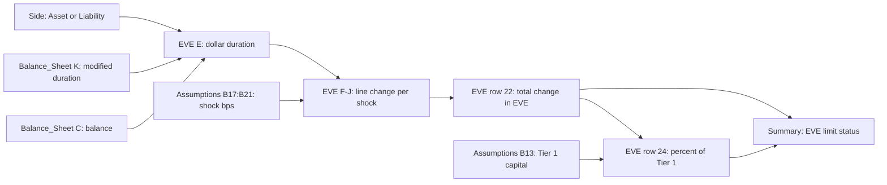

# EVE Modified Duration

The `EVE` sheet of the [NII Sensitivity Model](../nii-sensitivity-model.md) (MDL-ALM-014) estimates how the [economic value of equity](../../concepts/economic-value-of-equity.md) changes under parallel interest-rate shocks. It does this with a first-order modified-duration approximation, not a full cash-flow revaluation. It is the value-based half of the model's IRRBB output. The earnings-based half is the 12-month NII projection on the `NII_Projection` sheet. See [IRRBB](../../concepts/irrbb.md) for the regulatory context.

The component is spreadsheet logic only, with no code. Meridian Harbor Financial Corp. is fictional, and the workbook is labelled as a synthetic proof of concept.

## The approximation

The README states the rule as `EVE change = -(asset value x modified duration - liability value x modified duration) x shock`. The `EVE` sheet header writes it as `dEVE ~= -(sum asset PV x duration - sum liability PV x duration) x shock`. It is built from three cell groups per balance-sheet line (14 lines, rows 7-20):

| Column | Quantity | Formula |
|---|---|---|
| C | Balance ($mm) | `=Balance_Sheet!C<n>` |
| D | Modified duration (years) | `=Balance_Sheet!K<n>` |
| E | Dollar duration ($mm per 100 bp) | `=IF(B7="Asset",1,-1)*C7*D7/100` |
| F-J | Change in EVE per shock | `=-$E7*F$6/100` |

Line-level changes are summed in row 22 (`=SUM(F7:F20)`) and divided by Tier 1 capital in row 24 (`=IF(F23=0,0,F22/F23)`).

- **Sign convention:** assets carry a positive dollar duration and liabilities a negative one. A rate rise therefore reduces asset value and also reduces liability value, and the net is the EVE change.
- **Linearity:** the shock enters only as `shock_bps / 100`, so the result is linear and exactly symmetric. +100 bp and -100 bp give equal and opposite results, and ±200 bp is exactly twice ±100 bp. There is no convexity term.
- **Value proxy:** the "PV" in the formula is the book balance from the `Balance_Sheet` sheet. The model does not discount cash flows or mark balances to market.
- **No beta or repricing logic:** the deposit and other rate betas (`Balance_Sheet` column L) and the repricing-bucket shares that drive NII are not used. Every line gets the full parallel shock through its duration.

## Inputs and provenance

| Input | Where it lives | Source |
|---|---|---|
| Balances | `Balance_Sheet` column C | API-15 Treasury Liquidity Positions API (month-end snapshot) for investments, trading assets, deposits and funding; API-11 Loan Servicing API for loan lines |
| Modified duration (years) | `Balance_Sheet` column K | Per-line values carried in the workbook; the sheet does not name a separate source feed for durations |
| Shock grid | `Assumptions` B17:B21 (-200, -100, 0, +100, +200 bp) | Scenario levers, shared with the NII projection |
| Tier 1 capital | `Assumptions` B13, $110,620mm | API-16 Regulatory Reporting API, YE2025 |
| EVE limit | `Assumptions` B12, 15.0% of Tier 1 | Board Risk Committee limit, approved 2025-03 |

The `Balance_Sheet` sheet lists the same upstream feeds. The two sheets share the shock grid, so editing a scenario in `Assumptions` updates both NII and EVE.

Durations for the largest lines, in years: residential mortgages 5.8, long-term debt 4.9, investment securities 4.6, noninterest-bearing deposits 3.5, consumer interest-bearing deposits 2.8. Short items are near zero: deposits with banks and repo are 0.1. The Pillar 3 disclosure singles out the behavioral durations of 3.5 years for noninterest-bearing deposits and 2.8 years for consumer interest-bearing deposits as key assumptions.

## FY2025 results (as of 2025-12-31)

Dollar duration is in $mm per 100 bp.

- Total asset dollar duration is about +28,504. Residential mortgages (12,679) and investment securities (7,861) dominate it.
- Total liability dollar duration is about -27,136. Consumer interest-bearing deposits (-11,256), noninterest-bearing deposits (-9,520) and long-term debt (-4,248) dominate it.
- Net dollar duration is +1,368.7. The change in EVE per +100 bp is therefore -1,368.7.

| Scenario | Change in EVE ($mm) | % of Tier 1 |
|---|---|---|
| Down 200 | +2,737.40 | +2.47% |
| Down 100 | +1,368.70 | +1.24% |
| Base | 0 | 0 |
| Up 100 | -1,368.70 | -1.24% |
| Up 200 | -2,737.40 | -2.47% |

The firm is therefore exposed to rising rates on a value basis. The annual report attributes this to the duration of fixed-rate mortgages and investment securities exceeding that of modeled deposit liabilities. This is the opposite direction from NII, where the firm is asset-sensitive and gains in rising-rate scenarios. Pillar 3 reports the same figures: +2,737 / +1,369 / -1,369 / -2,737 $mm and ±2.5% / ±1.2% of Tier 1.

## Limit test

On the `Summary` sheet, the EVE status is `=IF(H6<-Assumptions!$B$12,"BREACH","Within limit")`, applied to EVE as a share of Tier 1. Notes for readers and modelers:

- The test flags only declines. Gains in a down-rate scenario can never breach.
- The worst reported decline, -2.47% at +200 bp, uses about 16% of the 15.0% limit (about $16.6bn of Tier 1 headroom against $2.74bn). All five scenarios read "Within limit".
- The limit is a percentage of Tier 1 capital, so a change in Tier 1 capital changes the percentage but not the dollar EVE change.

## Sensitivities and invariants

- **Net, not gross:** the result is a small difference between two large dollar durations (about 28.5bn against 27.1bn per 100 bp). A one-year change in the duration of noninterest-bearing deposits alone moves net dollar duration by 272,000 × 1 / 100 = 2,720, which is about 2.5% of Tier 1 per 100 bp. Behavioral deposit durations are therefore the most influential judgment inputs. This is the arithmetic implication of the sheet's formulas, not a statement in the source.
- **Scale invariance:** the output scales linearly with balances, durations and shock size.
- **Zero at base:** the Base column is always 0, because the shock is 0.
- **No in-sheet integrity check:** unlike the `Balance_Sheet` repricing shares (`Share check` column), the `EVE` sheet has no validation. Durations and balances are taken as given.
- **Static balance sheet:** the same 2025-12-31 snapshot is used as in the NII projection, with no growth or mix shift.

## Known limitations

The workbook README and Pillar 3 document limits that apply to this approximation. Some are stated for the model as a whole:

- Parallel shocks only, with no curve twists.
- Static balance sheet.
- Betas held constant across shock sizes (not used in the EVE calculation itself).
- Pillar 3 adds that the model does not capture basis risk, mortgage prepayment optionality beyond the static profile, or deposit-beta convexity at very low rates. Duration-only linear EVE inherently misses convexity.
- These gaps are covered by a compensating control: a dynamic balance-sheet simulation run quarterly in the ALM engine, reviewed by ALCO.

## Governance and downstream use

MDL-ALM-014 is a Tier 1 (High) model owned by Corporate Treasury - Asset & Liability Management and independently validated by Model Risk Governance & Review (last validation 2025-09-18, next due 2026-09-30). The EVE results feed the `Summary` sheet, which in turn feeds the Annual Report (Market Risk Management) and Pillar 3 (IRRBB) disclosures, and the limit-utilisation flags used in ALCO reporting. See [Model Risk (SR 11-7)](../../concepts/model-risk-sr-11-7.md) and [Basel III Pillar 3](../../concepts/basel-iii-pillar-3.md) for the surrounding frameworks.

## Extending or changing the component

- **Add a shock:** add a row to the `Assumptions` scenario grid, then add matching columns on `EVE`, `NII_Projection` and `Summary`. The columns are positional (`EVE!F` to `J` map to `Summary` rows 6-10), so there is no automatic extension.
- **Add a balance-sheet line:** add it on `Balance_Sheet` with its side and duration, then extend row ranges in `EVE` (`SUM(F7:F20)`) and `NII_Projection`. The `SUMIFS` totals on `Balance_Sheet` cover rows 6-19.
- **Refine durations:** change column K on `Balance_Sheet`. Because the model is Tier 1, such changes would normally go through validation.
