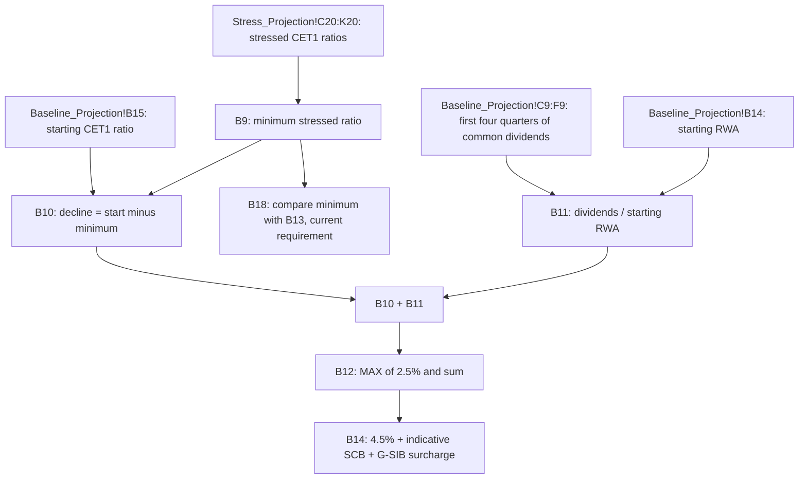

# Indicative Stress Capital Buffer

The indicative stress capital buffer (SCB) is the last step of the [Capital Planning & Stress Projection Model (MDL-CAP-003)](../capital-planning-model.md). It lives on the `Summary` sheet. It reuses the supervisory SCB recipe on the firm's own stress path: the CET1 ratio decline under the severely adverse scenario, plus a dividend add-on, subject to a floor. The institution (Meridian Harbor Financial Corp.) and all figures are synthetic. The regulatory concept is described in [Stress Capital Buffer](../../concepts/stress-capital-buffer.md).

## Responsibilities

- Measure the **peak-to-trough CET1 decline** under stress as the Q2 2026 starting ratio minus the lowest stressed quarterly ratio.
- Measure the **dividend add-on**: four quarters of planned baseline common dividends divided by starting RWA.
- Combine the two and apply the **2.5% floor** to give the indicative SCB.
- Show what the requirement stack would be if the indicative SCB replaced the current one, next to the current requirement.
- Report whether the stressed minimum clears the current requirement.

It does not set any binding requirement. The regulatory SCB is entered by hand on `Assumptions!B19` (3.20%, effective 2025-10-01) and drives the 10.20% requirement. The indicative value is a side-by-side estimate.

## Calculation

<!-- openwiki: broken internal link [../../sources/models/capital-planning-model.md#L69-L108] file "../../sources/models/capital-planning-model.md" does not exist. Fix the href or restore the target, then delete this comment. -->
All cells are on `Summary` ([model source](../../sources/models/capital-planning-model.md#L69-L108)):

| Cell | Metric | Formula | Q2 2026 run |
|---|---|---|---|
| B6 | Starting CET1 ratio | `=Baseline_Projection!B15` | 15.14% |
| B9 | Minimum stressed CET1 ratio | `=MIN(Stress_Projection!C20:K20)` | 12.90% |
| B10 | Peak-to-trough decline | `=B6-B9` | 2.24% |
| B11 | Dividend add-on | `=-SUM(Baseline_Projection!C9:F9)/Baseline_Projection!B14` | 0.94% |
| B12 | **Indicative SCB** | `=MAX(0.025,B10+B11)` | **3.18%** |
| B13 | Requirement, current SCB | `=Assumptions!$B$23` (4.5% + 3.2% + 2.5%) | 10.20% |
| B14 | Requirement, indicative SCB | `=Assumptions!$B$18+B12+Assumptions!$B$20` | 10.18% |
| B18 | Stress minimum above requirement? | `=IF(B9>=B13,"YES","NO - capital action required")` | YES |

Caption: how the indicative SCB and the related checks are wired on the `Summary` sheet.

## Key behaviours and invariants

- **Floor.** The result is never below 2.5%. The floor is a literal `0.025` in the `B12` formula and is not an input cell. In the current run it is not binding (the unfloored sum is 3.18%).
- **Decline is measured from the starting ratio, not from a peak.** `B10` subtracts the minimum from the Q2 2026 actual ratio (`B6`). The stressed minimum occurs in Q3 2027 (12.90%), driven by capital depletion plus the RWA path (RWA grows early and then shrinks), not by the quarter with the lowest capital dollars. See [Capital Stress Projection](capital-stress-projection.md).
- **Dividend add-on uses baseline dividends.** The four quarters are the first four projected quarters, Q3 2026 to Q2 2027 (columns C to F). They come from the [baseline projection](capital-baseline-projection.md), where dividends decline as buybacks shrink the share count. The stress sheet holds dividends flat at about $1,588mm per quarter. The add-on is therefore not exactly the stress-case dividend burden. It is divided by starting RWA (`Baseline_Projection!B14`, $668,400mm).
<!-- openwiki: broken internal link [../../sources/models/capital-planning-model.md#L35-L41] file "../../sources/models/capital-planning-model.md" does not exist. Fix the href or restore the target, then delete this comment. -->
<!-- openwiki: broken internal link [../../sources/models/capital-planning-model.md#L446-L456] file "../../sources/models/capital-planning-model.md" does not exist. Fix the href or restore the target, then delete this comment. -->
- **Stress conventions flow through.** The minimum ratio depends on stress losses, PPNR and RWA growth supplied top-down by the enterprise stress testing program. Stress tax is at the 22% effective rate with a benefit on losses. Buybacks are suspended and preferred and common dividends are held flat ([README](../../sources/models/capital-planning-model.md#L35-L41); [stress cell notes](../../sources/models/capital-planning-model.md#L446-L456)).
- **Pass/fail uses the current SCB.** `B18` compares the minimum stressed ratio with `B13` (current requirement), not with the indicative-SCB requirement in `B14`. Here, 12.90% against 10.20% gives "YES".
- **Indicative and current requirements differ slightly.** The indicative SCB of 3.18% against the current 3.20% gives a requirement of 10.18% against 10.20%.
- **Self-consistency in the stress path.** Because the SCB depends on the stress minimum, anything that deepens the stress trough (losses, RWA growth, tax rate, dividends) raises the SCB roughly one-for-one, until the floor stops it from falling further.

## Inputs and ownership

<!-- openwiki: broken internal link [../../sources/models/capital-planning-model.md#L43-L54] file "../../sources/models/capital-planning-model.md" does not exist. Fix the href or restore the target, then delete this comment. -->
- Starting CET1 capital and RWA come from the Regulatory Reporting API (API-16). Scenario paths come from the Macroeconomic Scenario API (API-14). Liquidity limits on distributions are cross-checked against the Treasury Liquidity Positions API (API-15) ([README](../../sources/models/capital-planning-model.md#L43-L54)).
<!-- openwiki: broken internal link [../../sources/models/capital-planning-model.md#L116-L135] file "../../sources/models/capital-planning-model.md" does not exist. Fix the href or restore the target, then delete this comment. -->
- The dividend plan is approved by the Board Capital Committee. It assumes $1.15 per share per quarter on 1,381mm starting shares ([Assumptions](../../sources/models/capital-planning-model.md#L116-L135)).
<!-- openwiki: broken internal link [../../sources/models/capital-planning-model.md#L9-L26] file "../../sources/models/capital-planning-model.md" does not exist. Fix the href or restore the target, then delete this comment. -->
- The model is Tier 1 (High), owned by Corporate Treasury - Capital Management and independently validated by Model Risk Governance & Review. Its last validation was 2026-02-27 and the next is due 2027-02-28 ([README](../../sources/models/capital-planning-model.md#L9-L26)).
- Results feed the Annual Report (Capital Risk Management) and the Pillar 3 capital planning and stress testing disclosures.

## Limits and failure modes

<!-- openwiki: broken internal link [../../sources/models/capital-planning-model.md#L56-L60] file "../../sources/models/capital-planning-model.md" does not exist. Fix the href or restore the target, then delete this comment. -->
- The model is simplified. It has no AOCI volatility modelling and no deferred-tax-asset threshold deductions, and the stress losses are inputs rather than being derived in the workbook ([limitations](../../sources/models/capital-planning-model.md#L56-L60)). The indicative SCB therefore approximates the Fed's own-model result and is not a forecast of it.
- The `Summary` formulas return no error guard for a missing stress minimum. They depend on `Stress_Projection!C20:K20`, whose own ratio cells return 0 if RWA is 0, and a 0 ratio would produce a very large decline.
- Changing the add-on window (for example to a different four quarters) means editing the `C9:F9` range in `B11`. It is not a parameter.

## Operating and changing it

- Update `Assumptions!B19` when the Fed's final SCB is confirmed. The indicative SCB then needs no change, because it is recomputed from the stress path, but the `B13` and `B18` comparison moves.
- To change the floor, edit the constant in `Summary!B12`.
- Changes to the formula or its stress conventions fall under the model's validation process ([Model Risk SR 11-7](../../concepts/model-risk-sr-11-7.md)).
