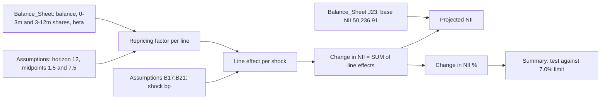

# NII Rate Shock Projection (MDL-ALM-014)

The `NII_Projection` sheet of the [NII Sensitivity Model](../nii-sensitivity-model.md) (MDL-ALM-014) estimates how 12-month [net interest income](../../metrics/net-interest-income.md) changes under the five [parallel rate shocks](../../scenarios/parallel-rate-shocks.md) in the model's scenario grid: -200, -100, 0, +100 and +200 bp. It is the earnings-based half of the model's [IRRBB](../../concepts/irrbb.md) output. The value-based half is [EVE Modified Duration](eve-modified-duration.md).

The component is spreadsheet logic only. Meridian Harbor Financial Corp. is fictional and the workbook is a synthetic proof of concept. All figures are USD millions (`$mm`), as of 2025-12-31 (FY2025 Annual Report snapshot).

In plain terms: **inputs** (balances, yields, repricing shares, betas, the shock grid) sit on `Assumptions` and `Balance_Sheet`; the **calculation** on `NII_Projection` turns them into a per-line earnings effect for each shock; the **outputs** are the change in NII, projected NII and percentage change per shock, which `Summary` tests against the Board limit.

## Results

Exact values from the `NII_Projection` and `Summary` sheets, with base-case NII of 50,236.91:

| Scenario | Shock (bp) | Projected NII ($mm) | Change in NII ($mm) | Change in NII (%) | NII limit status |
|---|---|---|---|---|---|
| Down 200 | -200 | 47,220.02 | -3,016.89 | -6.01% (-0.0601) | Within limit |
| Down 100 | -100 | 48,728.47 | -1,508.44 | -3.00% (-0.0300) | Within limit |
| Base | 0 | 50,236.91 | 0 | 0 | Within limit |
| Up 100 | +100 | 51,745.35 | +1,508.44 | +3.00% | Within limit |
| Up 200 | +200 | 53,253.80 | +3,016.89 | +6.01% | Within limit |

### The -200 bp case

The -200 bp shock is the adverse case for earnings. It lives in `NII_Projection` column D and is surfaced on `Summary` row 6. Projected NII (`NII_Projection!D24`) is **47,220.02**, a change (`D22`) of **-3,016.89 $mm** and a percentage change (`D25`) of **-0.0601, i.e. -6.01% of base NII**. `Summary!F6` reports "Within limit". The Board limit is a maximum NII decline of 7.0% of base NII, so the limit-equivalent decline is about 3,516.58 $mm (7.0% x 50,236.91). That leaves headroom of roughly 499.69 $mm, or about 0.99 percentage points. The headroom figure is derived arithmetic, not a workbook cell.

The balance sheet is asset-sensitive. In the -200 bp column, asset lines lose about 11,638.44 and liability lines gain 8,621.55, for a net of -3,016.89. The largest single contributors at -200 bp are:

| Line | Side | Cell | Effect ($mm) |
|---|---|---|---|
| Deposits with banks & fed funds sold | Asset | `D7` | -4,320.75 |
| Commercial & industrial loans | Asset | `D14` | -2,458.12 |
| Credit card loans | Asset | `D10` | -1,584.68 |
| Wholesale interest-bearing deposits | Liability | `D17` | +4,060.80 |
| Consumer interest-bearing deposits | Liability | `D16` | +2,623.05 |
| Repo & short-term borrowings | Liability | `D19` | +1,417.50 |
| Long-term debt | Liability | `D20` | +520.20 |
| Noninterest-bearing deposits | Liability | `D18` | 0 |

Liability relief only partly offsets asset yield loss because deposit betas are below 1 for the interest-bearing deposit lines (consumer 0.45, wholesale 0.75), and noninterest-bearing deposits have a beta of 0 and contribute nothing.

## Mechanism

For each of the 14 balance-sheet lines (`NII_Projection` rows 7-20, mirroring `Balance_Sheet` rows 6-19), the model computes a **repricing factor** once, then multiplies it by balance, beta and shock for each scenario column (D-H).

1. **Repricing factor (column C).** Only the 0-3m and 3-12m repricing buckets count. Each bucket is assumed to reprice at its midpoint, month 1.5 and month 7.5, and earns or pays the new rate for the rest of the 12-month horizon. Rendered formula for row 7:
   `=Balance_Sheet!E6*(Assumptions!$B$8-Assumptions!$B$9)/Assumptions!$B$8+Balance_Sheet!F6*(Assumptions!$B$8-Assumptions!$B$10)/Assumptions!$B$8` (value 0.8750). With the 12/1.5/7.5 inputs this is `0.875 x share(0-3m) + 0.375 x share(3-12m)`.
2. **Line effect (columns D-H).** Rendered formula for `D7`:
   `=IF(B7="Asset",1,-1)*Balance_Sheet!C6*Balance_Sheet!L6*$C7*D$6/10000` (value -4,320.75). That is sign x balance x beta x repricing factor x shock_bp / 10000. The sign flip makes a liability cost increase reduce NII. Row 6 of `NII_Projection` holds the shocks, linked from `Assumptions!B17:B21`.
3. **Aggregate (rows 22-25).**
   - Change in NII, `D22`: `=SUM(D7:D20)` (value -3,016.89).
   - Base-case NII, `D23`: `=Balance_Sheet!$J$23` (value 50,236.91).
   - Projected NII, `D24`: `=D23+D22` (value 47,220.02).
   - Change in NII (%), `D25`: `=IF(D23=0,0,D22/D23)` (value -0.0601). The guard returns 0 if base NII is 0.
4. **Limit test (`Summary`).** `Summary` row 6 pulls `C6 =NII_Projection!D24`, `D6 =NII_Projection!D22` and `E6 =NII_Projection!D25`. The NII status is `F6 =IF(E6<-Assumptions!$B$11,"BREACH","Within limit")`. Only declines are tested. Rows 7-10 follow the same pattern for columns E-H.

Base NII itself is `Balance_Sheet!J23` (`=J21-J22`): `sum(balance x yield)` over assets minus the same over liabilities, 76,515.95 of annual asset interest less 26,279.04 of liability interest, which is 50,236.91.

## Inputs and sources

- **Balances, yields and liability repricing profiles:** the month-end snapshot from the Treasury Liquidity Positions API ([API-15](../../apis/api-15-treasury-liquidity-positions-api.md)). Loan repricing profiles come from the Loan Servicing API ([API-11](../../apis/api-11-loan-servicing-api.md)).
- **Policy rate and curve:** the Market Data API ([API-12](../../apis/api-12-market-data-api.md)). The policy rate is 3.75% (`Assumptions!B7`), recorded as context. The NII formulas do not read it.
- **Betas:** `Balance_Sheet` column L. Every asset line has beta 1. Liability betas come from the Deposit Behaviour sub-model (2025 calibration, cells L15-L19). They are 0.45 consumer, 0.75 wholesale, 0 noninterest-bearing, and 1 for repo and long-term debt.
- **Horizon and midpoints:** 12 months, 1.5 and 7.5, in `Assumptions` B8:B10.
- **Shock grid:** `Assumptions` B17:B21, which `NII_Projection` row 6 and `Summary` link to.
- **Limit:** 0.0700 (7.0%) maximum decline, Board Risk Committee limit approved 2025-03 (`Assumptions!B11`).

## Invariants and behaviour worth knowing

- **Symmetry.** The effect is linear in the shock and the betas are constant across shock sizes. Every up result is the exact negative of the matching down result, and ±200 bp is exactly twice ±100 bp. The model therefore cannot show convexity, or an asymmetric downside from rate floors.
- **Repricing shares are validated.** `Balance_Sheet` column I (`=IF(ABS(SUM(E6:H6)-1)<0.0001,"OK","CHECK")`) flags "CHECK" if a line's four repricing shares do not sum to 1 within 0.0001. All lines read "OK". The 1-5y and >5y shares do not affect the 12-month NII, which is why mortgages (factor 0.07) and long-term debt (factor 0.30) move little.
- **Static balance sheet.** No growth, mix shift or reinvestment is modelled. Only existing positions reprice.
- **Known limitations** stated in the README: parallel shocks only (no twists), no rate floors on deposit costs below zero, and betas held constant. The compensating control is a quarterly dynamic balance-sheet simulation in the ALM engine.
- **Governance.** The model is Tier 1 (High) risk, owned by Corporate Treasury - ALM and validated by Model Risk Governance & Review. It was last validated 2025-09-18, with the next validation due 2026-09-30. See [model risk (SR 11-7)](../../concepts/model-risk-sr-11-7.md).

## Changing or extending

- **Add or change a shock.** Edit `Assumptions` B17:B21. `NII_Projection` row 6, the column formulas and `Summary` follow. A new scenario column would need to be added to each of these three places by hand.
- **Change a rate response.** Edit the beta in `Balance_Sheet` column L, or the repricing shares in columns E-F. The component reads them directly.
- **Change the limit.** Edit `Assumptions!B11`. `Summary` status formulas reference it as an absolute cell.
- **Downstream use.** Results feed the Annual Report market-risk section and the Pillar 3 IRRBB disclosure through `Summary` (see [Basel III Pillar 3](../../concepts/basel-iii-pillar-3.md)). Limit utilisation flags are used in ALCO reporting.

## Relationships

- Parent model: [NII Sensitivity Model](../nii-sensitivity-model.md) (MDL-ALM-014), which also holds the EVE sheet.
- Sibling components: [NII Repricing and Deposit Betas](nii-repricing-and-deposit-betas.md) (the repricing and beta inputs read here) and [EVE Modified Duration](eve-modified-duration.md) (the value-based counterpart).
- Concepts and metrics: [IRRBB](../../concepts/irrbb.md), [Net Interest Income](../../metrics/net-interest-income.md) and the [parallel rate shocks](../../scenarios/parallel-rate-shocks.md) scenario set.
- Owner: [Corporate Treasury - ALM](../../teams/corporate-treasury-alm.md).
- Data flow context: [Capital and Rate Sensitivity Flow](../../workflows/capital-and-rate-sensitivity-flow.md).
