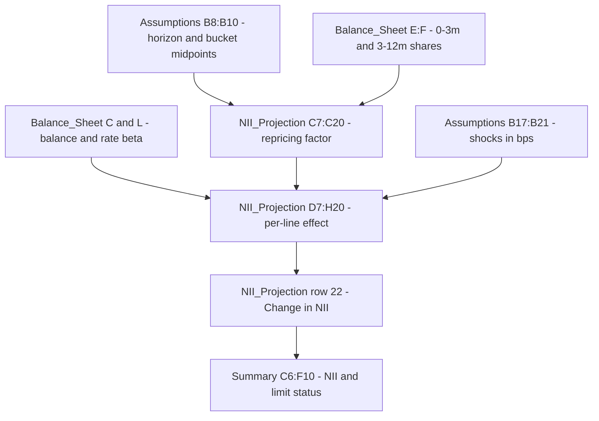

# NII Repricing and Deposit Betas (MDL-ALM-014)

This component is the assumption layer of the 12-month net interest income (NII) projection in the Net Interest Income Sensitivity Model (MDL-ALM-014, owned by Corporate Treasury - Asset & Liability Management). It decides **how much of each balance sheet line reprices inside the 12-month horizon** (the *repricing factor*) and **how far its rate moves when the policy curve is shocked** (the *rate beta*, called the deposit beta on the liability side). The projection sheet multiplies these two per-line assumptions by balance and shock size. Everything lives in one Excel workbook, `NII_Sensitivity_Model.xlsx`, rendered in `sources/models/nii-sensitivity-model.md`. The institution and all figures are synthetic.

## Inputs -> calculation -> outputs



The diagram shows how the repricing factor and beta combine with balances and shocks to produce the change in NII that feeds the Summary sheet.

### Inputs

| Input | Location | Value (as of 2025-12-31) |
|---|---|---|
| Projection horizon H (months) | `Assumptions!B8` | 12 |
| Repricing month, bucket 0-3m (midpoint) | `Assumptions!B9` | 1.50 |
| Repricing month, bucket 3-12m (midpoint) | `Assumptions!B10` | 7.50 |
| Shock grid (bps) | `Assumptions!B17:B21` | -200, -100, 0, +100, +200 |
| NII limit (max decline, % of base) | `Assumptions!B11` | 0.0700 |
| Balance ($mm) | `Balance_Sheet!C6:C19` | per line (balances come from API-15 and API-11 feeds) |
| Reprice 0-3m / 3-12m shares | `Balance_Sheet!E6:F19` | per line |
| Reprice 1-5y / >5y shares | `Balance_Sheet!G6:H19` | per line (not used by NII) |
| Rate beta | `Balance_Sheet!L6:L19` | see below |

The README sheet states that rates are stored as decimals, shocks are in basis points, and blue-font cells are hard-coded inputs. The bucket midpoints are an explicit convention ("midpoint of bucket"), and the liability betas are described as coming from the Deposit Behaviour sub-model (annual calibration, MRGR approved).

### Calculation 1: repricing factor (`NII_Projection!C7:C20`)

Each line's factor is the share-weighted fraction of the horizon that remains after its bucket's repricing date. Row 7 of `NII_Projection` links to `Balance_Sheet` row 6, so the `NII_Projection` row is always `Balance_Sheet` row + 1. The formula in `C7` is:

```
=Balance_Sheet!E6*(Assumptions!$B$8-Assumptions!$B$9)/Assumptions!$B$8+Balance_Sheet!F6*(Assumptions!$B$8-Assumptions!$B$10)/Assumptions!$B$8
```

With H = 12 this is `E × (12 − 1.5)/12 + F × (12 − 7.5)/12 = E × 0.875 + F × 0.375`. Only the 0-3m and 3-12m buckets contribute; shares in the 1-5y and >5y buckets (columns G and H) reprice after the horizon and add nothing, so no line can exceed 0.875 (a line that is 100% in 0-3m).

Resulting factors (column C):

| Line | Row | Factor |
|---|---|---|
| Deposits with banks & fed funds sold | C7 | 0.8750 |
| Investment securities (AFS + HTM) | C8 | 0.1425 |
| Trading assets (interest-earning) | C9 | 0.4000 |
| Credit card loans | C10 | 0.5725 |
| Residential mortgage loans | C11 | 0.0700 |
| Auto loans | C12 | 0.1425 |
| Commercial real estate loans | C13 | 0.5188 |
| Commercial & industrial loans | C14 | 0.7125 |
| Other consumer & wholesale loans | C15 | 0.4938 |
| Consumer interest-bearing deposits | C16 | 0.7250 |
| Wholesale interest-bearing deposits | C17 | 0.8000 |
| Noninterest-bearing deposits | C18 | 0 |
| Repo & short-term borrowings | C19 | 0.8750 |
| Long-term debt | C20 | 0.3000 |

Worked example, credit card loans: `0.62 × 0.875 + 0.08 × 0.375 = 0.5425 + 0.03 = 0.5725`.

### Calculation 2: rate betas and deposit betas (`Balance_Sheet!L6:L19`)

Column L is the single place betas are stored. They are hard-coded inputs, not formulas.

| Line | Cell | Beta |
|---|---|---|
| All nine asset lines (rows 6-14) | `L6:L14` | 1.00 (asset rates move one-for-one with the shock) |
| Consumer interest-bearing deposits | `L15` | 0.45 |
| Wholesale interest-bearing deposits | `L16` | 0.75 |
| Noninterest-bearing deposits | `L17` | 0 |
| Repo & short-term borrowings | `L18` | 1.00 |
| Long-term debt | `L19` | 1.00 |

Cell notes on `L15:L19` attribute all five liability betas to the Deposit Behaviour sub-model (2025 calibration). Repo and long-term debt are therefore pass-through (beta 1.0), and consumer deposits are the stickiest interest-bearing funding.

### Calculation 3: per-line effect and total change (`NII_Projection!D7:H22`)

For each line and each shock column (D = Down 200, E = Down 100, F = Base, G = Up 100, H = Up 200), the effect is:

```
=IF(B7="Asset",1,-1)*Balance_Sheet!C6*Balance_Sheet!L6*$C7*D$6/10000
```

That is `sign × balance × beta × repricing factor × shock_bps / 10000`, where sign is +1 for assets and −1 for liabilities. The shock row `D6:H6` links to `Assumptions!B17:B21`. Row 22 (`=SUM(D7:D20)` and so on) sums all lines, so the change in NII is the asset repricing effect minus the liability repricing effect. The balance sheet is static: no growth, no mix shift.

Worked example, consumer interest-bearing deposits at +200 bp (`H16`): `−1 × 402,000 × 0.45 × 0.725 × 200 / 10000 = −2,623.05`. This reduces NII because funding costs rise. Wholesale deposits at +200 bp (`H17`): `−338,400 × 0.75 × 0.80 × 0.02 = −4,060.80`.

### Outputs

| Output | Cell | Formula | Down 200 | Down 100 | Base | Up 100 | Up 200 |
|---|---|---|---|---|---|---|---|
| Change in NII ($mm) | `NII_Projection!D22:H22` | `=SUM(D7:D20)` | -3,016.89 | -1,508.44 | 0 | 1,508.44 | 3,016.89 |
| Base-case NII ($mm) | `NII_Projection!D23:H23` | `=Balance_Sheet!$J$23` | 50,236.91 | 50,236.91 | 50,236.91 | 50,236.91 | 50,236.91 |
| Projected NII ($mm) | `NII_Projection!D24:H24` | `=D23+D22` | 47,220.02 | 48,728.47 | 50,236.91 | 51,745.35 | 53,253.80 |
| Change in NII (%) | `NII_Projection!D25:H25` | `=IF(D23=0,0,D22/D23)` | -6.01% | -3.00% | 0 | 3.00% | 6.01% |

At +200 bp the nine asset lines add about +11,638.44 and the five liability lines subtract about 8,621.55, giving the net +3,016.89. The base-case NII of 50,236.91 comes from `Balance_Sheet!J23` (`=J21-J22`, asset interest of 76,515.95 minus liability interest of 26,279.04, where each line's interest is `=C*D`).

`Summary!C6:E10` pulls rows 24, 22 and 25 for each scenario, and the status cells apply the Board limit:

```
=IF(E6<-Assumptions!$B$11,"BREACH","Within limit")
```

Only declines can breach. At the current values the worst case, -6.01% at Down 200, sits under the 7.0% limit, so all five scenarios read "Within limit". Because the structure is linear (same beta and factor in both directions), up and down results are exact mirror images.

## Behaviours and invariants

- **Noninterest-bearing deposits never move NII.** `L17` is 0 and `C18` is 0 (all shares sit in 1-5y and >5y), so row 18 is zero in every scenario. They still matter to EVE, which ignores betas and repricing factors and uses modified duration from `Balance_Sheet` column K. Their dollar duration there is -9,520 per 100 bp (`EVE!E18`).
- **Share check is informational.** `Balance_Sheet!I6:I19` returns `OK` when the four repricing shares sum to 1 within 0.0001, otherwise `CHECK`. No NII or Summary formula reads it, so a bad share set would flow through silently unless someone watches the flag. Since the factor only uses E and F, an error in G or H would not change NII even though it fails the check.
- **Betas are constant.** The same beta applies to every shock size and sign, and there is no floor on shocked deposit costs (a large down shock can push a modelled cost below zero). The README lists these, plus parallel-only shocks and a static balance sheet, as known limitations. The compensating control is a quarterly dynamic balance-sheet simulation in the ALM engine.
- **Midpoint timing is a convention.** Moving `Assumptions!B9`, `B10` or `B8` changes every factor at once. Changing `Assumptions!B8` also shifts the weights, so this is a model-wide change, not a line-level one.

## Operating and changing the component

- **Recalibrating betas:** edit `Balance_Sheet!L15:L19` (the 2025 calibration values) and keep the cell notes in step with the Deposit Behaviour sub-model. Asset betas in `L6:L14` are 1.0 by design.
- **Updating repricing profiles:** edit shares in `Balance_Sheet!E:H` for the affected line (loan profiles from API-11, treasury lines from API-15), and confirm `I` still reads `OK`.
- **Adding a line:** the formulas in `NII_Projection` and `EVE` are row-aligned to `Balance_Sheet` rows 6-19, and the totals use fixed ranges (`C6:C19`, `D7:D20`, and so on), so new lines need all of those ranges extended.
- The model is Tier 1 (High) risk, last validated 2025-09-18 with the next validation due 2026-09-30, by Model Risk Governance & Review (MRGR).

## Relationships

- Parent model: [NII Sensitivity Model](../nii-sensitivity-model.md) (MDL-ALM-014).
- Consumes the repricing factor and betas in: [NII Rate Shock Projection](nii-rate-shock-projection.md).
- Sibling component that does not use betas or repricing factors: [EVE Modified Duration](eve-modified-duration.md).
- Measure produced: [Net Interest Income](../../metrics/net-interest-income.md).
- Scenario grid applied: [Parallel Rate Shocks](../../scenarios/parallel-rate-shocks.md).
- Risk framework: [IRRBB](../../concepts/irrbb.md).
- Owning team: [Corporate Treasury - ALM](../../teams/corporate-treasury-alm.md).
