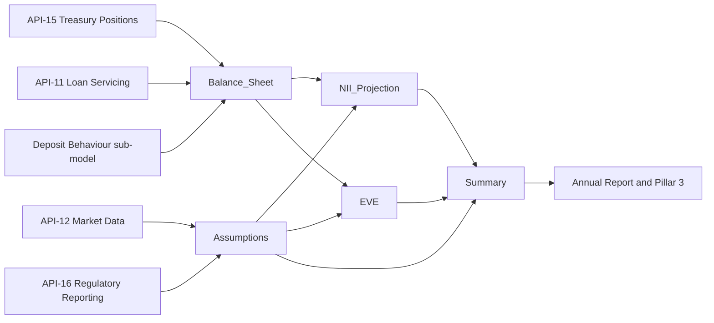

# MDL-ALM-014 NII Sensitivity Model

MDL-ALM-014 is the Meridian Harbor Financial Corp. workbook `NII_Sensitivity_Model.xlsx` (rendered in `sources/models/nii-sensitivity-model.md`). It produces two [IRRBB](../concepts/irrbb.md) measures from one static balance sheet: the change in 12-month [net interest income](../metrics/net-interest-income.md) and the change in [economic value of equity](../concepts/economic-value-of-equity.md) (EVE) under parallel shocks. The institution and all figures are synthetic.

| Attribute | Value |
| --- | --- |
| Model ID | MDL-ALM-014 |
| Risk tier | Tier 1 (High) |
| Owner | [Corporate Treasury - Asset & Liability Management](../teams/corporate-treasury-alm.md) |
| Independent validator | Model Risk Governance & Review (MRGR); see [SR 11-7](../concepts/model-risk-sr-11-7.md) |
| Last validation / next due | 2025-09-18 / 2026-09-30 |
| Units | USD millions unless stated; rates stored as decimals; shocks in basis points |
| As-of date | 2025-12-31 (`Assumptions!B6`), the month-end snapshot for the FY2025 Annual Report |
| Downstream disclosures | Annual Report (Market Risk Management); Pillar 3 IRRBB (see [Basel III Pillar 3](../concepts/basel-iii-pillar-3.md)) |

## Relationships

- consumes: [API-15 Treasury Liquidity Positions API](../apis/api-15-treasury-liquidity-positions-api.md) for month-end balances and yields/costs of securities, trading assets, deposits with banks, deposits, repo and long-term debt (the `Feed` column of `Balance_Sheet`).
- consumes: [API-11 Loan Servicing API](../apis/api-11-loan-servicing-api.md) for loan balances, yields and repricing profiles (credit card, mortgage, auto, CRE, C&I, other loans).
- consumes: [API-12 Market Data API](../apis/api-12-market-data-api.md) for the yield curve and the policy rate (`Assumptions!B7`, series `POLICY.FEDFUNDS.UB`).
- consumes: [API-16 Regulatory Reporting API](../apis/api-16-regulatory-reporting-api.md) for year-end Tier 1 capital (`Assumptions!B13`). The README lists only API-11, API-12 and API-15 as upstream feeds, so this dependency is visible only in the `Assumptions` source note.
- consumes: deposit betas from the Deposit Behaviour sub-model (annual calibration, MRGR approved), entered in `Balance_Sheet!L15:L19`.
- produces: modeled 12-month NII for the [NII metric](../metrics/net-interest-income.md) and EVE sensitivity as a percentage of Tier 1 capital.
- components: [NII rate-shock projection](components/nii-rate-shock-projection.md), [repricing and deposit betas](components/nii-repricing-and-deposit-betas.md), [EVE modified duration](components/eve-modified-duration.md).
- scenario set: [parallel rate shocks](../scenarios/parallel-rate-shocks.md).

## Workbook structure and data flow

The workbook has six sheets. Colour convention: blue text = hard-coded input or scenario lever, black = formula, green = cross-sheet link, yellow fill = key assumption.

| Sheet | Role |
| --- | --- |
| `README` | Model documentation: ID, tier, owner, validator, feeds, method, limits, limitations. |
| `Assumptions` | As-of date, policy rate, horizon, repricing midpoints, Board limits, Tier 1 capital, shock grid. |
| `Balance_Sheet` | 14 rate-sensitive lines (9 assets, 5 liabilities) with balances, yields, repricing shares, durations and betas. |
| `NII_Projection` | Per-line NII effect of each shock, summed to change, projected NII and percent change. |
| `EVE` | Per-line dollar duration and EVE change per shock, summed and scaled by Tier 1. |
| `Summary` | Scenario table with limit-status flags; feeds the Annual Report and Pillar 3. |

Caption: inputs enter through `Assumptions` and `Balance_Sheet`; `NII_Projection` and `EVE` compute independently and converge in `Summary`.

## Inputs

### Assumptions sheet

| Cell | Item | Value |
| --- | --- | --- |
| `B6` | As-of date | 2025-12-31 |
| `B7` | Policy rate (fed funds upper bound) | 0.0375 |
| `B8` | Projection horizon H (months) | 12 |
| `B9` | Repricing month, bucket 0-3m (midpoint) | 1.5 |
| `B10` | Repricing month, bucket 3-12m (midpoint) | 7.5 |
| `B11` | NII limit, max decline as % of base | 0.07 (Board Risk Committee, approved 2025-03) |
| `B12` | EVE limit, max decline as % of Tier 1 | 0.15 (Board Risk Committee, approved 2025-03) |
| `B13` | Tier 1 capital ($mm) | 110,620 (API-16, YE2025) |
| `A17:B21` | Shock grid | Down 200 / Down 100 / Base / Up 100 / Up 200 = -200, -100, 0, 100, 200 bp |

The shock grid is referenced by `NII_Projection!D6:H6`, `EVE!F6:J6` and `Summary!A6:B10`, so changing a shock in `Assumptions!B17:B21` flows to all three sheets. The policy rate (`B7`) and as-of date (`B6`) are documentation: no calculation formula in the rendered workbook references them, so changing the policy rate does not change results.

### Balance_Sheet sheet

Rows 6-14 are assets and rows 15-19 are liabilities. Columns: `C` balance, `D` yield/cost, `E:H` repricing shares (0-3m, 3-12m, 1-5y, >5y), `I` share check, `J` annual interest, `K` modified duration, `L` rate beta, `M` feed.

Key cells and formulas:

- `J6:J19`: `=C6*D6` (annual interest = balance x yield/cost).
- `I6:I19`: `=IF(ABS(SUM(E6:H6)-1)<0.0001,"OK","CHECK")`, the only in-workbook data-integrity control; it flags rows whose repricing shares do not sum to 100%.
- `C21` / `C22`: `=SUMIFS(C6:C19,B6:B19,"Asset")` and `"Liability"`; totals 1,258,500 and 1,180,100.
- `J21` / `J22`: the same `SUMIFS` on column `J`; 76,515.95 and 26,279.04.
- `J23`: `=J21-J22`, base-case annual NII of 50,236.91.

Betas in column `L`: all asset lines are 1.0; liabilities are consumer interest-bearing deposits 0.45, wholesale interest-bearing deposits 0.75, noninterest-bearing deposits 0, repo and short-term borrowings 1.0, long-term debt 1.0. The cell notes on `L15:L19` attribute all five liability betas to the Deposit Behaviour sub-model's 2025 calibration.

## Calculation

The README states the method as five steps: base NII is balance x yield summed over assets minus balance x cost summed over liabilities; each position reprices only for the part of the 12-month horizon remaining after its bucket midpoint; asset rates move one-for-one with the shock while liability rates move by shock x beta; change in NII is asset effect minus liability effect on a static balance sheet; and EVE change is the negative of net dollar duration times the shock.

### NII_Projection

Rows 7-20 mirror `Balance_Sheet` rows 6-19, in columns `D:H` for the five scenarios.

- Repricing factor, column `C` (for example `C7`):
  `=Balance_Sheet!E6*(Assumptions!$B$8-Assumptions!$B$9)/Assumptions!$B$8+Balance_Sheet!F6*(Assumptions!$B$8-Assumptions!$B$10)/Assumptions!$B$8`.
  With H = 12 this is `share_0-3m x 0.875 + share_3-12m x 0.375`. Only the 0-3m and 3-12m shares enter; the 1-5y and >5y shares are not used by NII, which is why noninterest-bearing deposits (0% in both near buckets) contribute no NII effect.
- Per-line effect, for example `D7`:
  `=IF(B7="Asset",1,-1)*Balance_Sheet!C6*Balance_Sheet!L6*$C7*D$6/10000`, that is sign x balance x beta x factor x shock in bp / 10,000. Liabilities carry sign -1, so a rate rise increases funding cost.
- `D22:H22`: `=SUM(D7:D20)`, change in NII.
- `D23:H23`: `=Balance_Sheet!$J$23`, base NII.
- `D24:H24`: `=D23+D22`, projected NII.
- `D25:H25`: `=IF(D23=0,0,D22/D23)`, percent change with a divide-by-zero guard.

### EVE

Rows 7-20 again mirror the balance sheet; the header note gives dEVE ~= -(sum asset PV x duration - sum liability PV x duration) x shock.

- `C` and `D` link balance and modified duration (`=Balance_Sheet!C6`, `=Balance_Sheet!K6`).
- Dollar duration, `E7`: `=IF(B7="Asset",1,-1)*C7*D7/100`, in $mm per 100 bp; liabilities are negative.
- Per-shock EVE change, `F7:J20`: `=-$E7*F$6/100`.
- `F22:J22`: `=SUM(F7:F20)`; `F23:J23`: `=Assumptions!$B$13`; `F24:J24`: `=IF(F23=0,0,F22/F23)`.

Book balance stands in for present value, so the approximation uses balance x duration as the PV exposure. See [EVE modified duration](components/eve-modified-duration.md) for the method's limits.

## Outputs

`Summary!A6:I10` is the single output table, one row per scenario. Each row links to the sheets above: projected NII `=NII_Projection!D24`, change `=NII_Projection!D22`, percent `=NII_Projection!D25`, EVE change `=EVE!F22`, EVE percent of Tier 1 `=EVE!F24` (columns shift one letter per scenario row).

Limit flags:

- NII status, `F6`: `=IF(E6<-Assumptions!$B$11,"BREACH","Within limit")`.
- EVE status, `I6`: `=IF(H6<-Assumptions!$B$12,"BREACH","Within limit")`.

Both tests are one-sided: only declines beyond the limit trip a breach, evaluated for every scenario including base. They are the "limit utilisation flags" used in ALCO reporting.

Reported results as of 2025-12-31 (base NII 50,236.91):

| Scenario | Projected NII ($mm) | Change in NII ($mm) | % of base | Change in EVE ($mm) | % of Tier 1 | Status |
| --- | --- | --- | --- | --- | --- | --- |
| Down 200 | 47,220.02 | -3,016.89 | -6.01% | +2,737.40 | +2.47% | Within limit |
| Down 100 | 48,728.47 | -1,508.44 | -3.00% | +1,368.70 | +1.24% | Within limit |
| Base | 50,236.91 | 0 | 0 | 0 | 0 | Within limit |
| Up 100 | 51,745.35 | +1,508.44 | +3.00% | -1,368.70 | -1.24% | Within limit |
| Up 200 | 53,253.80 | +3,016.89 | +6.01% | -2,737.40 | -2.47% | Within limit |

Reading the results: the bank is asset-sensitive on earnings (NII rises with rates) and exposed to rising rates on value (EVE falls). The worst NII outcome (-6.01% in Down 200) is close to the 7.0% Board limit, while the worst EVE outcome (-2.47% of Tier 1 in Up 200) is far inside the 15.0% limit. Results are exactly symmetric because the model is linear in the shock: constant betas, no optionality, no convexity.

## Limits, controls and known limitations

- Board limits: NII decline no greater than 7.0% of base NII in any parallel shock; EVE decline no greater than 15.0% of Tier 1 capital.
- Limitations stated in the README: parallel shocks only (no twists), static balance sheet (no growth or mix shift), no rate floors on deposit costs below zero, and betas held constant across shock sizes.
- Compensating control: a dynamic balance-sheet simulation run quarterly in the ALM engine.
- Internal control: the `Balance_Sheet!I` share check. Nothing in `Summary` consumes it, so a `CHECK` result must be noticed on that sheet.
- Governance: Tier 1 model validated independently by MRGR; the deposit beta inputs come from a separately approved sub-model with annual recalibration.

## Operations and extension points

- Refresh: replace the month-end snapshot in `Balance_Sheet` columns `C:H` and `K` from API-15 and API-11, update `Assumptions!B6`, `B7` and `B13`, then confirm all `I` cells read `OK`.
- Adding a shock scenario means a new row in `Assumptions!A17:B21` plus a matching column in `NII_Projection`, `EVE` and a row in `Summary`; the layout is fixed to five scenarios.
- Adding a balance-sheet line requires inserting a row in the contiguous `Balance_Sheet!6:19` block and in the mirrored `NII_Projection!7:20` and `EVE!7:20` blocks, because the `SUM` and `SUMIFS` ranges are hard-coded to those rows.
- Changing the repricing convention means editing the bucket midpoints in `Assumptions!B9:B10`; the horizon is `Assumptions!B8`.
- Recalibrated deposit betas go into `Balance_Sheet!L15:L19`; because NII is linear in beta, a beta change scales that line's effect proportionally.
