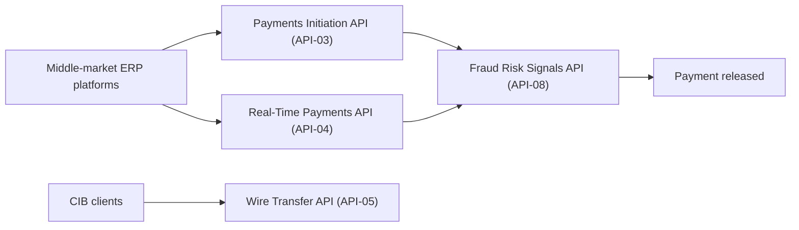

# Commercial & Investment Bank (CIB)

The Commercial & Investment Bank (CIB) is one of three reportable business segments of [Meridian Harbor Financial Corp.](meridian-harbor-financial-corp.md) (MHFC). The other two are Consumer & Community Banking (CCB) and Asset & Wealth Management (AWM). A fourth, non-business segment called Corporate holds Treasury/CIO and other centrally managed items. MHFC is a fictional institution in a proof-of-concept corpus, so all figures are invented. Dollar figures come from the [2025 Annual Report](../../sources/reports/mhfc-2025-annual-report.md), the [2025 Pillar 3 disclosures](../../sources/reports/mhfc-2025-pillar3-disclosures.md) and the [2Q26 earnings supplement](../../sources/reports/mhfc-q2-2026-earnings-supplement.md).

## Scope and history

- **Scope.** CIB provides investment banking, markets, securities services, global payments and lending. Its clients are corporations, institutional investors, financial institutions, middle-market companies, real estate investors and government entities.
- **Formation.** In January 2025 MHFC combined its corporate and investment banking business with its commercial banking business into a single CIB. The Annual Report says the integration of the former Commercial Banking segment was completed in 2025.
- **Rationale.** The shareholder letter says the combination gives middle-market clients direct access to the global product set, "from payments and treasury services to capital markets".
- **Reporting.** Segment results are on a managed basis. Capital is allocated by standalone risk profile, including Standardized requirements, the stress capital buffer and the G-SIB surcharge. Segment ROE is net income less allocated preferred dividends, divided by average allocated equity.

## 2025 results

| Metric (USD millions unless noted) | 2025 | 2024 | Change |
|---|---|---|---|
| Net revenue | 32,450 | 30,620 | 6.0% |
| of which net interest income | 12,680 | 12,140 | 4.4% |
| Provision for credit losses | 820 | 690 | 18.8% |
| Noninterest expense | 17,920 | 17,110 | 4.7% |
| **Net income** | **10,180** | **9,560** | **6.5%** |
| Average allocated equity | 54,000 | 53,000 | 1.9% |
| Return on equity | 18.0% | 17.0% | +100 bps |
| Investment banking fees | 6,840 | 5,910 | 15.7% |
| Markets revenue | 17,920 | 17,010 | 5.3% |
| Average loans | 268,000 | 259,400 | 3.3% |
| Average deposits | 318,000 | 302,700 | 5.1% |

Calculated from the segment table, CIB was about 38% of firmwide net revenue ($86.1 billion) and about 41% of firmwide net income ($24.96 billion). Its 18% ROE was below CCB (30%) and AWM (32%) and below the firm's 21%. It carried the largest allocated equity of any segment, at $54.0 billion. Segment net income of 12,300 + 10,180 + 3,580 − 1,100 (Corporate) reconciles to firmwide $24,960 million. See [Net Income and EPS](../metrics/net-income-and-eps.md).

Drivers named by management:

- **Investment banking.** Fees rose to $6.8 billion, led by debt underwriting and a recovery in advisory.
- **Markets.** Revenue was a record $17.9 billion, with strength in rates, securitized products and equity derivatives. It appears in firmwide noninterest revenue mainly as principal transactions.
- **Global Payments.** Revenue was $9.6 billion, up 7%, on higher deposit balances and fee growth from real-time payments and cross-border wires. Real-time payments volume more than doubled after the Real-Time Payments API was opened to corporate clients.
- **Credit.** The higher provision reflected net charge-offs concentrated in office commercial real estate (CRE) and a small number of C&I names in consumer discretionary. The Annual Report text gives the provision as "820 million" with no currency symbol; the table shows 820 in millions.

The Annual Report also names CIB, with AWM, as a source of higher revenue-related compensation, which lifted firmwide compensation expense 4.8%. CIB's resale-agreement balances were a driver of the rise in total assets to $1,418.6 billion, and its middle-market C&I lending contributed to loan growth.

## Latest quarter: 2Q26

| Metric (USD millions) | 2Q26 | 1Q26 | 2Q25 | vs 1Q26 | vs 2Q25 |
|---|---|---|---|---|---|
| Net revenue | 8,480 | 8,870 | 8,110 | (4.4%) | 4.6% |
| **Net income** | **2,740** | **2,890** | **2,510** | **(5.2%)** | **9.2%** |
| Average loans | 279,200 | 274,600 | 265,300 | 1.7% | 5.2% |
| Average deposits | 331,500 | 326,800 | 312,400 | 1.4% | 6.1% |
| Investment banking fees | 1,820 | 1,760 | 1,600 | 3.4% | 13.8% |
| Markets revenue | 4,610 | 5,080 | 4,430 | (9.3%) | 4.1% |

- **Sequential dip.** The quarter-on-quarter decline comes mainly from Markets. Fixed Income Markets was $2.9 billion and Equity Markets $1.7 billion. Management says Equity Markets was lower than a record first quarter in derivatives.
- **Other lines.** Payments revenue was $2.5 billion, up 8% year-on-year. Lending revenue was $0.9 billion. The provision for credit losses was $260 million, including $90 million of office CRE net charge-offs. Investment banking wallet share was 8.1%, with strong technology and healthcare M&A and improving sponsor activity.
- **Firmwide context.** CIB's $2.74 billion was about 42% of firmwide net income of $6.54 billion.
- **Office CRE.** Management calls it the area of greatest credit attention. Criticized office loans were $3.1 billion, down from $3.6 billion at year end, and office allowance coverage was 9.8%.

## Payments and API dependencies

Payments is described as a strategic priority. The segment relies on the firm's Developer Platform APIs:

- API-03 and API-04 are integrated with the top five ERP platforms used by middle-market clients. 2,400 clients went live on API-based payments in 2Q26.
- Each payment is screened by the Fraud Risk Signals API (API-08) before release. The Annual Report says API-08 scores every card authorization, real-time payment and wire.
- Real-time payment volume was up 64% year-on-year in 2Q26 after the Real-Time Payments API was extended to middle-market clients. The API-04 row in the supplement's table shows 205 million monthly calls, up 64%, at 99.99% availability.
- The Wire Transfer API (API-05) lists CIB clients as its key consumers (41 million calls per month, 99.99% availability).

## Market risk and VaR

The trading activity behind CIB's Markets revenue is covered by firmwide market-risk disclosures. The sources do not publish a CIB-only VaR figure, so VaR here is a firmwide measure, not a segment one. The trading assets it covers sit mainly in the Markets business. Treat VaR below as context for CIB, not as a CIB-specific number. See [Value-at-Risk](../metrics/value-at-risk.md) for the full treatment.

Two VaR bases are published, and they must not be compared directly:

| Basis | Source | 2025 headline |
|---|---|---|
| Management VaR, 95% 1-day, historical simulation, one-year look-back | Annual Report, Market Risk Management | Average total 50 (2024: 51); min 37, max 71. Fixed income is the largest component at 38. |
| Regulatory VaR, 99% 10-day | Pillar 3, section 9 | Average 160; min 118, max 231; period end 149. Interest rate is the largest component at 128 average. |

- **Backtesting.** The Annual Report reports 3 backtesting exceptions in 2025 for the management measure, "within the expected range". Pillar 3 reports 2 firmwide exceptions against the 99% 1-day VaR. That is below the threshold of five that would raise the regulatory multiplier above 3.0.
- **Capital.** Regulatory VaR, stressed VaR, the incremental risk charge, the comprehensive risk measure and standardized specific risk feed market risk RWA of $54.2 billion at year end 2025 (2024: $52.6 billion). See [Risk-Weighted Assets](../metrics/risk-weighted-assets.md).
- **Inputs.** Trading positions are valued daily from the Market Data API (API-12) and FX Rates API (API-13). These are BCBS 239 critical data elements, and the Valuation Control Group validates them independently.
- **Oversight.** Market Risk Management, part of the independent risk function, sets limits, monitors exposures and reports to the Board Risk Committee.

## Credit exposure relevant to CIB

- **Loan mix.** Firmwide, the C&I portfolio is $172.5 billion with a 0.32% net charge-off rate and 1.60% allowance coverage. The CRE portfolio is $98.2 billion with a 0.39% net charge-off rate and 2.52% coverage. The sources do not state how much of each is booked in CIB.
- **CRE.** CRE is 61% multifamily, and office is 9% of CRE loans.
- **Wholesale credit decisions.** These are made by credit officers with delegated authority on internal risk ratings. The ratings map to PD estimates from the Credit Risk Scoring API (API-10). Consumer decisions use the automated Credit Decisioning API (API-09).

## Reading and using the numbers

- Compare like with like. Annual figures are in the Annual Report, quarterly figures in the earnings supplement, and regulatory measures in Pillar 3.
- Quarterly results move with capital-markets activity. The supplement describes 1Q as seasonally strong in Markets, which accounts for the 2Q26 sequential decline despite year-on-year growth.
