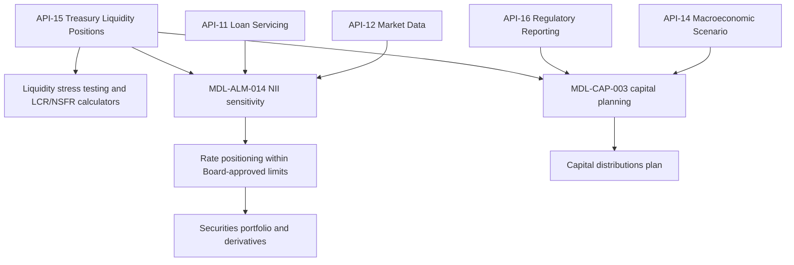

# Corporate (Treasury/CIO)

<!-- openwiki: broken internal link [../../sources/reports/mhfc-2025-annual-report.md#L247-L251] heading anchor "L247-L251" does not exist in "../../sources/reports/mhfc-2025-annual-report.md". Fix the href or restore the target, then delete this comment. -->
Corporate is the fourth reporting segment of [Meridian Harbor Financial Corp.](./meridian-harbor-financial-corp.md), alongside Consumer & Community Banking, Commercial & Investment Bank and [Asset & Wealth Management](./asset-wealth-management.md). It has two parts ([Annual Report 2025, p. 11](../../sources/reports/mhfc-2025-annual-report.md#L247-L251)):

- **Treasury and the Chief Investment Office (Treasury/CIO)**. It manages the Firm's liquidity, funding, capital, structural interest rate and foreign exchange risks, and the investment securities portfolio.
- **Other Corporate**. This holds centrally managed functions and expense that is not allocated to the business segments.

<!-- openwiki: broken internal link [../../sources/reports/mhfc-2025-annual-report.md#L88] heading anchor "L88" does not exist in "../../sources/reports/mhfc-2025-annual-report.md". Fix the href or restore the target, then delete this comment. -->
The segment is a net cost centre rather than a revenue line. It is excluded from the Annual Report's segment revenue chart ([Annual Report 2025](../../sources/reports/mhfc-2025-annual-report.md#L88)).

## Responsibilities

| Area | What Treasury/CIO does | Source |
|---|---|---|
<!-- openwiki: broken internal link [../../sources/reports/mhfc-2025-annual-report.md#L317-L321] heading anchor "L317-L321" does not exist in "../../sources/reports/mhfc-2025-annual-report.md". Fix the href or restore the target, then delete this comment. -->
| Liquidity risk | Is responsible for liquidity risk management. The Chief Risk Office's Liquidity Risk Oversight function provides independent oversight. | [Annual Report, Liquidity Risk Management](../../sources/reports/mhfc-2025-annual-report.md#L317-L321) |
<!-- openwiki: broken internal link [../../sources/reports/mhfc-2025-annual-report.md#L413] heading anchor "L413" does not exist in "../../sources/reports/mhfc-2025-annual-report.md". Fix the href or restore the target, then delete this comment. -->
| Structural interest rate risk | Manages it through the investment securities portfolio and interest rate derivatives, within limits approved by the Board Risk Committee. | [Annual Report, Market Risk](../../sources/reports/mhfc-2025-annual-report.md#L413) |
<!-- openwiki: broken internal link [../../sources/reports/mhfc-2025-annual-report.md#L257] heading anchor "L257" does not exist in "../../sources/reports/mhfc-2025-annual-report.md". Fix the href or restore the target, then delete this comment. -->
| Investment securities | Runs the available-for-sale and held-to-maturity portfolios. In 2025 it deployed excess cash into high-quality securities. | [Annual Report, Balance Sheet](../../sources/reports/mhfc-2025-annual-report.md#L257) |
<!-- openwiki: broken internal link [../../sources/reports/mhfc-q2-2026-earnings-supplement.md#L244-L246] heading anchor "L244-L246" does not exist in "../../sources/reports/mhfc-q2-2026-earnings-supplement.md". Fix the href or restore the target, then delete this comment. -->
| Capital | Manages capital distributions within the plan produced by the capital planning model. | [Q2 2026 Supplement, p. 10](../../sources/reports/mhfc-q2-2026-earnings-supplement.md#L244-L246) |
<!-- openwiki: broken internal link [../../sources/reports/mhfc-2025-annual-report.md#L249] heading anchor "L249" does not exist in "../../sources/reports/mhfc-2025-annual-report.md". Fix the href or restore the target, then delete this comment. -->
| Model ownership | Through Corporate Treasury sub-teams, it owns the two Tier 1 models listed below. | [Annual Report, p. 11](../../sources/reports/mhfc-2025-annual-report.md#L249) |

<!-- openwiki: broken internal link [../../sources/reports/mhfc-2025-pillar3-disclosures.md#L60] heading anchor "L60" does not exist in "../../sources/reports/mhfc-2025-pillar3-disclosures.md". Fix the href or restore the target, then delete this comment. -->
Under the Firm's three-lines-of-defense model, Treasury/CIO sits in the **first line**. It owns the risks it generates, while Independent Risk Management and Compliance (second line) set appetite and limits and challenge it. Internal Audit is the third line ([Pillar 3, risk governance](../../sources/reports/mhfc-2025-pillar3-disclosures.md#L60)). The Treasurer's role is described on the [Treasurer](../people/treasurer.md) page.

## Owned models

| Model | Owner | Purpose | Last validated |
|---|---|---|---|
| MDL-ALM-014, Net Interest Income Sensitivity ([page](../models/nii-sensitivity-model.md)) | Corporate Treasury - Asset & Liability Management | Earnings-at-risk, the primary IRRBB earnings measure | 2025-09-18 |
| MDL-CAP-003, Capital Planning & Stress Projection ([page](../models/capital-planning-model.md)) | Corporate Treasury - Capital Management | Nine-quarter CET1, RWA and ratio projections | 2026-02-27 |

<!-- openwiki: broken internal link [../../sources/reports/mhfc-2025-annual-report.md#L441-L445] heading anchor "L441-L445" does not exist in "../../sources/reports/mhfc-2025-annual-report.md". Fix the href or restore the target, then delete this comment. -->
<!-- openwiki: broken internal link [../../sources/reports/mhfc-2025-pillar3-disclosures.md#L379] heading anchor "L379" does not exist in "../../sources/reports/mhfc-2025-pillar3-disclosures.md". Fix the href or restore the target, then delete this comment. -->
Both are Tier 1 models validated independently by Model Risk Governance & Review ([Annual Report model inventory](../../sources/reports/mhfc-2025-annual-report.md#L441-L445); [Pillar 3, p. 16](../../sources/reports/mhfc-2025-pillar3-disclosures.md#L379)).

## How the segment operates

<!-- openwiki: broken internal link [../../sources/reports/mhfc-2025-annual-report.md#L443-L445] heading anchor "L443-L445" does not exist in "../../sources/reports/mhfc-2025-annual-report.md". Fix the href or restore the target, then delete this comment. -->
<!-- openwiki: broken internal link [../../sources/reports/mhfc-2025-pillar3-disclosures.md#L439] heading anchor "L439" does not exist in "../../sources/reports/mhfc-2025-pillar3-disclosures.md". Fix the href or restore the target, then delete this comment. -->
Caption: data feeds into Treasury/CIO's liquidity and model workflows, and the actions they inform. The feeds come from the model inventory and Pillar 3 data lineage ([Annual Report](../../sources/reports/mhfc-2025-annual-report.md#L443-L445); [Pillar 3, p. 18](../../sources/reports/mhfc-2025-pillar3-disclosures.md#L439)).

### Liquidity management

<!-- openwiki: broken internal link [../../sources/reports/mhfc-2025-annual-report.md#L321] heading anchor "L321" does not exist in "../../sources/reports/mhfc-2025-annual-report.md". Fix the href or restore the target, then delete this comment. -->
<!-- openwiki: broken internal link [../../sources/reports/mhfc-2025-pillar3-disclosures.md#L439] heading anchor "L439" does not exist in "../../sources/reports/mhfc-2025-pillar3-disclosures.md". Fix the href or restore the target, then delete this comment. -->
- Liquidity positions across all legal entities are aggregated **daily** through the Treasury Liquidity Positions API (API-15). It publishes intraday cash, collateral and HQLA positions to the liquidity stress testing engine and to the ALM models. Pillar 3 adds that it feeds the LCR and NSFR calculators with legal-entity-level views ([Annual Report](../../sources/reports/mhfc-2025-annual-report.md#L321); [Pillar 3](../../sources/reports/mhfc-2025-pillar3-disclosures.md#L439)).
<!-- openwiki: broken internal link [../../sources/reports/mhfc-2025-annual-report.md#L457] heading anchor "L457" does not exist in "../../sources/reports/mhfc-2025-annual-report.md". Fix the href or restore the target, then delete this comment. -->
- API-15 is also one of the APIs classed as a *critical data service*. These get enhanced change management and data-quality controls because they feed Tier 1 models and regulatory reports ([Annual Report](../../sources/reports/mhfc-2025-annual-report.md#L457)). A defect in API-15 therefore propagates into liquidity ratios, NII sensitivity and capital projections together.
<!-- openwiki: broken internal link [../../sources/reports/mhfc-2025-annual-report.md#L333] heading anchor "L333" does not exist in "../../sources/reports/mhfc-2025-annual-report.md". Fix the href or restore the target, then delete this comment. -->
- The internal stress test assumes a 90-day idiosyncratic and market-wide stress. It includes loss of unsecured wholesale funding, accelerated deposit outflows, collateral calls from a three-notch downgrade and draws on committed facilities. At 31 Dec 2025, liquidity sources exceeded stressed outflows in every material legal entity ([Annual Report](../../sources/reports/mhfc-2025-annual-report.md#L333)).
<!-- openwiki: broken internal link [../../sources/reports/mhfc-2025-annual-report.md#L323-L329] heading anchor "L323-L329" does not exist in "../../sources/reports/mhfc-2025-annual-report.md". Fix the href or restore the target, then delete this comment. -->
<!-- openwiki: broken internal link [../../sources/reports/mhfc-q2-2026-earnings-supplement.md#L372-L388] heading anchor "L372-L388" does not exist in "../../sources/reports/mhfc-q2-2026-earnings-supplement.md". Fix the href or restore the target, then delete this comment. -->
- Reported outcomes: average Q4 2025 LCR of 116% (113% in 2024), NSFR of 128%, and average Q4 HQLA of $286.0 billion ([Annual Report](../../sources/reports/mhfc-2025-annual-report.md#L323-L329)). In 2Q26 the average LCR was 115%, with HQLA of $292.3 billion and about $560 billion of total liquidity resources ([Q2 2026 Supplement](../../sources/reports/mhfc-q2-2026-earnings-supplement.md#L372-L388)). See [Liquidity Coverage Ratio](../metrics/liquidity-coverage-ratio.md) and [Net Stable Funding Ratio](../metrics/net-stable-funding-ratio.md).

### Structural interest rate risk

<!-- openwiki: broken internal link [../../sources/reports/mhfc-2025-annual-report.md#L413-L415] heading anchor "L413-L415" does not exist in "../../sources/reports/mhfc-2025-annual-report.md". Fix the href or restore the target, then delete this comment. -->
<!-- openwiki: broken internal link [../../sources/reports/mhfc-2025-pillar3-disclosures.md#L393-L398] heading anchor "L393-L398" does not exist in "../../sources/reports/mhfc-2025-pillar3-disclosures.md". Fix the href or restore the target, then delete this comment. -->
<!-- openwiki: broken internal link [../../sources/reports/mhfc-q2-2026-earnings-supplement.md#L392] heading anchor "L392" does not exist in "../../sources/reports/mhfc-q2-2026-earnings-supplement.md". Fix the href or restore the target, then delete this comment. -->
<!-- openwiki: broken internal link [../../sources/reports/mhfc-2025-pillar3-disclosures.md#L402] heading anchor "L402" does not exist in "../../sources/reports/mhfc-2025-pillar3-disclosures.md". Fix the href or restore the target, then delete this comment. -->
Structural rate risk comes from lending, deposit-taking and debt issuance. Treasury/CIO manages it with the securities portfolio and interest rate derivatives, and measures it with MDL-ALM-014. The model applies instantaneous parallel shocks to a static year-end balance sheet. It measures the 12-month change in net interest income, with deposit betas of 0.45 for consumer and 0.75 for wholesale interest-bearing deposits ([Annual Report](../../sources/reports/mhfc-2025-annual-report.md#L413-L415)). The Firm is modestly asset-sensitive. At year-end 2025 a +100 bp shock raised 12-month NII by about $1,508 million (3.0%), and the 30 Jun 2026 sensitivity was directionally similar at about $1.4 billion ([Pillar 3](../../sources/reports/mhfc-2025-pillar3-disclosures.md#L393-L398); [Q2 2026 Supplement](../../sources/reports/mhfc-q2-2026-earnings-supplement.md#L392)). The model's known limitations (non-parallel curve moves, basis risk, prepayment optionality) are covered through quarterly dynamic simulation reviewed by ALCO ([Pillar 3](../../sources/reports/mhfc-2025-pillar3-disclosures.md#L402)). See [IRRBB](../concepts/irrbb.md) and [Net Interest Income](../metrics/net-interest-income.md).

### Securities portfolio actions

<!-- openwiki: broken internal link [../../sources/reports/mhfc-2025-annual-report.md#L126-L130] heading anchor "L126-L130" does not exist in "../../sources/reports/mhfc-2025-annual-report.md". Fix the href or restore the target, then delete this comment. -->
- **2025:** Treasury/CIO repositioned the available-for-sale portfolio to extend duration ahead of expected rate cuts. This produced $410 million of investment securities losses ([Annual Report](../../sources/reports/mhfc-2025-annual-report.md#L126-L130)).
<!-- openwiki: broken internal link [../../sources/reports/mhfc-q2-2026-earnings-supplement.md#L244] heading anchor "L244" does not exist in "../../sources/reports/mhfc-q2-2026-earnings-supplement.md". Fix the href or restore the target, then delete this comment. -->
- **2026:** It reinvests maturing securities into agency mortgage-backed securities and U.S. Treasuries at yields above the run-off yield, which supports Firmwide NII. Portfolio duration was about 3.6 years at the end of 2Q26 ([Q2 2026 Supplement](../../sources/reports/mhfc-q2-2026-earnings-supplement.md#L244)).

<!-- openwiki: broken internal link [../../sources/reports/mhfc-2025-annual-report.md#L267-L268] heading anchor "L267-L268" does not exist in "../../sources/reports/mhfc-2025-annual-report.md". Fix the href or restore the target, then delete this comment. -->
At 31 Dec 2025, available-for-sale securities were $112.6 billion (up 7.3%) and held-to-maturity securities were $58.3 billion (down 7.2%) ([Annual Report](../../sources/reports/mhfc-2025-annual-report.md#L267-L268)).

## Financial profile

| Measure ($ millions) | 2Q26 | 1Q26 | 2Q25 | FY2025 | FY2024 |
|---|---|---|---|---|---|
| Net revenue | (80) | (70) | (90) | (330) | 0 |
| Net income | (370) | (390) | (270) | (1,100) | (940) |

<!-- openwiki: broken internal link [../../sources/reports/mhfc-q2-2026-earnings-supplement.md#L57-L66] heading anchor "L57-L66" does not exist in "../../sources/reports/mhfc-q2-2026-earnings-supplement.md". Fix the href or restore the target, then delete this comment. -->
<!-- openwiki: broken internal link [../../sources/reports/mhfc-2025-annual-report.md#L175] heading anchor "L175" does not exist in "../../sources/reports/mhfc-2025-annual-report.md". Fix the href or restore the target, then delete this comment. -->
Sources: [Q2 2026 Supplement, p. 4 and p. 10](../../sources/reports/mhfc-q2-2026-earnings-supplement.md#L57-L66); [Annual Report, p. 9](../../sources/reports/mhfc-2025-annual-report.md#L175).

<!-- openwiki: broken internal link [../../sources/reports/mhfc-2025-annual-report.md#L251] heading anchor "L251" does not exist in "../../sources/reports/mhfc-2025-annual-report.md". Fix the href or restore the target, then delete this comment. -->
- The FY2025 loss widened mainly because of the $410 million of securities losses, partly offset by higher net interest income on the investment portfolio ([Annual Report](../../sources/reports/mhfc-2025-annual-report.md#L251)).
<!-- openwiki: broken internal link [../../sources/reports/mhfc-q2-2026-earnings-supplement.md#L238-L242] heading anchor "L238-L242" does not exist in "../../sources/reports/mhfc-q2-2026-earnings-supplement.md". Fix the href or restore the target, then delete this comment. -->
- In 2Q26, net revenue included $40 million of investment securities losses. Expense of $480 million was mainly centrally managed technology and legal costs not allocated to segments. Treasury/CIO NII benefited from reinvesting maturing securities at higher yields ([Q2 2026 Supplement, p. 10](../../sources/reports/mhfc-q2-2026-earnings-supplement.md#L238-L242)).
<!-- openwiki: broken internal link [../../sources/reports/mhfc-2025-annual-report.md#L175] heading anchor "L175" does not exist in "../../sources/reports/mhfc-2025-annual-report.md". Fix the href or restore the target, then delete this comment. -->
<!-- openwiki: broken internal link [../../sources/reports/mhfc-q2-2026-earnings-supplement.md#L516] heading anchor "L516" does not exist in "../../sources/reports/mhfc-q2-2026-earnings-supplement.md". Fix the href or restore the target, then delete this comment. -->
- Segment ROE is not meaningful (NM). Corporate is not a client-facing business, and the supplement presents it on the same managed basis as the others ([Annual Report](../../sources/reports/mhfc-2025-annual-report.md#L175); [Q2 2026 Supplement](../../sources/reports/mhfc-q2-2026-earnings-supplement.md#L516)).
- The business segments' net interest income sums to 47,740 against the Firm's 48,620. The roughly $880 million residual is not itemised in the sources, so the wiki does not attribute it to Corporate with certainty (see [Net Interest Income](../metrics/net-interest-income.md)).

## Governance and invariants

<!-- openwiki: broken internal link [../../sources/reports/mhfc-2025-annual-report.md#L413] heading anchor "L413" does not exist in "../../sources/reports/mhfc-2025-annual-report.md". Fix the href or restore the target, then delete this comment. -->
<!-- openwiki: broken internal link [../../sources/reports/mhfc-q2-2026-earnings-supplement.md#L246] heading anchor "L246" does not exist in "../../sources/reports/mhfc-q2-2026-earnings-supplement.md". Fix the href or restore the target, then delete this comment. -->
- Rate positioning must stay within **Board-approved limits** (Board Risk Committee approval) ([Annual Report](../../sources/reports/mhfc-2025-annual-report.md#L413); [Q2 2026 Supplement](../../sources/reports/mhfc-q2-2026-earnings-supplement.md#L246)).
- Liquidity is overseen independently by the Chief Risk Office. Treasury/CIO owns the risk, but it does not oversee itself.
<!-- openwiki: broken internal link [../../sources/reports/mhfc-2025-annual-report.md#L283] heading anchor "L283" does not exist in "../../sources/reports/mhfc-2025-annual-report.md". Fix the href or restore the target, then delete this comment. -->
- Capital planning is governed by the Capital Governance Committee, chaired by the CFO, and the Board approves the Capital Policy and risk appetite. MDL-CAP-003 sources starting capital and RWA from API-16 and scenarios from API-14 ([Annual Report](../../sources/reports/mhfc-2025-annual-report.md#L283)). See [CET1 ratio](../metrics/cet1-ratio.md) and [Stress Capital Buffer](../concepts/stress-capital-buffer.md).
<!-- openwiki: broken internal link [../../sources/reports/mhfc-2025-pillar3-disclosures.md#L482-L514] heading anchor "L482-L514" does not exist in "../../sources/reports/mhfc-2025-pillar3-disclosures.md". Fix the href or restore the target, then delete this comment. -->
- Both owned models are Tier 1, so material changes to them fall under [model risk governance (SR 11-7)](../concepts/model-risk-sr-11-7.md). Next validations are due 2026-09-30 for MDL-ALM-014 and 2027-02-28 for MDL-CAP-003 ([Pillar 3](../../sources/reports/mhfc-2025-pillar3-disclosures.md#L482-L514)).

## Related pages

- [Meridian Harbor Financial Corp.](./meridian-harbor-financial-corp.md)
- [IRRBB](../concepts/irrbb.md)
- [Liquidity Coverage Ratio](../metrics/liquidity-coverage-ratio.md)
- [Treasurer](../people/treasurer.md)
