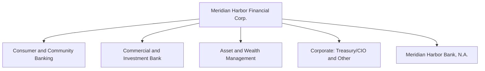
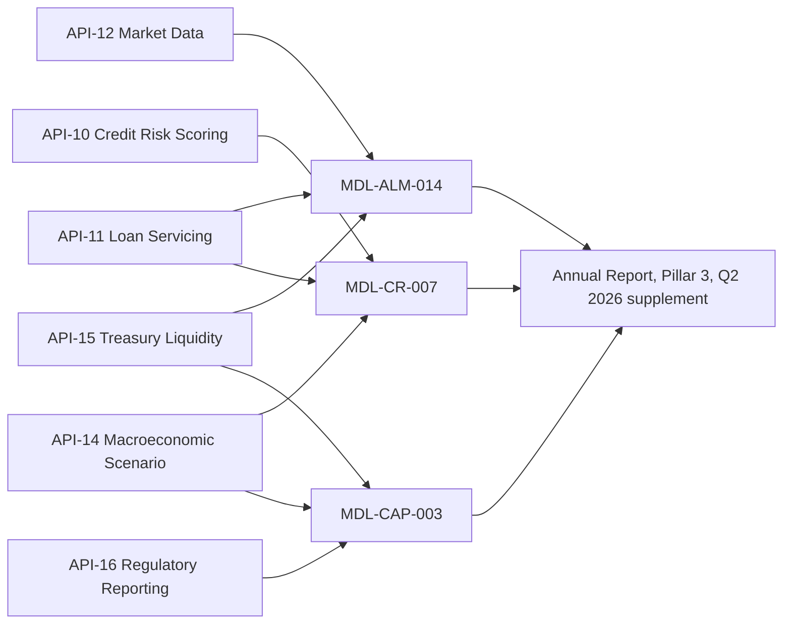

# Meridian Harbor Financial Corp.

Meridian Harbor Financial Corp. ("MHFC", "Meridian Harbor" or "the Firm") is the bank entity at the center of this wiki. It is a **fictional** institution: every source document carries a notice that it is a synthetic proof-of-concept and that names, figures and events are invented. MHFC is a financial holding company incorporated under Delaware law, headquartered in Charlotte Bay, NC, operating in 31 countries and employing 214,600 people at year-end 2025 (216,100 by Q2 2026). Its principal insured depository institution is Meridian Harbor Bank, N.A.

The page plays three roles for the rest of the wiki:

1. **Parent of the segments** – it consolidates [Consumer & Community Banking](consumer-community-banking.md), [Commercial & Investment Bank](commercial-investment-bank.md), [Asset & Wealth Management](asset-wealth-management.md) and [Corporate](corporate.md).
2. **Discloser of reports** – it publishes the 2025 Annual Report (February 2026), the 2025 Pillar 3 Regulatory Capital Disclosures (March 2026) and the Q2 2026 Earnings Release and Financial Supplement (July 14, 2026).
3. **Owner of models and data feeds** – the Firm's Tier 1 models and the Developer Platform APIs that feed them determine many of the numbers it discloses.

For a bank-wide orientation see the [overview](../overview.md). The chief executive is covered on [Chief Executive Officer](../people/chief-executive-officer.md).

## Structure

The Firm organizes its activities into three reportable business segments plus a Corporate segment. Corporate comprises Treasury/CIO (liquidity, funding, capital, structural interest-rate and FX risk, and the investment securities portfolio) and Other Corporate (centrally managed functions and unallocated expense). In January 2025 the former corporate and investment banking business was combined with Commercial Banking into a single Commercial & Investment Bank, with the integration completed during 2025.

Caption: MHFC as parent of the three business segments and Corporate, with its principal insured bank subsidiary.

Segment results as reported for 2025 (managed basis, $ millions):

| Segment | Net revenue | Net income | ROE |
|---|---|---|---|
| Consumer & Community Banking | 40,800 | 12,300 | 30% |
| Commercial & Investment Bank | 32,450 | 10,180 | 18% |
| Asset & Wealth Management | 13,180 | 3,580 | 32% |
| Corporate | (330) | (1,100) | NM |
| **Total Firm** | **86,100** | **24,960** | **21%** |

Capital is allocated to each segment from its standalone risk profile, including Standardized-approach requirements, the stress capital buffer and the G-SIB surcharge. Corporate carries a net loss in every period reported; in 2025 its revenue included $410 million of investment securities losses from repositioning the available-for-sale portfolio to extend duration ahead of expected rate cuts.

## Financial profile

| Metric (consolidated) | 2025 | 2024 |
|---|---|---|
| Net revenue | $86,100 mm | $81,860 mm |
| Net income | $24,960 mm | $23,380 mm |
| Diluted EPS | $16.93 | $15.40 |
| ROTCE | 26.4% | 26.3% |
| Overhead ratio | 54.9% | 55.7% |
| CET1 ratio (Standardized) | 15.1% | 14.7% |
| Total assets | $1,418,560 mm | $1,362,240 mm |
| Loans / Deposits | $742,300 mm / $1,012,400 mm | $718,600 mm / $978,300 mm |

Q2 2026 continued the trend: net income of $6.54 billion ($4.48 diluted EPS, ROTCE 24% on a reconciled basis), revenue of $22.48 billion (up 5.4% year on year), Standardized CET1 ratio of 15.1% and $4.6 billion returned to shareholders. Segment net income in 2Q26 was CCB $3,210 mm, CIB $2,740 mm, AWM $960 mm and Corporate $(370) mm, summing to $6,540 mm. Management raised its 2026 net interest income expectation from about $50.2 billion (January) to about $50.5 billion (July), kept adjusted noninterest expense at about $49.5 billion and the Card net charge-off outlook at about 3.6%. Related metric pages: [Net income and EPS](../metrics/net-income-and-eps.md), [Net interest income](../metrics/net-interest-income.md), [CET1 ratio](../metrics/cet1-ratio.md), [Allowance for credit losses](../metrics/allowance-for-credit-losses.md).

## Governance and risk organization

- **Board and committees.** The Board oversees risk through its Risk, Audit and Compensation committees. The Board approves the Capital Policy and risk appetite.
- **Three lines of defense.** Lines of business and Treasury/CIO are the first line and own the risks they generate. Independent Risk Management and Compliance are the second line. Internal Audit is the third line.
- **Chief Risk Officer.** Dana K. Whitfield reports to the CEO and the Board Risk Committee and leads an independent risk function organized by risk stripe (credit, market, liquidity, model, operational, compliance, reputational). Model Risk Governance & Review (MRGR) reports to the CRO.
- **Executive roles named in sources.** Eleanor V. Ashcombe is Chairman and CEO; Marcus O. Lindqvist is Chief Technology Officer, overseeing the Developer Platform.
- **Management committees.** Firmwide Risk Committee (chaired by the CEO and CRO); Asset and Liability Committee (ALCO, monthly review of NII Sensitivity Model output); Capital Governance Committee (chaired by the CFO; oversees the capital plan, CCAR submission and outputs of the capital model); Allowance Committee (approves scenario weights, CECL outputs and qualitative overlays each quarter); Firmwide Model Risk Committee (approves Tier 1 models); Data and Technology Risk Committee (critical data elements, API change management, BCBS 239).
- **Risk appetite.** Board-approved limits include a Standardized CET1 ratio at or above 13.0% in the baseline plan, minimum stressed CET1 of 10.2%, SLR at or above 5.5%, average LCR at or above 110%, a decline in 12-month NII under a -200 bp shock of no more than 7.0%, and a Card net charge-off rate at or below 4.5%. At December 31, 2025 every metric was within limit (for example CET1 15.08%, NII decline 6.0%, Card NCO rate 3.42%).

## Capital, liquidity and distributions

- The binding capital ratio is the Standardized CET1 ratio. The Firm is an advanced-approaches banking organization and uses the lower of the Standardized and Advanced ratios (the "Collins Floor"). Year-end 2025 Standardized CET1 was 15.08% versus 15.92% under Advanced approaches.
- The Standardized CET1 requirement is **10.2%** = 4.5% minimum + 3.2% [stress capital buffer](../concepts/stress-capital-buffer.md) (effective October 1, 2025 to September 30, 2026) + 2.5% [G-SIB surcharge](../concepts/gsib-surcharge.md), with the countercyclical buffer at 0%. Management targets about 13.0%. On June 27, 2026 the Federal Reserve gave preliminary 2026 results, and the Firm expects its SCB to remain 3.2% from October 1, 2026; the final SCB was still to be confirmed in August.
- Capital actions in 2025: $4.30 per share in dividends ($6.1 billion), $11.0 billion of repurchases (38.3 million shares), and a new $30 billion repurchase authorization through 2028 approved in June 2025. The 2Q26 plan assumes $3.0 billion of repurchases per quarter and $1.15 quarterly dividends per share. Management signaled caution on deploying excess capital pending final capital rules.
- Treasury/CIO owns liquidity, with independent oversight from Liquidity Risk Oversight in the Chief Risk Office. Average Q4 2025 LCR was 116% and NSFR 128%; average 2Q26 LCR was 115%. See [Liquidity coverage ratio](../metrics/liquidity-coverage-ratio.md) and [Net stable funding ratio](../metrics/net-stable-funding-ratio.md).

## Disclosure mechanism

MHFC discloses through three source reports, each tied to a cadence:

| Report | Period / date | Purpose |
|---|---|---|
| 2025 Annual Report (10-K style) | FY ended December 31, 2025; published February 2026 | MD&A, segment results, risk management, financial statements, notes |
| 2025 Pillar 3 Disclosures | As of December 31, 2025; published March 2026 | Basel III capital, RWA, credit, market, liquidity, model and data-lineage disclosures under 12 CFR 217 |
| Q2 2026 Earnings Release and Financial Supplement | Quarter ended June 30, 2026; released July 14, 2026 | Quarterly results, latest capital-model projections, API usage, call highlights |

The Pillar 3 document covers the consolidated bank holding company, is not required to be audited, and is subject to the Disclosure Committee and disclosure controls. It is stated to be consistent with the FR Y-9C, FFIEC 101 and FR Y-15 filings. Regulatory capital ratios in the earnings supplement are estimates subject to finalization in the FR Y-9C, which is prepared from data delivered by the Regulatory Reporting API. See [Basel III Pillar 3](../concepts/basel-iii-pillar-3.md).

The reports cross-reference one another by design: model outputs that change quarterly (such as capital projections) are deliberately omitted from the annual and Pillar 3 reports and published in the quarterly earnings materials instead; the year-end allowance by segment and scenario-weight sensitivity live in Note 6 of the Annual Report and are referenced from the Q2 2026 supplement.

## Model ownership

The Firm's inventory holds about 2,900 models under a Model Risk Policy aligned with SR 11-7. Each model has a risk tier. Tier 1 models require annual independent validation by MRGR, quarterly performance monitoring, annual attestation by owners and Firmwide Model Risk Committee approval before use. Three Tier 1 models directly drive disclosed amounts:

| Model | Owner | Upstream APIs | Last validated / next due |
|---|---|---|---|
| [MDL-ALM-014 NII Sensitivity Model](../models/nii-sensitivity-model.md) | Corporate Treasury - Asset & Liability Management | API-12, API-15, API-11 | 2025-09-18 / 2026-09-30 |
| [MDL-CR-007 CECL Allowance Model](../models/cecl-allowance-model.md) | Consumer & Wholesale Credit Risk - Allowance Methodology | API-10, API-11, API-14 | 2025-11-04 / 2026-11-30 |
| [MDL-CAP-003 Capital Planning Model](../models/capital-planning-model.md) | Corporate Treasury - Capital Management | API-16, API-14, API-15 | 2026-02-27 / 2027-02-28 |

The Annual Report also names Treasury/CIO (Corporate) as owner of the NII Sensitivity Model and the Capital Planning & Stress Projection Model. See [CECL](../concepts/cecl.md), [IRRBB](../concepts/irrbb.md) and [Model risk (SR 11-7)](../concepts/model-risk-sr-11-7.md) for the governing concepts.

Reported validation findings: MDL-CR-007 had one medium finding (no explicit model for unfunded commitments, remediated through an interim overlay) and one low finding (Card PD elasticity documentation). MDL-ALM-014 had a medium finding that deposit betas are held constant across shock sizes, mitigated by the quarterly dynamic simulation. MDL-CAP-003 had no finding above low severity.

## Developer Platform and data lineage

The Firm runs a single Developer Platform exposing eighteen production APIs (API-01 to API-18) to internal applications, clients and approved third parties; see the [Developer Platform overview](../apis/developer-platform-overview.md). APIs are versioned, authenticated with OAuth 2.0 (mutual TLS for server-to-server traffic), rate-limited and monitored against SLOs. In 2025 the platform averaged 4.0 billion calls per month at 99.97% availability; 2Q26 averaged 4.4 billion at 99.98%.

The same governed APIs serve clients and regulators. Six are classified critical data services with enhanced change management: Credit Risk Scoring, Loan Servicing, Market Data, Macroeconomic Scenario, Treasury Liquidity Positions and Regulatory Reporting. Market Data and FX Rates are also critical data elements under the BCBS 239 program.

Caption: Upstream APIs feeding the three Tier 1 models whose outputs appear in MHFC's disclosures.

Control points: each model's upstream APIs are registered in the model inventory, and a breaking change to an API schema or business logic automatically opens a model change review. In 2025 the Regulatory Reporting and Macroeconomic Scenario APIs were migrated to the strategic data platform, and automated reconciliation of API-16 output to the general ledger at legal-entity level was introduced. Data-quality exceptions on critical data elements are reported monthly to the Data and Technology Risk Committee; none had a material effect on reported capital ratios in 2025. The scenario-load time for CECL and capital models fell from six hours to under forty minutes after the Macroeconomic Scenario API migration. See [BCBS 239](../concepts/bcbs-239.md), [API-10](../apis/api-10-credit-risk-scoring-api.md), [API-14](../apis/api-14-macroeconomic-scenario-api.md), [API-15](../apis/api-15-treasury-liquidity-positions-api.md) and [API-16](../apis/api-16-regulatory-reporting-api.md).

## Operating cycle

- **Quarterly:** capital model re-run with updated starting capital, RWA and scenario paths (nine-quarter horizon, baseline and severely adverse); Allowance Committee approves scenario weights and overlays (unchanged at Upside 20%, Baseline 50%, Downside 30% at June 30, 2026); ALCO reviews NII sensitivity monthly; earnings release.
- **Annual:** CCAR participation and the resulting SCB; Tier 1 model validation; Annual Report and Pillar 3 publication; internal severely adverse scenario run at least semi-annually.
- **Daily:** liquidity aggregated through API-15 across legal entities; trading valuation via the Market Data and FX Rates APIs.

## Invariants and limits

- The reported Standardized CET1 ratio must stay above the 10.2% requirement; the Firm was not subject to distribution limits at year-end 2025 (conservation buffer 10.58% versus 5.7% required).
- Under stress in the capital model, buybacks are suspended and dividends are held flat; indicative SCB is the peak-to-trough CET1 decline plus four quarters of dividends over starting RWA, floored at 2.5%. The Q2 2026 indicative SCB was 3.18% versus the preliminary supervisory 3.2%.
- NII sensitivity is measured on a static balance sheet with parallel shocks and constant deposit betas (0.45 consumer, 0.75 wholesale interest-bearing); non-parallel moves and management actions are only captured in the quarterly dynamic simulation. At year-end 2025 the Firm was asset-sensitive: +100 bp adds $1,508 mm (3.0%) to 12-month NII and -200 bp removes $3,017 mm (6.0%), inside the 7.0% limit.
- The allowance ($15,920 mm, 2.14% of loans at year-end 2025; $16,380 mm, 2.15% at June 30, 2026) is highly sensitive to scenario weights: a 100% downside weighting would raise it by about $4.2 billion.
- Pillar 3 notes no restrictions on transferring funds or regulatory capital within the Firm beyond those generally applicable to U.S. bank holding companies; Meridian Harbor Bank, N.A. is separately well capitalized.

## Relationships

- parent of: [Consumer & Community Banking](consumer-community-banking.md), [Commercial & Investment Bank](commercial-investment-bank.md), [Asset & Wealth Management](asset-wealth-management.md), [Corporate](corporate.md)
- led by: [Chief Executive Officer](../people/chief-executive-officer.md)
- owns: [NII Sensitivity Model](../models/nii-sensitivity-model.md), [CECL Allowance Model](../models/cecl-allowance-model.md), [Capital Planning Model](../models/capital-planning-model.md)
- operates: [Developer Platform](../apis/developer-platform-overview.md)
- governed by: [Model risk (SR 11-7)](../concepts/model-risk-sr-11-7.md), [BCBS 239](../concepts/bcbs-239.md), [Basel III Pillar 3](../concepts/basel-iii-pillar-3.md)
- subject to: [Stress capital buffer](../concepts/stress-capital-buffer.md), [G-SIB surcharge](../concepts/gsib-surcharge.md)
- context: [Overview](../overview.md)
