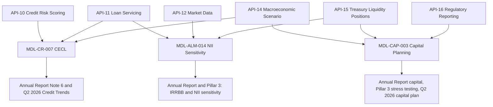

# Meridian Harbor Financial Corp. Overview

Meridian Harbor Financial Corp. ("MHFC", "the Firm") is a **fictional** financial holding company headquartered in Charlotte Bay, NC, incorporated under Delaware law, with operations in 31 countries. Every source document is marked as a synthetic proof-of-concept document: names, figures and events are invented. This wiki is a knowledge graph of a document corpus (three reports, three Excel models rendered as text, and one API reference). It is not a software codebase.

The central idea of the corpus is a single chain of lineage: **governed Developer Platform APIs feed Tier 1 risk models, and those models produce the amounts and metrics disclosed in the reports.** The 2025 Annual Report's shareholder letter says the APIs "are also the governed data feeds for our most important risk models" (Annual Report, p. 4). For the full chain see [API to model to report lineage](workflows/api-to-model-to-report-lineage.md); for routing see [Quickstart](quickstart.md); for the entity page of the bank see [Meridian Harbor Financial Corp.](organizations/meridian-harbor-financial-corp.md).

## The bank in numbers (fiscal year 2025)

All figures are from the [2025 Annual Report](reports/annual-report-2025.md) (published February 2026) and are as of or for the year ended December 31, 2025, in USD.

| Item | Value |
|---|---|
| Total net revenue | $86,100 million (up 5.2%) |
| Net interest income | $48,620 million (up 3.6%) |
| Net income | $24,960 million (up 6.8%) |
| Diluted EPS | $16.93 |
| ROTCE | 26.4% |
| Total assets (Dec 31, 2025) | $1,418,560 million |
| Loans / Deposits (Dec 31, 2025) | $742,300 million / $1,012,400 million |
| Allowance for loan losses (Dec 31, 2025) | $15,920 million, 2.14% of loans |
| CET1 ratio (Standardized, Dec 31, 2025) | 15.1% versus a 10.2% requirement and a ~13.0% management target |
| Supplementary leverage ratio | 6.1% |
| LCR (average, Q4 2025) / NSFR | 116% / 128% |
| Headcount | 214,600 |

The 10.2% CET1 requirement is the sum of the 4.5% regulatory minimum, a 3.2% stress capital buffer (effective October 1, 2025) and a 2.5% G-SIB surcharge, with a 0% countercyclical buffer. See [CET1 ratio](metrics/cet1-ratio.md), [Net interest income](metrics/net-interest-income.md), [Net income and EPS](metrics/net-income-and-eps.md), [Allowance for credit losses](metrics/allowance-for-credit-losses.md), [Liquidity coverage ratio](metrics/liquidity-coverage-ratio.md), [Net stable funding ratio](metrics/net-stable-funding-ratio.md), [Supplementary leverage ratio](metrics/supplementary-leverage-ratio.md), [Risk-weighted assets](metrics/risk-weighted-assets.md), [Net charge-offs](metrics/net-charge-offs.md) and [Value at risk](metrics/value-at-risk.md).

## Segments

MHFC reports three business segments plus a Corporate segment. Segment figures below are FY2025 net revenue and net income in USD millions, from Annual Report p. 9.

| Segment | Net revenue | Net income | ROE | Page |
|---|---|---|---|---|
| Consumer & Community Banking (CCB) | 40,800 | 12,300 | 30% | [CCB](organizations/consumer-community-banking.md) |
| Commercial & Investment Bank (CIB) | 32,450 | 10,180 | 18% | [CIB](organizations/commercial-investment-bank.md) |
| Asset & Wealth Management (AWM) | 13,180 | 3,580 | 32% | [AWM](organizations/asset-wealth-management.md) |
| Corporate (Treasury/CIO and Other Corporate) | (330) | (1,100) | NM | [Corporate](organizations/corporate.md) |
| **Total Firm** | **86,100** | **24,960** | **21%** | |

- CCB serves 74 million customers through 4,180 branches and 15,900 ATMs; consumer account and transaction data is served through the Accounts and Transactions APIs.
- CIB was formed by combining corporate and investment banking with commercial banking in January 2025; Markets revenue was a record $17.9 billion and investment banking fees were $6,840 million.
- AWM had client assets of $3,180 billion and assets under management of $2,140 billion at December 31, 2025.
- Corporate (Treasury/CIO) manages liquidity, funding, capital, and structural interest rate and FX risk, and **owns the NII Sensitivity and Capital Planning models** (Annual Report, p. 11).

## The three reports

| Report | Period / date | What it contributes |
|---|---|---|
| [2025 Annual Report](reports/annual-report-2025.md) | FY ended Dec 31, 2025; published February 2026 | Results, segments, balance sheet, capital, liquidity, credit, market risk, the model inventory table and the Developer Platform description. The seed document for this wiki. |
| [Q2 2026 Earnings Supplement](reports/q2-2026-earnings-supplement.md) | Quarter ended June 30, 2026; released July 14, 2026 | Latest results, credit trends, the capital plan produced by MDL-CAP-003 from June 30, 2026 starting capital, outlook, and API usage statistics. |
| [2025 Pillar 3 Disclosures](reports/pillar3-disclosures-2025.md) | As of Dec 31, 2025; published March 2026 | Basel III regulatory capital disclosures: capital structure, IRRBB methodology, liquidity, stress testing, model validation findings and the API-to-model lineage table (Section 15). |

Headline Q2 2026 figures (Earnings Supplement, quarter ended June 30, 2026): net income $6.54 billion, diluted EPS $4.48, revenue $22.48 billion (up 5.4% year-on-year), Standardized CET1 ratio 15.1%, allowance for loan losses $16.38 billion or 2.15% of period-end loans, and an updated full-year 2026 NII outlook of approximately $50.5 billion (up from approximately $50.2 billion in the Annual Report).

The reports cross-reference each other deliberately: the Annual Report defers the latest capital projection to the Q2 2026 supplement, defers CET1 composition to Pillar 3, and the supplement defers year-end allowance by segment and scenario sensitivity to Note 6 of the Annual Report.

## The three Tier 1 models

MHFC's model inventory holds approximately 2,900 models; three Tier 1 models "directly drive amounts and metrics disclosed" in the Annual Report (Annual Report, p. 20). All three are validated independently by Model Risk Governance & Review (MRGR) under the Firm's SR 11-7-aligned Model Risk Policy. See [Model risk (SR 11-7)](concepts/model-risk-sr-11-7.md).

| Model | Owner | Upstream APIs | Last validated | Purpose |
|---|---|---|---|---|
| [MDL-ALM-014 NII Sensitivity](models/nii-sensitivity-model.md) | Corporate Treasury - Asset & Liability Management | API-12, API-15, API-11 | 2025-09-18 | 12-month NII under parallel rate shocks, plus EVE for IRRBB |
| [MDL-CR-007 CECL Lifetime Expected Credit Loss](models/cecl-allowance-model.md) | Consumer & Wholesale Credit Risk - Allowance Methodology | API-10, API-11, API-14 | 2025-11-04 | Allowance under ASC 326 using weighted scenarios and PD x LGD x EAD |
| [MDL-CAP-003 Capital Planning & Stress Projection](models/capital-planning-model.md) | Corporate Treasury - Capital Management | API-16, API-14, API-15 | 2026-02-27 | Nine-quarter CET1, RWA and ratio projection under baseline and severely adverse paths |

Key results the models produce:

- **NII sensitivity (Dec 31, 2025):** base-case 12-month NII of $50,237 million; +100 bp gives +$1,508 million (3.0%), +200 bp gives +$3,017 million (6.0%), -100 bp gives -$1,508 million (-3.0%), -200 bp gives -$3,017 million (-6.0%), inside the Board limit of a 7.0% decline. The Firm is asset-sensitive. The base figure matches the approximately $50.2 billion 2026 NII outlook, not 2025 reported NII of $48,620 million, because it is a forward 12-month projection. Deposit betas are 0.45 (consumer interest-bearing) and 0.75 (wholesale interest-bearing). See [parallel rate shocks](scenarios/parallel-rate-shocks.md), [IRRBB](concepts/irrbb.md) and [economic value of equity](concepts/economic-value-of-equity.md).
- **CECL allowance (Dec 31, 2025):** modeled $15,239 million plus a qualitative overlay of $681 million gives $15,920 million. Scenario weights are Upside 20%, Baseline 50%, Downside 30%; weights were unchanged at June 30, 2026. A 100% downside weight would raise the allowance to about $20.2 billion, $4.2 billion higher. See [CECL](concepts/cecl.md) and [MSC-2025Q4 scenarios](scenarios/macro-scenarios-msc-2025q4.md).
- **Capital plan (June 30, 2026 start):** baseline CET1 reaches 16.15% by 3Q28 after $27.0 billion of buybacks; severely adverse minimum CET1 is 12.90% (peak-to-trough decline of 2.24%); indicative SCB is 3.18% against a preliminary supervisory 3.2%. See [stress capital buffer](concepts/stress-capital-buffer.md), [G-SIB surcharge](concepts/gsib-surcharge.md) and the [internal severely adverse scenario](scenarios/internal-severely-adverse.md).

Component pages explain individual calculation steps: [repricing and deposit betas](models/components/nii-repricing-and-deposit-betas.md), [rate-shock projection](models/components/nii-rate-shock-projection.md), [EVE modified duration](models/components/eve-modified-duration.md), [scenario weighting](models/components/cecl-scenario-weighting.md), [lifetime PD](models/components/cecl-lifetime-pd.md), [LGD and EAD](models/components/cecl-lgd-and-ead.md), [qualitative overlay](models/components/cecl-qualitative-overlay.md), [baseline projection](models/components/capital-baseline-projection.md), [stress projection](models/components/capital-stress-projection.md) and [indicative SCB](models/components/indicative-stress-capital-buffer.md).

## The 18 Developer Platform APIs

The Developer Platform exposes versioned REST APIs (Developer Platform API Reference v3.6, July 2026, owner Developer Platform Engineering) to three audiences: internal applications, external clients and partners, and internal risk and finance processes including Tier 1 models and regulatory reporting. In 2025 it handled an average of 4.0 billion calls per month at 99.97% availability; in Q2 2026 it handled 4.4 billion calls per month at 99.98%. See the [Developer Platform overview](apis/developer-platform-overview.md).

| Group | APIs |
|---|---|
| Retail and servicing | [API-01 Accounts](apis/api-01-accounts-api.md), [API-02 Transactions](apis/api-02-transactions-api.md), [API-17 Statements & Documents](apis/api-17-statements-documents-api.md) |
| Payments and cards | [API-03 Payments Initiation](apis/api-03-payments-initiation-api.md), [API-04 Real-Time Payments](apis/api-04-real-time-payments-api.md), [API-05 Wire Transfer](apis/api-05-wire-transfer-api.md), [API-06 Card Management](apis/api-06-card-management-api.md) |
| Identity and fraud | [API-07 Customer Identity & KYC](apis/api-07-customer-identity-kyc-api.md), [API-08 Fraud Risk Signals](apis/api-08-fraud-risk-signals-api.md) |
| Credit | [API-09 Credit Decisioning](apis/api-09-credit-decisioning-api.md), [API-10 Credit Risk Scoring](apis/api-10-credit-risk-scoring-api.md), [API-11 Loan Servicing](apis/api-11-loan-servicing-api.md) |
| Markets, treasury, finance | [API-12 Market Data](apis/api-12-market-data-api.md), [API-13 FX Rates](apis/api-13-fx-rates-api.md), [API-14 Macroeconomic Scenario](apis/api-14-macroeconomic-scenario-api.md), [API-15 Treasury Liquidity Positions](apis/api-15-treasury-liquidity-positions-api.md), [API-16 Regulatory Reporting](apis/api-16-regulatory-reporting-api.md) |
| Platform | [API-18 Webhooks & Event Notifications](apis/api-18-webhooks-event-notifications-api.md) |

Platform-wide conventions: OAuth 2.0 (client-credentials with mutual TLS for server-to-server, authorization-code with PKCE for customers), 15-minute JWT access tokens, major version in the path (for example `/accounts/v3`), cursor pagination, and an `Idempotency-Key` header on money-moving or resource-creating POSTs. The restricted risk and finance APIs (API-10, API-14, API-15, API-16) are reachable only on the private internal environment.

**Critical data services.** APIs that feed Tier 1 models or regulatory reports are classified as critical data services under the BCBS 239 program, with named data owners, data-quality rules and enhanced change management. The Annual Report names API-10, API-11, API-12, API-14, API-15 and API-16; the API Reference adds that a breaking change automatically triggers a model change review by MRGR. See [BCBS 239](concepts/bcbs-239.md).

## How the corpus fits together

The diagram shows each Tier 1 model's registered upstream APIs and the report sections that disclose its outputs, as stated in the Annual Report model table (p. 20) and Pillar 3 Sections 14 and 15.

Other lineage facts worth knowing:

- API-13 FX Rates and API-12 Market Data price trading positions and feed VaR (Annual Report: average 95% 1-day VaR of $50 million in 2025); both are BCBS 239 critical data elements.
- API-15 aggregates liquidity positions daily and also supports the LCR and NSFR calculators (Pillar 3, Section 12).
- API-16 supplies regulatory capital, RWA and leverage exposure to MDL-CAP-003, the FR Y-9C and Pillar 3. Its migration, with API-14, to the strategic data platform is credited in the Q2 2026 supplement with cutting scenario load time for the CECL and capital models from six hours to under forty minutes.
- API-09 Credit Decisioning (combining API-08 fraud signals) is only indirectly related to MDL-CR-007 (Pillar 3 describes it as "indirect"), and API-08 feeds operational risk loss data.
- Where a number appears in both a report and a model, the sources agree: for example the $15,920 million allowance in Annual Report Note 6 is quoted as the output of the CECL model's `Allowance_Summary` sheet, and the NII shock results in the Annual Report, Pillar 3 and Q2 supplement are all produced by the NII model.

### Reading order

1. Start here, then [Quickstart](quickstart.md) for folder-level routing.
2. Follow [API to model to report lineage](workflows/api-to-model-to-report-lineage.md) for question types like "which APIs feed the CECL model?".
3. Go to a model page for inputs, calculation and outputs, then to the metric or concept page for the disclosed number and its governing framework.

## Governance and people

- The Chief Executive Officer and Chairman is Eleanor V. Ashcombe; the Chief Risk Officer is Dana K. Whitfield (reports to the CEO and the Board Risk Committee); the Chief Technology Officer is Marcus O. Lindqvist, who oversees the Developer Platform.
- The Capital Governance Committee, chaired by the Chief Financial Officer, oversees capital planning and the CCAR submission. MRGR reports to the Chief Risk Officer.
- Tier 1 models require annual independent validation, ongoing performance monitoring and approval by the Firmwide Model Risk Committee. MRGR's 2025 findings were: a medium finding on MDL-CR-007 (no explicit model for unfunded commitments, remediated through an interim overlay), a medium finding on MDL-ALM-014 (deposit betas held constant across shock sizes, with the quarterly dynamic simulation as compensating control), and nothing above low severity for MDL-CAP-003.

## Caveats when using the corpus

- The bank is fictional; do not import outside knowledge about real banks.
- Figures are quoted with their as-of dates because the corpus spans several: Dec 31, 2025 (Annual Report and Pillar 3), June 30, 2026 (Q2 supplement and the current capital plan), and July 2026 (API Reference).
- Model sensitivities (NII shocks, scenario-weight sensitivities) are static or hold the overlay constant and are not management forecasts.

## Relationships

- is parent of: [Consumer & Community Banking](organizations/consumer-community-banking.md), [Commercial & Investment Bank](organizations/commercial-investment-bank.md), [Asset & Wealth Management](organizations/asset-wealth-management.md), [Corporate](organizations/corporate.md)
- described by: [Meridian Harbor Financial Corp. (entity page)](organizations/meridian-harbor-financial-corp.md)
- discloses results in: [2025 Annual Report](reports/annual-report-2025.md), [Q2 2026 Earnings Supplement](reports/q2-2026-earnings-supplement.md), [2025 Pillar 3 Disclosures](reports/pillar3-disclosures-2025.md)
- operates model: [MDL-ALM-014 NII Sensitivity](models/nii-sensitivity-model.md), [MDL-CR-007 CECL Allowance](models/cecl-allowance-model.md), [MDL-CAP-003 Capital Planning](models/capital-planning-model.md)
- operates platform: [Developer Platform overview](apis/developer-platform-overview.md) (18 APIs, API-01 to API-18)
- governed by: [Model risk (SR 11-7)](concepts/model-risk-sr-11-7.md), [BCBS 239](concepts/bcbs-239.md), [Basel III Pillar 3](concepts/basel-iii-pillar-3.md)
- measures: [CET1 ratio](metrics/cet1-ratio.md), [Net interest income](metrics/net-interest-income.md), [Allowance for credit losses](metrics/allowance-for-credit-losses.md)
- see also: [Quickstart](quickstart.md), [API to model to report lineage](workflows/api-to-model-to-report-lineage.md)
