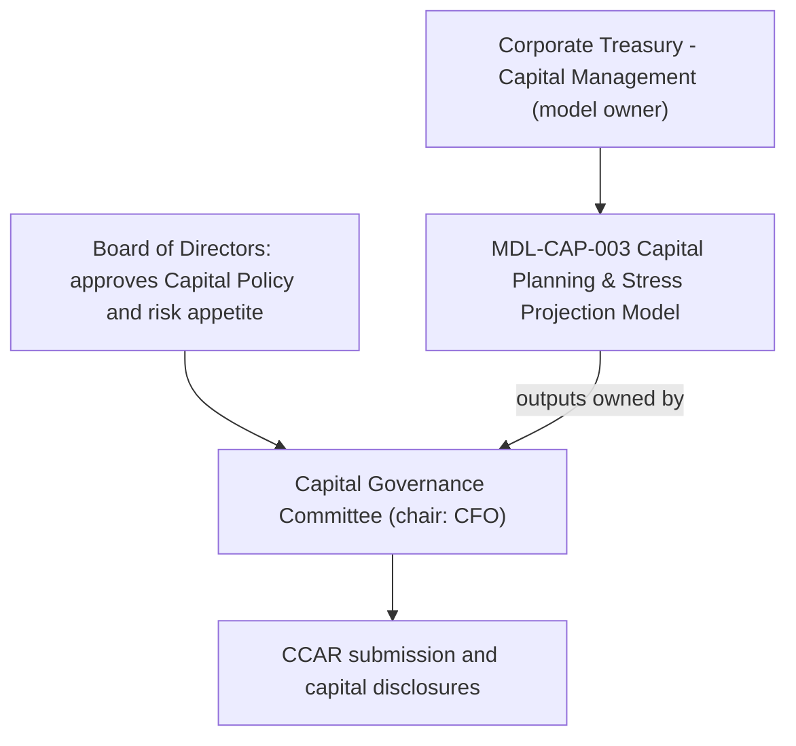

# Chief Financial Officer

The Chief Financial Officer (CFO) of Meridian Harbor Financial Corp. (a synthetic institution) is documented in the sources only through one role: **chair of the Capital Governance Committee**. No source states the CFO's name, tenure or reporting line, so this page describes the role and does not name a person.

## Name: not given in the sources

<!-- openwiki: broken internal link [../../sources/reports/mhfc-2025-annual-report.md#L283] heading anchor "L283" does not exist in "../../sources/reports/mhfc-2025-annual-report.md". Fix the href or restore the target, then delete this comment. -->
- The 2025 Annual Report refers only to "the Chief Financial Officer" ([Annual Report](../../sources/reports/mhfc-2025-annual-report.md#L283)).
- A full-text search of the three report sources found no other mention of the title. "CFO" does not appear at all.
<!-- openwiki: broken internal link [../../sources/reports/mhfc-q2-2026-earnings-supplement.md#L438] heading anchor "L438" does not exist in "../../sources/reports/mhfc-q2-2026-earnings-supplement.md". Fix the href or restore the target, then delete this comment. -->
- The Q2 2026 earnings-call Q&A has a speaker, Rajiv N. Castellano, who answers deposit-pricing and capital-deployment questions. The sources give no title for him ([earnings supplement](../../sources/reports/mhfc-q2-2026-earnings-supplement.md#L438)). Do not assume he is the CFO.
- The CEO page makes the same point; see [Chief Executive Officer](chief-executive-officer.md).

## Responsibilities

<!-- openwiki: broken internal link [../../sources/reports/mhfc-2025-pillar3-disclosures.md#L85] heading anchor "L85" does not exist in "../../sources/reports/mhfc-2025-pillar3-disclosures.md". Fix the href or restore the target, then delete this comment. -->
The CFO's documented authority comes from chairing the **Capital Governance Committee**. That committee is one of the management committees listed in the Pillar 3 disclosures ([Pillar 3](../../sources/reports/mhfc-2025-pillar3-disclosures.md#L85)). It:

- oversees capital planning;
- oversees the Comprehensive Capital Analysis and Review (CCAR) submission;
- oversees contingency capital planning (Annual Report); the Pillar 3 report words this as the capital plan and capital actions;
- owns the outputs of the Capital Planning & Stress Projection Model (MDL-CAP-003).

## Position in capital governance

Caption: the Board sets policy and appetite. The committee the CFO chairs oversees how the plan is produced and submitted. Corporate Treasury - Capital Management owns and runs the model.

Three separate roles should not be conflated:

- **Board of Directors.** It approves the Capital Policy and risk appetite. The committee oversees planning within that framework.
- **Model owner.** MDL-CAP-003 is owned by Corporate Treasury - Capital Management. The committee owns the model's *outputs*, not the workbook. Independent validation sits with Model Risk Governance & Review.
- **Board Capital Committee.** The model's inputs show a distribution plan and a 13.00% management CET1 target attributed to this body ([Capital Planning Model](../models/capital-planning-model.md)). The sources keep it separate from the management-level Capital Governance Committee, and they do not say how the two interact.

## What the committee oversees

<!-- openwiki: broken internal link [../../sources/reports/mhfc-2025-annual-report.md#L307] heading anchor "L307" does not exist in "../../sources/reports/mhfc-2025-annual-report.md". Fix the href or restore the target, then delete this comment. -->
The committee's subject matter is the output of [MDL-CAP-003](../models/capital-planning-model.md). The model is re-run each quarter with updated starting capital, RWA and scenario paths ([Annual Report](../../sources/reports/mhfc-2025-annual-report.md#L307)). Its main outputs are:

- **Baseline path.** Starting CET1 ratio of 15.14% at Q2 2026, rising to 16.15% by Q3 2028 after planned dividends and buybacks.
- **Severely adverse path.** Buybacks are suspended and dividends held flat. The minimum CET1 ratio is 12.90%, above the 10.20% requirement but below the 13.00% management target.
<!-- openwiki: broken internal link [../../sources/reports/mhfc-q2-2026-earnings-supplement.md#L81] heading anchor "L81" does not exist in "../../sources/reports/mhfc-q2-2026-earnings-supplement.md". Fix the href or restore the target, then delete this comment. -->
- **Indicative stress capital buffer (SCB).** 3.18%, against the current 3.2%. The Federal Reserve's preliminary 2026 SCB, received June 27, 2026, is expected to leave the firm's SCB at 3.2% from October 1, 2026 ([earnings supplement](../../sources/reports/mhfc-q2-2026-earnings-supplement.md#L81)).

<!-- openwiki: broken internal link [../../sources/reports/mhfc-2025-annual-report.md#L301] heading anchor "L301" does not exist in "../../sources/reports/mhfc-2025-annual-report.md". Fix the href or restore the target, then delete this comment. -->
The firm's CET1 requirement of 10.2% is the sum of the 4.5% minimum, the 3.2% SCB and the 2.5% G-SIB surcharge. Management targets about 13.0% ([Annual Report](../../sources/reports/mhfc-2025-annual-report.md#L301)).

## Connection to earnings

Net income is the main driver of CET1 growth, offset by dividends and repurchases. In 2025 it was the main source of the $5.3 billion rise in CET1 capital, offset by $6.1 billion of common dividends, $11.0 billion of repurchases and $1.1 billion of preferred dividends. See [Net Income and EPS](../metrics/net-income-and-eps.md). That is why the capital committee's remit, covering distributions and capital actions, interacts directly with reported earnings.

<!-- openwiki: broken internal link [../../sources/reports/mhfc-q2-2026-earnings-supplement.md#L456] heading anchor "L456" does not exist in "../../sources/reports/mhfc-q2-2026-earnings-supplement.md". Fix the href or restore the target, then delete this comment. -->
On the Q2 2026 call, an unnamed-title executive said the capital model shows excess capital building, but management is cautious because the final capital rules are uncertain. They would revisit the buyback pace after the final SCB is confirmed in August ([earnings supplement](../../sources/reports/mhfc-q2-2026-earnings-supplement.md#L456)). The sources do not say whether the CFO gave that answer.

## Gaps and cautions

- No name, appointment date, biography, or direct reports are given.
- The committee's membership, meeting cadence and escalation path are not described.
- The sources do not say what action is required if the model's pass/fail check returns "NO - capital action required". They say only that the committee oversees capital actions and contingency capital planning.

## Related pages

- [Chief Executive Officer](chief-executive-officer.md)
- [Capital Planning & Stress Projection Model (MDL-CAP-003)](../models/capital-planning-model.md)
- [Net Income and EPS](../metrics/net-income-and-eps.md)
- [Meridian Harbor Financial Corp.](../organizations/meridian-harbor-financial-corp.md)
