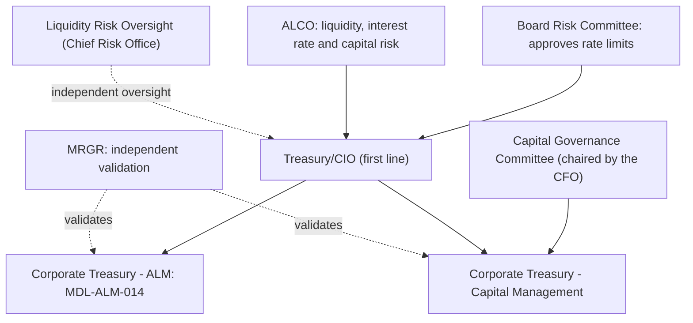

# Treasurer

<!-- openwiki: broken internal link [../../sources/api_docs/mhfc-developer-platform-api-reference.md#L16] heading anchor "L16" does not exist in "../../sources/api_docs/mhfc-developer-platform-api-reference.md". Fix the href or restore the target, then delete this comment. -->
**The sources do not name a Treasurer and do not use the title.** A search of the three reports (2025 Annual Report, 2025 Pillar 3 Disclosures, Q2 2026 Earnings Supplement) finds no "Treasurer". The only appearance of the word in the corpus is in the Developer Platform API reference, which lists "corporate treasurers" as external clients of the APIs. Those are customers, not Meridian Harbor staff ([API reference](../../sources/api_docs/mhfc-developer-platform-api-reference.md#L16)). This wiki therefore does not name a person. It describes the function the role would lead, which the sources call **Treasury/CIO**.

## What the sources do and do not say

<!-- openwiki: broken internal link [../../sources/reports/mhfc-2025-annual-report.md#L249] heading anchor "L249" does not exist in "../../sources/reports/mhfc-2025-annual-report.md". Fix the href or restore the target, then delete this comment. -->
<!-- openwiki: broken internal link [../../sources/reports/mhfc-2025-annual-report.md#L443-L445] heading anchor "L443-L445" does not exist in "../../sources/reports/mhfc-2025-annual-report.md". Fix the href or restore the target, then delete this comment. -->
- **No named head of Treasury/CIO.** The sources describe the function and its two sub-teams, Corporate Treasury - Asset & Liability Management and Corporate Treasury - Capital Management. They name no individual who leads them ([Annual Report](../../sources/reports/mhfc-2025-annual-report.md#L249); [Annual Report model inventory](../../sources/reports/mhfc-2025-annual-report.md#L443-L445)).
<!-- openwiki: broken internal link [../../sources/reports/mhfc-2025-annual-report.md#L57] heading anchor "L57" does not exist in "../../sources/reports/mhfc-2025-annual-report.md". Fix the href or restore the target, then delete this comment. -->
<!-- openwiki: broken internal link [../../sources/reports/mhfc-2025-pillar3-disclosures.md#L58] heading anchor "L58" does not exist in "../../sources/reports/mhfc-2025-pillar3-disclosures.md". Fix the href or restore the target, then delete this comment. -->
<!-- openwiki: broken internal link [../../sources/reports/mhfc-2025-annual-report.md#L457] heading anchor "L457" does not exist in "../../sources/reports/mhfc-2025-annual-report.md". Fix the href or restore the target, then delete this comment. -->
- **Named executives are few.** The reports name three executives with titles. They are Eleanor V. Ashcombe (Chairman and CEO), Dana K. Whitfield (Chief Risk Officer) and Marcus O. Lindqvist (Chief Technology Officer) ([Annual Report, p. 1](../../sources/reports/mhfc-2025-annual-report.md#L57); [Pillar 3](../../sources/reports/mhfc-2025-pillar3-disclosures.md#L58); [Annual Report](../../sources/reports/mhfc-2025-annual-report.md#L457)). See [Chief Executive Officer](chief-executive-officer.md) and [Chief Risk Officer](chief-risk-officer.md).
<!-- openwiki: broken internal link [../../sources/reports/mhfc-q2-2026-earnings-supplement.md#L436-L456] heading anchor "L436-L456" does not exist in "../../sources/reports/mhfc-q2-2026-earnings-supplement.md". Fix the href or restore the target, then delete this comment. -->
- **Untitled speakers on the Q2 2026 call.** The analyst Q&A attributes answers to Rajiv N. Castellano (deposit betas, capital deployment) and Helen T. Mbeki (NII sensitivity, securities duration). Neither is given a title ([Q2 2026 Supplement, p. 18](../../sources/reports/mhfc-q2-2026-earnings-supplement.md#L436-L456)). Their topics fall within Treasury/CIO's remit. That overlap is not evidence of a title, so do not read either as the Treasurer.
<!-- openwiki: broken internal link [../../sources/reports/mhfc-2025-annual-report.md#L283] heading anchor "L283" does not exist in "../../sources/reports/mhfc-2025-annual-report.md". Fix the href or restore the target, then delete this comment. -->
- **The Chief Financial Officer is also unnamed.** The CFO chairs the Capital Governance Committee ([Annual Report](../../sources/reports/mhfc-2025-annual-report.md#L283)). See [Chief Financial Officer](chief-financial-officer.md).

## The function: Treasury/CIO

<!-- openwiki: broken internal link [../../sources/reports/mhfc-2025-annual-report.md#L98] heading anchor "L98" does not exist in "../../sources/reports/mhfc-2025-annual-report.md". Fix the href or restore the target, then delete this comment. -->
<!-- openwiki: broken internal link [../../sources/reports/mhfc-2025-annual-report.md#L249] heading anchor "L249" does not exist in "../../sources/reports/mhfc-2025-annual-report.md". Fix the href or restore the target, then delete this comment. -->
Treasury and the Chief Investment Office (Treasury/CIO) sit in the **Corporate** segment, alongside Other Corporate. Treasury/CIO manages the Firm's liquidity, funding, capital, and structural interest rate and foreign exchange risks, and the investment securities portfolio ([Annual Report](../../sources/reports/mhfc-2025-annual-report.md#L98); [Annual Report](../../sources/reports/mhfc-2025-annual-report.md#L249)). The full segment profile is on the [Corporate (Treasury/CIO)](../organizations/corporate.md) page.

| Responsibility | How the sources describe it |
|---|---|
<!-- openwiki: broken internal link [../../sources/reports/mhfc-2025-annual-report.md#L319] heading anchor "L319" does not exist in "../../sources/reports/mhfc-2025-annual-report.md". Fix the href or restore the target, then delete this comment. -->
| Liquidity | Treasury/CIO is responsible for liquidity risk management. The Chief Risk Office's Liquidity Risk Oversight function provides independent oversight ([Annual Report](../../sources/reports/mhfc-2025-annual-report.md#L319)). |
<!-- openwiki: broken internal link [../../sources/reports/mhfc-2025-annual-report.md#L413] heading anchor "L413" does not exist in "../../sources/reports/mhfc-2025-annual-report.md". Fix the href or restore the target, then delete this comment. -->
| Structural interest rate risk | It is managed through the investment securities portfolio and interest rate derivatives, within limits approved by the Board Risk Committee ([Annual Report](../../sources/reports/mhfc-2025-annual-report.md#L413)). The earnings-at-risk measure is the Net Interest Income Sensitivity Model, MDL-ALM-014. |
<!-- openwiki: broken internal link [../../sources/reports/mhfc-q2-2026-earnings-supplement.md#L246] heading anchor "L246" does not exist in "../../sources/reports/mhfc-q2-2026-earnings-supplement.md". Fix the href or restore the target, then delete this comment. -->
| Capital | Treasury/CIO manages capital distributions within the plan produced by the Capital Planning & Stress Projection Model, MDL-CAP-003 ([Q2 2026 Supplement](../../sources/reports/mhfc-q2-2026-earnings-supplement.md#L246)). |
<!-- openwiki: broken internal link [../../sources/reports/mhfc-2025-annual-report.md#L130] heading anchor "L130" does not exist in "../../sources/reports/mhfc-2025-annual-report.md". Fix the href or restore the target, then delete this comment. -->
<!-- openwiki: broken internal link [../../sources/reports/mhfc-q2-2026-earnings-supplement.md#L244] heading anchor "L244" does not exist in "../../sources/reports/mhfc-q2-2026-earnings-supplement.md". Fix the href or restore the target, then delete this comment. -->
| Investment securities | In 2025 it repositioned the available-for-sale portfolio to extend duration ahead of expected rate cuts. In 2026 it reinvests maturing securities at higher yields ([Annual Report](../../sources/reports/mhfc-2025-annual-report.md#L130); [Q2 2026 Supplement](../../sources/reports/mhfc-q2-2026-earnings-supplement.md#L244)). |
<!-- openwiki: broken internal link [../../sources/reports/mhfc-2025-annual-report.md#L249] heading anchor "L249" does not exist in "../../sources/reports/mhfc-2025-annual-report.md". Fix the href or restore the target, then delete this comment. -->
| Model ownership | Treasury/CIO owns MDL-ALM-014 and MDL-CAP-003 ([Annual Report](../../sources/reports/mhfc-2025-annual-report.md#L249)). |

### Governance and oversight

<!-- openwiki: broken internal link [../../sources/reports/mhfc-2025-pillar3-disclosures.md#L60] heading anchor "L60" does not exist in "../../sources/reports/mhfc-2025-pillar3-disclosures.md". Fix the href or restore the target, then delete this comment. -->
- Treasury/CIO is in the **first line of defense**. It owns the risks it generates. Independent Risk Management and Compliance set appetite and limits, and Internal Audit is the third line ([Pillar 3](../../sources/reports/mhfc-2025-pillar3-disclosures.md#L60)).
<!-- openwiki: broken internal link [../../sources/reports/mhfc-2025-pillar3-disclosures.md#L83-L85] heading anchor "L83-L85" does not exist in "../../sources/reports/mhfc-2025-pillar3-disclosures.md". Fix the href or restore the target, then delete this comment. -->
- The **Asset and Liability Committee (ALCO)** oversees liquidity, interest rate and capital risk and reviews NII Sensitivity Model outputs monthly. The **Capital Governance Committee** oversees the capital plan, the CCAR submission and capital actions, and owns MDL-CAP-003 outputs ([Pillar 3, committees](../../sources/reports/mhfc-2025-pillar3-disclosures.md#L83-L85)). The sources do not say whether a Treasurer sits on either committee.
<!-- openwiki: broken internal link [../../sources/reports/mhfc-q2-2026-earnings-supplement.md#L444] heading anchor "L444" does not exist in "../../sources/reports/mhfc-q2-2026-earnings-supplement.md". Fix the href or restore the target, then delete this comment. -->
- Rate positioning must stay within Board-approved limits. On the Q2 2026 call, a 200 bp decline was described as reducing NII by roughly 6% on a static basis, inside a 7% Board limit ([Q2 2026 Supplement](../../sources/reports/mhfc-q2-2026-earnings-supplement.md#L444)).

### Data the function depends on

<!-- openwiki: broken internal link [../../sources/reports/mhfc-2025-annual-report.md#L321] heading anchor "L321" does not exist in "../../sources/reports/mhfc-2025-annual-report.md". Fix the href or restore the target, then delete this comment. -->
<!-- openwiki: broken internal link [../../sources/reports/mhfc-2025-pillar3-disclosures.md#L439] heading anchor "L439" does not exist in "../../sources/reports/mhfc-2025-pillar3-disclosures.md". Fix the href or restore the target, then delete this comment. -->
<!-- openwiki: broken internal link [../../sources/reports/mhfc-2025-annual-report.md#L457] heading anchor "L457" does not exist in "../../sources/reports/mhfc-2025-annual-report.md". Fix the href or restore the target, then delete this comment. -->
The Treasury Liquidity Positions API (API-15) publishes intraday cash, collateral and HQLA positions daily across all legal entities. It feeds liquidity stress testing, the LCR and NSFR calculators, and both Treasury/CIO models ([Annual Report](../../sources/reports/mhfc-2025-annual-report.md#L321); [Pillar 3](../../sources/reports/mhfc-2025-pillar3-disclosures.md#L439)). It is classed as a critical data service with enhanced change management ([Annual Report](../../sources/reports/mhfc-2025-annual-report.md#L457)).

## Relationships

- leads (function, role unnamed in sources): [Corporate (Treasury/CIO)](../organizations/corporate.md)
- related team: [Corporate Treasury - Asset & Liability Management](../teams/corporate-treasury-alm.md)
- related roles: [Chief Financial Officer](chief-financial-officer.md), [Chief Risk Officer](chief-risk-officer.md), [Chief Executive Officer](chief-executive-officer.md)
