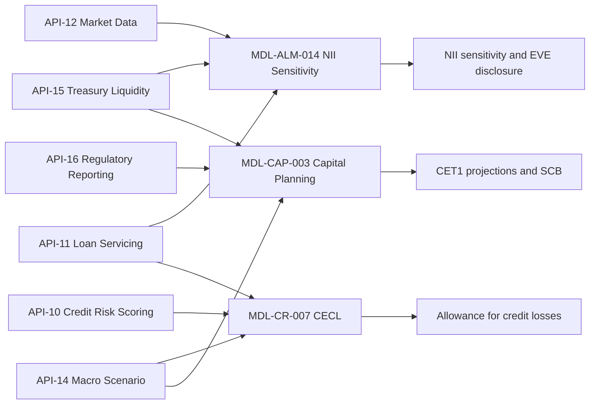

# 2025 Annual Report

The 2025 Annual Report of [Meridian Harbor Financial Corp.](../organizations/meridian-harbor-financial-corp.md) (MHFC) is a "Form 10-K style" disclosure for the fiscal year ended December 31, 2025, published February 2026 (p. 1). It is a **synthetic document** for a proof of concept: the firm, names, figures and events are fictional (p. 1, p. 27). The source was converted from `raw/reports/MHFC_2025_Annual_Report.pdf` to Markdown with `<!-- page N -->` markers; the page numbers cited below follow those markers. The Contents table on pp. 2-3 did not survive conversion (it is empty), so the structure below is reconstructed from the section headings.

Beyond being a financial report, the document is notable for how it ties disclosed numbers to named **models** (`MDL-*`) and the **Developer Platform APIs** (`API-NN`) that feed them. That linkage is the main reason to read it alongside the model and API pages in this wiki.

## Structure at a glance

| Section | Pages | What it contains |
|---|---|---|
| Cover, Contents | 1-3 | Title, publication date, synthetic-document disclaimer; empty contents table |
| Letter to Shareholders | 4-5 | Narrative of 2025, signed by Chairman and CEO Eleanor V. Ashcombe (see [Chief Executive Officer](../people/chief-executive-officer.md)) |
| Financial Highlights | 6 | 2025 vs 2024 table of 20 headline metrics |
| Management's Discussion and Analysis | 7-8 | Executive overview, 2026 outlook, revenue, provision, expense, tax |
| Business Segment Results | 9-11 | CCB, CIB, AWM and Corporate |
| Balance Sheet Analysis | 12 | Selected balance sheet data |
| Capital Risk Management | 13-14 | Regulatory capital, requirements, CCAR/stress testing, capital actions |
| Liquidity Risk Management | 15 | LCR, NSFR, HQLA, funding, ratings |
| Credit Risk Management | 15-17 | Loan portfolio, allowance (CECL), scenario weights, sensitivity |
| Market Risk Management | 18-19 | VaR, IRRBB / NII sensitivity |
| Model Risk Management | 20 | Governance and the three Tier 1 models |
| Operational, Technology and Cybersecurity Risk | 20-21 | Developer Platform, cyber, fraud, resilience |
| Consolidated Financial Statements | 22-24 | Income statement, balance sheet, condensed cash flows |
| Notes | 25-26 | Notes 1, 2, 5, 6, 9, 11, 13, 18 (selected notes only; numbering is non-contiguous) |
| Glossary, Forward-Looking Statements | 27 | Term definitions and the safe-harbor statement |

## Letter to Shareholders (pp. 4-5)

The letter frames 2025 as a year of record revenue of $86.1 billion (+5.2%), net income of $25.0 billion, diluted EPS of $16.93 and ROTCE of 26.4% against a 17% through-the-cycle target. It cites a CET1 ratio of 15.1% versus a 10.2% requirement and a 13.0% management target, and $17.1 billion returned to shareholders (p. 4). It highlights:

- the January 2025 merger of corporate/investment banking with commercial banking into a single Commercial & Investment Bank, and real-time payments volume that more than doubled after the Real-Time Payments API was opened to corporate clients (p. 4);
- $16.8 billion of technology spend and a Developer Platform with **eighteen production APIs**, which the letter says are both client products and "the governed data feeds" for the models that set the allowance for credit losses, measure interest rate risk and project capital under stress (p. 4);
- 214,600 employees (p. 4).

## Headline metrics disclosed

Financial Highlights (p. 6) report, in millions unless noted, 2025 versus 2024:

| Metric | 2025 | 2024 |
|---|---|---|
| Total net revenue | 86,100 | 81,860 |
| Net interest income | 48,620 | 46,910 |
| Noninterest revenue | 37,480 | 34,950 |
| Noninterest expense | 47,260 | 45,580 |
| Provision for credit losses | 6,840 | 6,120 |
| Net income | 24,960 | 23,380 |
| Diluted EPS | $16.93 | $15.40 |
| ROE / ROTCE | 21.1% / 26.4% | 20.9% / 26.3% |
| Overhead ratio | 54.9% | 55.7% |
| CET1 ratio (Standardized) | 15.1% | 14.7% |
| Supplementary leverage ratio | 6.1% | 6.1% |
| Total assets | 1,418,560 | 1,362,240 |
| Loans / Deposits | 742,300 / 1,012,400 | 718,600 / 978,300 |
| Headcount | 214,600 | 211,900 |

Related metric pages: [CET1 ratio](../metrics/cet1-ratio.md), [net income and EPS](../metrics/net-income-and-eps.md), [net interest income](../metrics/net-interest-income.md), [allowance for credit losses](../metrics/allowance-for-credit-losses.md), [net charge-offs](../metrics/net-charge-offs.md), [liquidity coverage ratio](../metrics/liquidity-coverage-ratio.md), [net stable funding ratio](../metrics/net-stable-funding-ratio.md), [risk-weighted assets](../metrics/risk-weighted-assets.md), [supplementary leverage ratio](../metrics/supplementary-leverage-ratio.md) and [value at risk](../metrics/value-at-risk.md).

### MD&A and segments (pp. 7-11)

- The firm operates in 31 countries with three reportable segments - Consumer & Community Banking (CCB), Commercial & Investment Bank (CIB), Asset & Wealth Management (AWM) - plus Corporate, which houses Treasury/CIO (p. 7). Segment pages: [CCB](../organizations/consumer-community-banking.md), [CIB](../organizations/commercial-investment-bank.md), [AWM](../organizations/asset-wealth-management.md), [Corporate](../organizations/corporate.md).
- **2026 outlook:** net interest income of about $50.2 billion (assuming two more 25 bp policy cuts), adjusted noninterest expense of about $49.5 billion and a Card net charge-off rate of about 3.6%. The NII expectation is stated to be consistent with the base case of the Net Interest Income Sensitivity Model, MDL-ALM-014 (p. 7).
- The provision of $6.84 billion comprised $6.1 billion of net charge-offs and a $740 million reserve build, mainly in Card (p. 7-8).
- Segment results (net revenue / net income / ROE, $ millions): CCB 40,800 / 12,300 / 30%; CIB 32,450 / 10,180 / 18%; AWM 13,180 / 3,580 / 32%; Corporate (330) / (1,100) / NM (p. 9). Corporate owns the NII Sensitivity Model and the Capital Planning & Stress Projection Model (p. 11).
- Other segment facts: CCB serves 74 million customers through 4,180 branches and has a Card net charge-off rate of 3.4% (p. 9); CIB Markets revenue was a record $17.9 billion and Global Payments revenue $9.6 billion (p. 10); AWM had AUM of $2,140 billion and client assets of $3,180 billion (p. 10).

### Balance sheet and statements (pp. 12, 22-24)

Total assets rose 4.1% to $1,418.6 billion; loans grew 3.3%, deposits 3.5%, loan-to-deposit ratio 73% (p. 12). Total stockholders' equity was $128.7 billion (p. 12, p. 23). The condensed cash-flow statement shows $33.9 billion of operating cash flow and $17.1 billion of common dividends and repurchases (p. 24).

## Capital (pp. 13-14)

The Board approves the Capital Policy and risk appetite; the Capital Governance Committee, chaired by the CFO, oversees capital planning, CCAR and contingency planning (p. 13; see [Chief Financial Officer](../people/chief-financial-officer.md)). Key disclosures:

- CET1 capital $98.45 billion over Standardized RWA of $652.8 billion gives the 15.1% ratio; Tier 1 ratio 17.0%, total capital ratio 19.8%, SLR 6.1% (p. 13).
- The 10.2% CET1 requirement is the sum of the 4.5% minimum, a 3.2% stress capital buffer (effective Oct 1, 2025 through Sep 30, 2026) and a 2.5% G-SIB surcharge; the countercyclical buffer is zero. Management targets about 13.0% (p. 13). See [stress capital buffer](../concepts/stress-capital-buffer.md) and [G-SIB surcharge](../concepts/gsib-surcharge.md).
- Capital actions: $4.30 per share dividends ($6.1 billion), $11.0 billion of repurchases (38.3 million shares), and a new $30 billion buyback program authorized in June 2025 through 2028 (p. 14).

### Capital Planning & Stress Projection Model (MDL-CAP-003)

The report states the model projects CET1 capital, RWA and ratios over a nine-quarter horizon under baseline and severely adverse scenarios, is re-run quarterly, and yields (1) a baseline CET1 path after planned dividends and buybacks, (2) a severely adverse path with buybacks suspended and dividends held flat, and (3) an indicative SCB equal to the peak-to-trough decline plus four quarters of planned dividends over starting RWA, floored at 2.5% (p. 13). Inputs come from the Regulatory Reporting API (API-16) and Macroeconomic Scenario API (API-14) (p. 13); the model table also lists API-15 (p. 20). See [Capital Planning Model](../models/capital-planning-model.md).

## Liquidity (p. 15)

Treasury/CIO owns liquidity risk with oversight from the Chief Risk Office's Liquidity Risk Oversight function. Legal-entity liquidity is aggregated daily through the Treasury Liquidity Positions API (API-15), which feeds the liquidity stress engine and ALM models. Metrics: average Q4 LCR 116% (113% in 2024), NSFR 128%, average Q4 HQLA $286.0 billion. Funding is deposit-led, about 66% consumer and small-business; long-term debt is $86.7 billion with a 6.8-year weighted-average maturity. Ratings are Moody's Aa2, S&P A+ and Fitch AA (fictional) with stable outlooks (p. 15).

## Credit risk and the allowance (pp. 15-17)

- **Decisioning:** consumer credit decisions use scorecards exposed through the Credit Decisioning API (API-09), which combines bureau data, behavior scores and fraud signals from API-08; portfolio PD/LGD come from the Credit Risk Scoring API (API-10), which serves the CECL model, regulatory capital calculations and monitoring (p. 15).
- **Portfolio (p. 16):** loans of $742.3 billion, net charge-offs of $6.1 billion (0.82%), allowance $15.92 billion (2.14% of loans). Card is $138.4 billion with a 3.34% NCO rate and 6.24% coverage; residential mortgage is the largest book at $218.6 billion with a 0.02% NCO rate.
- **CECL model (MDL-CR-007):** estimates lifetime loss per portfolio segment as EAD x lifetime PD x LGD under three macro scenarios from API-14, weighted per the Scenario Committee (20% upside, 50% baseline, 30% downside), with loan balances and remaining lives from the Loan Servicing API (API-11), then adds qualitative adjustments. The model was validated by MRGR in November 2025 (p. 16). Modeled allowance is $15,239 million plus a net $681 million overlay (p. 17). See [CECL Allowance Model](../models/cecl-allowance-model.md) and [CECL](../concepts/cecl.md).
- **Sensitivity (p. 17):** 100% downside weight would raise the allowance by about $4.2 billion (to about $20.2 billion); 100% baseline would reduce it by about $1.4 billion, holding the overlay constant.

## Market risk and interest rate risk (pp. 18-19)

- Trading valuation uses the Market Data API (API-12) and FX Rates API (API-13), both designated critical data elements under BCBS 239 (p. 18; see [BCBS 239](../concepts/bcbs-239.md)). Average 95% 1-day total VaR was $50 million (min 37, max 71) with 3 backtesting exceptions, within the expected range (p. 18).
- **NII Sensitivity Model (MDL-ALM-014):** applies instantaneous parallel shocks to the year-end balance sheet and measures 12-month NII change, using deposit betas of 0.45 (consumer interest-bearing) and 0.75 (wholesale interest-bearing). Inputs: API-15 balances and rates, API-11 repricing profiles and API-12 yield curve (p. 18). Results: base NII $50,237 million; +100 bp adds $1,508 million (3.0%); -200 bp reduces it $3,017 million (6.0%), inside the Board limit of a 7.0% decline, so the firm is asset-sensitive; EVE falls 1.2% / 2.5% of Tier 1 for +100 / +200 bp (p. 18-19). Results exclude management actions and non-parallel moves, which the quarterly dynamic simulation covers (p. 19). See [NII Sensitivity Model](../models/nii-sensitivity-model.md), [IRRBB](../concepts/irrbb.md) and [EVE](../concepts/economic-value-of-equity.md).

## Model risk management (p. 20)

Model risk follows the Model Risk Policy, aligned with SR 11-7 and overseen by MRGR, which reports to the Chief Risk Officer ([Chief Risk Officer](../people/chief-risk-officer.md), [SR 11-7](../concepts/model-risk-sr-11-7.md)). Tier 1 models need annual independent validation, ongoing monitoring and Firmwide Model Risk Committee approval; upstream data feeds are registered in the model inventory, and a schema or business-logic change to an upstream API triggers a model change review. The inventory holds about 2,900 models, three of which are Tier 1 models directly driving figures in the report (p. 20):

| Model ID | Model | Owner | Upstream APIs | Last validated |
|---|---|---|---|---|
| MDL-ALM-014 | Net Interest Income Sensitivity Model | Corporate Treasury - ALM | API-12, API-15, API-11 | 2025-09-18 |
| MDL-CR-007 | CECL Lifetime Expected Credit Loss Model | Consumer & Wholesale Credit Risk - Allowance Methodology | API-10, API-11, API-14 | 2025-11-04 |
| MDL-CAP-003 | Capital Planning & Stress Projection Model | Corporate Treasury - Capital Management | API-16, API-14, API-15 | 2026-02-27 |

Upstream APIs feeding each Tier 1 model, and the disclosure each model drives, per the model table on p. 20.

## Operational, technology and cyber risk (pp. 20-21)

- The Developer Platform exposes 18 production APIs (API-01 to API-18) to internal applications, clients and approved third parties. They are versioned, authenticated with OAuth 2.0 (mutual TLS for server-to-server), rate-limited and monitored against SLOs; 2025 volume averaged 4.0 billion calls a month at 99.97% availability. The platform is overseen by CTO Marcus O. Lindqvist (p. 20; the glossary on p. 27 also states the 18-API count). See [Developer Platform overview](../apis/developer-platform-overview.md).
- APIs feeding Tier 1 models or regulatory reports - Credit Risk Scoring, Loan Servicing, Market Data, Macroeconomic Scenario, Treasury Liquidity Positions and Regulatory Reporting (API-10, 11, 12, 14, 15, 16) - are classed as **critical data services** with enhanced change management and data-quality controls (p. 20).
- Cyber spend exceeds $1 billion a year with more than 3,500 professionals and no material incident in 2025 (p. 20-21). Real-time fraud scoring via the Fraud Risk Signals API (API-08) covers every card authorization, real-time payment and wire; card fraud losses fell to 7.9 bp of sales (p. 21).

## APIs referenced

| API | Mentioned role | Page |
|---|---|---|
| Accounts API, Transactions API (API-01, API-02) | Serve consumer app data; offered to aggregators under data-access agreements | 9 |
| Real-Time Payments API (API-04) | Opened to corporate clients; real-time payments volume more than doubled | 4 |
| Fraud Risk Signals API (API-08) | Fraud signals for credit decisions; scoring of all card, RTP and wire traffic | 15, 21 |
| Credit Decisioning API (API-09) | Consumer credit scorecards | 15 |
| Credit Risk Scoring API (API-10) | PD/LGD pool parameters for CECL, capital and monitoring | 15 |
| Loan Servicing API (API-11) | Balances, remaining lives, repricing profiles | 16, 18 |
| Market Data API (API-12) | Prices, curves, vol surfaces, yield curve, Level 1/2 fair values | 18, 25 |
| FX Rates API (API-13) | FX rates for trading valuation | 18 |
| Macroeconomic Scenario API (API-14) | Scenario variables for CECL and capital planning | 13, 16 |
| Treasury Liquidity Positions API (API-15) | Daily liquidity positions; balances for NII model | 15, 18 |
| Regulatory Reporting API (API-16) | Starting capital and RWA for capital planning | 13 |

The API pages in this wiki are indexed from [Developer Platform overview](../apis/developer-platform-overview.md); APIs 03, 05, 06, 07, 17 and 18 are part of the platform but are not individually described in the report.

## Financial statements and notes (pp. 22-26)

The statements are the consolidated income statement (pre-tax income $32,000 million, tax $7,040 million, 1,412 million average diluted shares), balance sheet and a condensed cash-flow statement (pp. 22-24). Only selected notes are included: Note 1 basis of presentation, Note 2 accounting policies (including a two-year reasonable and supportable forecast period for CECL, then 12-month reversion), Note 5 loans (nonaccrual $5,150 million), Note 6 allowance roll-forward, Note 9 deposits, Note 11 long-term debt, Note 13 fair value and Note 18 regulatory capital (pp. 25-26). Note 18 states the firm and Meridian Harbor Bank, N.A. were well capitalized, and that CET1 composition is disclosed in the Pillar 3 report (p. 26; see [Basel III Pillar 3](../concepts/basel-iii-pillar-3.md)).

## Cross-references and caveats

- The report points to other publications for detail: the earnings supplement for managed-basis reconciliations (p. 7), Pillar 3 disclosures (pp. 20, 26) and a Q2 2026 Earnings Release and Financial Supplement for the latest capital projection (p. 13) and credit trends (p. 20). The Q2 2026 references post-date the February 2026 publication, which is an internal oddity of the synthetic document.
- Minor presentation differences exist: Card net charge-off rate is 3.42% in the CCB narrative (p. 9), 3.4% in the CCB table (p. 9) and 3.34% in the portfolio table (p. 16), reflecting segment versus portfolio bases. Note 6 shows a $0 residual for non-loan provisions (p. 26).
- The CIB provision is written as "820 million" without a currency symbol (p. 10); the table gives 820 in millions.
- Forward-looking statements are subject to the risk factors listed on p. 27, including model effectiveness for allowance, interest rate risk and capital.
