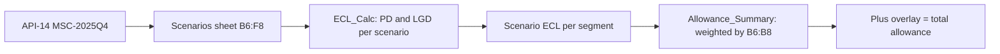

# Macro Scenarios MSC-2025Q4 (Upside / Baseline / Downside)

**MSC-2025Q4** is the three-scenario macroeconomic set used for the 31 December 2025 allowance for credit losses. It is approved (approval date `2025-12-15`) by the Scenario Committee, published through the [Macroeconomic Scenario API (API-14)](../apis/api-14-macroeconomic-scenario-api.md), and consumed by the [CECL Allowance Model (MDL-CR-007)](../models/cecl-allowance-model.md). A separate, stress-oriented set (`SA-2025-INT`) is covered in [Internal Severely Adverse](internal-severely-adverse.md); this page covers only the probability-weighted CECL set.

## Scenario weights and variables

The set is the same in three places: the API-14 example response for `GET /scenarios/v1/scenario-sets/MSC-2025Q4`, the CECL workbook `Scenarios` sheet, and the scenario table in the 2025 Annual Report (Allowance for Credit Losses section). Workbook cell addresses are given on the `Scenarios` sheet; the workbook stores rates as decimals.

| Scenario | Weight (col B) | Peak unemployment (col C) | Real GDP growth 2026 (col D) | House price index chg (col E) | CRE price index chg (col F) |
| --- | --- | --- | --- | --- | --- |
| Upside (row 6) | `Scenarios!B6` = 0.2000 | `C6` = 0.0380 (3.8%) | `D6` = 0.0260 (2.6%) | `E6` = 0.0450 (+4.5%) | `F6` = 0.0300 (+3.0%) |
| Baseline (row 7) | `Scenarios!B7` = 0.5000 | `C7` = 0.0440 (4.4%) | `D7` = 0.0170 (1.7%) | `E7` = 0.0220 (+2.2%) | `F7` = -0.0100 (-1.0%) |
| Downside (row 8) | `Scenarios!B8` = 0.3000 | `C8` = 0.0680 (6.8%) | `D8` = -0.0120 (-1.2%) | `E8` = -0.0850 (-8.5%) | `F8` = -0.1400 (-14.0%) |

Supporting cells on the same sheet:

- `Scenarios!B9` = `SUM(B6:B8)` = 1, and `Scenarios!C9` returns `OK`; the check returns `WEIGHTS MUST SUM TO 100%` when the sum differs from 1 by 0.0001 or more.
- `Scenarios!B11` = `C7` = 0.0440, the **baseline unemployment anchor** against which every scenario's unemployment shock is measured.

In the API-14 payload the same values appear as `weight`, `peakUnemployment`, `realGdp2026`, `hpiChange` and `creChange` per scenario (for example Downside: `0.3`, `0.068`, `-0.012`, `-0.085`, `-0.14`).

Only four scalar summary variables per scenario reach the CECL workbook. API-14 describes its sets more broadly: paths for unemployment, GDP, house prices, CRE prices, rates and spreads, with the quarterly path of any variable available from `GET /scenario-sets/{setId}/paths/{variable}`. Rates and spreads are not used by the CECL calculation.

## How API-14 serves the set

| Aspect | Value |
| --- | --- |
| Base path / version | `/scenarios/v1`, API-14 v1.6 |
| Endpoints | `GET /scenario-sets`, `GET /scenario-sets/{setId}` (scenarios, weights, approval metadata), `GET /scenario-sets/{setId}/paths/{variable}` |
| Owner | [Risk Analytics Engineering](../teams/risk-analytics-engineering.md) |
| Consumers | Internal only: CECL, capital planning, stress testing, ALM |
| Classification / limits | Restricted - Internal; 30 requests/minute |
| OAuth scopes | `scenarios:read`, `scenarios:approve` |
| SLO | 99.9% availability; a new set is published within 1 business day of approval |
| Lifecycle | Sets are versioned and **locked after Scenario Committee approval** |

Upstream inputs are economics research, Federal Reserve supervisory scenarios and Scenario Committee approvals. Downstream consumers named in the lineage are MDL-CR-007 (CECL: scenario weights, unemployment, HPI, CRE), MDL-CAP-003 (Capital Planning & Stress Projection Model) and the Credit Risk Scoring API (API-10). v1.5 (2025-10) added the internal severely adverse set; v1.6 (2026-05) moved the API to the strategic data platform, cutting scenario load time for the CECL and capital models from six hours to under forty minutes (also reported in the Q2 2026 earnings supplement).

Because a locked set is immutable, a change in view (new weights, new paths) is expressed as a new set ID rather than an edit of MSC-2025Q4.

## How the CECL model uses the scenarios

For each scenario and each of the six portfolio segments, `ECL_Calc` has one block (Upside rows 7-12, Baseline rows 17-22, Downside rows 27-32):

1. **Scenario PD** = base annual PD x (1 + PD elasticity x (scenario peak unemployment - `Scenarios!B11`) x 100), floored at 0. Because the anchor is the Baseline value, the Baseline scenario leaves PD unchanged, Upside lowers it and Downside raises it.
2. **Lifetime PD** = 1 - (1 - scenario PD)^remaining life (years).
3. **Scenario LGD** = base LGD x (1 - LGD sensitivity x collateral price change), bounded between 0 and 1. The price driver is `Scenarios` column E (HPI) for Residential Mortgage, column F (CRE index) for Commercial Real Estate, and none for the other segments (their LGD is the same in all scenarios).
4. **Scenario ECL** = EAD x lifetime PD x scenario LGD.
5. **Modeled allowance** per segment (`Allowance_Summary!E6:E11`) = Upside ECL x `Scenarios!$B$6` + Baseline ECL x `Scenarios!$B$7` + Downside ECL x `Scenarios!$B$8`.
6. **Total allowance** = modeled allowance + the qualitative overlay approved by the Allowance Committee (column F).

Worked check (Downside, Residential Mortgage, `ECL_Calc` row 28): HPI change -0.0850 raises LGD from 0.1400 to 0.1614 (sensitivity 1.80); annual PD 0.0047, lifetime PD 0.0300, ECL 1,058.80 $mm. In Credit Card the Downside PD rises from 0.0374 to 0.0522 (lifetime 0.0871), giving ECL 10,611.39 $mm; Credit Card has no price driver, so the unemployment path alone moves it.

### Resulting allowance (`Allowance_Summary`, $mm)

| Scenario | Total ECL (row 12) | Weight |
| --- | --- | --- |
| Upside | `B12` = 12,434.76 | 0.20 |
| Baseline | `C12` = 13,817.04 | 0.50 |
| Downside | `D12` = 19,478.13 | 0.30 |
| Probability-weighted (modeled) | `E12` = 15,238.91 | - |
| Qualitative overlay | `F12` = 681.09 | - |
| Total allowance | `G12` = 15,920 | equals reported allowance `H12` = 15,920 (difference `I12` = 0) |

The overlay is a management adjustment on top of the scenario result, not a scenario output; per-segment overlays range from -33.56 (Auto) to 256.82 (Credit Card).

### Sensitivity to the weights

Because the weights are the lever that distinguishes the reported number from any single scenario, the `Sensitivity` sheet recomputes the allowance with 100% on one scenario (modeled ECL plus the same 681.09 overlay) against the reported 15,920:

| Weighting | Allowance (`Sensitivity!C`) | Change vs reported | % |
| --- | --- | --- | --- |
| 100% Upside (row 6) | 13,115.85 | -2,804.15 | -17.6% |
| 100% Baseline (row 7) | 14,498.13 | -1,421.87 | -8.9% |
| 100% Downside (row 8) | 20,159.22 | +4,239.22 | +26.6% |

The Annual Report quotes the same sensitivities (about $20.2 billion under 100% Downside, $4.2 billion higher; about $1.4 billion lower under 100% Baseline) and states that they hold the overlay constant and do not represent management's loss expectation. The Annual Report also attributes part of the 2025 reserve build to a modest increase in the weight on the Downside scenario.

## Controls, invariants and failure behavior

- **Weights must sum to 100%.** Enforced as a visible check (`Scenarios!B9`/`C9`), documented as a model limit in the README sheet. It is a flag in the workbook rather than a hard stop on the calculation, so a failed check must be resolved before the output is relied on.
- **Overlay discipline.** `Allowance_Summary!F14` returns `OK` when no segment's overlay is more than 15% of its modeled allowance in absolute terms, otherwise `REVIEW`; the current value is `OK` (the largest is Commercial Real Estate at 10.07%).
- **Single anchor.** Every scenario PD depends on `Scenarios!B11 = C7`; editing the Baseline peak unemployment moves the anchor and therefore the Upside and Downside PDs as well as the Baseline's.
- **Approval boundary.** Weights and paths originate from the Scenario Committee through API-14; the Pillar 3 disclosures additionally list the Allowance Committee as approving scenario weights, CECL model outputs and overlays each quarter. The workbook itself does not re-derive or alter scenario inputs.
- **Scope limits of the model.** The workbook is a simplified pool-level demonstration; unfunded commitments are excluded.

## Later reporting on the same set

The Q2 2026 earnings supplement states that scenario weights were unchanged from year end (Upside 20%, Baseline 50%, Downside 30%) and that the baseline assumes unemployment peaking at 4.5% in the first quarter of 2027, slightly higher than the 4.4% assumed at year end. The 4.4% figure is the MSC-2025Q4 `Scenarios!C7` value; the 4.5% figure belongs to the later view and is not part of MSC-2025Q4.

## Extension points

- A new quarter is a new scenario set ID served by API-14; the workbook `Scenarios` sheet is re-pointed to it (header "Source: API-14 Macroeconomic Scenario API, scenario set MSC-2025Q4").
- Adding a fourth scenario would require a new `ECL_Calc` block, a new weight row inside the `B6:B8` range and updated formulas in `Allowance_Summary` and `Sensitivity`, since weights are referenced by fixed cell addresses.

## Relationships

- **Served by:** [API-14 Macroeconomic Scenario API](../apis/api-14-macroeconomic-scenario-api.md), owned by [Risk Analytics Engineering](../teams/risk-analytics-engineering.md); set ID `MSC-2025Q4`.
- **Used by:** the [CECL Allowance Model (MDL-CR-007)](../models/cecl-allowance-model.md), through the [scenario weighting component](../models/components/cecl-scenario-weighting.md); see also the [CECL allowance calculation flow](../workflows/cecl-allowance-calculation-flow.md) and the [CECL concept](../concepts/cecl.md). Capital planning (MDL-CAP-003) also draws scenario variables from API-14; the Pillar 3 disclosures cite the [internal severely adverse set](internal-severely-adverse.md) (`SA-2025-INT`) for its stress paths.
- **Drives:** the [Allowance for Credit Losses](../metrics/allowance-for-credit-losses.md) metric: weighted modeled 15,238.91 plus overlay 681.09 = 15,920 $mm.
