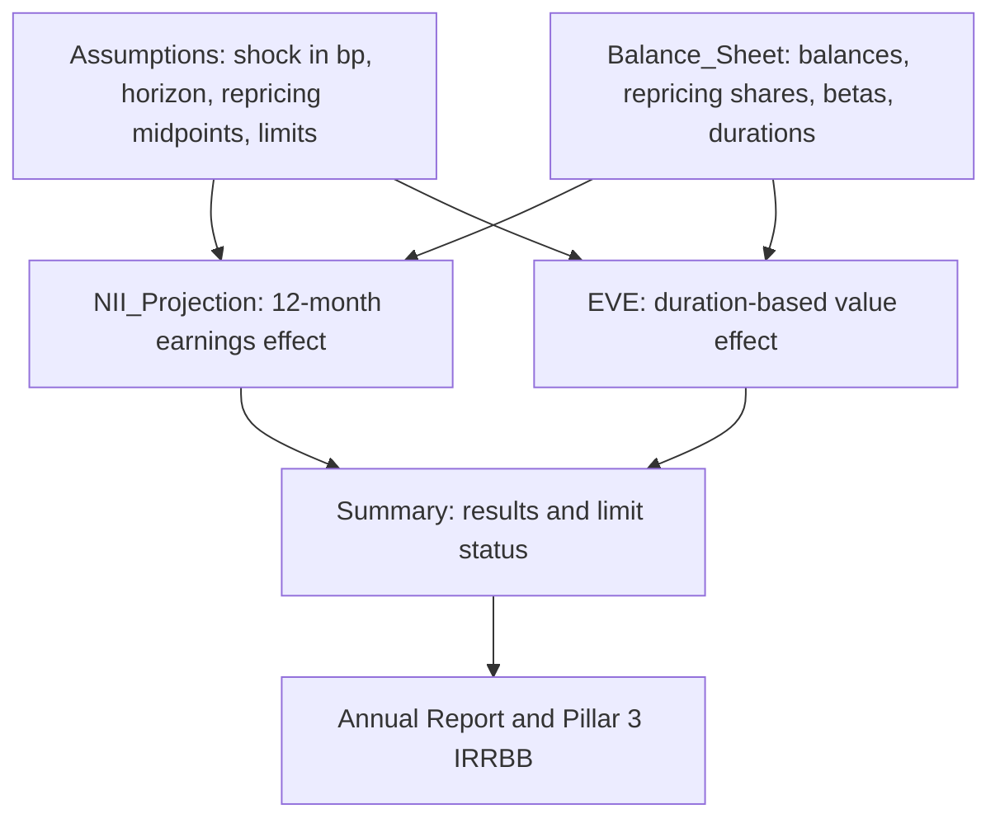

# Parallel Rate Shocks

A parallel rate shock moves every point on the yield curve by the same number of basis points (bp), instantly. The [NII Sensitivity Model](../models/nii-sensitivity-model.md) (MDL-ALM-014, Tier 1) runs five such scenarios against a rate-sensitive balance sheet as of 2025-12-31. It reports the effect on 12-month [net interest income](../metrics/net-interest-income.md) and on [economic value of equity](../concepts/economic-value-of-equity.md) (EVE). Both are standard [IRRBB](../concepts/irrbb.md) measures. The company, Meridian Harbor Financial Corp., is fictional and the workbook is a synthetic proof of concept. Figures are USD millions unless stated.

## The scenario grid

The grid lives on the model's `Assumptions` sheet (rows 17-21). Each scenario is a single input in bp. Every downstream sheet links to these cells, so changing a shock size is a one-cell edit.

| Scenario | Shock (bp) |
|---|---|
| Down 200 | -200 |
| Down 100 | -100 |
| Base | 0 |
| Up 100 | +100 |
| Up 200 | +200 |

The shocks are applied as an instantaneous, one-time step. They are not a path, and the model has no twists, steepeners or flatteners.

## How a shock flows through the model

The diagram shows how the scenario grid and balance-sheet inputs feed both measures and the limit tests.

### NII effect (earnings view)

Detail on the mechanics is in [NII Rate Shock Projection](../models/components/nii-rate-shock-projection.md) and [NII Repricing and Deposit Betas](../models/components/nii-repricing-and-deposit-betas.md). In outline:

1. Each of the 14 lines gets a **repricing factor** that counts only the 0-3m and 3-12m buckets. They are assumed to reprice at months 1.5 and 7.5, so with a 12-month horizon the factor is `share(0-3m) x 10.5/12 + share(3-12m) x 4.5/12`. Positions in the 1-5y and >5y buckets contribute nothing to 12-month NII.
2. A line's NII effect is `sign x balance x beta x factor x shock / 10000`, where the sign is +1 for assets and -1 for liabilities.
3. Asset rates move one-for-one with the shock (beta 1). Liability betas are lower: 0.45 for consumer interest-bearing deposits, 0.75 for wholesale interest-bearing deposits, 0 for noninterest-bearing deposits and 1 for repo and long-term debt. The deposit betas come from the Deposit Behaviour sub-model's 2025 calibration.
4. Change in NII is the sum over lines. Projected NII is base NII (50,236.91, assets' annual interest minus liabilities') plus that change.

The balance sheet is static: no growth, no mix shift and no replacement of maturing positions at different spreads.

### EVE effect (value view)

The `EVE` sheet uses a modified-duration approximation. Each line's dollar duration per 100 bp is `sign x balance x modified duration / 100`. The line's value change is `-dollar duration x shock / 100`, and the EVE change is the sum. The result is divided by Tier 1 capital of 110,620 (API-16, YE2025). Repricing buckets are not used here. The value effect depends on duration, not on when positions reprice within 12 months. See [EVE Modified Duration](../models/components/eve-modified-duration.md).

Asset dollar duration totals about 28,504 per 100 bp and liability dollar duration about 27,136. The net of roughly 1,369 per 100 bp is why EVE falls when rates rise.

## Results at FY2025

| Scenario | Projected NII | Change in NII | Change in NII % | Change in EVE | EVE % of Tier 1 |
|---|---|---|---|---|---|
| Down 200 | 47,220.02 | -3,016.89 | -6.01% | +2,737.40 | +2.47% |
| Down 100 | 48,728.47 | -1,508.44 | -3.00% | +1,368.70 | +1.24% |
| Base | 50,236.91 | 0 | 0 | 0 | 0 |
| Up 100 | 51,745.35 | +1,508.44 | +3.00% | -1,368.70 | -1.24% |
| Up 200 | 53,253.80 | +3,016.89 | +6.01% | -2,737.40 | -2.47% |

The two measures move in opposite directions. The bank gains NII when rates rise (it is asset-sensitive over 12 months) but loses EVE (the asset side's dollar duration exceeds the liability side's, driven mainly by securities and residential mortgages). The binding risk differs by direction:

- **Rates down 200 bp:** NII is the adverse measure. In this scenario, assets lose 11,638.44 and liabilities give back only 8,621.55. The largest single driver is deposits with banks and fed funds sold, at -4,320.75.
- **Rates up 200 bp:** EVE is the adverse measure, at -2.47% of Tier 1.

Results are exactly linear and symmetric in the shock: the 200 bp results are double the 100 bp results with the opposite sign. This follows from betas that are constant across shock sizes and from first-order duration, which has no convexity term.

## Limits and breach logic

The `Summary` sheet tests each scenario against Board Risk Committee limits approved in 2025-03.

| Measure | Limit | Test |
|---|---|---|
| NII | Decline no greater than 7.0% of base NII in any parallel shock | `IF(change% < -7%, "BREACH", "Within limit")` |
| EVE | Decline no greater than 15.0% of Tier 1 capital | `IF(EVE% < -15%, "BREACH", "Within limit")` |

Both tests look only at declines, so a gain never triggers a breach. All five scenarios are "Within limit". The worst NII case (-6.01%) uses about 86% of the NII limit, which is the tightest margin. The worst EVE case (-2.47%) uses about 16% of the EVE limit. The utilisation percentages are derived arithmetic, not workbook cells. The statuses feed ALCO limit-utilisation flags, the Annual Report (Market Risk Management) and the Pillar 3 IRRBB disclosure.

## Inputs and data lineage

- Balances and yields: API-15 Treasury Liquidity Positions API (month-end snapshot).
- Loan repricing profiles: API-11 Loan Servicing API.
- Yield curve and policy rate (3.75% fed funds upper bound): API-12 Market Data API.
- Tier 1 capital: API-16 Regulatory Reporting API.
- Deposit betas: Deposit Behaviour sub-model, annual calibration approved by MRGR.

## Invariants and failure modes

- Each balance-sheet row has a `Share check` that flags `CHECK` unless the four repricing shares sum to 100%. All rows currently show `OK`. A row that does not sum to 1 would silently distort the repricing factor, so this check is the model's main input-integrity control.
- Percent calculations are guarded, returning 0 when the denominator (base NII or Tier 1 capital) is 0. A missing denominator therefore shows as no change, not as an error.
- Rates are stored as decimals and shocks are in bp, divided by 10,000 in the NII formulas. A shock entered as a decimal would be wrong by a factor of 10,000.

## Known limitations and compensating control

The model documents these limits:

- Parallel shocks only.
- Static balance sheet.
- No rate floors on deposit costs below zero. Large down shocks therefore do not cap the liability-side relief in the way a floor would.
- Betas held constant across shock sizes.

The compensating control is a dynamic balance-sheet simulation run quarterly in the ALM engine. The model owner is Corporate Treasury (ALM), the independent validator is Model Risk Governance & Review, last validation was 2025-09-18 and the next is due 2026-09-30.

## Extending the scenario set

Adding or resizing a parallel shock means changing the `Assumptions` shock grid. The `NII_Projection`, `EVE` and `Summary` sheets use fixed column and row positions for the five scenarios, so a sixth scenario would need new columns and `Summary` rows as well as a new grid row. Non-parallel shapes, floors, beta-by-shock-size or balance-sheet dynamics would require changing the formulas. The quarterly ALM-engine simulation exists to cover such cases.
