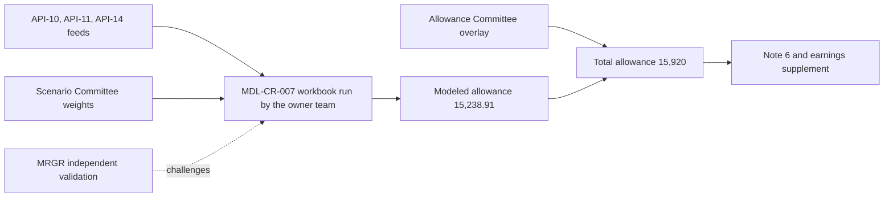

# Consumer & Wholesale Credit Risk - Allowance Methodology

Consumer & Wholesale Credit Risk - Allowance Methodology is the named **model owner** of MDL-CR-007, the *CECL Lifetime Expected Credit Loss Model*, at Meridian Harbor Financial Corp. (a fictional institution). The model is the `CECL_Allowance_Model.xlsx` workbook, which estimates the allowance for credit losses under ASC 326 (CECL). The sources name the team only through this ownership. They give no headcount, reporting line or staffing detail, so this page describes the team through what it owns. For the workbook mechanics, see [MDL-CR-007 CECL Allowance Model](../models/cecl-allowance-model.md). For the accounting standard, see [CECL](../concepts/cecl.md).

Evidence: repo://sources/models/cecl-allowance-model.md#L125-L137, repo://sources/api_docs/mhfc-developer-platform-api-reference.md#L1395-L1404, repo://sources/reports/mhfc-2025-annual-report.md#L365

## What the team owns

| Item | Detail |
|---|---|
| Model | MDL-CR-007, CECL Lifetime Expected Credit Loss Model (`CECL_Allowance_Model.xlsx`) |
| Risk tier | Tier 1 (High) |
| Independent validator | Model Risk Governance & Review (MRGR), a separate function from the owner |
| Last validation / next due | 2025-11-04 / 2026-11-30 |
| Upstream feeds | API-10 Credit Risk Scoring, API-11 Loan Servicing, API-14 Macroeconomic Scenario |
| Downstream disclosures | Annual Report Note 6 (Allowance for Credit Losses); Q2 2026 Earnings Supplement, Credit Trends; Pillar 3 allowance disclosure |
| Units | USD millions; rates stored as decimals |

The Annual Report, the Pillar 3 disclosures, the developer-platform reference and the workbook README all name the same owner for MDL-CR-007. The model is the only one this team is recorded as owning. The other two model owners are Corporate Treasury - Asset & Liability Management (NII sensitivity) and Corporate Treasury - Capital Management (capital planning).

Evidence: repo://sources/models/cecl-allowance-model.md#L125-L137, repo://sources/reports/mhfc-2025-annual-report.md#L444, repo://sources/reports/mhfc-2025-pillar3-disclosures.md#L489-L500, repo://sources/api_docs/mhfc-developer-platform-api-reference.md#L1389-L1415

## Responsibilities in the allowance process

Read together, the README and the Annual Report disclosure describe the following chain of work, which sits under the owner's model.

1. **Source the inputs.** Balances (EAD) and remaining life come from API-11. Pool-level PD and LGD parameters come from API-10 and are refreshed quarterly. Scenario paths and weights come from API-14 and are approved by the Scenario Committee. The team consumes these and does not set the scenario weights itself.
2. **Run the pool-level calculation.** For each of six segments and each of three scenarios, the model computes lifetime ECL as EAD × lifetime PD × scenario LGD. The unemployment shock is anchored on the baseline scenario. LGD is adjusted for collateral prices only for Residential Mortgage (house price index) and CRE (commercial property price index).
3. **Weight the scenarios.** The model applies Upside 20%, Baseline 50% and Downside 30% (scenario set MSC-2025Q4). The weighted modeled allowance is $15,238.91 million.
4. **Carry the qualitative overlay.** The overlay is a management adjustment approved by the Allowance Committee (Dec-2025). It is entered as a hard-coded input per segment, and the total is $681.09 million.
5. **Reconcile and publish.** The total allowance of $15,920 million is reconciled to the reported allowance with a zero difference in every segment. It feeds Annual Report Note 6 and the earnings supplement, along with the coverage metrics and the single-scenario sensitivity.

Caption: the owner team runs the model on external feeds and committee-approved judgments, while MRGR validates it independently.

Evidence: repo://sources/models/cecl-allowance-model.md#L146-L164, repo://sources/models/cecl-allowance-model.md#L14-L22, repo://sources/models/cecl-allowance-model.md#L107-L114, repo://sources/reports/mhfc-2025-annual-report.md#L367

## Decision rights and approval boundaries

The team runs the model, but it does not hold sole authority over the figures that drive the result. The sources assign two of the key judgments to committees.

- **Scenario weights belong to the Scenario Committee.** The annual report says that scenario-conditional estimates are weighted by probabilities approved by the Firm's Scenario Committee, and the README says the paths and weights come from API-14 after that approval. The weights are 20/50/30 at year-end 2025. The Q2 2026 supplement says they were unchanged at 2Q26.
- **The qualitative overlay belongs to the Allowance Committee.** Every overlay cell in `Allowance_Summary!F6:F11` carries a note saying the adjustment was approved by that committee (Dec-2025). Pillar 3 describes the $681 million of overlays the same way. The overlay is a judgmental adjustment for model limitations, concentration and emerging risks. Management applies it for risks not fully captured by the models.
- **Independent validation belongs to MRGR.** The owner and the validator are separate parties. See [Model Risk (SR 11-7)](../concepts/model-risk-sr-11-7.md) for the wider framework.

Evidence: repo://sources/reports/mhfc-2025-annual-report.md#L367, repo://sources/models/cecl-allowance-model.md#L154-L158, repo://sources/models/cecl-allowance-model.md#L107-L114, repo://sources/reports/mhfc-2025-pillar3-disclosures.md#L297, repo://sources/reports/mhfc-q2-2026-earnings-supplement.md#L270

## Controls the team maintains

The workbook embeds three checks. The README lists the limits, and the formulas implement them.

| Control | Where | Behavior |
|---|---|---|
| Scenario weights sum to 100% | `Scenarios!C9` | Returns "OK" if the weights are within 0.0001 of 1, otherwise "WEIGHTS MUST SUM TO 100%" |
| Overlay within ±15% of modeled, per segment | `Allowance_Summary!F14` | Returns "REVIEW" if any segment's overlay share `J6:J11` exceeds 15% in absolute value, otherwise "OK" |
| Reconciliation to reported allowance | `Allowance_Summary!I6:I12` | Difference between modeled total and the Note 6 balance, currently 0 in every row |

Limits on what these controls prove:

- The weight check is a flag only. The weights flow into the summary by direct reference, so a failed check does not stop the calculation. Review must treat it as a gate by procedure.
- The overlay check is the only automated range test on the judgmental adjustment. It currently passes. The largest overlay is CRE at +10.07%, and Auto carries a negative overlay of −4.64%.
- The overlay is an input rather than a derived value, and the difference to the reported figure is zero in every segment. A zero reconciliation therefore shows that the total ties to Note 6, not that the model independently produced the reported number.

Evidence: repo://sources/models/cecl-allowance-model.md#L166-L171, repo://sources/models/cecl-allowance-model.md#L195-L201, repo://sources/models/cecl-allowance-model.md#L105, repo://sources/models/cecl-allowance-model.md#L14-L22, repo://sources/models/cecl-allowance-model.md#L32

## Governance status and open findings

- **Validation cycle.** MRGR last validated the model on 2025-11-04. The next validation is due 2026-11-30.
- **2025 findings.** One medium-severity finding says there is no explicit model for unfunded commitments. It was remediated through an interim overlay. The README separately lists unfunded commitments (the off-balance-sheet allowance) as excluded from the workbook. One low-severity finding concerns documentation of the Card PD elasticity.
- **Simplification.** The README states the workbook is a simplified pool-level approach for demonstration, and that the production model uses loan-level cash flows.

Evidence: repo://sources/models/cecl-allowance-model.md#L125-L137, repo://sources/models/cecl-allowance-model.md#L166-L171, repo://sources/reports/mhfc-2025-pillar3-disclosures.md#L517

## Outputs the team is accountable for

At 2025-12-31 the workbook produces a total allowance of $15,920 million on $742,300 million of loans (2.14% coverage). It gives 2.61 years of coverage of the FY2025 net charge-offs of $6,100 million. These tie to the Annual Report allowance, the Note 6 ending balance and the Pillar 3 allowance figure. The segment table is below.

| Segment | Owning LOB | Modeled | Overlay | Total |
|---|---|---|---|---|
| Credit Card | CCB | 8,383.18 | 256.82 | 8,640 |
| Residential Mortgage | CCB | 764.97 | 55.03 | 820 |
| Auto | CCB | 723.56 | (33.56) | 690 |
| Commercial Real Estate | CIB | 2,244.00 | 226.00 | 2,470 |
| Commercial & Industrial | CIB | 2,609.28 | 150.72 | 2,760 |
| Other Consumer & Wholesale | AWM/CCB | 513.93 | 26.07 | 540 |
| **Total** | | **15,238.91** | **681.09** | **15,920** |

One methodology owner therefore covers both the consumer segments owned by [Consumer & Community Banking](../organizations/consumer-community-banking.md) and the wholesale segments owned by [Commercial & Investment Bank](../organizations/commercial-investment-bank.md), which matches the team's name.

The sensitivity sheet shows the effect of the weighting decision. A 100% Downside weight, with the overlay held constant, gives $20,159.22 million (+$4,239.22 million, +26.63%). A 100% Baseline weight gives $14,498.13 million (−$1,421.87 million, −8.93%). The Annual Report states that these figures are not a management loss expectation.

After year-end the allowance moved to $16,380 million at 2Q26 (2.15% of period-end loans). That figure comes from the earnings supplement and is not computed in the workbook. The supplement says that API-10 pool-level PD and LGD estimates were refreshed in June and are reflected in the quarter-end allowance, that weights were unchanged, and that the baseline assumed unemployment peaking at 4.5% in Q1 2027, compared with 4.4% in the year-end workbook.

Evidence: repo://sources/models/cecl-allowance-model.md#L12-L22, repo://sources/models/cecl-allowance-model.md#L209-L226, repo://sources/models/cecl-allowance-model.md#L407-L440, repo://sources/reports/mhfc-2025-annual-report.md#L377-L389, repo://sources/reports/mhfc-q2-2026-earnings-supplement.md#L263-L270, repo://sources/reports/mhfc-q2-2026-earnings-supplement.md#L351

## Operations: how to work with this team's model safely

- **Scenario or weight change.** Edit `Scenarios!B6:B8` only on the basis of Scenario Committee approval, confirm `C9` shows "OK", and re-read `Allowance_Summary` and `Sensitivity`.
- **Overlay change.** This needs Allowance Committee approval and documentation, and `F14` must still show "OK".
- **Parameter refresh.** Quarterly PD, LGD and elasticity refreshes come from API-10. Balances and remaining life come from API-11.
- **Adding a segment or a collateral driver.** The formulas are row-aligned across `Segment_Inputs`, the three `ECL_Calc` blocks and `Allowance_Summary`. A new segment needs a row in each and extended `SUM` ranges. The collateral-price lookup recognises only "HPI" and "CRE", so any other driver needs a new `Scenarios` column and an extended `IF` in all three blocks. Auto has an LGD sensitivity of 0.40, but its price driver is "None", so it has no collateral adjustment.
- **Changing the scope.** Bringing unfunded commitments into the workbook would change a documented exclusion and would address the medium MRGR finding. It is a material methodology change that goes through validation.

The last two points go beyond what the sources state, and the model page discusses the first two in more detail. The sources do not describe an approval workflow for adding segments or for expanding the scope.

Evidence: repo://sources/models/cecl-allowance-model.md#L154-L158, repo://sources/models/cecl-allowance-model.md#L278-L281, repo://sources/models/cecl-allowance-model.md#L212-L218, repo://sources/models/cecl-allowance-model.md#L166-L171

## Relationships

- owns: [MDL-CR-007 CECL Allowance Model](../models/cecl-allowance-model.md)
- applies: [CECL](../concepts/cecl.md)
- validated by: Model Risk Governance & Review (MRGR), under [Model Risk (SR 11-7)](../concepts/model-risk-sr-11-7.md)
- consumes: [API-10 Credit Risk Scoring API](../apis/api-10-credit-risk-scoring-api.md), [API-11 Loan Servicing API](../apis/api-11-loan-servicing-api.md), [API-14 Macroeconomic Scenario API](../apis/api-14-macroeconomic-scenario-api.md)
- produces: [Allowance for Credit Losses](../metrics/allowance-for-credit-losses.md)
- segments owned by: [Consumer & Community Banking](../organizations/consumer-community-banking.md), [Commercial & Investment Bank](../organizations/commercial-investment-bank.md)
