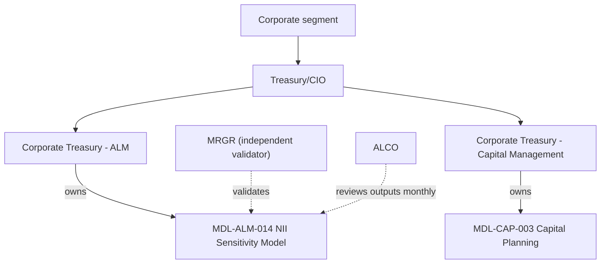

# Corporate Treasury - Asset & Liability Management

Corporate Treasury - Asset & Liability Management (ALM) is the team named as **model owner** of [MDL-ALM-014, the Net Interest Income Sensitivity Model](../models/nii-sensitivity-model.md). It sits inside Treasury/CIO, which is part of the [Corporate segment](../organizations/corporate.md) of Meridian Harbor Financial Corp. (MHFC). The sources attribute only this one model to the team. They give no headcount, reporting line, named individuals or on-call arrangements. They do not say whether the team also runs the Deposit Behaviour sub-model or the quarterly ALM-engine simulation, so those are not claimed for it here. MHFC and all figures are synthetic.

## Responsibilities

| Area | What the sources say |
| --- | --- |
| Model ownership | The team owns MDL-ALM-014. This is stated in the workbook README, the Annual Report, Pillar 3 Section 11 and the model inventory, and in Appendix B of the Developer Platform API reference. |
| Purpose of the model | It projects 12-month net interest income (NII) under parallel rate shocks and economic value of equity (EVE) sensitivity for [IRRBB](../concepts/irrbb.md) reporting. |
| Risk tier | The model is Tier 1 (High). That brings annual independent validation by Model Risk Governance & Review (MRGR), quarterly monitoring and annual owner attestation. |
| Disclosures | The model's `Summary` sheet feeds the Annual Report (Market Risk Management) and Pillar 3 (Interest Rate Risk in the Banking Book). |
| Limit monitoring | The model flags NII and EVE results against Board limits. The workbook describes these flags as the "limit utilisation flags used in ALCO reporting". |

<!-- openwiki: broken internal link [../../sources/reports/mhfc-2025-annual-report.md#L411-L415] heading anchor "L411-L415" does not exist in "../../sources/reports/mhfc-2025-annual-report.md". Fix the href or restore the target, then delete this comment. -->
Treasury/CIO manages structural rate risk through the investment securities portfolio and interest rate derivatives, within limits approved by the Board Risk Committee. It measures earnings-at-risk with MDL-ALM-014 ([Annual Report, structural interest rate risk](../../sources/reports/mhfc-2025-annual-report.md#L411-L415)). The ALM team owns the measurement tool. The sources do not say which team executes the hedging or portfolio actions.

## Where the team sits

Caption: ownership and oversight of MDL-ALM-014. Treasury/CIO is first line of defence; MRGR and ALCO are oversight counterparts. The Annual Report says Treasury/CIO owns the two Tier 1 models through Corporate Treasury sub-teams. The sibling team for MDL-CAP-003 is Corporate Treasury - Capital Management.

## The model the team operates

MDL-ALM-014 is an Excel workbook (`NII_Sensitivity_Model.xlsx`) with README, Assumptions, Balance_Sheet, NII_Projection, EVE and Summary sheets. Full cell-level mechanics are on the [model page](../models/nii-sensitivity-model.md). What matters for the owning team:

- **Method.** It applies instantaneous parallel shocks of -200, -100, +100 and +200 bp to a static balance sheet as of 2025-12-31. Each position reprices only for the part of the 12-month horizon left after its bucket midpoint (month 1.5 for 0-3m, month 7.5 for 3-12m). Asset rates move one-for-one with the shock. Liability rates move by shock x deposit beta. See [repricing and deposit betas](../models/components/nii-repricing-and-deposit-betas.md) and [rate-shock projection](../models/components/nii-rate-shock-projection.md).
- **EVE.** Change in EVE is approximated as -(asset value x modified duration - liability value x modified duration) x shock. See [EVE modified duration](../models/components/eve-modified-duration.md).
- **Scenario set.** The shocks are the [parallel rate shocks](../scenarios/parallel-rate-shocks.md).
- **Latest results (2025-12-31).** Base-case 12-month NII is $50,236.91 million. The worst NII case is Down 200 at -$3,016.89 million (-6.01% of base). The worst EVE case is Up 200 at -$2,737.40 million (-2.47% of Tier 1 capital of $110,620 million). Every scenario reads "Within limit". Pillar 3 reports the same figures rounded: $50,237 million, (3,017) and (2,737). The model is asset-sensitive on earnings and loses EVE when rates rise. The measure is [net interest income](../metrics/net-interest-income.md).

## Inputs the team must keep current

The team depends on upstream platform feeds and one sub-model. The workbook is refreshed from a month-end snapshot.

| Input | Source | Used for |
| --- | --- | --- |
| Balances and yields/costs of securities, trading assets, deposits with banks, deposits, repo and long-term debt | [API-15 Treasury Liquidity Positions API](../apis/api-15-treasury-liquidity-positions-api.md) | `Balance_Sheet` lines tagged API-15 |
| Loan balances, yields and repricing profiles | [API-11 Loan Servicing API](../apis/api-11-loan-servicing-api.md) | `Balance_Sheet` loan lines |
| Yield curve and policy rate (series `POLICY.FEDFUNDS.UB`) | [API-12 Market Data API](../apis/api-12-market-data-api.md) | `Assumptions!B7` |
| Year-end Tier 1 capital | [API-16 Regulatory Reporting API](../apis/api-16-regulatory-reporting-api.md) | `Assumptions!B13`, the EVE denominator |
| Deposit betas (annual calibration, MRGR approved) | Deposit Behaviour sub-model | `Balance_Sheet!L15:L19` |

The README and Appendix B list only API-11, API-12 and API-15 as registered upstream feeds. The Tier 1 capital dependency on API-16 appears only in the `Assumptions` source note. The team must therefore track it by hand.

API-12 is designated a critical data element under the [BCBS 239](../concepts/bcbs-239.md) programme. A breaking change there triggers a model change review by MRGR, as described on the [API-12 page](../apis/api-12-market-data-api.md). The team should expect curve or series changes to carry validation implications.

## Governance counterparts

<!-- openwiki: broken internal link [../../sources/reports/mhfc-2025-annual-report.md#L437] heading anchor "L437" does not exist in "../../sources/reports/mhfc-2025-annual-report.md". Fix the href or restore the target, then delete this comment. -->
- **MRGR** independently validates the model. The last validation was 2025-09-18 and the next is due 2026-09-30. Under the [Model Risk Policy (SR 11-7)](../concepts/model-risk-sr-11-7.md), material model changes need MRGR approval. MRGR is the independent validation function and reports to the Chief Risk Officer ([Annual Report](../../sources/reports/mhfc-2025-annual-report.md#L437)).
<!-- openwiki: broken internal link [../../sources/reports/mhfc-2025-pillar3-disclosures.md#L83] heading anchor "L83" does not exist in "../../sources/reports/mhfc-2025-pillar3-disclosures.md". Fix the href or restore the target, then delete this comment. -->
- **ALCO** (Asset and Liability Committee) oversees liquidity, interest rate and capital risk. It reviews the NII Sensitivity Model outputs monthly ([Pillar 3, committees](../../sources/reports/mhfc-2025-pillar3-disclosures.md#L83)). It also reviews the quarterly dynamic simulation and supplemental scenario analysis.
- **Board Risk Committee** approved the limits (March 2025): NII decline no greater than 7.0% of base NII in any parallel shock, and EVE decline no greater than 15.0% of Tier 1 capital.
- **Treasurer.** See the [Treasurer](../people/treasurer.md) page for the executive role over Treasury/CIO.

## Open findings and compensating controls

<!-- openwiki: broken internal link [../../sources/reports/mhfc-2025-pillar3-disclosures.md#L517] heading anchor "L517" does not exist in "../../sources/reports/mhfc-2025-pillar3-disclosures.md". Fix the href or restore the target, then delete this comment. -->
- **MRGR 2025 finding (medium severity).** Deposit betas are held constant across shock sizes. The compensating control is a dynamic balance-sheet simulation run quarterly in the ALM engine ([Pillar 3, validation findings](../../sources/reports/mhfc-2025-pillar3-disclosures.md#L517)).
<!-- openwiki: broken internal link [../../sources/reports/mhfc-2025-pillar3-disclosures.md#L402] heading anchor "L402" does not exist in "../../sources/reports/mhfc-2025-pillar3-disclosures.md". Fix the href or restore the target, then delete this comment. -->
- **Disclosed limitations.** The model uses parallel shocks only and a static balance sheet. It has no rate floors on deposit costs below zero. It does not capture basis risk or mortgage prepayment optionality beyond the static repricing profile, or deposit-beta convexity at very low rates ([Pillar 3, Section 11](../../sources/reports/mhfc-2025-pillar3-disclosures.md#L402)).
- **Headroom.** The worst-case NII decline (6.01%) is close to the 7.0% Board limit, so the team's attention to the limit is not purely formal. The EVE result (2.47% of Tier 1) is far inside 15.0%.
- **Weak internal check.** The only in-workbook integrity control is the `Balance_Sheet!I6:I19` share check, which returns "CHECK" when a row's repricing shares do not sum to 100%. Nothing in `Summary` consumes it, so the team has to inspect it directly after each refresh.
- **Inert inputs.** `Assumptions!B6` (as-of date) and `B7` (policy rate) feed no formula in the rendered workbook. Changing them does not change results.

## Routine operations

A refresh cycle for the owning team follows the model's structure:

1. Replace the month-end snapshot in `Balance_Sheet` columns `C:H` and `K` from API-15 and API-11.
2. Update `Assumptions!B6`, `B7` and `B13`.
3. Confirm every `I` cell on `Balance_Sheet` reads `OK`.
4. Read `Summary!F6:F10` and `I6:I10` for limit status, then pass the results to ALCO reporting and the disclosure owners.

Extending the model is constrained by its fixed layout. A sixth shock scenario or an extra balance-sheet line means adding rows or columns across `Assumptions`, `Balance_Sheet`, `NII_Projection`, `EVE` and `Summary`, because the sums and `SUMIFS` ranges are hard-coded. Recalibrated deposit betas are entered in `Balance_Sheet!L15:L19`. Before the next validation (due 2026-09-30), changes should be coordinated with MRGR.

## Relationships

- owns: [MDL-ALM-014 NII Sensitivity Model](../models/nii-sensitivity-model.md)
- part of: [Corporate (Treasury/CIO)](../organizations/corporate.md)
- consumes: [API-11](../apis/api-11-loan-servicing-api.md), [API-12](../apis/api-12-market-data-api.md), [API-15](../apis/api-15-treasury-liquidity-positions-api.md), [API-16](../apis/api-16-regulatory-reporting-api.md) (through the model)
- produces: [Net interest income sensitivity](../metrics/net-interest-income.md) and [EVE](../concepts/economic-value-of-equity.md) results for [IRRBB](../concepts/irrbb.md)
- governed by: [SR 11-7 model risk](../concepts/model-risk-sr-11-7.md); independently validated by Model Risk Governance & Review
- disclosed in: [Pillar 3 disclosures 2025](../reports/pillar3-disclosures-2025.md) and the [2025 Annual Report](../reports/annual-report-2025.md)
- related: [Treasurer](../people/treasurer.md)
