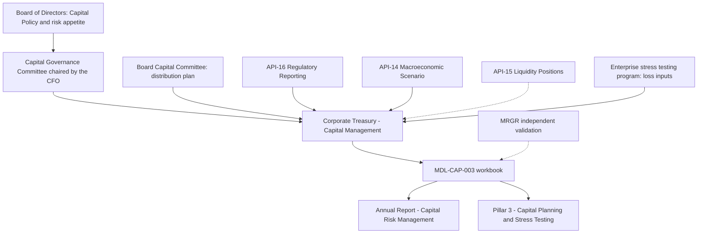

# Corporate Treasury - Capital Management

<!-- openwiki: broken internal link [../../sources/reports/mhfc-2025-annual-report.md#L249] heading anchor "L249" does not exist in "../../sources/reports/mhfc-2025-annual-report.md". Fix the href or restore the target, then delete this comment. -->
Corporate Treasury - Capital Management is the model-owning team for **MDL-CAP-003, the Capital Planning & Stress Projection Model** ([model page](../models/capital-planning-model.md)). It sits inside the Treasury/CIO function of the Corporate segment, which manages the Firm's liquidity, funding, capital and structural rate and FX risks and is named as owner of this model and of the Net Interest Income Sensitivity Model ([Annual Report](../../sources/reports/mhfc-2025-annual-report.md#L249)). The sources name no individual who leads the team (see [Treasurer](../people/treasurer.md)). The institution is synthetic.

## Responsibilities

<!-- openwiki: broken internal link [../../sources/models/capital-planning-model.md#L9-L26] heading anchor "L9-L26" does not exist in "../../sources/models/capital-planning-model.md". Fix the href or restore the target, then delete this comment. -->
<!-- openwiki: broken internal link [../../sources/reports/mhfc-2025-pillar3-disclosures.md#L506-L515] heading anchor "L506-L515" does not exist in "../../sources/reports/mhfc-2025-pillar3-disclosures.md". Fix the href or restore the target, then delete this comment. -->
- **Own and run MDL-CAP-003.** The team is the registered owner in the model README, the Annual Report model inventory, the Pillar 3 disclosures and the developer-platform model appendix ([README](../../sources/models/capital-planning-model.md#L9-L26); [Pillar 3](../../sources/reports/mhfc-2025-pillar3-disclosures.md#L506-L515)).
- **Produce the capital plan.** The model projects CET1 capital, risk-weighted assets and capital ratios over a nine-quarter horizon (Q3 2026 to Q3 2028) under a baseline and a severely adverse scenario, "to size distributions" (dividends and buybacks).
<!-- openwiki: broken internal link [../../sources/models/capital-planning-model.md#L110-L141] heading anchor "L110-L141" does not exist in "../../sources/models/capital-planning-model.md". Fix the href or restore the target, then delete this comment. -->
- **Maintain the inputs it controls.** The team keeps the `Assumptions` sheet current: starting capital and RWA from API-16, the Board Capital Committee's distribution plan, the financial-plan growth rates, and the requirement stack (4.5% minimum, current SCB, G-SIB surcharge) ([Assumptions](../../sources/models/capital-planning-model.md#L110-L141)).
<!-- openwiki: broken internal link [../../sources/reports/mhfc-q2-2026-earnings-supplement.md#L274-L286] heading anchor "L274-L286" does not exist in "../../sources/reports/mhfc-q2-2026-earnings-supplement.md". Fix the href or restore the target, then delete this comment. -->
- **Feed the disclosures.** `Summary` outputs feed Annual Report - Capital Risk Management and Pillar 3 - Capital Planning and Stress Testing. The Q2 2026 earnings supplement quotes the same results (baseline 16.15% by 3Q28, stress minimum 12.90%, indicative SCB 3.18%, about $23.0 billion of excess CET1 over the 13.0% target) ([earnings supplement](../../sources/reports/mhfc-q2-2026-earnings-supplement.md#L274-L286)).
<!-- openwiki: broken internal link [../../sources/reports/mhfc-2025-pillar3-disclosures.md#L517] heading anchor "L517" does not exist in "../../sources/reports/mhfc-2025-pillar3-disclosures.md". Fix the href or restore the target, then delete this comment. -->
- **Submit the model to independent validation.** Model Risk Governance & Review (MRGR) validates the model as Tier 1 (High): last validated 2026-02-27, next due 2027-02-28, with no findings above low severity ([Pillar 3](../../sources/reports/mhfc-2025-pillar3-disclosures.md#L517)). See [SR 11-7 model risk management](../concepts/model-risk-sr-11-7.md).

## Operating context

Caption: governance sits above the team, data and decisions flow in from APIs, committees and the stress testing program, and validated outputs flow to two disclosures. Dotted lines are a manual cross-check (API-15) and an independent oversight relationship (MRGR).

<!-- openwiki: broken internal link [../../sources/reports/mhfc-2025-annual-report.md#L283] heading anchor "L283" does not exist in "../../sources/reports/mhfc-2025-annual-report.md". Fix the href or restore the target, then delete this comment. -->
- **Governance.** The Board approves Capital Policy and risk appetite. The Capital Governance Committee, chaired by the CFO, oversees capital planning, the CCAR submission and contingency capital planning; the committee owns the model's outputs, not the workbook ([Annual Report](../../sources/reports/mhfc-2025-annual-report.md#L283); [CFO](../people/chief-financial-officer.md)). Distribution-plan inputs are approved by the Board Capital Committee.
- **Upstream data.** API-16 supplies starting CET1 capital and standardized RWA ([API-16](../apis/api-16-regulatory-reporting-api.md)); API-14 supplies severely adverse scenario variables ([API-14](../apis/api-14-macroeconomic-scenario-api.md)); API-15 is used to cross-check liquidity constraints on distributions ([API-15](../apis/api-15-treasury-liquidity-positions-api.md)).
- **Other teams' inputs.** Stress losses (PPNR, provisions, trading and counterparty losses) are top-down values from the enterprise stress testing program and are typed into the workbook, not computed there.

## Recurring workflow

The team re-runs the model each quarter with refreshed starting capital, RWA and scenario paths (as noted on [CET1 ratio](../metrics/cet1-ratio.md)). A run proceeds as follows:

1. Refresh `Assumptions!B6:B8` (starting CET1, RWA, share count) from API-16 and the transfer agent; the Q2 2026 actual column in both projection sheets reads only from these cells.
2. Update financial-plan and distribution-plan inputs (`B9:B16`) and, if the regulator or surcharge method has changed, `B19` (SCB) and `B20` (G-SIB surcharge); `B23` recomputes the requirement.
3. Replace the blue stress rows on `Stress_Projection` (PPNR, provisions, trading losses, RWA growth) with the current scenario and stress-testing losses; buyback row 15 stays at zero.
4. Read `Summary`: minimum stressed CET1 ratio, indicative SCB, headroom against requirement and target, and the `B18` pass/fail test.
5. Cross-check liquidity constraints on planned distributions against API-15 (outside the formulas), then publish results to the disclosures.

## What the team must watch (invariants and failure modes)

- **Pass/fail is against the regulatory requirement, not the management target.** `Summary!B18` returns "YES" when the stressed minimum is at or above the current-SCB requirement (10.20%); otherwise it returns "NO - capital action required". In the current version the stressed minimum (12.90%, Q3 2027) is below the 13.0% management target in Q2 to Q4 2027 yet still returns YES, so target breaches need separate attention.
- **Indicative SCB is not fed back.** The 3.18% indicative SCB (floored at 2.5%) is informational; `Assumptions!B19` (3.20%, effective 2025-10-01) must be updated by hand when a new SCB is set.
- **Buyback changes ripple into dividends.** Baseline common dividends use the prior-quarter share count, so changing buybacks or the assumed share price changes dividends and the SCB dividend add-on (`Summary!B11`).
- **Fixed horizon.** Summary ranges are hard-wired to nine columns (`C:K`, `C:F`); extending the horizon requires editing those formulas.
- **Known limitations.** No AOCI volatility modelling and no deferred-tax-asset threshold deductions (other items collapse to a flat -150 per quarter); share price, dividend per share, RWA growth and buyback pace are flat assumptions.
<!-- openwiki: broken internal link [../../sources/reports/mhfc-2025-annual-report.md#L439] heading anchor "L439" does not exist in "../../sources/reports/mhfc-2025-annual-report.md". Fix the href or restore the target, then delete this comment. -->
- **Upstream change control.** Under the Model Risk Policy, changes to an upstream API's schema or business logic trigger a model change review, and Tier 1 models need annual validation and Firmwide Model Risk Committee approval before use ([Annual Report](../../sources/reports/mhfc-2025-annual-report.md#L439)).

## Current reference outputs

| Measure | Baseline | Severely adverse |
| --- | --- | --- |
| Starting CET1 ratio (Q2 2026) | 15.14% | 15.14% |
| Ending CET1 ratio (Q3 2028) | 16.15% | 13.63% |
| Minimum CET1 ratio | 15.23% | 12.90% |
| Cumulative buybacks ($mm) | 27,000 | 0 |

<!-- openwiki: broken internal link [../../sources/reports/mhfc-2025-pillar3-disclosures.md#L464] heading anchor "L464" does not exist in "../../sources/reports/mhfc-2025-pillar3-disclosures.md". Fix the href or restore the target, then delete this comment. -->
Indicative SCB is 3.18% against the current 3.20%; excess CET1 over the 13.0% target at Q3 2028 is about $22,995mm. In the 2025 CCAR cycle, the Fed's projected minimum was 12.1% (SCB 3.2%) versus 12.6% from the Firm's own MDL-CAP-003 run ([Pillar 3](../../sources/reports/mhfc-2025-pillar3-disclosures.md#L464)).

## Related pages

- [MDL-CAP-003 model](../models/capital-planning-model.md) and its components: [baseline projection](../models/components/capital-baseline-projection.md), [stress projection](../models/components/capital-stress-projection.md), [indicative SCB](../models/components/indicative-stress-capital-buffer.md)
- [Stress capital buffer](../concepts/stress-capital-buffer.md), [G-SIB surcharge](../concepts/gsib-surcharge.md), [CET1 ratio](../metrics/cet1-ratio.md), [RWA](../metrics/risk-weighted-assets.md)
- [Treasurer](../people/treasurer.md), [Chief Financial Officer](../people/chief-financial-officer.md), [Corporate segment](../organizations/corporate.md)
