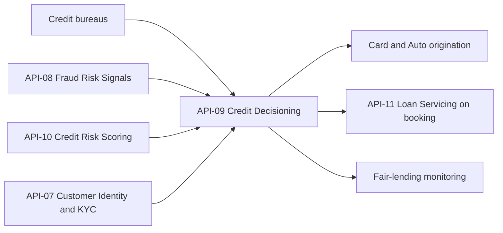

# Credit Platforms Engineering

Credit Platforms Engineering is the owning team for the [API-09 Credit Decisioning API](../apis/api-09-credit-decisioning-api.md). The Developer Platform API catalog lists it as the owner of exactly one API, and that API belongs to the **Credit Origination** business domain. The sources give no headcount, reporting line, on-call rota, repositories or escalation path for the team specific to it. Everything below is drawn from the API's published reference.

## What the team is accountable for

The team runs the automated underwriting decision service for consumer and small-business credit applications. A caller submits an application and receives an `approve`, `decline` or `refer` decision, plus a credit line and pricing tier. The decision combines credit bureau attributes, internal behaviour scores and fraud signals. Decisions are logged so the bank can perform fair-lending monitoring and produce adverse-action notices.

Published surface, base path `/credit-decisions/v2`:

| Method | Path | Purpose |
| --- | --- | --- |
| POST | `/applications` | Submit an application and receive a decision |
| GET | `/applications/{id}` | Retrieve decision, reason codes and offered terms |
| POST | `/applications/{id}/counteroffer` | Accept a counteroffer |

An application carries `product` (for example `CARD_REWARDS`), an `applicant` object (for example `income`, `housing`) and a `bureauConsentToken`. The request is sent with an `Idempotency-Key` header. The response returns `id`, `decision`, `creditLine`, `apr`, `pdBand` and `reasonCodes`. Because the application carries a consent token and not a bureau report, the service pulls bureau data itself.

## Who depends on the team's API

- **Card, Auto and small-business origination channels** are the intended production consumers.
- **Point-of-sale partners** are intended consumers through the sandbox only (added in v2.2).
- **Loan Servicing API (API-11)** receives bookings from API-09 as an input.
- **Fair-lending monitoring** reads the logged decisions.

## Upstream dependencies

The team's API depends on services owned by other teams:

| Upstream | Owner | Role |
| --- | --- | --- |
| Credit bureaus | External | Bureau attributes, pulled under the consent token |
| [Fraud Risk Signals API (API-08)](../apis/api-08-fraud-risk-signals-api.md) | Fraud Strategy Engineering | Fraud signals |
| [Credit Risk Scoring API (API-10)](../apis/api-10-credit-risk-scoring-api.md) | Risk Analytics Engineering | Risk scoring inputs |
| [Customer Identity & KYC API (API-07)](../apis/api-07-customer-identity-kyc-api.md) | Know-Your-Customer Platform | Identity data |

Because decisions depend on these inputs, a change or outage in any of them can affect the team's availability and latency commitments. The sources do not state how API-09 behaves when an upstream is slow or down, and the team should agree timeout and fail-open or fail-closed policy with each origination channel.

## Commitments the team carries

| Commitment | Value |
| --- | --- |
| API version | v2.2 |
| Data classification | Restricted - Credit |
| OAuth scopes | `credit.decisions:write`, `credit.decisions:read` |
| Rate limit | 400 requests/minute per channel |
| Availability SLO | 99.95% |
| Latency SLO | p95 900 ms |

Platform-wide rules that also bind the team's API: OAuth 2.0 with 15-minute JWT access tokens, idempotency keys retained for 24 hours for POST operations that create resources, and a major version supported for at least 12 months after its successor reaches general availability.

## Operating notes and invariants

- **Decision logging must stay complete.** Logging of decisions, reason codes and offered terms exists for fair-lending monitoring and adverse-action notices. Any change to the decision flow, such as a new input or product, should preserve this.
- **Restricted data.** Applications hold income, housing status and bureau-derived data, so access is limited to origination channels holding the right scopes.
- **Per-channel capacity.** The rate limit is applied per channel, so a bursting channel hits its own ceiling without affecting others.
- **Not a critical data service.** API-09 is not in the platform's list of critical data services with 24x7 quarter-close escalation (API-10, API-11, API-12, API-14, API-15, API-16). Nor is it registered as a direct upstream feed of any Tier 1 model in the API-to-model lineage matrix. Its outputs reach CECL only indirectly, via booked loans in API-11. Production incidents follow the general API operations hotline and status page.

## Release history

- **v2.2 (2026-05):** point-of-sale sandbox.
- **v2.1 (2025-09):** small-business applications.

## Gaps in the sources

The sources do not describe the meaning of `refer` and how referrals are resolved, the counteroffer payload, the reason-code catalogue, whether `Idempotency-Key` is mandatory, the endpoint-to-scope mapping, or the team's internal processes. See the [API page](../apis/api-09-credit-decisioning-api.md) for details.
