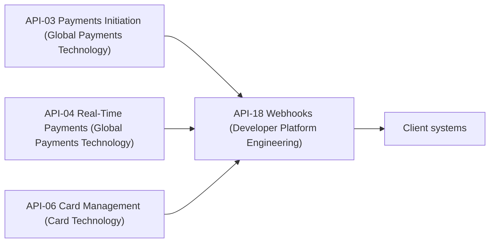

# Developer Platform Engineering

Developer Platform Engineering is the team that owns **API-18**, the [Webhooks & Event Notifications API](../apis/api-18-webhooks-event-notifications-api.md), and the **Developer Platform API Reference** document (version 3.6, July 2026). It is the only team the sources name against the Platform business domain. The sources give no headcount, reporting line, on-call rota or repositories for the team, so this page covers only what the API reference states.

## Responsibilities

The team has two documented areas of ownership.

| Area | What it covers |
| --- | --- |
| API-18 | The push-notification channel at `/events/v1`. Clients subscribe to signed HTTPS webhook events and the platform delivers them. |
| The API Reference | The catalog document that describes all 18 APIs and the platform-wide conventions they share. See the [Developer Platform overview](../apis/developer-platform-overview.md). |

### What the team does not own

The other 17 APIs belong to other teams, such as Digital Platforms Engineering (API-01, 02, 17), Global Payments Technology (API-03, 04, 05) and Card Technology (API-06). Developer Platform Engineering owns the reference document that lists them and the single event-delivery API that depends on three of them. It does not own the upstream APIs' behaviour. A change to an event in API-03, API-04 or API-06 is therefore something this team has to follow, not control.

## API-18 as the team's product

API-18 lets a client register an HTTPS URL and a list of event types. The platform then delivers signed notifications such as payment status changes, card controls updated and statement available. The API also provides replay of recent events and test events.

| Attribute | Value |
| --- | --- |
| Version | v1.3 (replay endpoint added 2026-02) |
| Base path | `/events/v1` |
| Intended consumers | All external API consumers |
| Data classification | Confidential |
| OAuth scopes | `events:subscribe`, `events:read` |
| Rate limits | 100 subscription changes/hour; delivery up to 10,000 events/second |
| Service-level objective | 99.95% delivery within 60 s |

Three endpoints make up the published surface: `POST /subscriptions`, `GET /events` and `POST /subscriptions/{id}/test`. Endpoint detail, the subscription lifecycle and receiver design guidance are on the [API-18 page](../apis/api-18-webhooks-event-notifications-api.md).

### Dependencies on other teams' APIs

API-18 is a fan-out layer. Its lineage table lists three upstream sources and one downstream consumer group.

Caption: API-18's upstream feeds and the teams that own them. Each upstream API also lists API-18 as a downstream consumer in its own lineage table.

This makes the team's delivery SLO depend on events arriving from teams it does not manage. For example, the [Card Technology](./card-technology.md) team owns API-06, which is one of the event sources. The sources do not describe any formal agreement between the teams about event schemas or change notification.

## Commitments the team carries

- **Delivery objective.** 99.95% delivery within 60 seconds. This is an event-delivery measure and not the availability or latency target that most other APIs state.
- **Two distinct limits.** The 100 subscription changes per hour limit applies to client-initiated changes. The 10,000 events per second figure is a delivery throughput ceiling. The source does not say whether that ceiling is per client or platform-wide.
- **Platform conventions.** The reference document sets rules that API-18 and every other API follow: OAuth 2.0 with 15-minute JWT access tokens, scopes enforced at least privilege, major version in the path, a 12-month support window for a superseded major version, an `Idempotency-Key` on creating POSTs (retained for 24 hours), cursor pagination, and one shared error envelope.
- **Not a critical data service.** API-18 is not one of the six APIs named as critical data services under the BCBS 239 program, and it is not registered as an upstream feed of any Tier 1 model. A breaking change to API-18 does not by itself trigger a model change review by Model Risk Governance & Review. See the [overview](../apis/developer-platform-overview.md) for the registered feeds.

## Operating notes

- The reference describes support channels for the whole platform: a developer-portal onboarding queue on business days (8:00-18:00 ET), an API operations hotline and 24x7 status page for P1/P2 incidents, and a responsible disclosure program for security issues. It does not say which channel the team staffs.
- Developer onboarding follows Sandbox (synthetic data, no SLA), then Certification (masked data), then Production, where SLAs apply. API-18's 99.95% delivery objective therefore applies in Production only.

## Gaps in the sources

The sources do not specify the signature algorithm or header, the retry schedule, event payload schemas, ordering guarantees, or the per-endpoint mapping of scopes. They do not say which upstream API originates the "statement available" event, since API-17 is not in API-18's lineage table. Treat these as open questions for the team rather than documented behaviour.

## Relationships

- owns: [API-18 Webhooks & Event Notifications API](../apis/api-18-webhooks-event-notifications-api.md)
- owns the reference for: [Developer Platform API Reference Overview](../apis/developer-platform-overview.md)
- receives events from: [API-03](../apis/api-03-payments-initiation-api.md), [API-04](../apis/api-04-real-time-payments-api.md), [API-06](../apis/api-06-card-management-api.md)
- peer team: [Card Technology](./card-technology.md)
