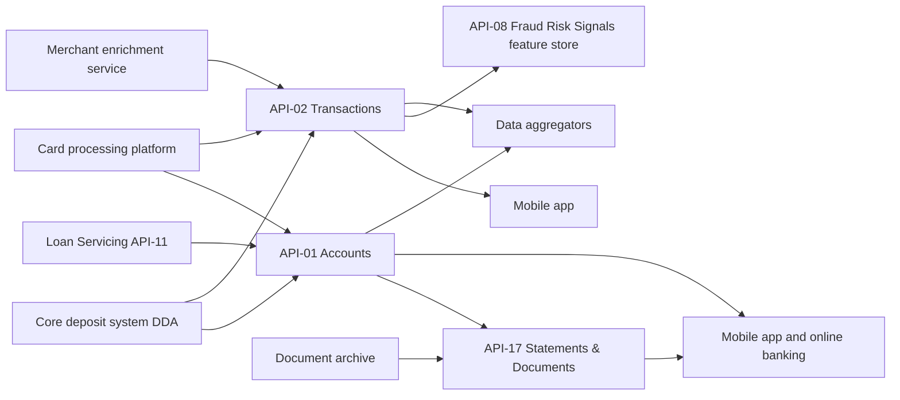

# Digital Platforms Engineering

Digital Platforms Engineering is the owning team for three APIs on the Meridian Harbor [Developer Platform](../apis/developer-platform-overview.md). They make up the client-facing "account data" surface: what accounts a customer has, what their balances and transactions are, and which statements and documents they can retrieve.

| API | Version | Base path | Domain | Wiki page |
| --- | --- | --- | --- | --- |
| API-01 Accounts API | v3.4 | `/accounts/v3` | Retail & Commercial Banking | [API-01](../apis/api-01-accounts-api.md) |
| API-02 Transactions API | v3.1 | `/transactions/v3` | Retail & Commercial Banking | [API-02](../apis/api-02-transactions-api.md) |
| API-17 Statements & Documents API | v1.4 | `/documents/v1` | Client Servicing | [API-17](../apis/api-17-statements-documents-api.md) |

The sources describe the team only through the ownership field of these API entries. They give no headcount, reporting line, on-call rota, repositories or runbooks, so none are asserted here. The platform reference is itself owned by a different group, Developer Platform Engineering, which owns API-18 (Webhooks & Event Notifications). Do not confuse the two teams.

## What the team is accountable for

- **API-01 Accounts** returns deposit, card and loan account details, balances and account holders. It is the stated source of truth for the balances shown in the mobile app and online banking. It has four read-only `GET` endpoints: list accounts, account detail, balances (current, available, ledger, with an `asOf` timestamp and, since v3.4, a `holds` field) and holders (with masked PII).
- **API-02 Transactions** returns posted and pending transactions for deposit and card accounts with merchant enrichment (category, merchant name, and location since v3.1), with up to 24 months of history. It has two reads (`GET /accounts/{accountId}/transactions` and `GET /transactions/{transactionId}`) and a `POST /transactions/search` for full-text and structured search.
- **API-17 Statements & Documents** lists statements by period, serves statements, tax forms and notices as PDF, and sets paperless (e-delivery) preferences with `PUT /preferences`. It is the only one of the three that writes state.

## Commitments the team carries

| Commitment | API-01 | API-02 | API-17 |
| --- | --- | --- | --- |
| OAuth scopes | `accounts:read`, `accounts.balances:read`, `accounts.holders:read` | `transactions:read`, `transactions.enriched:read` | `documents:read`, `documents.preferences:write` |
| Rate limit | 1,200 req/min per client; burst 200/s | 1,000 req/min per client | 300 req/min |
| Availability SLO | 99.95% monthly | 99.95% | 99.9% |
| Latency SLO | p95 180 ms | p95 250 ms | none stated |
| Classification | Confidential - Client Data | Confidential - Client Data | Confidential - Client Data |

All three are classified Confidential - Client Data. This is a less restrictive class than the Restricted - PCI class that [Card Technology](card-technology.md) carries for the Card Management API, but it still covers client financial records. Holder data is masked in API-01 responses.

The team is also bound by the platform-wide rules in the Developer Platform reference: OAuth 2.0 (client credentials with mutual TLS for servers, authorization code with PKCE for customer-facing integrations), 15-minute JWT access tokens, least-privilege scopes, cursor pagination with `limit` and `cursor`, `X-RateLimit-*` headers and `Retry-After` on HTTP 429, a standard JSON error object, and major versions in the path with at least 12 months of support for a major version after its successor reaches general availability.

### Observed volume and reliability

The Q2 2026 earnings supplement reports the following for two of the team's APIs. API-17 is not in that table.

| API | Monthly calls (millions) | Year-on-year growth | Availability | Key consumers |
| --- | --- | --- | --- | --- |
| API-01 Accounts | 1,140 | 18% | 99.99% | Mobile app, aggregators |
| API-02 Transactions | 1,320 | 22% | 99.98% | Mobile app, aggregators, Fraud |

Both are above their 99.95% SLOs. Together they account for roughly 2.46 billion of the 4.4 billion monthly calls the platform handled. API-02 is the busiest API in that table, and it is also growing faster than API-01. That growth is the main capacity pressure the sources reveal against the team's published rate limits.

## How the three APIs fit together

- **Shared upstream.** API-01 and API-02 both draw on the core deposit system (DDA) and the card processing platform. API-01 additionally depends on the [Loan Servicing API](../apis/api-11-loan-servicing-api.md) (API-11), owned by another team, for loan accounts. API-02 additionally depends on a merchant enrichment service.
- **Internal dependency.** API-01 lists API-17 as a downstream consumer, and API-17 lists API-01 as an upstream source, together with a document archive. An API-01 change that affects account identifiers or visibility can therefore reach statement listings. The sources do not say how the two are joined.
- **Cross-team consumers.** API-02 feeds the feature store of the [Fraud Risk Signals API](../apis/api-08-fraud-risk-signals-api.md) (API-08), which API-08 lists as an upstream source. Fraud Strategy is also a named consumer of API-02. A change to transaction shape or enrichment therefore affects fraud scoring, not only client apps.
- **External consumers.** Licensed data aggregators and corporate clients use API-01 and API-02. Corporate clients also use API-17. The mobile app and online banking are the first-party consumers.

## Change history

- API-01: v3.4 (2026-03) added `holds` to the balances response. v3.2 (2025-07) added cursor-based pagination. v2 was sunset on 2025-12-31.
- API-02: v3.1 (2026-01) added `merchant.location`. v3.0 (2025-04) made enrichment generally available.
- API-17: v1.4 (2025-12) added tax forms.

Each major version is in the URL path, so a breaking change would need a new path such as `/accounts/v4`. Minor releases such as these have been additive. Consumers should tolerate new fields.

## Model and regulatory exposure

None of the team's APIs is registered as an upstream feed to a Tier 1 model (MDL-ALM-014, MDL-CR-007, MDL-CAP-003) in the platform's API-to-model lineage matrix. The Appendix C list of critical data services, which gets 24x7 escalation during quarter close, also does not include them. This means the BCBS 239 critical-data-service controls the reference describes for Tier 1 feeders, including automatic model change review by MRGR on breaking changes, are not documented as applying to these APIs. Their impact is mostly operational and client-facing. Even so, API-02's role as a fraud feature source is a downstream dependency worth treating carefully when changing it.

## Notes for people working with the team's APIs

- Balances in API-01 carry `current`, `available` and `ledger` values and an `asOf` timestamp. In the documented example, `available` equals `current` minus `holds`. The source does not state that as a rule.
- Statement retrieval in API-17 is two steps: list by account and period, then download by `documentId`. The download path carries no account ID.
- Production incidents (P1/P2) use the platform-wide API operations hotline and status page. The sources give no team-specific channel.

## Gaps in the sources

The sources do not document the following, so do not assume them: per-endpoint scope mapping for any of the three APIs, whether `transactions.enriched:read` gates the `merchant` block, whether `POST /transactions/search` needs an `Idempotency-Key`, the `PUT /preferences` body, API-17 pagination and error cases, how API-17 authorises a `documentId`, API-17 usage volumes, and any team-level staffing, escalation or roadmap information.
