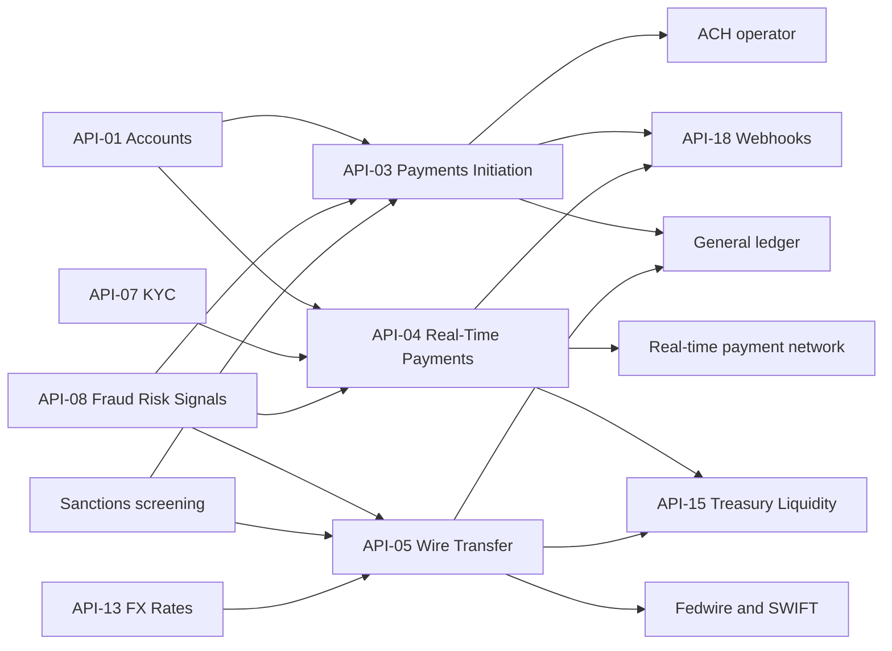

# Global Payments Technology

Global Payments Technology is the team that owns the Payments business domain of the [Developer Platform](../apis/developer-platform-overview.md). The API reference names it as owner of exactly three APIs: [API-03 Payments Initiation](../apis/api-03-payments-initiation-api.md), [API-04 Real-Time Payments](../apis/api-04-real-time-payments-api.md) and [API-05 Wire Transfer](../apis/api-05-wire-transfer-api.md). The sources give no headcount, reporting line, on-call rota or repositories for the team, so this page covers only what the API reference states about the APIs it owns.

## Responsibilities

The three APIs cover the payment rails a client can use to move money out of a deposit account. They are split by rail and speed.

| API | Version | Base path | Rails | Typical consumers |
| --- | --- | --- | --- | --- |
| API-03 Payments Initiation | v3.2 | `/payments/v3` | ACH (including same-day), book transfer, check; single payments and bulk files | Corporate clients, ERP connectors, internal treasury applications |
| API-04 Real-Time Payments | v2.3 | `/rtp/v2` | Instant, irrevocable account-to-account payments and requests for payment, 24x7x365 | Corporate and small-business clients, consumer app (P2P) |
| API-05 Wire Transfer | v2.0 | `/wires/v2` | Fedwire (domestic) and SWIFT (cross-border, MT or ISO 20022 MX), with FX conversion | CIB corporate and institutional clients |

All three are classified Restricted - Financial Transaction, and all three require an `Idempotency-Key` header on the payment-creating POST in the published examples.

### What the team does not own

The team does not own the services its APIs call. Funds checks and KYC limits come from the Accounts API (API-01) and the Customer Identity & KYC API (API-07). Fraud scoring comes from the Fraud Risk Signals API (API-08), owned by [Fraud Strategy Engineering](./fraud-strategy-engineering.md). FX rates come from the FX Rates API (API-13). Event delivery to clients is done by the Webhooks & Event Notifications API (API-18), owned by [Developer Platform Engineering](./developer-platform-engineering.md). The sources also list sanctions screening as an upstream of API-03 and API-05, but do not say who runs it or whether it is an API.

## How the three APIs differ

### API-03: screened, staged payments

API-03 is the batch-oriented rail. A payment is created with `POST /payments` and followed through the states `received`, `screened`, `released`, `settled` and `returned` via `GET /payments/{paymentId}`. The reference says every payment is screened by sanctions and the Fraud Risk Signals API before release, and `POST /payments/{paymentId}/cancel` is available only before release. The example response returns a `fraudScore` and an `expectedSettlement` date alongside the `received` status.

Bulk input goes through `POST /payment-files`, which accepts ISO 20022 `pain.001` or CSV, up to 50,000 items per file, under a dedicated scope (`payments.bulk:write`). The changelog records ISO 20022 structured remittance in v3.2 (2026-05) and the same-day ACH rail in v3.1 (2025-10).

### API-04: instant and irrevocable

API-04 sends credit transfers (`POST /credit-transfers`) and requests for payment (`POST /requests-for-payment`). Status values are `accepted`, `rejected` and `pending-review`. A pre-check, `GET /participants/{routing}`, tells a caller whether the receiving bank is reachable on the network. Payments are capped at $1,000,000 each. The example response carries a `settledAt` timestamp, which reflects that settlement is immediate rather than staged.

Request for payment became generally available in v2.3 (2026-02), and v2.2 (2025-09) opened the API to middle-market clients. The reference reports volume growth of 64% year-on-year in 2Q26, the only growth figure stated for any of the team's APIs.

### API-05: wires with quoted FX

API-05 creates domestic or international wires with `POST /wires` and reports status and UETR tracking events through `GET /wires/{wireId}`. For cross-currency wires the client first calls `POST /wires/quotes` to get an FX quote valid for 60 seconds, then passes the returned `quoteId` in the wire request. The example wire response starts in a `screening` status and returns the UETR and the applied rate. The v2.0 changelog entry (2025-11) records that the ISO 20022 MX migration is complete.

## Shared flow and dependencies

Each API pulls from the same kinds of upstream services before release and feeds the same kinds of downstream systems.

Caption: upstream and downstream edges taken from the data-lineage tables of API-03, API-04 and API-05.

Points worth knowing:

- **Fraud screening is universal.** All three APIs list API-08 as an upstream source. The documented call for API-03 is that screening happens before release.
- **Funds and identity checks differ by rail.** API-03 lists API-01 for funds checks. API-04 lists API-01 and API-07. API-05 lists neither, and instead depends on API-13 for FX.
- **Webhooks fan out from two of the three.** API-03 and API-04 are named upstream sources of API-18. API-05's lineage does not list API-18, so a client should not assume wire status events are pushed. The sources do not say how wire status changes are communicated apart from polling `GET /wires/{wireId}`.
- **Treasury and ledger feeds.** API-04 and API-05 list the Treasury Liquidity Positions API (API-15) as downstream, with API-04 specifically feeding intraday cash. API-03 and API-05 list the general ledger.

## Operating commitments

| API | Rate limit | Service-level objective |
| --- | --- | --- |
| API-03 | 300 requests/minute per client, bulk files up to 50,000 items | 99.98% availability, p95 latency 400 ms |
| API-04 | 600 requests/minute per client, max $1,000,000 per payment | 99.99% availability, p95 end-to-end 4 s |
| API-05 | 120 requests/minute per client | 99.99% availability during operating hours |

- **Different latency meanings.** API-03's 400 ms is the API's own response time. API-04's 4 s is end-to-end and so includes the network round trip. API-05 states no latency target.
- **Wire availability is bounded.** API-05's 99.99% applies only during operating hours, unlike API-04's round-the-clock figure. This matches the source's framing of Fedwire and SWIFT as operating-hours rails, though the source does not define the hours.
- **Scopes.** API-03 uses `payments:write`, `payments:read` and `payments.bulk:write`. API-04 uses `rtp:send`, `rtp:read` and `rtp.rfp:write`. API-05 uses `wires:write` and `wires:read`. Read and write access are separated on every API.
- **Idempotency.** Platform conventions say creating POSTs take an `Idempotency-Key`, retained for 24 hours. Money-moving calls should always send one, and `500` responses should be retried with backoff only for idempotent requests.
- **Environments.** Developers move from Sandbox to Certification to Production. SLAs apply only in Production.

## Model and regulatory exposure

None of API-03, 04 or 05 is registered as an upstream feed of a Tier 1 model, and none is one of the six critical data services. A breaking change to them therefore does not by itself trigger a Model Risk Governance & Review model change review. They still follow the platform rule that a superseded major version stays supported for 12 months. See the [overview](../apis/developer-platform-overview.md) for the registered feeds.

## Gaps in the sources

The sources do not specify the per-endpoint scope mapping, the exact cut-off or operating hours for same-day ACH and wires, the cancellation window for API-03 beyond "before release", the retry or return reason codes, or what happens to an API-04 payment in `pending-review`. They also do not describe the team's own processes. Treat these as open questions for the team.

## Relationships

- owns: [API-03 Payments Initiation API](../apis/api-03-payments-initiation-api.md)
- owns: [API-04 Real-Time Payments API](../apis/api-04-real-time-payments-api.md)
- owns: [API-05 Wire Transfer API](../apis/api-05-wire-transfer-api.md)
- depends on: [API-01 Accounts](../apis/api-01-accounts-api.md), [API-07 Customer Identity & KYC](../apis/api-07-customer-identity-kyc-api.md), [API-08 Fraud Risk Signals](../apis/api-08-fraud-risk-signals-api.md), [API-13 FX Rates](../apis/api-13-fx-rates-api.md)
- publishes events through: [API-18 Webhooks & Event Notifications](../apis/api-18-webhooks-event-notifications-api.md), run by [Developer Platform Engineering](./developer-platform-engineering.md)
- catalogued in: [Developer Platform overview](../apis/developer-platform-overview.md)
