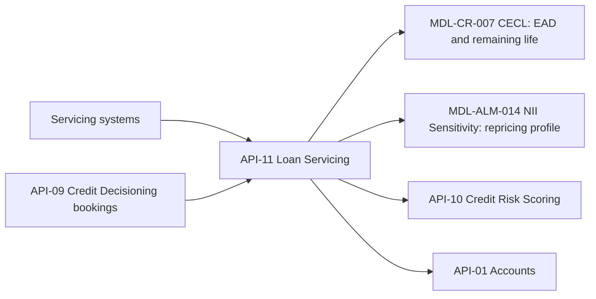

# Lending Platforms Engineering

Lending Platforms Engineering is the owning team for the [API-11 Loan Servicing API](../apis/api-11-loan-servicing-api.md). The Developer Platform API catalog lists it as the owner of exactly one API, which belongs to the **Lending Operations** business domain. The sources give no headcount, reporting line, on-call rota, repositories or team-specific escalation path. Everything below comes from the published API reference, and the corpus contains no implementation code or tests.

## What the team is accountable for

The team runs the loan-level servicing data service. It exposes balances, payment schedules, delinquency status, remaining contractual life and repricing terms for consumer and wholesale loans. It also supports payoff quotes and payment posting.

Published surface, base path `/loans/v2`:

| Method | Path | Purpose |
| --- | --- | --- |
| GET | `/loans/{loanId}` | Loan details: balance, rate, next reset date, maturity, status |
| GET | `/loans/{loanId}/schedule` | Amortization schedule |
| GET | `/portfolio/snapshots/{asOf}` | Month-end portfolio snapshot by segment and repricing bucket (0-3m, 3-12m, 1-5y, >5y) |
| POST | `/loans/{loanId}/payoff-quotes` | Generate a payoff quote |

Payment posting is described in the API overview, and it is the reason for the `loans.payments:write` scope. No dedicated posting path appears in the endpoint table.

The surface has two audiences. Loan-level endpoints serve servicing applications and customer channels. The portfolio snapshot serves risk and finance model consumers and sits behind the separate `loans.portfolio:read` scope. The scope-to-endpoint mapping is inferred from the scope names and is not stated per endpoint in the source.

### Milestones the team has shipped

| Version | Date | Change | Driver |
| --- | --- | --- | --- |
| v2.6 | 2025-06 | Remaining-life field | CECL |
| v2.8 | 2026-02 | Repricing-bucket snapshot | ALM |

Both of the last two documented releases were added specifically for Tier 1 model consumers.

## Who depends on the team's API

- **Servicing applications and customer channels** are the intended interactive consumers.
- **[CECL allowance model](../models/cecl-allowance-model.md) (MDL-CR-007)** takes balances (used as EAD) and remaining life.
- **[NII sensitivity model](../models/nii-sensitivity-model.md) (MDL-ALM-014)** takes the repricing profile of the loan asset side.
- **[Credit Risk Scoring API (API-10)](../apis/api-10-credit-risk-scoring-api.md)** and **[Accounts API (API-01)](../apis/api-01-accounts-api.md)** are downstream API consumers.

In the API-to-model lineage matrix, API-11 is marked as an upstream feed for both MDL-ALM-014 and MDL-CR-007. It is the only API in that matrix feeding both.

## Upstream dependencies

| Upstream | Role |
| --- | --- |
| Loan servicing systems (mortgage, auto, card, commercial) | Underlying system data |
| [Credit Decisioning API (API-09)](../apis/api-09-credit-decisioning-api.md), owned by [Credit Platforms Engineering](credit-platforms-engineering.md) | Bookings: a decisioned loan becomes a serviced loan |

The sources do not describe how API-11 behaves when an upstream servicing system is late or unavailable. The team should treat that as an open operating question, since the downstream models consume month-end snapshots.

## Commitments the team carries

| Commitment | Value |
| --- | --- |
| API version | v2.8 |
| Data classification | Confidential - Client Data |
| OAuth scopes | `loans:read`, `loans.payments:write`, `loans.portfolio:read` |
| Rate limit | 900 requests/minute; portfolio snapshots via async extract |
| Availability SLO | 99.95% |

Platform-wide rules also bind the team: OAuth 2.0 with 15-minute JWTs, an `Idempotency-Key` (retained 24 hours) on POSTs that create resources such as payoff quotes, a major version supported for at least 12 months after its successor reaches GA, and the standard error envelope.

## Operating notes and invariants

- **Critical data service.** API-11 is one of six critical data services (API-10, 11, 12, 14, 15, 16). Production incidents go through the API operations hotline. During quarter close, escalation runs through the Data and Technology Risk Committee, 24x7.
- **Change control is heavy.** Critical data services fall under the BCBS 239 program, with named data owners, data-quality rules and enhanced change management. A breaking change triggers a model change review by Model Risk Governance & Review. Treat any change to balance, remaining-life, repricing-bucket or delinquency semantics as potentially breaking. Minor versions must stay additive and backward compatible, and deprecations are signalled with the `Sunset` header.
- **Numbers flow straight into the allowance.** Remaining life is an exponent in the lifetime PD calculation, and the balance enters ECL one-for-one as EAD. Errors in these fields therefore change reported allowances directly. The FY2025 C&I segment balance of 172,500 USD millions in the snapshot example matches the CECL model's C&I EAD.
- **Repricing buckets must sum to 1.0.** The snapshot reports the share of balance in each bucket, and it states its own `units`.
- **Bulk access discipline.** The 900 requests/minute limit is for interactive use. Bulk portfolio pulls belong on the async extract, not loops over `/loans/{loanId}`. The source does not say how the extract relates to the synchronous snapshot endpoint.
- **Client data.** Loan-level responses are client data, while aggregated snapshots carry segment totals.
- **Network exposure.** API-11 is not in the platform's list of private-network-only risk and finance APIs (API-10, 14, 15, 16).

## Related

- [API-11 Loan Servicing API](../apis/api-11-loan-servicing-api.md)
- [Credit Platforms Engineering](credit-platforms-engineering.md)
- [CECL Allowance Model](../models/cecl-allowance-model.md)
- [NII Sensitivity Model](../models/nii-sensitivity-model.md)
