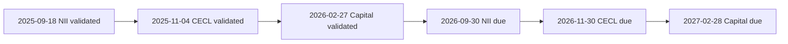
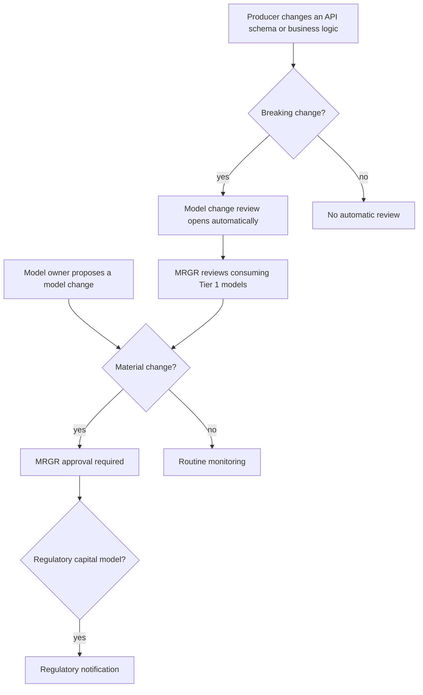

# Model Risk Governance & Review (MRGR)

<!-- openwiki: broken internal link [../../sources/reports/mhfc-2025-annual-report.md#L435-L439] heading anchor "L435-L439" does not exist in "../../sources/reports/mhfc-2025-annual-report.md". Fix the href or restore the target, then delete this comment. -->
<!-- openwiki: broken internal link [../../sources/reports/mhfc-2025-annual-report.md#L660] heading anchor "L660" does not exist in "../../sources/reports/mhfc-2025-annual-report.md". Fix the href or restore the target, then delete this comment. -->
Model Risk Governance & Review (MRGR) is the independent model validation function of [Meridian Harbor Financial Corp.](../organizations/meridian-harbor-financial-corp.md) (MHFC, a fictional institution; all source documents are labelled synthetic). The 2025 Annual Report says model risk is governed by the Model Risk Policy, which aligns with SR 11-7, and is "overseen by" MRGR, which **reports to the Chief Risk Officer** ([Annual Report, Model Risk Management](../../sources/reports/mhfc-2025-annual-report.md#L435-L439)). The glossary defines MRGR simply as "the independent model validation function" ([Annual Report glossary](../../sources/reports/mhfc-2025-annual-report.md#L660)).

For the framework itself (tiers, rules, controls) see [Model Risk (SR 11-7)](../concepts/model-risk-sr-11-7.md). This page covers MRGR as a team: what it is responsible for, how it interacts with model owners and upstream data producers, and where the sources stop. The sources name no individual who leads MRGR and give no headcount; the executive it reports to is the [Chief Risk Officer](../people/chief-risk-officer.md).

## Position in the organization

- **Reporting line.** MRGR reports to the CRO, who leads the independent risk function organized by risk stripe (credit, market, liquidity, model, operational, compliance, reputational). MRGR is the "model" stripe in practice ([CRO page](../people/chief-risk-officer.md)).
<!-- openwiki: broken internal link [../../sources/reports/mhfc-2025-pillar3-disclosures.md#L60] heading anchor "L60" does not exist in "../../sources/reports/mhfc-2025-pillar3-disclosures.md". Fix the href or restore the target, then delete this comment. -->
- **Second line of defense.** The Pillar 3 disclosures put lines of business and Treasury/CIO in the first line (they own the risks they generate), Independent Risk Management and Compliance in the second line (set appetite, policies and limits and challenge the first line), and Internal Audit in the third ([Pillar 3, §2](../../sources/reports/mhfc-2025-pillar3-disclosures.md#L60)). The sources do not state explicitly which line MRGR sits in, but as part of the CRO's organization it falls in the independent second line.
- **Independence from model owners.** Every Tier 1 model is owned by a first-line team and validated by MRGR, never by its owner (see the table below).

## Responsibilities

The sources attribute these duties to MRGR:

<!-- openwiki: broken internal link [../../sources/reports/mhfc-2025-pillar3-disclosures.md#L472] heading anchor "L472" does not exist in "../../sources/reports/mhfc-2025-pillar3-disclosures.md". Fix the href or restore the target, then delete this comment. -->
1. **Annual independent validation of Tier 1 models.** "Tier 1 models undergo annual independent validation by Model Risk Governance & Review (MRGR), quarterly ongoing performance monitoring and annual attestation by model owners" ([Pillar 3, §14](../../sources/reports/mhfc-2025-pillar3-disclosures.md#L472)).
2. **Approving material model changes.** Material model changes require MRGR approval; for regulatory capital models they also require regulatory notification (same paragraph).
<!-- openwiki: broken internal link [../../sources/api_docs/mhfc-developer-platform-api-reference.md#L18] heading anchor "L18" does not exist in "../../sources/api_docs/mhfc-developer-platform-api-reference.md". Fix the href or restore the target, then delete this comment. -->
<!-- openwiki: broken internal link [../../sources/reports/mhfc-2025-pillar3-disclosures.md#L474] heading anchor "L474" does not exist in "../../sources/reports/mhfc-2025-pillar3-disclosures.md". Fix the href or restore the target, then delete this comment. -->
3. **Reviewing breaking upstream API changes.** Upstream APIs are registered as critical data sources in the model inventory, and a breaking change to an API's schema or business logic automatically opens a model change review by MRGR ([API reference §1](../../sources/api_docs/mhfc-developer-platform-api-reference.md#L18); [Pillar 3, §14](../../sources/reports/mhfc-2025-pillar3-disclosures.md#L474)).
<!-- openwiki: broken internal link [../../sources/models/nii-sensitivity-model.md#L44-L49] heading anchor "L44-L49" does not exist in "../../sources/models/nii-sensitivity-model.md". Fix the href or restore the target, then delete this comment. -->
4. **Approving a model component's calibration.** The deposit betas used by the NII model come from the Deposit Behaviour sub-model, calibrated annually and "MRGR approved" ([NII model README](../../sources/models/nii-sensitivity-model.md#L44-L49)).
5. **Recording findings and rating severity.** MRGR's validations produce findings with severities (medium, low) that are disclosed in Pillar 3 §14.

<!-- openwiki: broken internal link [../../sources/reports/mhfc-2025-pillar3-disclosures.md#L89] heading anchor "L89" does not exist in "../../sources/reports/mhfc-2025-pillar3-disclosures.md". Fix the href or restore the target, then delete this comment. -->
<!-- openwiki: broken internal link [../../sources/reports/mhfc-2025-pillar3-disclosures.md#L81-L91] heading anchor "L81-L91" does not exist in "../../sources/reports/mhfc-2025-pillar3-disclosures.md". Fix the href or restore the target, then delete this comment. -->
What MRGR does **not** do: it does not approve Tier 1 models for use (the Firmwide Model Risk Committee approves Tier 1 models and model risk appetite, [Pillar 3 §2](../../sources/reports/mhfc-2025-pillar3-disclosures.md#L89)), and it does not own model outputs. Business committees use the models: ALCO reviews NII model outputs monthly, the Capital Governance Committee owns capital model outputs, and the Allowance Committee approves scenario weights, CECL outputs and overlays each quarter ([Pillar 3 §2](../../sources/reports/mhfc-2025-pillar3-disclosures.md#L81-L91)). The model owners run the models and attest to them annually.

## Models validated

<!-- openwiki: broken internal link [../../sources/models/nii-sensitivity-model.md#L15-L26] heading anchor "L15-L26" does not exist in "../../sources/models/nii-sensitivity-model.md". Fix the href or restore the target, then delete this comment. -->
<!-- openwiki: broken internal link [../../sources/models/cecl-allowance-model.md#L125-L136] heading anchor "L125-L136" does not exist in "../../sources/models/cecl-allowance-model.md". Fix the href or restore the target, then delete this comment. -->
<!-- openwiki: broken internal link [../../sources/models/capital-planning-model.md#L15-L26] heading anchor "L15-L26" does not exist in "../../sources/models/capital-planning-model.md". Fix the href or restore the target, then delete this comment. -->
<!-- openwiki: broken internal link [../../sources/reports/mhfc-2025-annual-report.md#L439] heading anchor "L439" does not exist in "../../sources/reports/mhfc-2025-annual-report.md". Fix the href or restore the target, then delete this comment. -->
All three Tier 1 (High) models that directly drive amounts disclosed in the Annual Report name MRGR as independent validator in their README sheets ([NII](../../sources/models/nii-sensitivity-model.md#L15-L26), [CECL](../../sources/models/cecl-allowance-model.md#L125-L136), [Capital](../../sources/models/capital-planning-model.md#L15-L26)). They are three of roughly 2,900 models in the Firm's inventory ([Annual Report](../../sources/reports/mhfc-2025-annual-report.md#L439)).

| Model | Owner (first line) | Last validated | Next due | Upstream APIs | Most recent findings |
|---|---|---|---|---|---|
| [Net Interest Income Sensitivity](../models/nii-sensitivity-model.md) (MDL-ALM-014) | Corporate Treasury - Asset & Liability Management | 2025-09-18 | 2026-09-30 | API-12, API-15, API-11 | Medium: deposit betas held constant across shock sizes. |
| [CECL Lifetime ECL](../models/cecl-allowance-model.md) (MDL-CR-007) | Consumer & Wholesale Credit Risk - Allowance Methodology | 2025-11-04 | 2026-11-30 | API-10, API-11, API-14 | Medium: no explicit model for unfunded commitments. Low: Card PD elasticity documentation. |
| [Capital Planning & Stress Projection](../models/capital-planning-model.md) (MDL-CAP-003) | Corporate Treasury - Capital Management | 2026-02-27 | 2027-02-28 | API-16, API-14, API-15 | Nothing above low severity. |

<!-- openwiki: broken internal link [../../sources/reports/mhfc-2025-pillar3-disclosures.md#L517] heading anchor "L517" does not exist in "../../sources/reports/mhfc-2025-pillar3-disclosures.md". Fix the href or restore the target, then delete this comment. -->
Findings come from [Pillar 3 §14](../../sources/reports/mhfc-2025-pillar3-disclosures.md#L517). Owner teams: [Corporate Treasury - ALM](corporate-treasury-alm.md), [Consumer & Wholesale Credit Risk - Allowance Methodology](consumer-wholesale-credit-risk-allowance-methodology.md) and [Corporate Treasury - Capital Management](corporate-treasury-capital-management.md).

### How findings are handled

The sources describe two kinds of disposition, both of which keep the model in use:

- **Remediation through an interim measure.** The CECL unfunded-commitment gap is remediated through an interim overlay. The workbook itself still excludes off-balance-sheet commitments.
<!-- openwiki: broken internal link [../../sources/models/nii-sensitivity-model.md#L57-L62] heading anchor "L57-L62" does not exist in "../../sources/models/nii-sensitivity-model.md". Fix the href or restore the target, then delete this comment. -->
- **Compensating control.** For the NII model's constant deposit betas, the compensating control is the quarterly dynamic balance-sheet simulation run in the ALM engine ([NII README](../../sources/models/nii-sensitivity-model.md#L57-L62)).

The sources do not describe a finding-closure workflow, due dates for remediation or severity definitions.

## Cadence and calendar

Each model's "next due" date is about a year after its last validation, consistent with annual Tier 1 validation. The validations are staggered, so MRGR's workload is spread across the year:

Caption: last-validation and next-due dates recorded in the three model README sheets, in date order. The NII model is the next to fall due.

Note that the next-due dates fall later than a strict twelve months for some models (for example CECL: 2025-11-04 to 2026-11-30), so the sources imply a due-by-month-end convention, not a fixed anniversary. This is an inference from the dates, not a stated rule.

## Change-review trigger and control flow

MRGR is the receiving end of two distinct triggers, and the sources combine them as follows:

Caption: trigger and approval path for model changes. The two stated rules (automatic review on breaking API change, MRGR approval of material changes) are documented separately in the sources. How a review is routed to the materiality decision is a synthesis, not a documented workflow.

<!-- openwiki: broken internal link [../../sources/reports/mhfc-2025-pillar3-disclosures.md#L525-L533] heading anchor "L525-L533" does not exist in "../../sources/reports/mhfc-2025-pillar3-disclosures.md". Fix the href or restore the target, then delete this comment. -->
The automatic trigger works through the model inventory. Each model's upstream data feeds are registered there, and the APIs that feed Tier 1 models are classified as critical data services under [BCBS 239](../concepts/bcbs-239.md). Individual API pages repeat the practical rule that a change to the semantics of fields feeding a model (balances, remaining life, repricing buckets, curve identifiers, units) should be treated as potentially breaking. The blast radius of a change follows the consumption map in [Pillar 3 §15](../../sources/reports/mhfc-2025-pillar3-disclosures.md#L525-L533):

| API | Tier 1 models whose review it can open |
|---|---|
| API-10 Credit Risk Scoring | MDL-CR-007 |
| API-11 Loan Servicing | MDL-CR-007, MDL-ALM-014 |
| API-12 Market Data | MDL-ALM-014 |
| API-14 Macroeconomic Scenario | MDL-CR-007, MDL-CAP-003 |
| API-15 Treasury Liquidity Positions | MDL-ALM-014, MDL-CAP-003 |
| API-16 Regulatory Reporting | MDL-CAP-003 |

API-11, API-14 and API-15 are each shared by two models, so a breaking change to one of them touches two validation scopes. See also the [API-10](../apis/api-10-credit-risk-scoring-api.md), [API-11](../apis/api-11-loan-servicing-api.md) and [API-12](../apis/api-12-market-data-api.md) pages, which each note the MRGR review obligation.

## What MRGR validates against

Each workbook documents its own limits and known limitations in a "Limits, controls and known limitations" section of the README, and embeds in-model checks. These are first-line controls that do not replace MRGR validation, but they define the surface a validator examines:

- **NII model.** Parallel shocks only, static balance sheet, constant betas across shock sizes, no negative-cost floors. Board limits: NII decline at most 7.0% of base NII, EVE decline at most 15.0% of Tier 1 capital. In-model status cells return `BREACH` or `Within limit`. At YE2025 the worst NII change (-200 bp) was -6.0% and the worst EVE change was 2.5% of Tier 1.
- **CECL model.** Simplified pool-level approach, unfunded commitments excluded, scenario weights must sum to 100% (20% / 50% / 30%), qualitative overlays must stay within +/-15% of the modeled allowance per segment (check cell returns `OK` or `REVIEW`), and the total allowance reconciles to the reported $15,920 million.
- **Capital model.** No AOCI volatility modeling, no deferred-tax-asset threshold deductions, and stress losses are top-down inputs from the enterprise stress testing program. A check returns `YES` or `NO - capital action required` for the stressed minimum against the 10.2% requirement.

Details for each are on the model pages linked above.

## Operating guidance

- **Before changing a model or an upstream API,** identify which Tier 1 models consume it (table above). A breaking API change opens an MRGR review automatically. A material model change needs MRGR approval, and for regulatory capital models (MDL-CAP-003 is the capital planning model) regulatory notification as well.
- **Track due dates.** Annual Tier 1 validation means an overdue "next validation due" date breaks policy. The earliest upcoming date is 2026-09-30 for MDL-ALM-014.
- **Disclosed numbers move with models.** Disclosures cite the workbooks as their source, so validation findings and model changes can affect Annual Report and Pillar 3 figures.

## Gaps in the sources

The corpus does not describe: MRGR's size, leadership or internal structure; the validation test suite; severity definitions; remediation timelines; how the 2,900-model inventory is tiered below Tier 1; or the workflow for approving a deposit beta calibration. The Annual Report mentions only "documented ongoing performance monitoring" for Tier 1 models, while Pillar 3 specifies quarterly monitoring and annual owner attestation; treat Pillar 3 as the more specific statement. Validation dates on the model READMEs (for example NII 2025-09-18) are consistent with Pillar 3, but the Annual Report model table lists only the last-validated dates.
