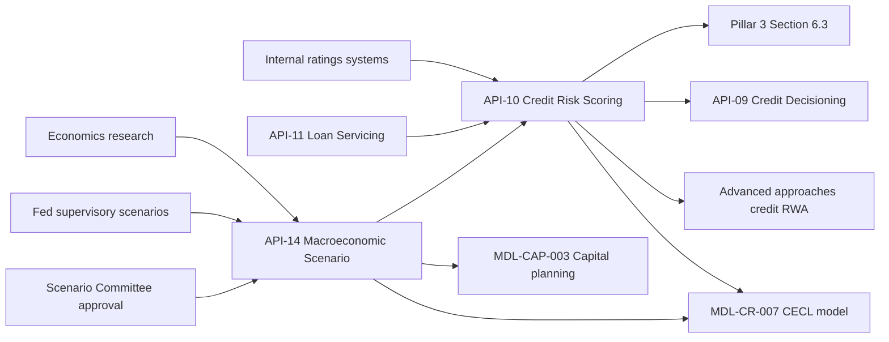

# Risk Analytics Engineering

Risk Analytics Engineering is the owning team for two internal-only APIs on the Meridian Harbor Developer Platform: the [Credit Risk Scoring API (API-10)](../apis/api-10-credit-risk-scoring-api.md) and the [Macroeconomic Scenario API (API-14)](../apis/api-14-macroeconomic-scenario-api.md). Both are registered as upstream data feeds for Tier 1 models. The [CECL allowance model](../models/cecl-allowance-model.md) uses both, and API-14 also feeds capital planning. This is why they appear in the platform's list of critical data services.

The sources describe the team only through these two API reference entries. They give no headcount, reporting line, repositories or on-call rota, so this page does not guess at them.

## What the team is accountable for

| | API-10 Credit Risk Scoring | API-14 Macroeconomic Scenario |
| --- | --- | --- |
| Version | v3.0 | v1.6 |
| Base path | `/credit-risk/v3` | `/scenarios/v1` |
| Business domain | Credit Risk | Risk & Finance |
| Serves | Pool-level and obligor-level PD, LGD and EAD parameters | Approved macroeconomic scenario sets: paths for unemployment, GDP, house prices, CRE prices, rates and spreads, plus probability weights |
| Data classification | Restricted - Risk Model Data | Restricted - Internal |
| OAuth scopes | `risk.params:read` | `scenarios:read`, `scenarios:approve` |
| Rate limit | 60 requests/minute; bulk data goes through async extract jobs | 30 requests/minute |
| Availability SLO | 99.95% | 99.9% |
| Freshness SLO | Quarterly refresh within T+3 business days | New set published within 1 business day of approval |

### API-10: risk parameters

API-10 is the single place where downstream consumers get probability of default, loss given default and exposure at default parameters by portfolio pool (for example Credit Card, Residential Mortgage, CRE and C&I). It provides two parameter bases through separate endpoints:

- `GET /pools/{poolId}/parameters?basis=pit` returns point-in-time, scenario-conditional parameters for CECL. These are PD, LGD, remaining life and macro elasticities.
- `GET /pools/{poolId}/parameters?basis=ttc` returns through-the-cycle PD and LGD with regulatory floors, used for Advanced approaches capital.
- `GET /pools` lists the pools.
- `POST /extracts` starts an asynchronous full-portfolio extract and returns a `jobId`. This is the intended route for bulk pulls, given the 60 requests/minute limit.

An example PIT response for `CARD` as of 2025-12-31 carries `basePdAnnual` 0.0374, `lgd` 0.88, `remainingLifeYears` 1.7, `pdElasticityPerPpUnemployment` 0.165 and `modelVersion` `PD-CARD-5.2`. These are the same values that appear in the CECL workbook's Credit Card segment inputs.

The PIT and TTC split was introduced in v3.0 (2025-10), alongside the macro elasticities that the CECL model needs.

### API-14: scenario sets

API-14 distributes scenario sets such as `MSC-2025Q4` and `SA-2025-INT`. A set contains named scenarios with probability weights and approval metadata. The three endpoints are:

- `GET /scenario-sets` lists the sets.
- `GET /scenario-sets/{setId}` returns scenarios, weights and approval metadata.
- `GET /scenario-sets/{setId}/paths/{variable}` returns the quarterly path of one variable in each scenario.

For `MSC-2025Q4` (approved 2025-12-15) the Upside, Baseline and Downside scenarios carry weights of 0.2, 0.5 and 0.3. Peak unemployment is 3.8%, 4.4% and 6.8% respectively.

Scenario sets are versioned and locked after Scenario Committee approval. The `scenarios:approve` scope exists alongside the read scope, so approval is a distinct permission from consumption. The sources do not say who holds it or what the approval call looks like.

v1.5 (2025-10) added an internal severely adverse set. v1.6 (2026-05) was the migration to the strategic data platform, which cut scenario load time for the CECL and capital planning models from six hours to under forty minutes.

## How the two APIs fit together

API-14 is upstream of API-10 as well as of the models. Its scenario data conditions the PIT parameters and macro elasticities that API-10 serves. The CECL model then reads both feeds. The workbook takes PD, LGD and elasticities from API-10, and scenario paths and weights from API-14. It takes balances and remaining life from API-11, which API-10 also lists as an upstream source.

In the CECL calculation, scenario PD is the base PD adjusted by the API-10 elasticity times the API-14 scenario's peak unemployment, measured against baseline. Lifetime PD, scenario LGD, and EAD-weighted ECL follow from that. The CECL model requires scenario weights to sum to 100%, so API-14's published weights have to satisfy that check (`MSC-2025Q4` sums to 1.0). See the [CECL allowance model](../models/cecl-allowance-model.md) for the full calculation.

## Consumers and downstream impact

| Consumer | Uses |
| --- | --- |
| MDL-CR-007 CECL model (owned by [Consumer & Wholesale Credit Risk - Allowance Methodology](consumer-wholesale-credit-risk-allowance-methodology.md)) | API-10 PIT parameters; API-14 weights, unemployment, HPI and CRE paths |
| MDL-CAP-003 Capital Planning & Stress Projection Model (owned by [Corporate Treasury - Capital Management](corporate-treasury-capital-management.md)) | API-14 scenario variables, including the severely adverse set |
| Advanced approaches credit RWA | API-10 TTC parameters with regulatory floors |
| Portfolio monitoring | API-10 |
| [API-09 Credit Decisioning](../apis/api-09-credit-decisioning-api.md) (owned by [Credit Platforms Engineering](credit-platforms-engineering.md)) | API-10, listed as an upstream input to underwriting |
| Stress testing, ALM | API-14, listed as intended consumers |
| Pillar 3 Section 6.3 | API-10 lineage |

The lineage appendix registers API-10 only against MDL-CR-007. It registers API-14 against MDL-CR-007 and MDL-CAP-003. The ALM team's NII sensitivity model is not registered against either API, although API-14's reference lists ALM as an intended consumer.

Usage data from the Q2 2026 earnings supplement shows API-10 as low-volume but high-consequence: about 12 million calls a month (+6% year on year) at 99.95% availability. Its key consumers are the CECL model, capital and monitoring. Pool-level PD and LGD estimates were refreshed in June 2026 and reflected in the quarter-end allowance.

## Governance, operations and invariants

- **Critical data service status.** Both APIs fall under the BCBS 239 critical-data-service designation. These services carry named data owners, documented data-quality rules and enhanced change management. They are registered in the model inventory, so any breaking change automatically triggers a model change review by Model Risk Governance & Review (MRGR). Treat a breaking change to either API's payload as a model change, not only an API change.
- **Escalation.** Critical data services get Data and Technology Risk Committee escalation, 24x7 during quarter close. Other production incidents use the API operations hotline and status page.
- **Network and access.** The APIs are reachable only on the private-network Internal (risk & finance) environment at `https://internal.api.mhfc.example`. Authentication is OAuth 2.0 client credentials with mutual TLS and 15-minute JWT access tokens, with least-privilege scopes as listed above. Neither API is available to external clients or partners.
- **Immutability of approved scenarios.** Because approved scenario sets are locked, a correction should arrive as a new, versioned set. Changing a set in place would silently change CECL and capital outputs that already used it. The sources state the lock but not the correction procedure.
- **Parameter basis must match the use.** CECL must use the `pit` basis, and regulatory capital must use `ttc` with floors. The reports describe these as distinct parameter sets for this reason. Mixing them would put cyclical estimates into capital or floored estimates into the allowance.
- **Refresh cadence.** API-10 parameters refresh quarterly, within T+3 business days. API-14 publishes within one business day of Scenario Committee approval. The quarter-close schedule depends on both, which is why the 24x7 escalation window applies then.
- **Rate limits.** Both APIs are tightly limited (60 and 30 requests/minute). Consumers needing portfolio-wide data should use `POST /extracts` and not page through `/pools`. Platform-wide behaviour applies: HTTP 429 responses carry `Retry-After`, and list endpoints use cursor pagination.
- **Versioning.** Major versions appear in the path. A major version is supported for at least 12 months after its successor reaches general availability.

## Known gaps in the sources

The sources do not specify the error semantics of the PIT endpoint when the requested `asOf` date has no refreshed parameters. They do not describe the `/extracts` job-status or result retrieval endpoints, and they do not describe the obligor-level access the API-10 overview mentions. Confirm these with the team before building on them.

## Related pages

- [Credit Risk Scoring API (API-10)](../apis/api-10-credit-risk-scoring-api.md)
- [Macroeconomic Scenario API (API-14)](../apis/api-14-macroeconomic-scenario-api.md)
- [CECL allowance model](../models/cecl-allowance-model.md)
- [Consumer & Wholesale Credit Risk - Allowance Methodology](consumer-wholesale-credit-risk-allowance-methodology.md)
