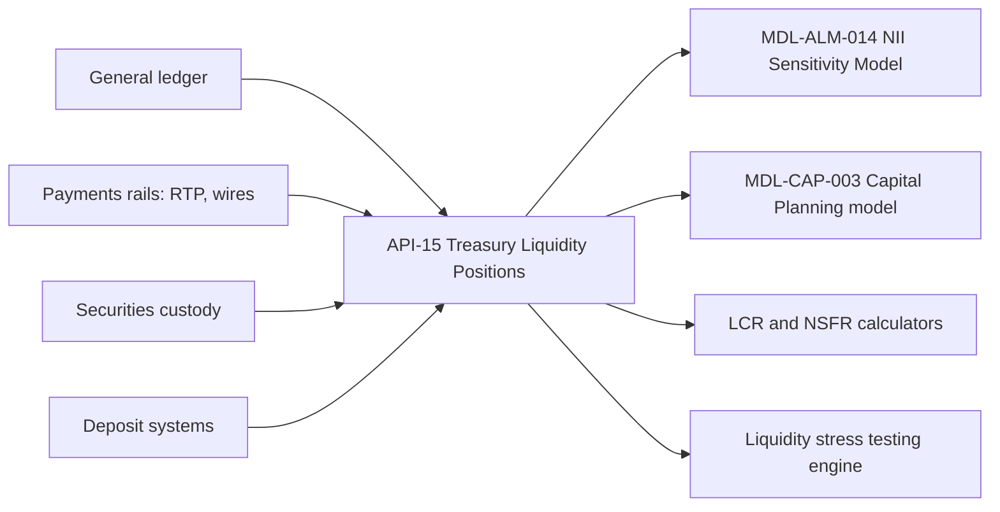

# Treasury Technology

Treasury Technology is the owning team, in the Treasury business domain, for a single service on the Meridian Harbor Developer Platform: the [API-15 Treasury Liquidity Positions API](../apis/api-15-treasury-liquidity-positions-api.md). The platform overview lists the team as owning API-15 only (see [Developer Platform Overview](../apis/developer-platform-overview.md)). The sources describe no other team attributes (headcount, on-call roster, contacts, reporting line), so this page covers ownership, what the team's service feeds, and the obligations that follow.

## What the team owns

| Attribute | Value |
| --- | --- |
| API | API-15 Treasury Liquidity Positions API |
| Version | v2.1 (changelog: 2026-01, `duration` field added for EVE) |
| Base path | `/treasury/v2` |
| Data classification | Restricted - Internal |
| Intended consumers | Internal only: Treasury/CIO, liquidity risk, ALM and capital models |
| OAuth scopes | `treasury.positions:read`, `treasury.hqla:read` |
| Rate limit | 120 requests/minute |
| Service-level objective | 99.95% availability; end-of-day (EOD) positions by 21:00 ET |

The API aggregates intraday and end-of-day cash, collateral, HQLA and rate-sensitive balance sheet positions by legal entity, with yields and costs by product line. It feeds the LCR/NSFR calculators and ALM models.

### Endpoints

| Method | Path | Returns |
| --- | --- | --- |
| GET | `/positions/balance-sheet/{asOf}` | Rate-sensitive positions with balance, yield/cost and duration by line |
| GET | `/hqla/{asOf}` | HQLA by level and legal entity |
| GET | `/cash/intraday` | Intraday cash position by currency and entity |

The documented example is `GET /treasury/v2/positions/balance-sheet/2025-12-31?line=CONSUMER_IB_DEPOSITS`. It returns a line label, `balance` (402000, in "USD millions"), `cost` (0.0205) and `modifiedDuration` (2.8). Risk and finance APIs state units in the payload.

## Responsibilities

- **Publish liquidity and balance sheet positions.** The Annual Report says positions across all legal entities are aggregated daily through API-15. It publishes intraday cash, collateral and HQLA positions to the liquidity stress testing engine and to the ALM models, and the same feed supplies balance sheet positions to the NII Sensitivity Model.
- **Meet the EOD deadline.** The 21:00 ET EOD commitment is the operative date for downstream daily compilation. The Q2 2026 supplement says HQLA and cash flow projections are compiled daily from API-15.
- **Run as a critical data service.** The Annual Report names API-15 among the APIs that feed Tier 1 models or regulatory reports. These carry named data owners, documented data-quality rules, enhanced change management and model-inventory registration. See [BCBS 239](../concepts/bcbs-239.md).
- **Keep the service private.** API-15 is a restricted API served only from the internal risk-and-finance environment (`https://internal.api.mhfc.example`), reachable on the private network only.

## Data lineage

Upstream sources named for API-15 are the general ledger, payments rails (RTP, wires), securities custody and deposit systems. The [Real-Time Payments API](../apis/api-04-real-time-payments-api.md) and [Wire Transfer API](../apis/api-05-wire-transfer-api.md) each list API-15 among their downstream consumers: the former for intraday cash and the latter as a downstream consumer. Treasury Technology therefore depends on the payments teams' feeds being complete for the intraday cash view.

## Downstream dependents

| Consumer | What it takes from API-15 | Owner |
| --- | --- | --- |
| [MDL-ALM-014 NII Sensitivity Model](../models/nii-sensitivity-model.md) | Month-end balances, yields, costs and durations by line; the model workbook tags rows as sourced from API-15 | [Corporate Treasury - ALM](./corporate-treasury-alm.md) |
| [MDL-CAP-003 Capital Planning Model](../models/capital-planning-model.md) | Liquidity constraints on distributions, cross-checked against API-15 | [Corporate Treasury - Capital Management](./corporate-treasury-capital-management.md) |
| LCR and NSFR calculators | HQLA, encumbrance and contractual cash flows by legal entity (see [LCR](../metrics/liquidity-coverage-ratio.md), [NSFR](../metrics/net-stable-funding-ratio.md)) | Not named in the sources |
| Liquidity stress testing engine | Intraday cash, collateral and HQLA positions | Not named in the sources |

The platform's lineage matrix marks API-15 as an upstream feed for MDL-ALM-014 and MDL-CAP-003, and not for MDL-CR-007. API-15 is one of the APIs shared by two Tier 1 models, so a breaking change reviews more than one model.

### Role in the NII and EVE models

In the NII model, API-15 supplies the balance, yield or cost and modified duration for each rate-sensitive line (for example consumer interest-bearing deposits at 402,000 balance, 0.0205 cost and 2.80 duration). The model adds repricing profiles from the Loan Servicing API and the yield curve and policy rate from the Market Data API. The v2.1 `duration` field was added for EVE, so the EVE calculation ([Economic Value of Equity](../concepts/economic-value-of-equity.md), [IRRBB](../concepts/irrbb.md)) depends directly on it. A change to duration definitions or line identifiers is therefore a validation matter for MDL-ALM-014.

## Change and governance implications

- **Model impact.** Critical data services are registered in the model inventory, so a breaking change automatically triggers a model change review by Model Risk Governance & Review. See [Model Risk (SR 11-7)](../concepts/model-risk-sr-11-7.md).
- **Versioning.** The major version is in the path (`/treasury/v2`) and minor versions are additive and backward compatible. A major version is supported for at least 12 months after its successor reaches general availability, with deprecation announced by the `Sunset` header and the developer portal. The v2.1 duration field is an additive change.
- **Escalation.** API-15 is among the critical data services (API-10, 11, 12, 14, 15, 16) escalated to the Data and Technology Risk Committee, with 24x7 coverage during quarter close. Production incidents (P1/P2) go through the API operations hotline.
- **Pillar 3.** The Pillar 3 lineage table maps API-15 to Sections 11 and 12 (HQLA, cash flows, balance sheet positions), covering interest rate risk in the banking book and liquidity. See [Basel III Pillar 3](../concepts/basel-iii-pillar-3.md).

## Operating expectations for consumers

- **Authentication.** Platform-wide OAuth 2.0; server-to-server clients use client-credentials with mutual TLS and 15-minute JWT access tokens. Least-privilege scopes are enforced, so a token needs `treasury.positions:read` for positions and cash, and `treasury.hqla:read` for HQLA. The sources do not map each scope to a specific endpoint.
- **Rate limits.** 120 requests/minute per client; 429 responses carry `Retry-After`. This is a low ceiling compared with the market data APIs, so consumers should pull by `asOf` date and line filter rather than polling.
- **As-of dates.** Balance sheet and HQLA endpoints take an `asOf` path date. The NII model uses a month-end snapshot. Because the EOD commitment is 21:00 ET, same-day EOD data should not be expected earlier.
- **Errors.** The standard error envelope applies (`unauthorized`, `insufficient_scope`, `rate_limited`, `service_unavailable`).

## Relationships

- owns: [API-15 Treasury Liquidity Positions API](../apis/api-15-treasury-liquidity-positions-api.md)
- feeds: [MDL-ALM-014 NII Sensitivity Model](../models/nii-sensitivity-model.md), [MDL-CAP-003 Capital Planning Model](../models/capital-planning-model.md), [Liquidity Coverage Ratio](../metrics/liquidity-coverage-ratio.md), [NSFR](../metrics/net-stable-funding-ratio.md)
- served within: [Corporate (Treasury/CIO)](../organizations/corporate.md), the intended consumer group named by the API
- governed by: [BCBS 239](../concepts/bcbs-239.md), [Model Risk (SR 11-7)](../concepts/model-risk-sr-11-7.md)
- platform context: [Developer Platform Overview](../apis/developer-platform-overview.md)
