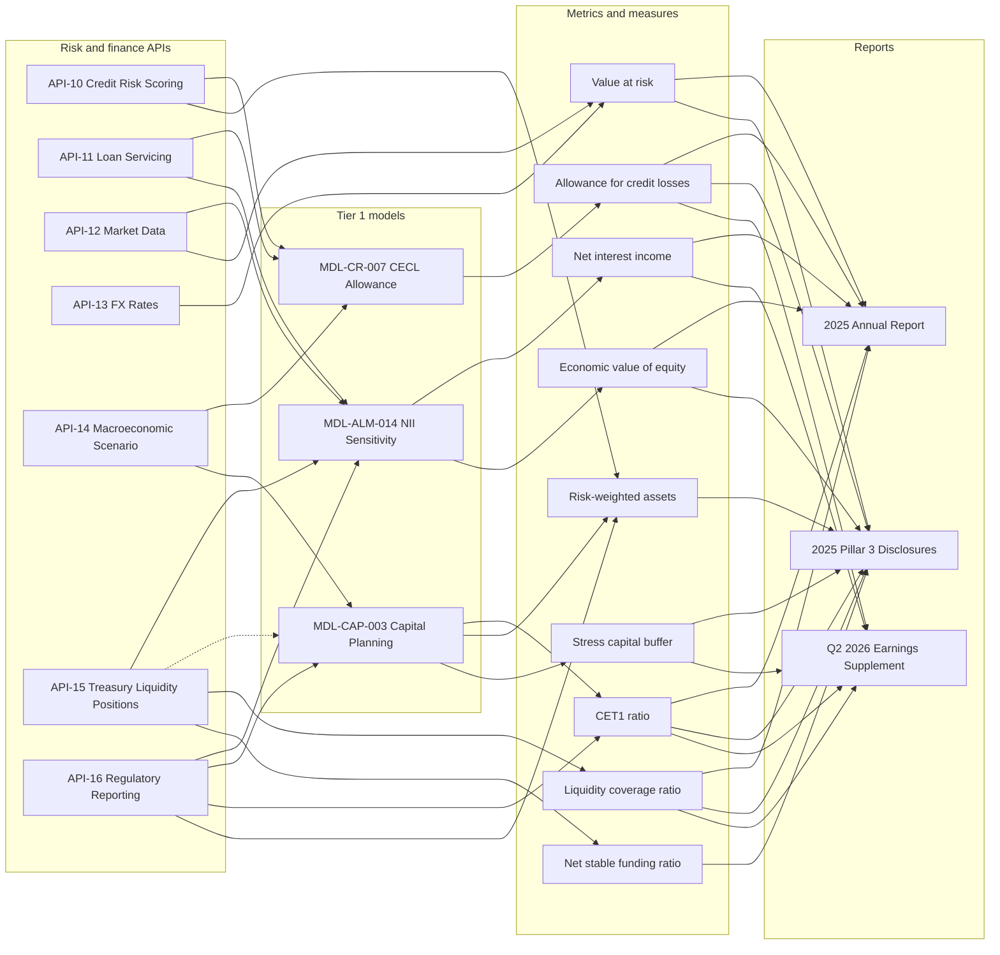
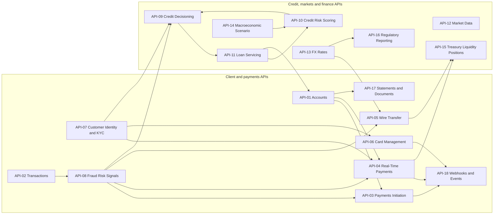

# API to Model to Report Lineage

Meridian Harbor Financial Corp. (a fictional bank) publishes numbers in three reports: the 2025 Annual Report, the 2025 Pillar 3 Disclosures and the Q2 2026 Earnings Supplement. The figures that come from models are not typed in by hand. Each model reads governed Developer Platform APIs, and each API documents its own upstream sources and downstream consumers in a **Data lineage** table. This page joins those tables into one chain: **API -> model -> metric -> report**. The page's diagrams are drawn from those tables.

Three layers of evidence describe the same chain, and they mostly agree:

1. Each API's Data lineage table (upstream sources and downstream consumers).
2. Each model workbook's README, which lists "Upstream data feeds (APIs)" and the cells those feeds fill.
3. The reports' model inventory, which lists upstream APIs and downstream disclosures for each Tier 1 model. Pillar 3 Section 15 also publishes an API-to-model-to-disclosure table.

Evidence: repo://sources/api_docs/apis/api-14-macroeconomic-scenario-api.md#L93-L97, repo://sources/reports/mhfc-2025-pillar3-disclosures.md#L474-L537, repo://sources/reports/mhfc-2025-annual-report.md#L439-L451

## The main chain

Caption: solid arrows are documented feeds, the dotted arrow is a manual cross-check, and every node links to its wiki page (also listed in the node index below). The edges to CET1, RWA and the NSFR/LCR/VaR nodes show APIs that feed calculators outside the three models; they are included so the report-side picture is complete.

### Node index

| Layer | Nodes |
|---|---|
| APIs | [API-10 Credit Risk Scoring](../apis/api-10-credit-risk-scoring-api.md), [API-11 Loan Servicing](../apis/api-11-loan-servicing-api.md), [API-12 Market Data](../apis/api-12-market-data-api.md), [API-13 FX Rates](../apis/api-13-fx-rates-api.md), [API-14 Macroeconomic Scenario](../apis/api-14-macroeconomic-scenario-api.md), [API-15 Treasury Liquidity Positions](../apis/api-15-treasury-liquidity-positions-api.md), [API-16 Regulatory Reporting](../apis/api-16-regulatory-reporting-api.md) |
| Models | [MDL-CR-007 CECL Allowance](../models/cecl-allowance-model.md), [MDL-ALM-014 NII Sensitivity](../models/nii-sensitivity-model.md), [MDL-CAP-003 Capital Planning](../models/capital-planning-model.md) |
| Metrics | [Allowance for credit losses](../metrics/allowance-for-credit-losses.md), [Net interest income](../metrics/net-interest-income.md), [Economic value of equity](../concepts/economic-value-of-equity.md), [CET1 ratio](../metrics/cet1-ratio.md), [Risk-weighted assets](../metrics/risk-weighted-assets.md), [Stress capital buffer](../concepts/stress-capital-buffer.md), [Liquidity coverage ratio](../metrics/liquidity-coverage-ratio.md), [Net stable funding ratio](../metrics/net-stable-funding-ratio.md), [Value at risk](../metrics/value-at-risk.md) |
| Reports | [2025 Annual Report](../reports/annual-report-2025.md), [2025 Pillar 3 Disclosures](../reports/pillar3-disclosures-2025.md), [Q2 2026 Earnings Supplement](../reports/q2-2026-earnings-supplement.md) |

## Model by model

### MDL-CR-007 CECL Allowance Model

| Input | API | What it fills | Reported as |
|---|---|---|---|
| EAD and remaining life | [API-11](../apis/api-11-loan-servicing-api.md) | `Segment_Inputs!C6:D11` | Allowance by segment |
| Pool PD, LGD and macro elasticities (point-in-time) | [API-10](../apis/api-10-credit-risk-scoring-api.md) | `Segment_Inputs!E6:H11` | Allowance by segment |
| Scenario weights and unemployment, HPI and CRE paths | [API-14](../apis/api-14-macroeconomic-scenario-api.md) | `Scenarios!B6:F8` | 20% / 50% / 30% weighting |

The model weights three scenario ECLs, adds a management overlay entered after Allowance Committee approval, and produces the $15,920 million allowance. The overlay is not an API input. The allowance is disclosed in Annual Report Note 6 and the Q2 2026 Earnings Supplement credit section. The Pillar 3 allowance paragraph also names MDL-CR-007 and the $681 million overlay, although the model inventory lists only the Annual Report and the Q2 supplement as downstream disclosures. See [CECL Allowance Model](../models/cecl-allowance-model.md) and [Allowance for Credit Losses](../metrics/allowance-for-credit-losses.md).

There is also an indirect path. API-10 itself takes API-14 and API-11 as upstreams, so scenario and balance data reach the model both directly and through the PD/LGD parameters.

Evidence: repo://sources/models/cecl-allowance-model.md#L133, repo://sources/models/cecl-allowance-model.md#L154-L158, repo://sources/api_docs/apis/api-10-credit-risk-scoring-api.md#L54-L58, repo://sources/reports/mhfc-2025-annual-report.md#L594, repo://sources/reports/mhfc-2025-pillar3-disclosures.md#L297

### MDL-ALM-014 NII Sensitivity Model

| Input | API | What it fills |
|---|---|---|
| Month-end balances, yields and costs of securities, deposits, repo and long-term debt | [API-15](../apis/api-15-treasury-liquidity-positions-api.md) | `Balance_Sheet` lines tagged `API-15` |
| Loan balances, yields and repricing buckets | [API-11](../apis/api-11-loan-servicing-api.md) | `Balance_Sheet` loan lines tagged `API-11` |
| Policy rate and yield curve | [API-12](../apis/api-12-market-data-api.md) | `Assumptions!B7` (`POLICY.FEDFUNDS.UB`) |
| Year-end Tier 1 capital | [API-16](../apis/api-16-regulatory-reporting-api.md) | `Assumptions!B13` |

Outputs are 12-month NII and EVE under +/-100 and +/-200 bp parallel shocks, flagged against Board limits. They are disclosed in the Annual Report (Market Risk Management) and Pillar 3 (IRRBB). The Q2 supplement describes the model's sensitivity and reproduces the year-end 2025 table. The Annual Report's roughly $50.2 billion 2026 NII outlook is said to be consistent with the model's base case. See [NII Sensitivity Model](../models/nii-sensitivity-model.md) and [Net Interest Income](../metrics/net-interest-income.md).

Evidence: repo://sources/models/nii-sensitivity-model.md#L23, repo://sources/models/nii-sensitivity-model.md#L46-L48, repo://sources/models/nii-sensitivity-model.md#L146-L152, repo://sources/reports/mhfc-2025-annual-report.md#L116, repo://sources/reports/mhfc-q2-2026-earnings-supplement.md#L392

### MDL-CAP-003 Capital Planning and Stress Projection Model

| Input | API | What it fills |
|---|---|---|
| Starting CET1 capital and standardized RWA (Q2 2026: 101,200 and 668,400) | [API-16](../apis/api-16-regulatory-reporting-api.md) | `Assumptions!B6:B7` |
| Severely adverse scenario paths | [API-14](../apis/api-14-macroeconomic-scenario-api.md) | Blue stress rows on `Stress_Projection` |
| Liquidity constraints on distributions | [API-15](../apis/api-15-treasury-liquidity-positions-api.md) | Manual cross-check, no formula link |

Outputs are nine-quarter CET1 and RWA paths under baseline and severely adverse conditions, a minimum stressed ratio and an indicative stress capital buffer. They are disclosed in Annual Report Capital Risk Management, Pillar 3 Capital Planning and Stress Testing, and the Q2 supplement capital section, which cites the workbook sheets directly. See [Capital Planning Model](../models/capital-planning-model.md), [CET1 ratio](../metrics/cet1-ratio.md) and [Stress capital buffer](../concepts/stress-capital-buffer.md).

Evidence: repo://sources/models/capital-planning-model.md#L23, repo://sources/models/capital-planning-model.md#L45-L47, repo://sources/models/capital-planning-model.md#L119-L120, repo://sources/reports/mhfc-q2-2026-earnings-supplement.md#L276-L286

## Report-side view

| Report | Models disclosed | Direct API-sourced items |
|---|---|---|
| [2025 Annual Report](../reports/annual-report-2025.md) | MDL-CR-007 (Note 6 allowance), MDL-ALM-014 (Market Risk Management, NII outlook), MDL-CAP-003 (Capital Risk Management); inventory table lists upstream APIs | API-15 liquidity aggregation, API-12/API-13 for trading valuations and VaR, API-10 and API-09 for credit decisions |
| [2025 Pillar 3 Disclosures](../reports/pillar3-disclosures-2025.md) | MDL-ALM-014 (IRRBB), MDL-CAP-003 (capital planning), MDL-CR-007 (allowance paragraph); Section 14 inventory and Section 15 API lineage table | API-16 as source of governed capital and RWA data, API-10 for Advanced approaches PD/LGD, API-12/13 for market risk inputs, API-12 for collateral values, API-15 for LCR/NSFR |
| [Q2 2026 Earnings Supplement](../reports/q2-2026-earnings-supplement.md) | MDL-CR-007 (allowance), MDL-CAP-003 (capital plan with 30 Jun 2026 starting point), MDL-ALM-014 (rate sensitivity) | API-16 for the FR Y-9C basis of capital, API-10 for the June PD/LGD refresh, API-15 for HQLA |

Evidence: repo://sources/reports/mhfc-2025-annual-report.md#L283-L451, repo://sources/reports/mhfc-2025-pillar3-disclosures.md#L116-L151, repo://sources/reports/mhfc-2025-pillar3-disclosures.md#L283-L346, repo://sources/reports/mhfc-q2-2026-earnings-supplement.md#L351-L388

## The wider API graph

The same Data lineage tables also link APIs to each other. Reading only those API-to-API edges shows where model inputs get their data, and which client and payments APIs sit outside the model chain entirely.

Caption: API-to-API edges declared in the Data lineage tables. API-12 has no API consumer in this graph because its consumers are models and engines. Treat non-API sources such as the general ledger, core deposit system and vendor feeds as outside the graph. See the [Developer Platform overview](../apis/developer-platform-overview.md) for the catalog.

Points worth knowing when you read this graph:

- **Risk APIs mix three upstream types.** API-14 draws on economics research, Federal Reserve supervisory scenarios and Scenario Committee approvals. API-16 draws on the general ledger and RWA calculation engines, plus API-13. API-12 draws only on licensed vendors and trader marks validated by Valuation Control. These external sources sit above the chain on the API pages.
- **Cycle through credit.** API-09 books loans into API-11, API-11 feeds API-10, and API-10 feeds back into API-09. This is a documented loop of decisioning, servicing and scoring, not a model dependency.
- **One-sided declarations.** API-01's own downstream list does not name API-03 or API-04, and API-07's does not name API-09, although those APIs list them as upstream. The diagram merges both directions, so a declared edge may appear on only one side.

Evidence: repo://sources/api_docs/apis/api-01-accounts-api.md#L58-L62, repo://sources/api_docs/apis/api-03-payments-initiation-api.md#L80-L84, repo://sources/api_docs/apis/api-07-customer-identity-kyc-api.md#L67-L71, repo://sources/api_docs/apis/api-08-fraud-risk-signals-api.md#L63-L67, repo://sources/api_docs/apis/api-09-credit-decisioning-api.md#L67-L71, repo://sources/api_docs/apis/api-11-loan-servicing-api.md#L58-L62, repo://sources/api_docs/apis/api-13-fx-rates-api.md#L47-L51

## Timing, locks and failure semantics

The model chain depends on when each API publishes. The figures below are the service-level commitments in the API definitions.

| API | Timing commitment | Why it matters downstream |
|---|---|---|
| [API-14](../apis/api-14-macroeconomic-scenario-api.md) | Scenario sets are versioned and locked after Scenario Committee approval; new set published within 1 business day | CECL and capital runs use an approved, immutable set |
| [API-10](../apis/api-10-credit-risk-scoring-api.md) | Quarterly refresh within T+3 business days; BCBS 239 critical data service | CECL PD/LGD are quarterly, so a late refresh delays the allowance run |
| [API-16](../apis/api-16-regulatory-reporting-api.md) | Quarter-end data locked by day 25; GL reconciliation status flag since v1.8 | Starting capital for MDL-CAP-003 and Tier 1 for MDL-ALM-014 |
| [API-15](../apis/api-15-treasury-liquidity-positions-api.md) | EOD positions by 21:00 ET | Balance-sheet snapshot for MDL-ALM-014 |
| [API-12](../apis/api-12-market-data-api.md) | EOD snapshot by 19:00 ET | Policy rate and curves for MDL-ALM-014 |

Governance rules that follow from the lineage:

- Each model's upstream API feeds are registered in the model inventory, and a breaking change to an API's schema or business logic automatically triggers a model change review. A change to an API on this page is therefore a model-risk event, not only an interface change.
- Model inputs are copied into workbook cells at run time (see the cell references above), so the lineage is a refresh procedure rather than a live link. A stale snapshot in a workbook does not fail visibly except through the workbook's own checks, for example the weight check and `Balance_Sheet` share check.
- Each Tier 1 model has an independent validator and a next-due validation date, and API changes that alter inputs feed that cycle. See [Model Risk (SR 11-7)](../concepts/model-risk-sr-11-7.md) and [BCBS 239](../concepts/bcbs-239.md).

Evidence: repo://sources/api_docs/apis/api-14-macroeconomic-scenario-api.md#L4-L17, repo://sources/api_docs/apis/api-10-credit-risk-scoring-api.md#L4-L17, repo://sources/api_docs/apis/api-16-regulatory-reporting-api.md#L4-L17, repo://sources/api_docs/apis/api-15-treasury-liquidity-positions-api.md#L4-L17, repo://sources/api_docs/apis/api-12-market-data-api.md#L4-L17, repo://sources/reports/mhfc-2025-pillar3-disclosures.md#L474, repo://sources/reports/mhfc-2025-annual-report.md#L439

## Where the sources disagree or are incomplete

Use these when tracing a number, because the three evidence layers do not match perfectly.

- **API-16 into MDL-ALM-014.** API-16 lists the "NII model Tier 1 capital input" as a downstream use, and the NII workbook uses it in `Assumptions!B13`. The workbook README, the Annual Report inventory and Pillar 3 list only API-11, API-12 and API-15 as that model's upstream APIs. The dependency exists but is not in the registered inventory.
- **API-15 into MDL-CAP-003.** The inventory and API-15 both name this feed. The workbook treats it only as an out-of-formula cross-check, so no cell depends on API-15 data.
- **API-10 into MDL-CAP-003.** API-10 lists Advanced approaches credit RWA, and API-16 lists the RWA calculation engines as its own upstream. Capital planning receives that data through API-16 and not from API-10 directly.
- **API-09 and API-08.** The Pillar 3 table says API-09 reaches MDL-CR-007 only indirectly, and API-08 reaches only operational risk loss data. They are not model inputs.
- **Scenario set names.** The CECL workbook cites set MSC-2025Q4, while Pillar 3 says paths distributed to both the CECL and capital planning models are in set SA-2025-INT. API-14 lists both sets. Check which set a run used before comparing results. See [Macro Scenarios MSC-2025Q4](../scenarios/macro-scenarios-msc-2025q4.md) and [Internal Severely Adverse](../scenarios/internal-severely-adverse.md).
- **Pillar 3 and the CECL model.** The Pillar 3 inventory omits Pillar 3 from MDL-CR-007's downstream disclosures, even though its allowance paragraph names the model.

Evidence: repo://sources/api_docs/apis/api-16-regulatory-reporting-api.md#L50-L54, repo://sources/models/nii-sensitivity-model.md#L23, repo://sources/models/capital-planning-model.md#L47, repo://sources/reports/mhfc-2025-pillar3-disclosures.md#L460, repo://sources/reports/mhfc-2025-pillar3-disclosures.md#L489-L500, repo://sources/reports/mhfc-2025-pillar3-disclosures.md#L534-L535, repo://sources/models/cecl-allowance-model.md#L183

## Changing or extending the lineage

- **Adding an API feed to a model.** Update the API's Data lineage table, the model workbook README and cell source notes, and the model inventory in the reports. Then raise a model change review. The three layers above have to be changed together or they will drift as described in the previous section.
- **Adding a downstream report.** Name the model and the section in the model inventory. Pillar 3 Section 15 is the table that maps API to model to disclosure section, so update it when the chain changes.
- **Tracing a reported number.** Start at the report line, follow its model ID to the workbook sheet (Summary, Allowance_Summary or Sensitivity), find the input cell and its source note, and then open the API page named there. For capital and RWA actuals skip the model and go from the report to API-16, which Pillar 3 describes as delivering the same data used for the FR Y-9C.

## Related pages

- [MDL-CR-007 CECL Allowance Model](../models/cecl-allowance-model.md)
- [MDL-ALM-014 NII Sensitivity Model](../models/nii-sensitivity-model.md)
- [MDL-CAP-003 Capital Planning Model](../models/capital-planning-model.md)
- [API-14 Macroeconomic Scenario API](../apis/api-14-macroeconomic-scenario-api.md)
- [API-16 Regulatory Reporting API](../apis/api-16-regulatory-reporting-api.md)
- [Developer Platform overview](../apis/developer-platform-overview.md)
