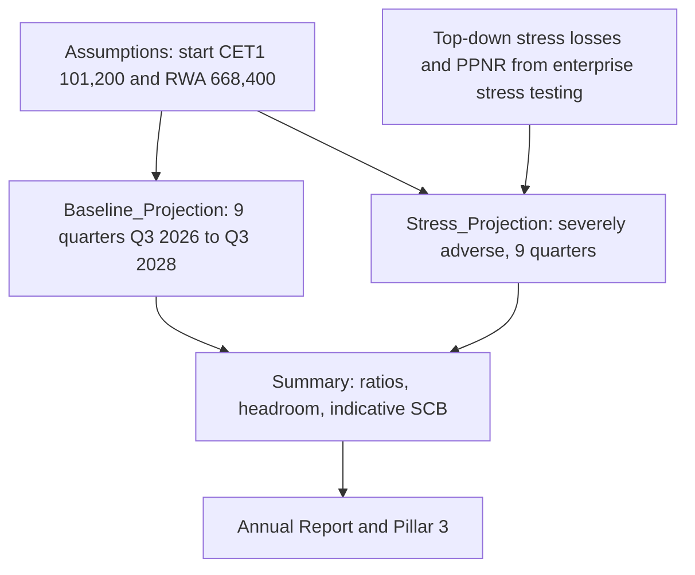
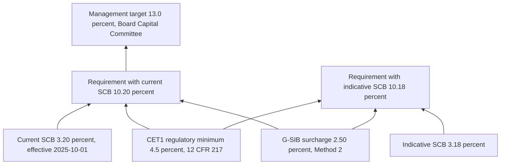
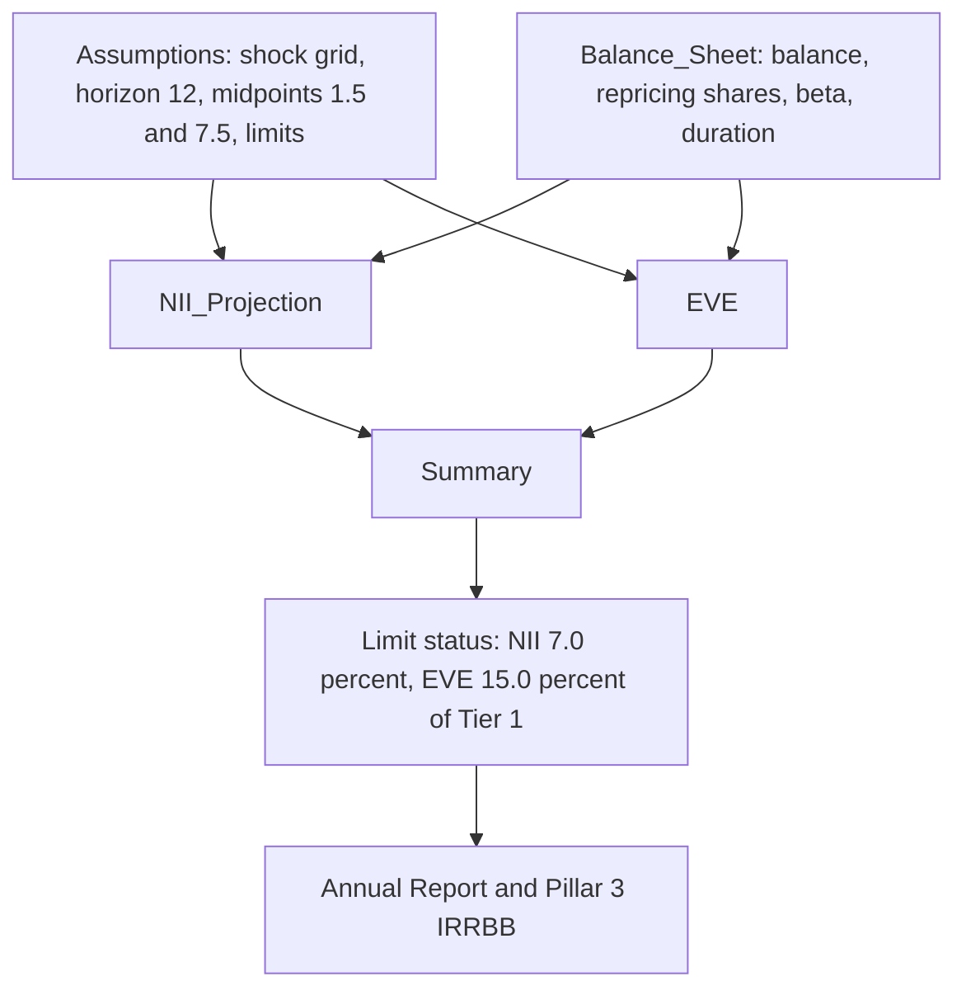

# Capital Projection and Rate Sensitivity Flows

Two Tier 1 Excel models at Meridian Harbor Financial Corp. (a fictional institution; all figures are synthetic) turn a small set of inputs into the numbers that go to the Annual Report and Pillar 3. This page follows the calculation chain in each one:

- **Capital flow**: [Capital Planning & Stress Projection Model](../models/capital-planning-model.md) (MDL-CAP-003) turns starting capital, a distribution plan and stress losses into CET1 ratio paths, a minimum stressed ratio and an indicative [stress capital buffer](../concepts/stress-capital-buffer.md).
- **Rate-sensitivity flow**: [NII Sensitivity Model](../models/nii-sensitivity-model.md) (MDL-ALM-014) turns a grid of [parallel rate shocks](../scenarios/parallel-rate-shocks.md) into a 12-month change in net interest income and a change in economic value of equity (EVE).

The two models are independent workbooks. The only shared quantity is Tier 1 / CET1 capital: the NII model divides EVE changes by Tier 1 capital of 110,620 ($mm, YE2025, from API-16), and the capital model starts from CET1 capital of 101,200 ($mm, Q2 2026, also from API-16). Units are USD millions and rates are stored as decimals in both.

## Part 1: Capital projection to CET1 and indicative SCB

### Inputs and ownership

The `Assumptions` sheet holds every starting value (blue-font inputs). Starting CET1 capital of 101,200 and standardized RWA of 668,400 come from the Regulatory Reporting API (API-16); scenario paths come from the Macroeconomic Scenario API (API-14); liquidity constraints on distributions are cross-checked against API-15. The distribution plan is approved by the Board Capital Committee. The model is owned by Corporate Treasury – Capital Management and independently validated by Model Risk Governance & Review (last validated 2026-02-27, next due 2027-02-28).

Key assumptions: quarterly baseline net income 6,600 growing 0.8% per quarter; preferred dividends 260 per quarter; common dividend $1.15 per share per quarter on 1,381mm shares; buybacks 3,000 per quarter at an assumed $262 share price; baseline RWA growth 1.0% per quarter; other CET1 movements of -150 per quarter; effective tax rate 22%.

### Calculation chain



The diagram shows both projection sheets reading the same `Assumptions` cells, with only the stress sheet consuming externally supplied losses.

**Baseline** (`Baseline_Projection`): for each quarter, ending CET1 = beginning CET1 + net income - preferred dividends - common dividends - buybacks + other movements. Common dividends are the prior quarter's share count times the dividend per share, and shares fall by buyback dollars divided by the assumed share price (1,381 falls to 1,277.95 by Q3 2028). RWA compounds at the growth rate, and the CET1 ratio is ending CET1 over RWA.

**Stress** (`Stress_Projection`): the same capital roll-forward, but net income is rebuilt from the top: pre-tax income = PPNR - provisions - trading and counterparty losses, taxed at 22% with the benefit recognised on losses (Q3 2026 shows a +1,166 tax benefit on -5,300 pre-tax income). Buybacks are zero in every quarter ("suspended under stress, CCAR convention"), and dividends are held flat: shares stay at 1,381, so common dividends stay at 1,588.15 per quarter. RWA follows its own scenario growth path (+2.2% in Q3 2026 easing to -0.4% by Q1 2028).

### Resulting numbers

| Measure | Value |
|---|---|
| Starting CET1 ratio (Q2 2026) | 15.14% |
| Baseline minimum CET1 ratio | 15.23% |
| Baseline ending CET1 ratio (Q3 2028) | 16.15% (CET1 118,027.41 on RWA 731,019.24) |
| Minimum stressed CET1 ratio | 12.90% (Q3 2027) |
| Stressed ending ratio (Q3 2028) | 13.63% |
| Peak-to-trough decline | 2.24% |
| Cumulative baseline buybacks | 27,000 |
| Excess CET1 vs 13.0% target at Q3 2028 (baseline) | 22,994.91 |

Under stress, headroom versus the 13.0% management target turns negative in Q2 2027 (-352.79), Q3 2027 (-712.94) and Q4 2027 (-266.65), while headroom versus the regulatory requirement never falls below 18,934.48 (Q3 2027). The `Summary` flag "Stress minimum above requirement?" is `=IF(B9>=B13,"YES","NO - capital action required")` and currently reads YES.

### From stress minimum to indicative SCB

The `Summary` sheet computes:

```
indicative SCB = MAX( 2.5%, (start CET1 ratio - minimum stressed CET1 ratio)
                            + (4 quarters of baseline common dividends / starting RWA) )
```

With the current figures: 15.14% - 12.90% = 2.24% peak-to-trough decline, plus 0.94% dividend add-on (the sum of the first four baseline common-dividend rows, about 6,273.59, over starting RWA of 668,400), giving an indicative SCB of **3.18%**. The 2.5% floor is not binding. The dividend add-on uses only common dividends from the baseline sheet (rows C9:F9), not preferred dividends or stress-case dividends.

### Capital stack

The requirement stack built on that SCB is summed from the `Assumptions` sheet, with the indicative variant swapping in the new SCB:



The diagram shows the requirement as 4.5% + SCB + 2.5% G-SIB surcharge, with the 13.0% management target sitting above it.

The stress minimum of 12.90% is therefore 2.70 percentage points above the 10.20% current requirement and 2.72 points above the 10.18% indicative requirement, but 0.10 points below the management target. The countercyclical buffer is not modelled in the workbook (see [G-SIB surcharge](../concepts/gsib-surcharge.md) and [CET1 ratio](../metrics/cet1-ratio.md)).

### Limitations that affect interpretation

- No AOCI volatility modelling and no deferred-tax-asset threshold deductions; AOCI-like effects sit in a flat -150 per quarter "other" line.
- Stress losses (PPNR, provisions, trading and counterparty losses) are hard-coded top-down inputs from the enterprise stress testing program, not derived in this workbook. See [Internal Severely Adverse](../scenarios/internal-severely-adverse.md).
- The indicative SCB is an internal estimate, distinct from the regulatory SCB set by the Federal Reserve (3.2%).

Component detail: [Baseline projection](../models/components/capital-baseline-projection.md), [Stress projection](../models/components/capital-stress-projection.md), [Indicative SCB](../models/components/indicative-stress-capital-buffer.md).

## Part 2: Rate shocks to NII and EVE

### Inputs

The `Assumptions` sheet carries the as-of date (2025-12-31), the policy rate (3.75%, fed funds upper bound from API-12), a 12-month horizon, repricing midpoints (month 1.5 for the 0-3m bucket, month 7.5 for 3-12m), the Board limits, Tier 1 capital of 110,620, and the shock grid of -200, -100, 0, +100, +200 bp. `Balance_Sheet` lists 14 rate-sensitive lines (balances and yields from API-15, loan repricing profiles from API-11) with four repricing-share buckets that must sum to 100% (a per-row "OK/CHECK" share check), modified durations and a rate beta per line. Deposit betas come from the Deposit Behaviour sub-model's 2025 calibration. Rate-sensitive assets total 1,258,500 and liabilities 1,180,100; base annual NII is 76,515.95 - 26,279.04 = **50,236.91**.

### Shock flow



The diagram shows that NII uses repricing timing and betas, EVE uses durations, and `Summary` tests both against the Board limits.

**NII path.** Each line gets a repricing factor = share(0-3m) x (12-1.5)/12 + share(3-12m) x (12-7.5)/12, so only positions repricing within the horizon matter; 1-5y and >5y shares contribute nothing. The line's effect for each shock is `sign x balance x beta x factor x shock / 10000`, where sign is +1 for assets and -1 for liabilities. Assets have beta 1; liability betas are 0.45 (consumer interest-bearing deposits), 0.75 (wholesale), 0 (noninterest-bearing), 1.0 (repo and long-term debt). Change in NII is the sum across lines; projected NII is base NII plus the change. The balance sheet is static.

**EVE path.** Dollar duration per 100 bp = sign x balance x modified duration / 100; each line's value change = -dollar duration x shock / 100; the EVE change is their sum and is expressed as a percentage of Tier 1 capital. Repricing buckets play no role in EVE. See [EVE Modified Duration](../models/components/eve-modified-duration.md) and [economic value of equity](../concepts/economic-value-of-equity.md).

### Results grid

| Scenario | Projected NII | Change in NII | % of base NII | Change in EVE | EVE % of Tier 1 |
|---|---|---|---|---|---|
| Down 200 | 47,220.02 | -3,016.89 | -6.01% | +2,737.40 | +2.47% |
| Down 100 | 48,728.47 | -1,508.44 | -3.00% | +1,368.70 | +1.24% |
| Base | 50,236.91 | 0 | 0% | 0 | 0% |
| Up 100 | 51,745.35 | +1,508.44 | +3.00% | -1,368.70 | -1.24% |
| Up 200 | 53,253.80 | +3,016.89 | +6.01% | -2,737.40 | -2.47% |

Results are exactly symmetric because the model is linear in the shock, with betas held constant across shock sizes.

### Worked answer: what happens to NII if rates fall 200 bp?

12-month NII falls by **3,016.89** (-6.01%) from 50,236.91 to **47,220.02**. The model's asset-side cuts (about 11,638.44 across the nine asset lines, led by deposits with banks and fed funds sold at -4,320.75 and commercial and industrial loans at -2,458.12) are only partly offset by liability-side savings (about 8,621.55: wholesale deposits 4,060.80, consumer deposits 2,623.05, repo 1,417.50, long-term debt 520.20). The asymmetry is the cost of low deposit betas and the fact that noninterest-bearing deposits (272,000) never reprice. This is inside the Board limit of a 7.0% maximum NII decline, using roughly 86% of that limit (6.01 / 7.0, a derived figure). EVE moves the other way: it rises by 2,737.40 (+2.47% of Tier 1) because net asset dollar duration exceeds liability dollar duration by about 1,369 per 100 bp.

### Limit tests

In `Summary`, the NII flag is `=IF(E<-Assumptions!$B$11,"BREACH","Within limit")` against 7.0%, and the EVE flag is `=IF(H<-Assumptions!$B$12,"BREACH","Within limit")` against 15.0% of Tier 1. Both test only declines (negative values), so a large rise in NII or EVE can never flag. All five scenarios currently read "Within limit". Limit utilisation flags feed ALCO reporting.

### Limitations and compensating control

Parallel shocks only (no twists), static balance sheet (no growth or mix shift), no handling of deposit-cost floors below zero, betas constant across shock sizes. The documented compensating control is a quarterly dynamic balance-sheet simulation in the ALM engine. The model is owned by Corporate Treasury – Asset & Liability Management, was last validated 2025-09-18, and is next due **2026-09-30**. Related: [IRRBB](../concepts/irrbb.md), [net interest income](../metrics/net-interest-income.md), [NII rate shock projection](../models/components/nii-rate-shock-projection.md), [repricing and deposit betas](../models/components/nii-repricing-and-deposit-betas.md).

## Operating notes

- Both workbooks are formula-driven: change blue-font inputs on `Assumptions` (or `Balance_Sheet`) and everything downstream recalculates. Shock sizes and scenario labels are single cells linked by all sheets.
- Run cadence differs: the capital projection is re-run each quarter, while the NII model reports on a year-end snapshot (2025-12-31) feeding the FY2025 disclosures.
- Disclosures: capital outputs feed Annual Report (Capital Risk Management) and Pillar 3 (Capital Planning and Stress Testing); NII/EVE outputs feed Annual Report (Market Risk Management) and Pillar 3 (IRRBB). See [Model Risk Management](../concepts/model-risk-sr-11-7.md) for the governance framework.
