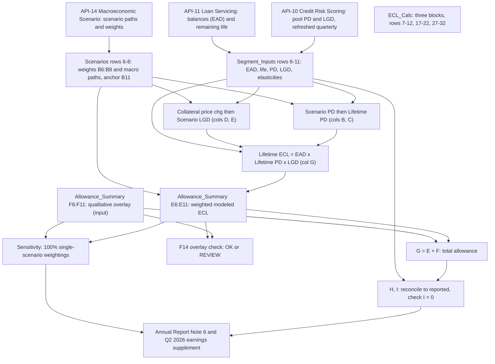

# CECL Allowance Calculation Flow

This page traces the order of calculation in the **CECL Lifetime Expected Credit Loss Model (MDL-CR-007)**, implemented as the workbook `CECL_Allowance_Model.xlsx`. It follows the path from inputs to scenario-conditional loss, probability weighting, management overlay, reconciliation and disclosure. For the model's ownership and governance see [CECL Allowance Model](../models/cecl-allowance-model.md). For the accounting concept see [CECL](../concepts/cecl.md). For the reported metric see [Allowance for Credit Losses](../metrics/allowance-for-credit-losses.md). All figures are USD millions at 2025-12-31 and come from a synthetic proof-of-concept dataset.

## Flow at a glance



Caption: sheet-level dependency flow of the CECL workbook, from the three upstream APIs to the disclosures.

## Sheets and their roles

The README sheet lists five working sheets. In dependency order:

| Sheet | Role | Cell type |
|---|---|---|
| `Scenarios` | Scenario weights and macro paths | Inputs plus checks |
| `Segment_Inputs` | Per-segment exposure and risk parameters | Inputs plus totals |
| `ECL_Calc` | Scenario-conditional lifetime ECL | Formulas only |
| `Allowance_Summary` | Weighting, overlay, reconciliation, coverage | Formulas plus overlay inputs |
| `Sensitivity` | Allowance under 100% single-scenario weighting | Formulas only |

Per the workbook's colour legend, blue cells are hard-coded inputs, black cells are formulas, green cells link to other sheets, and yellow fill marks key assumptions.

## Step 1: Inputs

**Upstream feeds.** The README names three APIs:
- Balances (EAD) and remaining life come from the Loan Servicing API ([API-11](../apis/api-11-loan-servicing-api.md)).
- Pool-level PD and LGD parameters come from the Credit Risk Scoring API ([API-10](../apis/api-10-credit-risk-scoring-api.md)), refreshed quarterly.
- Scenario paths and weights come from the Macroeconomic Scenario API ([API-14](../apis/api-14-macroeconomic-scenario-api.md)), scenario set `MSC-2025Q4` (see [MSC-2025Q4 scenarios](../scenarios/macro-scenarios-msc-2025q4.md)).

The workbook holds these values as pasted inputs. No sheet formula calls an API.

**`Scenarios` sheet (rows 6–8, columns B–F).** Each row holds a weight, peak unemployment, 2026 real GDP growth, house price index change and CRE price index change:

| Scenario | Weight (B) | Peak unemp. (C) | HPI chg (E) | CRE chg (F) |
|---|---|---|---|---|
| Upside (row 6) | 20% | 3.8% | +4.5% | +3.0% |
| Baseline (row 7) | 50% | 4.4% | +2.2% | −1.0% |
| Downside (row 8) | 30% | 6.8% | −8.5% | −14.0% |

Two formula cells govern this sheet:
- `B9 = SUM(B6:B8)` totals the weights.
- `C9 = IF(ABS(B9-1)<0.0001,"OK","WEIGHTS MUST SUM TO 100%")` is the weight check.
- `B11 = C7` is the **baseline unemployment anchor** (4.4%). Because it follows the baseline row, the baseline scenario's PD shift is zero by construction.

Real GDP growth (column D) is carried on the sheet but is not referenced by any `ECL_Calc` formula. Only unemployment and the two price indices drive the calculation.

**`Segment_Inputs` sheet (rows 6–11, total row 12).** The six segments are Credit Card, Residential Mortgage, Auto, Commercial Real Estate, Commercial & Industrial, and Other Consumer & Wholesale. Columns:
- C: EAD / balance
- D: remaining life in years
- E: base annual PD
- F: base LGD
- G: PD elasticity per 1pp of unemployment
- H: LGD sensitivity to price
- I: price driver (`HPI`, `CRE` or `None`)
- J: FY2025 net charge-offs
- K: reported allowance

Only the totals are formulas: `C12`, `J12` and `K12` are each `SUM` over rows 6–11, giving 742,300 of loans, 6,100 of net charge-offs and 15,920 of reported allowance. These loan totals match the Annual Report's loan table, and the charge-offs and reported allowance match Note 6.

## Step 2: Scenario PD

`ECL_Calc` has three stacked blocks, one per scenario, each with six segment rows plus a total row:

| Block | Scenario row on `Scenarios` | Segment rows | Total cell |
|---|---|---|---|
| Upside | 6 | 7–12 | `G13` |
| Baseline | 7 | 17–22 | `G23` |
| Downside | 8 | 27–32 | `G33` |

Column B (annual scenario PD) uses the row-7 formula for Credit Card in the Upside block:

```
=MAX(0,Segment_Inputs!E6*(1+Segment_Inputs!G6*(Scenarios!$C$6-Scenarios!$B$11)*100))
```

That is: `base PD × (1 + elasticity × (scenario peak unemployment − baseline anchor) × 100)`, floored at zero. Baseline blocks reference `Scenarios!$C$7` and Downside blocks reference `Scenarios!$C$8`.

Worked example (Credit Card, Downside): `0.0374 × (1 + 0.165 × (0.068 − 0.044) × 100)` ≈ 0.0522, which is the value shown in `B27`.

Column C (lifetime PD) compounds the annual PD over remaining life:

```
=1-(1-B7)^Segment_Inputs!D6
```

Credit Card has a 1.7-year life, so baseline lifetime PD is about 6.27% (`C17`). Residential Mortgage has a 6.5-year life, so a 0.35% annual PD becomes about 2.25% (`C18`). See [CECL lifetime PD](../models/components/cecl-lifetime-pd.md).

## Step 3: Scenario LGD and EAD

Column D picks the collateral price change for the segment's price driver:

```
=IF(Segment_Inputs!I7="HPI",Scenarios!$E$6,IF(Segment_Inputs!I7="CRE",Scenarios!$F$6,0))
```

Column E applies the segment's sensitivity, capped between 0 and 100%:

```
=MIN(1,MAX(0,Segment_Inputs!F7*(1-Segment_Inputs!H7*D8)))
```

So LGD rises when collateral prices fall. Residential Mortgage LGD goes from a 14% base to 16.14% under Downside (HPI −8.5%, sensitivity 1.8). CRE goes from 38% to 46.51% (CRE −14%, sensitivity 1.6). Auto carries an LGD sensitivity of 0.40 but its price driver is `None`, so its LGD never moves. Credit Card, C&I and Other also have zero sensitivity or a `None` driver. Only Mortgage and CRE therefore flex LGD.

Column F simply links EAD: `=Segment_Inputs!C6`. EAD is held constant across scenarios, so scenario risk enters only through PD and LGD. See [CECL LGD and EAD](../models/components/cecl-lgd-and-ead.md).

## Step 4: Scenario ECL

Column G is the lifetime ECL for each segment in each scenario:

```
=F7*C7*E7        (EAD × lifetime PD × scenario LGD)
```

The block totals are the sums `G13 = SUM(G7:G12)`, `G23 = SUM(G17:G22)` and `G33 = SUM(G27:G32)`:

| Scenario | Total lifetime ECL |
|---|---|
| Upside | 12,434.76 |
| Baseline | 13,817.04 |
| Downside | 19,478.13 |

Credit Card is by far the largest term: 10,611.39 of the Downside total.

## Step 5: Probability weighting

`Allowance_Summary` pulls each segment's three scenario ECLs into columns B, C and D. For Credit Card (row 6): `B6 = ECL_Calc!G7`, `C6 = ECL_Calc!G17` and `D6 = ECL_Calc!G27`. Rows 7–11 follow the same pattern with `G8/G18/G28` and so on.

The weighted modeled allowance (column E) is:

```
=B6*Scenarios!$B$6+C6*Scenarios!$B$7+D6*Scenarios!$B$8
```

That is `0.2 × Upside + 0.5 × Baseline + 0.3 × Downside`. `E12 = SUM(E6:E11)` gives **15,238.91**. Because weighting is applied after ECL is computed per scenario, it is a weighted average of nonlinear scenario results, not a single ECL on weighted macro inputs. See [CECL scenario weighting](../models/components/cecl-scenario-weighting.md).

## Step 6: Qualitative overlay

Column F (`F6:F11`) is the qualitative overlay. It is **not a formula**. Each cell is a hard-coded input carrying the note "Management qualitative adjustment approved by the Allowance Committee (Dec-2025): captures model limitations, concentration and emerging-risk factors." `F12 = SUM(F6:F11)` totals 681.09.

| Segment | Overlay | Overlay % of modeled (col J) |
|---|---|---|
| Credit Card | 256.82 | 3.06% |
| Residential Mortgage | 55.03 | 7.19% |
| Auto | −33.56 | −4.64% |
| Commercial Real Estate | 226.00 | 10.07% |
| Commercial & Industrial | 150.72 | 5.78% |
| Other Consumer & Wholesale | 26.07 | 5.07% |
| Total | 681.09 | 4.47% |

The overlay can be negative: Auto's overlay reduces the allowance below its modeled value. Column J is `=IF(E6=0,0,F6/E6)`.

**Control check.** `F14` is `=IF(SUMPRODUCT(--(ABS(J6:J11)>0.15))=0,"OK","REVIEW")`. It returns `OK` only if every segment's overlay is within ±15% of its modeled value. The README states the same limit, and that overlays must be documented. The check flags a breach as `REVIEW` for people to resolve. It does not cap or alter the overlay. See [CECL qualitative overlay](../models/components/cecl-qualitative-overlay.md).

## Step 7: Total allowance and reconciliation

- `G6 = E6+F6` is the total allowance per segment, and `G12 = SUM(G6:G11)` is **15,920**.
- `H6 = Segment_Inputs!K6` links the reported allowance, which is itself an input there.
- `I6 = G6-H6` is the difference, and `I12 = SUM(I6:I11)`. Every segment currently shows 0.
- `K6 = IF(Segment_Inputs!C6=0,0,G6/Segment_Inputs!C6)` is allowance over loans (2.14% in total, 6.24% for cards).
- `L6 = IF(Segment_Inputs!J6=0,0,G6/Segment_Inputs!J6)` is coverage of FY2025 net charge-offs in years (2.61 in total).

Column I is the reconciliation control. A nonzero value means the modeled-plus-overlay total no longer ties to the booked figure.

## Step 8: Sensitivity

The `Sensitivity` sheet reuses the segment-total row of `Allowance_Summary`:
- `B6 = Allowance_Summary!B12`, `B7 = ...!C12` and `B8 = ...!D12` pick the single-scenario totals.
- `C = B + Allowance_Summary!$F$12` adds the same overlay.
- `D = C - Allowance_Summary!$H$12` is the change versus reported.
- `E = D / H12` is the percentage change.

| Weighting | Modeled | Plus overlay | Change vs reported |
|---|---|---|---|
| 100% Upside | 12,434.76 | 13,115.85 | −2,804.15 (−17.6%) |
| 100% Baseline | 13,817.04 | 14,498.13 | −1,421.87 (−8.9%) |
| 100% Downside | 19,478.13 | 20,159.22 | +4,239.22 (+26.6%) |
| Weighted (reported) | 15,238.91 | 15,920 | 0 |

The overlay is held constant, which the Annual Report states explicitly.

## Step 9: Disclosure

`Allowance_Summary` is labelled in the workbook as feeding Annual Report Note 6 and the earnings supplement. The README lists these downstream disclosures:
- **Annual Report** (see [Annual Report 2025](../reports/annual-report-2025.md)):
  - The Credit Risk Management narrative gives the modeled, overlay, total and coverage columns, citing `CECL_Allowance_Model.xlsx`, sheet `Allowance_Summary`. These match `E`, `F`, `G` and `K`.
  - Its sensitivity paragraph states about $20.2 billion under 100% Downside (+$4.2 billion) and about −$1.4 billion under 100% Baseline. These match `Sensitivity!C8`, `D8` and `D7`.
- **Note 6**: the roll-forward starts from beginning balances, deducts net charge-offs and adds provision to reach the year-end balance of 15,920, described as the model output plus approved qualitative adjustments. The net charge-off column matches `Segment_Inputs!J`, and the ending balance matches `K`.
- **Q2 2026 Earnings Supplement** ([summary](../reports/q2-2026-earnings-supplement.md)):
  - It states that scenario weights were unchanged at 20/50/30.
  - It states that baseline unemployment peaks at 4.5% in Q1 2027, up from the 4.4% year-end assumption.
  - It refers readers to Note 6 for the year-end by-segment figures.
- **Pillar 3 disclosures** repeat the $681 million overlay figure, describe it as approved by the Allowance Committee, and state that the Allowance Committee approves scenario weights, model outputs and overlays each quarter.

## Governance touchpoints

- Model tier 1 (High), validated by Model Risk Governance & Review on 2025-11-04, with next validation due 2026-11-30 (see [model risk SR 11-7](../concepts/model-risk-sr-11-7.md)).
- The owner is Consumer & Wholesale Credit Risk – Allowance Methodology.
- Scenario weights are described as approved by the Scenario Committee in the README and Annual Report, and by the Allowance Committee in Pillar 3. Overlays are approved by the Allowance Committee.

## Invariants and failure modes

- **Weights must sum to 100%.** `Scenarios!C9` shows an error string if not. Nothing downstream blocks on it, so a bad weight set would still flow into `Allowance_Summary!E`.
- **Overlay within ±15% per segment.** `Allowance_Summary!F14` reads `OK` or `REVIEW`.
- **Reconciliation to reported.** `Allowance_Summary!I6:I12` should be 0.
- **PD floor and LGD bounds.** PD is floored at 0 and LGD is bounded to 0–100% by the `MAX` and `MIN` wrappers.
- **Anchor coupling.** `Scenarios!B11 = C7`, so changing the baseline peak unemployment (for example to 4.5%) shifts the Upside and Downside PD multipliers as well. The anchor moves with the baseline row.
- **Zero divisors.** The `IF(...=0,0,...)` guards in `J`, `K` and `L` return 0 instead of an error.
- **Label quirk.** The Baseline and Downside blocks of `ECL_Calc` repeat the label "Scenario: Upside" in the column header of the formula listing. The formulas themselves correctly reference rows 7 and 8 of `Scenarios`.

## Known limitations and scope gaps

The README and Annual Report define the boundary of this workbook:
- It is a simplified pool-level approach. The production model uses loan-level cash flows.
- Unfunded commitments (the off-balance-sheet allowance) are excluded.
- Annual Report Note 2 describes a two-year reasonable and supportable forecast with reversion to historical loss rates over 12 months, and individual assessment of collateral-dependent and restructured wholesale loans. The workbook has no reversion or individual-assessment formulas, so those are outside this calculation flow.
- Pillar 3 notes that CECL parameters are point-in-time and scenario-conditioned, unlike through-the-cycle regulatory capital parameters. Both are served by API-10 through separate endpoints.

## Operating the flow

- **Quarterly cycle:** refresh inputs from API-10, API-11 and API-14 (the Q2 2026 supplement credits a platform migration that cut scenario load time for CECL and capital models from six hours to under forty minutes). Update `Scenarios` and `Segment_Inputs`, and the calculation recalculates through `ECL_Calc` to `Allowance_Summary`.
- **Adding or changing a segment:** `ECL_Calc` rows are hard-wired per segment (for example, Credit Card is row 7, 17 and 27) and `Allowance_Summary` links to them row by row. A new segment needs matching rows in all three scenario blocks, in `Segment_Inputs`, in `Allowance_Summary`, and in the `SUM` ranges.
- **Adding a scenario:** the weighting formula in `Allowance_Summary!E` hard-wires three terms, and `Sensitivity` hard-wires three scenario rows, so a fourth scenario requires new formulas in both places and changes to the weight check range `B6:B8`.
